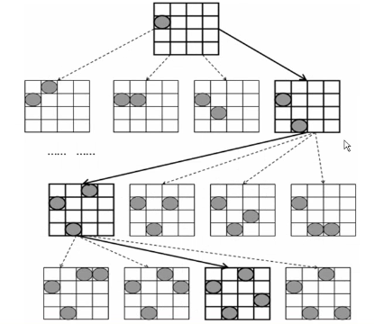

以4皇后为例，其他的N皇后问题以此类推。所谓4皇后问题就是求解如何在4×4的棋盘上无冲突的摆放4个皇后棋子。在国际象棋中，皇后的移动方式为横竖交叉的，因此在任意一个皇后所在位置的水平、竖直、以及45度斜线上都不能出现皇后的棋子，例子  

要求编程求出符合要求的情况的个数。四皇后问题有很多种解法，这里主要介绍一种经典的解决方法：回溯法

回溯法的基本思想是：可以构建出一棵解空间树，通过探索这棵解空间树，可以得到四皇后问题的一种或几种解。这样的解空间树有四棵

在如上图所示的4×4的棋盘上，按列来摆放棋子，首先因为皇后棋子不能在同一列，所以先排除有2个或2个以上的棋子在同一列的情况，所以第一个棋子在第一列有4种摆放方法（第1列第1行，第1列第2行，第1列第3行，第1列第4行），同样第二个棋子在第二列有4种，同样第三个棋子在第三列有4种，同样第四个棋子在第四列有4种，所以进行简单的排除不在同一列的情况后，还有4×4×4×4=256种可能，但是在这256种可能里，依然存在比如棋子在同一行，或在45度斜线上的情况出现。另一个角度思考，所有的满足四皇后问题的摆放方式一定都存在于这256种情况之中。简单的理解就是：这256种棋盘局面包含了所有满足4皇后问题的解，但是不包含全部的棋盘局面。

下面是解空间树的示例（以上一段的按列摆放的方式来进行示例讲解），其中第i层的棋盘局面是在第i-1层的棋盘局面演化而来的（1<i<4）  

    
上面的图片是以第一个棋子在第一列的第一行而派生出的一个解空间树，最后一层会有64中结局面，同理在以第一个棋子在第一、列的第二/三/四行都分别可以派生出一个解空间树，最后一层都会有64中局面，所以有4棵解空间树，每一棵最终有64个局面，所以一共有4×64=256种局面

可以用上面的方法穷举出所有的解，再遍历穷举的所有结果找出所有符合四皇后问题的解，但是这样会很浪费。所以这里可以用到回溯法，在构建解空间树的途中进行深度优先探索，当探索到某一种棋盘局面一定不是四皇后问题的解的时候（比如出现任意两个或两个以上的棋子在同一行/同一列/45度斜线上），就可以判断这个节点向下派生出的解空间树的节点也一定不是四皇后问题的解，这样就可以避免大量的无用功。

比如上图中第二行的第一个节点出现了两个棋子在同一行的情况，所以可以判断出这个节点以及这个节点向下派生出的所有节点就不再有必要进行遍历了，这样就会避免4+4×4次的完全无用功的遍历，就会大大的节省时间，再去探索第二行的第二个节点……其他的同理。

这样，如果能够成功遍历到叶子节点，并且判断该叶子节点的局面就是符合4皇后问题的，那么这个节点局面就代表一个合法的四皇后问题的解。下面的图片就代表找到的一个合法的解的过程（注意图片中，虚线代表排除，黑实线代表继续向下探索）     以上图为例，当在第i层出现非法的棋盘局面时，就跳回第i-1层，继续探索第i-1层的那个节点的下一个分支；或者在第4层探索到合法的局面就进行记录并跳回上一层，继续探索下一个分支。其他三个解空间树同理。 

以上图为例，就单看探索的第四层节点的个数。使用回溯法，就只需探索第4层中的4个节点，而如果使用穷举法，就要探索玩第4层的所有64个节点，显而易见，哪一个方法更有效。

其实在解决四皇后问题的时候，并不一定要真的构建出这样的一棵解空间树，它完全可以通过一个递归回溯来模拟。所谓的解空间树只是一个逻辑上的抽象。当然也可以用树结构来真实的创建出一棵解空间树，不过那样会比较浪费空间资源，也没有那个必要

解决四皇后问题的算法描述如下

    #include<stdio.h>
    
    int count = 0;
    int isCorrect(int i, int j, int (*Q)[4])
    {
    	int s, t;
    	for(s=i,t=0; t<4; t++)
    		if(Q[s][t]==1 && t!=j)
    			return 0;//判断行
    	for(t=j,s=0; s<4; s++)
    		if(Q[s][t]==1 && s!=i)
    			return 0;//判断列
    	for(s=i-1,t=j-1; s>=0&&t>=0; s--,t--)
    		if(Q[s][t]==1)
    			return 0;//判断左上方
    	for(s=i+1,t=j+1; s<4&&t<4;s++,t++)
    		if(Q[s][t]==1)
    			return 0;//判断右下方
    	for(s=i-1,t=j+1; s>=0&&t<4; s--,t++)
    		if(Q[s][t]==1)
    			return 0;//判断右上方
    	for(s=i+1,t=j-1; s<4&&t>=0; s++,t--)
    		if(Q[s][t]==1)
    			return 0;//判断左下方
    
    	return 1;//否则返回
    }
    
    void Queue(int j, int (*Q)[4])
    {
    	int i,k;
    	if(j==4){//递归结束条件
    		for(i=0; i<4; i++){
                    //得到一个解，在屏幕上显示
    			for(k=0; k<4; k++)
    				printf("%d ", Q[i][k]);
    			printf("\n");
    		}
    		printf("\n");
    		count++;
    		return ;
    	}
    	for(i=0; i<4; i++){
    		if(isCorrect(i, j, Q)){//如果Q[i][j]可以放置皇后
    			Q[i][j]=1;//放置皇后
    			Queue(j+1, Q);//递归深度优先搜索解空间树
    			Q[i][j]=0;//这句代码就是实现回溯到上一层
    		}
    	}
    }
    
    int main()
    {
    	int Q[4][4];
    	int i, j;
    	for(i=0; i<4; i++)
    		for(j=0; j<4; j++)
    			Q[i][j] = 0;
    	Queue(0, Q);
    	printf("The number of the answers are %d\n", count);
    	return 0;
    }
