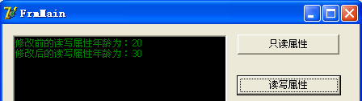
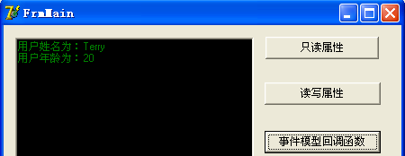

参考：[http://www.cnblogs.com/edisonfeng/archive/2012/05/22/2513727.html](http://www.cnblogs.com/edisonfeng/archive/2012/05/22/2513727.html)

##一、基本属性##

    TOnUserInfoShow = procedure(userName: String; userAge: Integer) of object;
    //定义时间模型中的回调函数
    
    TUserInfo = class
        private
            FName: String;
            FAge: Integer;
            FOnUserInfoShow: TOnUserInfoShow;
            procedure FSetAge(theAge: Integer);
        public
            property Name: string read FName;    //只读属性
            property Age: Integer read FAge write FSetAge;    //读写属性（私有变量，私有方法）
            property OnUserInfoShow: TOnUserInfoShow read FOnUserInfoShow write FOnUserInfoShow;    //事件模型回调函数
            constructor Create;
    end

对于FAge、FSetAge等变量和方法，只需要在Property后声明好，直接Ctrl+Shift+C，既可以自动生成

##二、只读属性##

###构造函数###

    constructor TUserInfo.Create;
    begin
        Self.FName:= 'Terry';
        Self.FAge:= 20;
    end;

###读取只读属性###

    begin
        Self.Memo1.Lines.Add('读取只读属性姓名：'+Self.theUserInfo.Name);
    end;

###运行###

##三、读写属性##

###构造函数###

    constructor TUserInfo.Create;
    begin
        Self.FName:= 'Terry';
        Self.FAge:= 20;
    end;

###修改读写属性，并读取新值###

    begin
        Self.Memo1.Lines.Add('修改前的读写属性年龄为：'+inttostr(Self.theUserInfo.Age));
        Self.theUserInfo.Age:= 30;
        Self.Memo1.Lines.Add('修改后的读写属性年龄为：'+inttostr(Self.theUserInfo.Age));
    end;

###运行###

##四、事件回调函数##

###主窗口成员函数###

    procedure TFrmMain.UserInfoShow(name: string; age: Integer);
    begin
        Self.Memo1.Lines.Add('用户姓名为：'+Self.theUserInfo.Name);    
        Self.Memo1.Lines.Add('用户年龄为：'+inttostr(Self.theUserInfo.Age));
    end;

###主窗体创建时，将函数指针赋值给“时间回调函数”###

    procedure TFrmMain.FormCreate(Sender: TObject);
    begin
        Self.Memo1.Color:= clBlack;
        Slef.Memo1.Font.Color:= clGreen;
        Self.theUserInfo.OnUserInfoShow:= Self.USerInfoShow;
    end;

###调用事件回调函数###

    begin
        Self.theUserInfo.OnUserInfoShow(Self.theUserInfo.Name, Self.theUserInfo.Age);
    end;

运行

