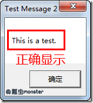

参考博客：[http://www.cnblogs.com/pchmonster/archive/2011/12/14/2287686.html](http://www.cnblogs.com/pchmonster/archive/2011/12/14/2287686.html)

其中的所有代码均在Delphi7下测试通过。

Delphi 4,5,6,7中有字符串类型包括了：
e
* 短字符串（Short String）
* 长字符串（Long String）
* 宽字符串（Wide String）
* 零结尾字符串（Null-Terminated String）、PChar和字符数组

## 1、短字符串（Short String）

固定长度，最大字符数个数为255，短字符串也称为长度字节（Length-byte）字符串，这是因为短字符串的第0个元素包含了这个字符串的长度（字符串中字符的个数）。因此ShortString的缺省最大长度为256个字节（255个字符+1个长度字节=256），声明一个短字符串有两种方式，如下：

    var
      S: ShortString;   { 255个字符长度,256个字节}
      S1: String[255];  { S1和S的字符类型一样，通过使用String声明字符串并且在String后面用中括号规定字符个数的形式定义字符串}
      Len: Integer;
    begin
      S := 'Hello';
      Len := Ord(S[0]); { Len现在包含S的长度为5，Ord函数可以把一个字符类型转换为整数类型}
      Len := SizeOf(S); { Len现在包含的是ShortString类型的大小，为256字节，并不是字符串的长度} 
    end;

以上例子通过S[0]可以获得S的字符串长度，当然也可以用Length函数来确定一个短字符串的长度。

可以通过数组的下标来访问ShortString中的一个特定位置的字符，具体使用参看下面例子和注释说明：

    var
      S: string[8];{这种定义方式，是定义S是一个字符串，且S是最多含有8个字符的字符串}
      i: Integer;
    begin
      S := 'a_pretty_darn_long_string';
      { 因为S只有8个字符大小，
      因此s的实际存储的内容为“a_pretty”}
      i := 10;
      S[i] := 's';
      { 因为S只有8个字符大小，
      试图改写第10个元素，将会使内存混乱}
    end;

## 2、长字符串（Long String）

长字符串 （AnsiString）是一种动态分配的字符串，其大小只受可用内存的限制。声明一个长字符串，只需要用关键字String不加大小参数即可。

在Delphi 7中AnsiString包含的字符是用单字节存储的。

    var
      S: string;

由于是动态分配的，一次可以随意修改字符串，而不用担心对其他的影响，也不用担心越界的问题。String类型没有0元素，试图存取String类型的0元素会产生一个编译错误。

通过Length函数也可以获得长字符串的长度，也可以通过SetLength过程为长字符串设置长度。其在内存中分配情况如下：

注意当给一个String类型赋值时候，赋的字符串太长，可能会报错：“String  literals may have at most 255 elements”。这时候你就纳闷了：不是说String的字符个数没有限制的吗？

对于这个问题，我们给个代码示例（程序1）

    var
        s: string;
    begin
        s:= '<?xml version="1.0" encoding="UTF-8"?><Msg><AppHdr><CharSet>UTF-8</CharSet><Fr>000100</Fr><To>SDC</To><BizMsgIdr>0000000002</BizMsgIdr><MsgDefIdr>V1.0</MsgDefIdr><BizSvc>067</BizSvc><CreDt>20130227100434</CreDt><Sgntr>fb3LY5VmhonZwhP+ntxI9A==</Sgntr></AppHdr><Document><Data><FndNm>name</FndNm><TtlFndVol>12681656.00</TtlFndVol><FndCd>159999</FndCd><FndSts>0</FndSts><NAV>1.0251</NAV><NtValDt>20130301</NtValDt><NtValTp>0</NtValTp></Data></Document></Msg>';
        
    end.

这个时候，将一个长度大于255的字符串直接赋值给string类型的变量就会报上面所说的错误。可以替代的办法是将一个较长的字符串分成多份，在赋值时候使用+ 再赋值，见例子（程序2）

    var
        s: string;
    begin
        s:= '<?xml version="1.0" encoding="UTF-8"?><Msg><AppHdr><CharSet>UTF-8</CharSet><Fr>000100</Fr><To>SDC</To>'
        + '<BizMsgIdr>0000000002</BizMsgIdr><MsgDefIdr>V1.0</MsgDefIdr><BizSvc>067</BizSvc><CreDt>20130227100434</CreDt>'
        + '<Sgntr>fb3LY5VmhonZwhP+ntxI9A==</Sgntr></AppHdr><Document><Data><FndNm>FundName</FndNm><TtlFndVol>12681656.00</TtlFndVol>'
        + '<FndCd>159999</FndCd><FndSts>0</FndSts><NAV>1.0251</NAV><NtValDt>20130301</NtValDt><NtValTp>0</NtValTp></Data>'
        + '</Document></Msg>';
    
    end.

这个时候就可以编译成功了

## 3、宽字符串（Wide String）

宽字符串和长字符串一样，大小只受有效内存的限制，并实行动态分配。

在Delphi 7 中WideString被实现为2个字节存储一个字符，用WideString来处理多字节字符（比如汉字）是十分方便的。如：

    var
      S: string;
      { 在Delphi 7中默认string等同于AnsiString}
      WS: WideString;
    begin
      S := '世界你好';
      WS := S;
      ShowMessage(S[1]);  { 此时无任何显示，因为S[1]取出的是‘世’的一半}
      ShowMessage(WS[1]); { 显示‘世’}
    end;

要理解宽字符串就必须理解字符编码的规则，比如ASCII、UTF-8……

 
## 4、零结尾字符串（Null-Terminated String）、PChar和字符数组

在C和C++中没有真正的字符串数据类型，都是通过以Null结尾（0）的字符数组来实现的，字符数组没有长度字节，因此只能通过结尾的Null标志来作为字符串的字符结束标志。又因为Windows是用C编写的，很多Windows函数要用到以字符数组作为参数，但Pascal字符串类型不是字符数组，因为为了让Pascal字符串也能与Windows兼容，就需要一个字符串数组，PChar类型正是符合这种需求，在任何需要字符数组的地方都可用PChar。

虽然AnsiString和WideString都已经实现了NULL

相应的也有PAnsiChar和PWideChar，分别对应于AnsiChar字符和WideChar字符。

例如：Windows MessageBox函数，此函数声明如下：

    function MessageBox(hWnd: HWND; lpText, lpCaption: PChar; uType: UINT): Integer; stdcall;

第二个和第三个参数需要一个指向字符数组的指针，为了可以调用此函数，有以下三种方法来实现

### 1、PChar()类型转换

    var
      Text: string;
      Caption: string;
    begin
      Text := 'This is a test.';
      Caption := 'Test Message';
      MessageBox(0, PChar(Text), PChar(Caption), 0);
      { 这里PChar用来把string类型转换为Null结尾的字符串}
    end;

其中

### 2、PChar变量

我们先做一个实现，看看PChar类型到底是啥呢？

运行下面程序：

    var
      Text: PChar;    { 声明为PChar类型}
      Str: string;    { 声明为String类型}
    begin
      Text := 'This is a test.';             { 都被赋予了相同的字符串}
      Str := 'This is a test.';
      ShowMessage(IntToStr(SizeOf(Text)));   { 4字节，实质是指针}
      ShowMessage(IntToStr(SizeOf(Str)));    { 也是4字节，也是指针}
    end;

通过上面的程序，我们知道Text（PChar类型）只不过是一个指针而已。

    var
      Text: PChar;
    begin
      Text := 'This is a test.';
      MessageBox(0, Text, 'Test Message', 0);
      { 这里Text直接声明为了PChar类型，字符串常量可以直接用}
    end;

指针Text指向了这样一个内存区域，一个包含Null的结尾的 'This is a test.' 字符串的区域。其等同于下面的代码：

    const
      TempString: array[0..15] of Char = 'This is a test.'#0;
    var
      Text: PChar;
    begin
      Text := @TempString[0];
      {Text指向Null结尾的TempString字符数组的第0个元素的地址，
      也就是整个字符数组的首地址}
      MessageBox(0, Text, 'Test Message', 0);
    end;

### 3、Char类型字符数组

最后还可以用Char数组来代替PChar，代码如下：

小心内存访问越界的情况的出现

    var
      Text1: array[0..14] of Char;  { 大小为15个字符}
      Text2: array[0..20] of Char;  { 大小为21个字符}
    begin
      Text1 := 'This is a test.';   {Text1和Text2的字符长度都为15个字符}
      Text2 := 'This is a test.';
      MessageBox(0, Text1, 'Test Message 1', 0);
      {因为Text1的字符长度超过了其声明的大小，因为会内存访问混乱，显示换乱}
     
      MessageBox(0, Text2, 'Test Message 2', 0);
      {Text2的字符长度比起声明的大小要小，因为正常访问，显示正确}
    end;
　　

显示结果如下：

  

关于字符串就先浅浅的谈到这个，以后再深入了解。