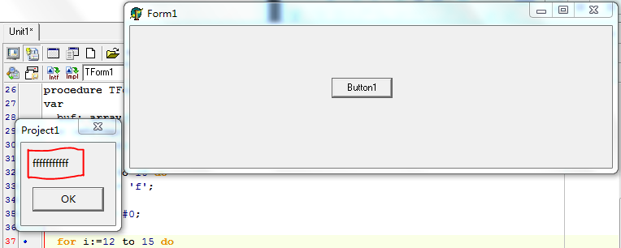
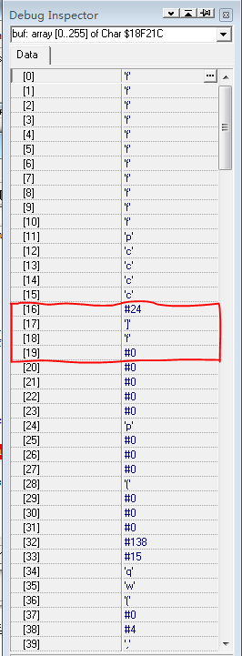
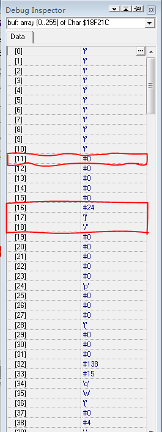
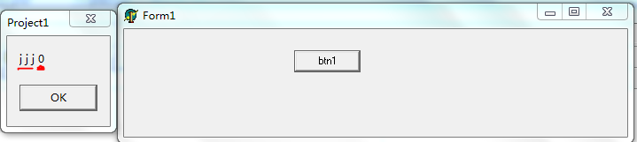

紧接着[上篇博客](http://xumenger.github.io/delphi-string-pchar-chararray-20150422-01/)讲解的内容：

* 将Char型数组转换为string类型还有下面的这种方法
* 但是我在测试的时候遇到了一些问题，并在下面进行了解释和总结

## 先说出我的总结

其实我们在学习编程的时候（比如我之前学习C的时候），一直有书或者博客上有建议说声明一个变量之后，一定要初始化，否则可能出现一些意想不到的错误。虽然这里的buf 也进行了初始化，但是初始化不完全（并没有考虑到字符串应该以#0 作为结尾），所以就出现了这样的问题。

另外，在编程的时候，难免因为很多问题没有考虑到而出现这样那样的问题，这个时候不要瞎猜，可以为自己的程序设置几个断点来调试一下、去看看运行时候的变量的值……

* Delphi的调试就类似与上面所讲的，更详细的可以看[http://www.cnblogs.com/pchmonster/archive/2012/05/08/2489754.html](http://www.cnblogs.com/pchmonster/archive/2012/05/08/2489754.html)以及之后的十篇delphi调试的博客
* C/C++里面也有，我比较喜欢Linux环境下的GDB调试器，GDB教程参考：[http://xumenger.github.io/linux-gdb-debug/](http://xumenger.github.io/linux-gdb-debug/)

 
## 再开始讲解整个过程

Char数组与String存储方式一样（还是有不一样的，具体的String的存储结构见：[http://xumenger.github.io/delphi-string-pchar-chararray-20150415/](http://xumenger.github.io/delphi-string-pchar-chararray-20150415/)），只不过string是以 '/0' 结尾的char数组（这样理解是可以的，但是不是很精确）。所以可以把Char数组强制转换为string类型。

### 程序一

    procedure TForm1.Button1Click(Sender: TObject);
    var
      buf: array[0..255] of Char;
      s :string;
      i: Integer;
    begin
      for i:=0 to 10 do
        buf[i]:= 'f';
    
      s:= string(buf);
    
      ShowMessage(s);
    end;
 

编译之后，点击按钮会看到这样的效果

### 程序二

但是，如果 buf 数组中间有某一位是 '/0'（在Delphi里面是 #0），转换时以第一个出现的'/0'前面的内容转换为s的内容，如果第一个字符即为'/0'（即#0）,buf[0]=char(0),则s的内容为空字符串。下面有一个例子

    procedure TForm1.Button1Click(Sender: TObject);
    var
      buf: array[0..255] of Char;
      s :string;
      i: Integer;
    begin
      for i:=0 to 10 do
        buf[i]:= 'f';
    
      buf[11]:= #0;
    
      for i:=12 to 15 do
        buf[i]:= 'c';
    
      s:= string(buf);
    
      ShowMessage(s);
    end;
 
编译之后，点击按钮会看到这样的效果。字符串s 只会有字符数组的 #0 之前的内容，#0 之后的就不会有，因为string是以#0 结尾的

 

### 程序三

但是还要注意一个问题，我在编写这样的代码的时候

    procedure TForm1.Button1Click(Sender: TObject);
    var
      buf: array[0..255] of Char;
      s :string;
      i: Integer;
    begin
      for i:=0 to 10 do
        buf[i]:= 'f';
    
      buf[11]:= 'p';
    
      for i:=12 to 15 do
        buf[i]:= 'c';
    
      s:= string(buf);
    
      ShowMessage(s);
    end;

出现下面的问题

为什么我将buf 的从 0到 10赋值为'f'，11赋值为'p'， 12到15赋值为'c'，这些显示都没有问题，但是为什么后面多了那几个乱七八糟的字符

所以设置断点，进行单步调试查看到底是为什么

如图，在  s:= string(buf); 这行设置断点（F5）

再按F9运行，在这行停住，再看buf的内容（Ctrl+鼠标左键），如下图

可以看到buf的元素从0 到15都确实是自己在程序中赋值的内容，但是为什么后面会出现这些乱七八糟的东西，回想第一个程序为什么能正确显示 fffffffffff，所以又回去将本博客中的第一个程序进行了断点调试

还是在  s:= string(buf); 这行设置断点（F5），如图

再按F9运行，到断点处，再看 buf的值

确实从0到10是 fffffffffff，11是#0，但是到16开始又有一些乱七八糟的东西出现了。所以就说明了初始化的重要性：进行初始化的内容就会确定是初始化时候的值，而没有初始化的部分可能是随机的值，这样就存在潜在的危险，因为对于不确定的东西就很难进行明确的控制

但是还有一种情况，就是将一个char型数组的所有元素都赋值为非 #0 的字符，在进行类型转换为string 类型会出现什么情况呢

### 程序四

    procedure TForm1.btn1Click(Sender: TObject);
    var
      s: string;
      a: array[0..2] of Char;
      i: Integer;
    begin
      for i:=0 to 2 do
        a[i]:= 'j';
      s:= string(a);
      ShowMessage(s[1]+' '+s[2]+ ' '+s[3] +' '+ IntToStr(Integer(s[4])));
    end;

补充：Char数组根据定义可以是从0开始，也可以是从1开始，也可以是从其他任何数开始（这点和C/C++中的数组不同），但是String的字符存储要从 1 开始

显示的结果如图

所以可以看出，将一个所有元素都为非 #0 的字符数组，强制转换为string，那么这个string会拷贝这个元素，并且自动添加一个 #0在string中作为结尾

如果这个字符数组中某一个元素为 #0 ，那么强制转化为 string之后，就只会保留#0 及其之前的字符串

使用PChar分配动态内存，并将一个PChar里面的所有元素都赋值为非 #0 的字符，在进行类型转换为string 类型和上面的效果一样

    procedure TForm1.btn1Click(Sender: TObject);
    var
      s: string;
      a: array[0..2] of Char;
      p: PChar;
      i: Integer;
    begin
      GetMem(p, 3);
      for i:=0 to 2 do
        p[i]:= 'j';
      s:= string(p);
      ShowMessage(s[1]+' '+s[2]+ ' '+s[3] +' '+ IntToStr(Integer(s[4])));
    end;
　 
## 原因

在程序三中，我们声明了字符数组 buf，buf分配了255字节的内存，这时候buf 并没有显式声明，所以buf的内容就是其分配的内存中原来的那些乱七八糟的东西（对本程序是完全没有意义的），但是第一个程序显式声明了从0到10的元素，第三个程序显示声明了0 到15 的元素，可是第一个程序的11 个元素及其之后的元素还是原来那些乱七八糟的东西，第三个程序的16个元素及其之后的元素也还是原来那些乱七八糟的东西。

不过第一个程序比较巧合的是第11 个元素碰巧是 #0，所以在这个程序最终的效果碰巧正确（但是这里是隐藏着隐患的），而第三个程序就没有那么巧合了，所以就又显示了一个乱七八糟的字符。这并不是意味着第一个程序正确，只是它比较“幸运”罢了。但是项目开发并不是开玩笑，不能靠巧合和运气，必须要确定和稳定

所以不论上面谈到的什么情况，要想避免可能出现的错误，唯一的原则就是：显式的声明想要结束的地方为 #0，这样就不会出错了，这样的代码就比较可靠，不会因为上面的那种巧合来出现“正确的”效果或者“错误的”效果

## 总结

首先，其实我们在学习编程的时候，一直有书或者博客上有建议说声明一个变量之后，一定要初始化，否则可能出现一些意想不到的错误。虽然这里的buf 也进行了初始化，但是初始化不完全（并没有考虑到字符串应该以#0 作为结尾），所以就出现了这样的问题。在C/C++里面也是和Delphi一样的。

另外，在编程的时候，难免因为很多问题没有考虑到而出现这样那样的问题，这个时候不要瞎猜，可以为自己的程序设置几个断点来调试一下、去看看运行时候的变量的值……

* Delphi的调试就类似与上面所讲的，更详细的可以看[http://www.cnblogs.com/pchmonster/archive/2012/05/08/2489754.html](http://www.cnblogs.com/pchmonster/archive/2012/05/08/2489754.html)以及之后的十篇delphi调试的博客
* C/C++里面也有，我就比较喜欢Linux环境下的GDB调试器，GDB的简单使用教程，参考：[http://xumenger.github.io/linux-gdb-debug/](http://xumenger.github.io/linux-gdb-debug/)