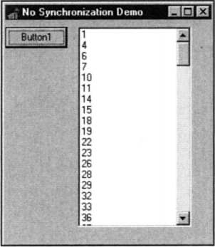

当有多个线程的时候，经常需要去同步这些线程以访问同一个数据或资源。

例如，假设有一个程序，其中一个线程用于把文件读到内存，而另一个线程用于统计文件的字符数。当然，在整个文件调入内存之前，统计它的计数是没有意义的。但是，由于每个操作都有自己的线程，操作系统会把两个线程当做是互不相干的任务分别执行，这样就可能在没有把整个文件装入内存时统计字数。为解决此问题，你必须使两个线程同步工作

存在一些线程同步地址的问题，Win 32 提供了许多线程同步的方式。这里将会讲到：临界区、互斥、信号量和事件

为了检验这些技术，首先来看一个需要线程同步解决的问题。假设有一个整数数组，需要按照升序赋初值。现在要在第一遍把这个数组赋初值为1~128，第二遍将此数组赋初值为128~255，然后结果显示在列表中。要用两个线程来分别进行初始化。下面的代码给出了没有做线程同步的代码

    unit Main;
    
    interface
    uses
        Windows, Messages, SysUtils, Classes, Graphics, Controls, Forms,
        Dialogs, StdCtrls;
    
    type
        TMainForm =class(TForm)
            Button1: TButton;
            ListBox1: TListBox;
            procedure Button1Click(Sender: TObject);
        private
            procedure ThreadsDone(Sender: TObject);
        end;
    
        TFooThread = class(TThread)
        protected
            procedure Execute; override;
        end;
    
    var
        MainForm: TMainForm;
    
    implementation
    {$R *.DFM}
    const
        MaxSize = 128;
    var
        NextNumber: Integer = 0;
        DoneFlags: Integer = 0;
        GlobalArray: array[1..MaxSize] of Integer;
    
    function GetNextNumber: Integer;
    begin
        Result:= NextNumber;    //return global var
        Inc(NextNumber);    //inc global var
    end;
    
    procedure TFooThread.Execute;
    var
        i: Integer;
    begin
        OnTerminate:= MainForm.ThreadsDone;
        for i:=1 to MazSize do
        begin
            GlobalArray[i]:= GetNextNumber;
            Sleep(5);
        end;
    end;
    
    procedure TMainForm.ThreadsDone(Sender: TObject);
    var
        i: Integer;
    begin
        Inc(DoneFlags);
        if DoneFlags = 2 then
            for i:=1 to MaxSize do
                ListBox1.Items.Add(IntToStr(GlobalArray[i]));    //注意ListBox的使用，并看下面编译运行的效果图
    end;
    
    procedure TMainForm.Button1Click(Sender: TObject);
    begin
        TFooThread.Create(False);    //创建一个新的线程
        TFooThread.Create(Flase);    //再创建一个新的线程
    end;
    
    end.

因为两个线程同时运行，同一个数组在两个线程中被初始化会出现什么呢？你可以看下面的截图

这个问题的解决方案是：当两个线程访问这个全局数组时，为防止它们同时执行，需要使用线程的同步。这样，你就会得到一组合理的数值

##1.临界区##

临界区是一种最直接的线程同步方法。所谓临界区，就是一次只能有一个线程来执行的一段代码。如果把初始化数组的代码放在临界区内，那么另一个线程在第一个线程处理完之前是不会被执行的。

在使用临界区之前，必须使用 InitializeCriticalSection()过程初始化它，其声明如下

    procedure InitializeCriticalSection(var lpCriticalSection: TRLCriticalSection); stdcall;

lpCriticalSection参数是一个TRTLCriticalSection类型的记录，并且是变参。至于TRTLCriticalSection是如何定义的，这并不重要，因为很少需要查看这个记录中的具体内容。只需要在lpCriticalSection中传递为初始化的记录，InitializeCriticalSection()过程就会填充这个记录

注意：Microsoft 故意隐瞒了TRTLCriticalSection 的细节。因为，其内容在不同的硬件平台上是不同的。在基于Intel 的平台上，TRTLCriticalSection 包含一个计数器、一个指示当前线程句柄的域和一个系统事件的句柄。在Alpha 平台上，计数器被替换为一种Alpha-CPU 数据结构，称为spinlock。

在记录被填充之后，我们就可以开始创建临界区了。这是我们需要使用EnterCriticalSection() 和LeaveCriticalSection() 来封装代码块。这两个过程的声明如下

    procedure EnterCriticalSection(var lpCriticalSection: TRTLCriticalSection); stdcall;
    
    procedure LeaveCriticalSection(var lpCriticalSection: TRTLCriticalSection); stdcall;

正如你所想的，参数 lpCriticalSection 就是有InitializeCriticalSection() 填充的记录

当你不需要TRTLCriticalSection 记录时，应当调用 DeleteCriticalSection() 过程，下面是它的声明

    procedure DeleteCriticalSection(var lpCriticalSection: TRTLCriticalSection); stdcall;

下面演示利用临界区来同步数组初始化线程的技术

    unit Main;
    
    interface
    uses
        Windows, Messages, SysUtils, Classes, Graphics, Controls, Forms,
        Dialogs, StdCtrls;
    
    type
        TMainForm =class(TForm)
            Button1: TButton;
            ListBox1: TListBox;
            procedure Button1Click(Sender: TObject);
        private
            procedure ThreadsDone(Sender: TObject);
        end;
    
        TFooThread = class(TThread)
        protected
            procedure Execute; override;
        end;
    
    var
        MainForm: TMainForm;
    
    implementation
    {$R *.DFM}
    const
        MaxSize = 128;
    var
        NextNumber: Integer = 0;
        DoneFlags: Integer = 0;
        GlobalArray: array[1..MaxSize] of Integer;
        CS: TRTLCriticalSection;        //
    
    function GetNextNumber: Integer;
    begin
        Result:= NextNumber;    //return global var
        Inc(NextNumber);    //inc global var
    end;
    
    procedure TFooThread.Execute;
    var
        i: Integer;
    begin
        OnTerminate:= MainForm.ThreadsDone;
        EnterCriticalSection(CS);        //
        for i:=1 to MazSize do
        begin
            GlobalArray[i]:= GetNextNumber;
            Sleep(5);
        end;
        LeaveCriticalSection(CS);        //
    end;
    
    procedure TMainForm.ThreadsDone(Sender: TObject);
    var
        i: Integer;
    begin
        Inc(DoneFlags);
        if DoneFlags = 2 then
            for i:=1 to MaxSize do
                ListBox1.Items.Add(IntToStr(GlobalArray[i]));
                DeleteCriticalSection(CS);    //
        end;
    end;
    
    procedure TMainForm.Button1Click(Sender: TObject);
    begin
        InitializeCriticalSection(CS);    //
        TFooThread.Create(False);    //创建一个新的线程
        TFooThread.Create(Flase);    //再创建一个新的线程
    end;
    
    end.

在第一个线程调用EnterCriticalSection()之后，所有别的线程就不能再进入代码块。下一个线程要等到第一个线程调用LeaveCriticalSection()之后才能被唤醒，输出结果显示如下

 

##2.互斥##

互斥非常类似于临界区，除了两个关键的区别：

* 首先，互斥可用于跨进程的线程同步
* 其次，互斥能被赋予一个字符串名字，并且通过引用此名字创建现有互斥对象的附加句柄

提示：临界区与事件对象（比如互斥对象）的最大的区别在性能上。临界区在没有线程冲突时，要用10~15个时间片，而事件对象由于涉及到系统内核，所以要用400~600个时间片

可以调用函数CreatMutex() 来创建一个互斥量。下面是函数的声明

    function CreateMutex(lpMutexAttributes: PSecurityAttributes; bInitialOwner: BOOL; lpName: PChar): THandle; stdcall;

* lpMutexAttributes 参数为一个指向TSecurityAttributes记录的指针。此参数通常设为nil ， 表示默认的安全属性
* bInitalOwner 参数表示创建互斥对象线程是否称为互斥对象的拥有者。当此参数为False时，表示互斥对象没有拥有者。
* lpName 参数指定互斥对象的名称。设为nil表示无命名，如果参数不设为nil，函数会搜索是否有同名的互斥对象存在。如果有，函数就会返回同名互斥对象的句柄。否则，就新创建一个互斥对象并返回其句柄。

当使用完互斥对象时，应当调用CloseHandle()来关闭它。

下面演示使用互斥技术来使两个进程对一个数组的初始化同步

    unit Main;
    
    interface
    uses
        Windows, Messages, SysUtils, Classes, Graphics, Controls, Forms,
        Dialogs, StdCtrls;
    
    type
        TMainForm =class(TForm)
            Button1: TButton;
            ListBox1: TListBox;
            procedure Button1Click(Sender: TObject);
        private
            procedure ThreadsDone(Sender: TObject);
        end;
    
        TFooThread = class(TThread)
        protected
            procedure Execute; override;
        end;
    
    var
        MainForm: TMainForm;
    
    implementation
    {$R *.DFM}
    const
        MaxSize = 128;
    var
        NextNumber: Integer = 0;
        DoneFlags: Integer = 0;
        GlobalArray: array[1..MaxSize] of Integer;
        hMutex: THandle = 0;        //
    
    function GetNextNumber: Integer;
    begin
        Result:= NextNumber;    //return global var
        Inc(NextNumber);    //inc global var
    end;
    
    procedure TFooThread.Execute;
    var
        i: Integer;
    begin
        FreeOnTerminate:= True;
        OnTerminate:= MainForm.ThreadsDone;
        if WaitForSingleObject(hMutex, INFINITE) = WAIT_OBJECT_0 then        //
        begin
            for i:=1 to MazSize do
            begin
                GlobalArray[i]:= GetNextNumber;
                Sleep(5);
            end;
        end;
        ReleaseMutex(hMutex);        //
    end;
    
    procedure TMainForm.ThreadsDone(Sender: TObject);
    var
        i: Integer;
    begin
        Inc(DoneFlags);
        if DoneFlags = 2 then
        begin
            for i:=1 to MaxSize do
                ListBox1.Items.Add(IntToStr(GlobalArray[i]));
            CloseHandle(hMutex);    //
        end;
    end;
    
    procedure TMainForm.Button1Click(Sender: TObject);
    begin
        hMutex:= CreateMutex(nil, False, nil);     //
        TFooThread.Create(False);    //创建一个新的线程
        TFooThread.Create(Flase);    //再创建一个新的线程
    end;
    
    end.

你将注意到，在程序中使用 WaitForSingleObject() 来防止其他进程进入同步区域的代码。此函数声明如下

    function WaitForSingleObject(hHandle: Thandle; dwMilliseconds: DWORD): DWORD; stdcall;

这个函数可以使当前线程在dwMilliseconds 指定的时间内睡眠，直到 hHandle参数指向的对象进入发信号状态为止。一个互斥对象不再被线程拥有时，它就进入发信号状态。当一个进程要终止时，它就进入发信号状态，而后立即返回。dwMilliSeconds参数设为 INFINITE，表示如果信号不出现将一直等下去。这个函数的返回值列在下表

| 返回值 | 含义  |
| ------------ | ------------- |  
| WAIT_ABANDONED |  指定的对象时互斥对象，并且拥有这个互斥对象的线程在没有释放此对象之前就已经终止。此时就称互斥对象被抛弃。这种情况下，这个互斥对象归当前线程所有，并把它设为非发信号状态 |
| WAIT_OBJECT_0 |  指定的对象处于发信号状态 |
| WAIT_TIMEOUT | 等待的事件已过，对象仍然是非发信号状态  |

再次声明，当一个互斥对象不再被一个线程所拥有，它就处于发信号状态，此时首先调用WaitForSignalObject() 函数的线程就称为该互斥对象的拥有者，此互斥对象设为不发信号状态。当线程调用ReleaseMutex() 函数并传递一个互斥对象的句柄作为参数时，这种拥有关系就被解除，互斥对象重新进入发信号状态

注意 除WaitForSingleObject() 函数外，你还可以使用 WaitForMultipleObject() 和MsgWaitForMultipleObject() 函数，它们可以等待几个对象变为发信号状态。这两个函数的详细情况请看Win32 API联机文档

##3.信号量##

另外一种使线程同步的技术是使用信号量对象。它是在互斥的基础上建立的，但是信号量增加了资源计数的功能，预定数目的线程允许同时进入要同步的代码。可以用 CreateSemaphore() 来创建一个信号量对象，其声明如下

    function CreateSemaphore(lpSemaphoreAttributes: PSecurityAttributes; lInitialCount, lMaxiMumCount: LongInt; lpName: PChar): THandle; stdcall;

* 和CreateMutex() 函数一样，CreateSemaphore() 的第一个参数也是一个指向 TSecurityAttributes 记录的指针，此参数的缺省值可以设为 nil。
* lInitialCount 参数用来指定一个信号量的初始计数值，这个值必须在 0 和 lMaximumCount 之间。此参数大于 0，就表示信号量处于发信号状态。当调用 WaitForSingleObject() 函数(或其他函数)时，此计数值就减1。当调用 ReleaseSemaphore() 时，此计数值加1。
* 参数 lMaximumCount 指定计数值的最大值。如果这个信号量代表某种资源，那么这个值代表可用资源总数
* 参数 lpName 用于给出信号量对象的名称，它类似于 CreateMutex() 函数的 lpName 参数。

下面是使用信号量技术来同步初始化数组的代码

    unit Main;
    
    interface
    uses
        Windows, Messages, SysUtils, Classes, Graphics, Controls, Forms,
        Dialogs, StdCtrls;
    
    type
        TMainForm =class(TForm)
            Button1: TButton;
            ListBox1: TListBox;
            procedure Button1Click(Sender: TObject);
        private
            procedure ThreadsDone(Sender: TObject);
        end;
    
        TFooThread = class(TThread)
        protected
            procedure Execute; override;
        end;
    
    var
        MainForm: TMainForm;
    
    implementation
    {$R *.DFM}
    const
        MaxSize = 128;
    var
        NextNumber: Integer = 0;
        DoneFlags: Integer = 0;
        GlobalArray: array[1..MaxSize] of Integer;
        hSem: THandle = 0;        //
    
    function GetNextNumber: Integer;
    begin
        Result:= NextNumber;    //return global var
        Inc(NextNumber);    //inc global var
    end;
    
    procedure TFooThread.Execute;
    var
        i: Integer;
        WaitReturn: DWORD;
    begin
        OnTerminate:= MainForm.ThreadsDone;
        WaitReturn:= WaitForSingleObject(hSem, INFINITE);       //
        if WaitReturn = WAIT_OBJECT_0 then        //
        begin
            for i:=1 to MazSize do
            begin
                GlobalArray[i]:= GetNextNumber;
                Sleep(5);
            end;
        end;
        ReleaseSemaphore(hSem, 1, nil);        //
    end;
    
    procedure TMainForm.ThreadsDone(Sender: TObject);
    var
        i: Integer;
    begin
        Inc(DoneFlags);
        if DoneFlags = 2 then
            for i:=1 to MaxSize do
                ListBox1.Items.Add(IntToStr(GlobalArray[i]));
                CloseHandle(hSem, );    //
        end;
    end;
    
    procedure TMainForm.Button1Click(Sender: TObject);
    begin
        hSem:= CreateSemaphore(nil, 1, 1 , nil);     //
        TFooThread.Create(False);    //创建一个新的线程
        TFooThread.Create(Flase);    //再创建一个新的线程
    end;
    
    end.

在这个程序中因为只允许一个线程进入要同步的代码，所以信号量的最大计数值（lMaximumCount）要设为1。

ReleaseSemaphore() 函数将使信号量对象的计数加 1。请注意此函数比 ReleaseMutex() 更复杂。ReleaseSemaphore() 函数声明如下：

    function ReleaseSemaphore(hSemaphore: Thandle; lReleaseCount: LongInt; 
        lpPreviousCount: Pointer): BOOL; stdcall;

lReleaseCount 数用于指定每次使计数值加多少。如果参数 lpPreviousCount 不为nil ,原有的计数值将存储在 lpPreviousCount 里。信号量对象并不属于某个线程。例如，假设一个信号量对象的最大计数值是10，并且有10个线程调用 WaitForSingleObject() ,计数值将减至0。只要有一个线程调用 ReleaseSemaphore()，并且把lReleaseCount参数设为10。这时，计数值又恢复为10，同时10个线程又恢复发信号状态。不过，此函数使调试变得困难，使用时要小心。

记住，最后一定要调用 CloseHandle() 函数来释放由CreateSemaphore()创建的信号量对象的句柄。

 
##最后说一下Application.ProcessMessages##

顺便总结Application.ProcessMessages的作用：运行一个非常耗时的循环，那么在这个循环结束前，程序可能不会响应任何事件，按钮没有反应，程序设置无法绘制窗体，看上去就如同死了一样，这有时不是很方便，例如于终止循环的机会都没有了，又不想使用多线程时,这时你就可以在循环中加上这么一句，每次程序运行到这句时，程序就会让系统响应一下消息，从而使你有机会按按钮，窗体有机会绘制。所起作用类似于VB中DoEvent方法. 调用ProcessMessages来使应用程序处于消息队列能够进行消息处理，ProcessMessages将Windows消息进行循环轮转，直至消息为空，然后将控制返回给应用程序。

注示：仅在应用程序调用ProcessMessages时勿略消息进程效果，而并非在其他应用程序中。在冗长的操作中，调用ProcessMessages周期性使得应用程序对画笔或其他信息产生回应。 ProcessMessages不充许应该程序空闲，而HandleMessage则然.使用ProcessMessages一定要保证相关代码是可重入的，如果实在不行也可按我上面的方法实现同步。
