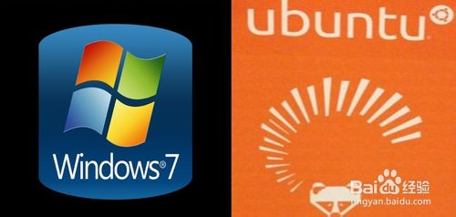
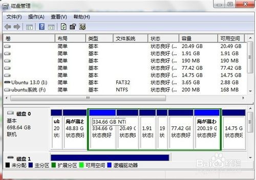
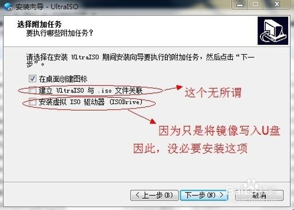
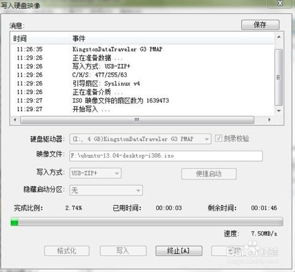
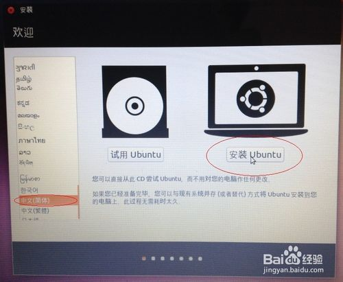
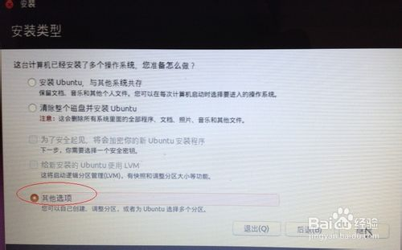
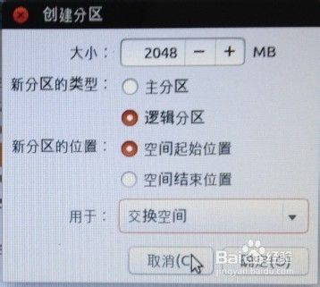
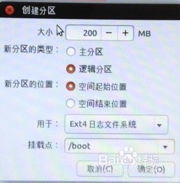
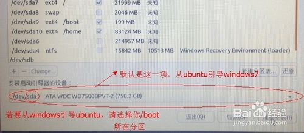
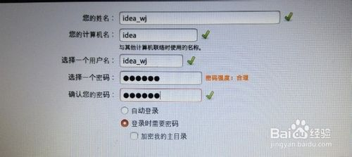

转载：[http://jingyan.baidu.com/article/60ccbceb18624464cab197ea.html](http://jingyan.baidu.com/article/60ccbceb18624464cab197ea.html)

当需要频繁使用ubuntu时，vmware虚拟机下运行ubuntu，就不是个好的选择了。为了让以后更好的学习linux，笔者今天下午琢磨了整整一下午，终于成功的在win7下安装了ubuntu13.04。

虽然网上已经有一些相关文章了，笔者也参考了很多，但很多文章对于第一次进行这些操作的人来说，一段话需要理解半天才能下手。

之所以发布这篇经验，是希望通过图文的方式，让很多第一次操作的大伙儿们能少走一些弯路，文章会尽量通俗、简洁、易懂的。

下面提到的方法是笔者综合网上各种方法后提炼出的一种个人认为是最简单的方法，只要按着步骤掌握它后，以后再往深里琢磨也不是什么难事了。不希望大家像笔者今天下午那样，耗费大量的时间实验网上各种方法，差点让笔记本瘫了。。。。。。

##工具/原料##

* windows 7 64位   （笔者笔记本自带系统）
* ubuntu 13.04 32位  （官网下载的最新版），14也是可以按照以下的流程安装的
* UltraISO最新版  （自己找渠道去下载，用来将镜像文件烧到u盘中）
* 一个空着的U盘（若有文件，请先备份）

本次双系统安装是用ubuntu引导windows7，也就是进入启动计算机界面时，是在ubuntu的启动界面选择是进入windows还是进入ubuntu，这样的坏处是，将来卸载ubuntu的时候会稍微复杂些，但笔者认为，那是后话了。。。

##安装前需要明白的几点：##

如果要window7引导ubuntu，需要更多的操作，对于初次接触者，笔者建议还是等熟悉了再说吧，弄得越复杂，将来雾水会越多。

虽然网上安装方法非常多，但初次接触时，能按着各种方法顺利走下来真的很难。因此，笔者认为，将ubuntu 13.04镜像文件烧到u盘或者光盘进行安装，是最快速，最容易上手的方法。记住，不是用diskpart命令将u盘设置成启动盘，不要和windows的安装方法混了。

注：网上提到的wubi的安装方法不适用于13.04，而虚拟镜像驱动安装也总失败，笔者已亲测，大家就不要将时间耗在这一方法上。

请先为安装ubuntu13.04分配出一块儿磁盘空间来，笔者分出了100G。

win7自带分磁盘的工具，只需要压缩步骤即可，不需要继续分盘符格式化等操作。该过程请“百度一下”

笔者当时忘了截图，下图是安装好ubuntu 13.04后的磁盘分配状况，大家可以忽略，不要去看，以免造成误导。

 

下面安装过程分为两大部分：将镜像文件iso写到U盘的步骤 以及 ubuntu13.04安装步骤
END

##将镜像文件iso写到U盘的步骤：##

下载并安装UltraISO软件，因为我们只是要将ubuntu13.04的镜像文件写入到u盘，因此，下方“安装虚拟ISO驱动器（ISODriver）”没必要安装。

安装最后，可能需要注册码才能激活软件，请大家自行解决该问题。

 
运行UltraISO软件，在“本地目录”中查找ubuntu13.04镜像文件的位置，在右方找到后，双击该镜像文件

 

完成上步后，选择上方的“启动”--“写入硬盘映像...”

 

在弹出的窗口中进行如下图设置，

* 刻录校验：打上对号
* 写入方式：USB-ZIP+
* 便捷启动：写入新的硬盘主引导记录（MBR）-USB-ZIP+
* 设置完毕后，单击“写入”

如下图：

上一步骤单击“写入”后，出现如下提示，请单击“是” 

注意：之后将会继续出现两个警告，请都选择“是”，在此就不专门截图了。

下图：

 

开始写入镜像文件，需要几分钟的等待时间，具体时间就要看你的U盘性能了。

当刻录完成后，软件将会有汉字提示的。

到此，将ubuntu13.04写入U盘的工作就结束了。

END

##ubuntu13.04安装步骤：##

重启计算机，从U盘启动，笔者笔记本是联想系列的，开机按下f12即可选择先启动哪个设备，若大家情况和笔者不同，不知道该怎样启动u盘，请先百度一下相关内容。

下图是现场拍的：

稍等片刻后，将进入ububtu13.04的安装界面，这里我们选择了“中文（简体）”，然后单击安装：

下图是现场拍的：

 

出现如下图时，请根据需要选择，然后单击“继续” ，

接下来会出现问你是否要连接网络，我们选择“我现在不想连接wifi网络”，然后点击“继续”，由于篇幅问题，在此就不上传它了。

我们要手动分盘符，所以，出现下图时，请选择“其它选项”

 

找到其中标有“空闲”的盘符，这个盘符就是我们用于安装ubuntu的100G空间，别去碰别的盘符，小心弄得到时候win7不能用了，甚至品牌机自带的隐藏分区也会被破坏。

然后，点击下方的“+”

接下来，我们要进行四次分区，每次都是从“空闲”中分出部分区域，网上也有人说两次分区即可，但初学者，按着4次走就行了，以后想探索，那是以后的事了。

我就只进行了三次分区（/ 和 swap 和/boot 这三个，swap：4096MB，/boot：200MB，其他的都是给 /，不过是首先给 / 分区，再给 swap，再给 /boot）

第一次分区：

* 上一步骤点“+”，进行如下设置：
* 挂载点：“/”
* 大小：22000MB
* 新分区的类型：主分区
* 新分区的位置：空间起始位置
* 用于：EXT4日志文件系统

第一次分区完毕

下图所示：
 

 

第二次分区：

* “空闲”处，继续点“+”，如下设置，
* 挂载点：（不设置）
* 大小：2048MB（网上认为是物理内存的2倍，其实笔者认为1G就够了，顶多2G）
* 新分区的类型：逻辑分区
* 新分区的位置：空间起始位置
* 用于：交换空间

第二次分区完毕

下图所示：

第三次分区：

* “空闲”处，继续点“+”，如下设置，
* 挂载点：/boot  （网上有的说不需要设置这项，但双系统引导时需要，先不要去理解这些）
* 大小：200MB（笔者暂时设置为200MB）
* 新分区的类型：逻辑分区
* 新分区的位置：空间起始位置
* 用于：EXT4日志文件系统

第三次分区完毕

下图所示：

第四次分区：

* “空闲”处，继续点“+”，如下设置，
* 挂载点：/home 
* 大小：（剩余全部空间，剩下显示多少，就多少）
* 新分区的类型：逻辑分区
* 新分区的位置：空间起始位置
* 用于：EXT4日志文件系统

第四次分区完毕

下图所示：

分区设置完毕后，下方还有一项“安装启动引导器的设备”，默认就如下图所示那样，也是网友们所说的sda，如果选择默认，则是ubuntu引导 windows7，到时候卸载ubuntu时，可能会麻烦些，如果想用windows7引导ubuntu，请选择你/boot所在的盘符，之后还要在 windows下安装引导类的软件，才能启动ubuntu，过程会复杂些。这一步骤请大家慎重选择，笔者选择的默认选项，以后产生什么问题，以后再说吧。

然后点击“现在安装”，

之后的步骤就没什么复杂了，按着提示点击“继续”就行了，有一项选择键盘布局的，默认是“汉语”，建议大家选择“英语（美国）”，如下图：

 

还有一步是设置一些个人信息，请按提示输入，然后点击“继续”

然后。。。。。等待片刻，安装就完成了。

至此，本经验“win7+ubuntu 13.04双系统安装方法”到此结束

END

##安装完成后的一大注意事项：##

我们是从ubuntu引导windows7的，因此，启动电脑时，会出现如下界面，此时，默认第一项是ubuntu，第六项才是win7启动项，如果向更改顺序，那大家得好好去熟悉ubuntu了。。。
 

END

##注意事项##

* 对于很多初学者，操作难免会失误，因此，建议大家操作前，注意备份重要数据
* 本经验中的截图大部分是作者实际进行操作时拍下的，有部分截图由于能讲清楚问题，是后来模拟出来的。
* 如果大家有任何疑问或者更好的建议，请大家在下方留言，作者会及时回复的，作者对linux的了解也不太深，如果回答的不好，请谅解。作者后期将更加深入的了解linux去，敬请关注作者之后的相关百度经验。
* 如果该文章对大伙有所帮助，请点击一下文章上方的大拇指或者右方的“关注”“投票”支持一下作者，作者将不胜感激。
* -----------作者：idea_wj    转载请注明作者笔名，谢谢        2013年10月13日
 