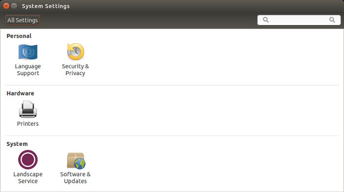

删除 ibus输入法：｀sudo apt-get install ibus｀

我们会遇到下面的问题

Ubuntu 14.04 系统设置很多选项消失。

其实遇到这个问题的一个最主要的原因是之前执行过卸载ibus输入法的操作，所以为了避免这个问题请不要卸载ibus输入法，大家依然可以安装fcitx输入法使用。

如果已经出现了这个问题，那该怎么解决呢？很简单的方法就是重新安装unity桌面。使用以下命令：

`sudo apt-get install ubuntu-desktop`

执行完以上命令之后，丢失的系统设置就可以找回来了。

