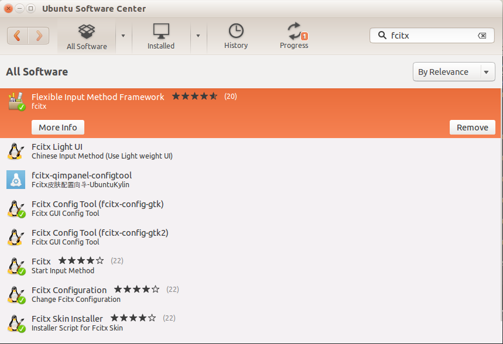
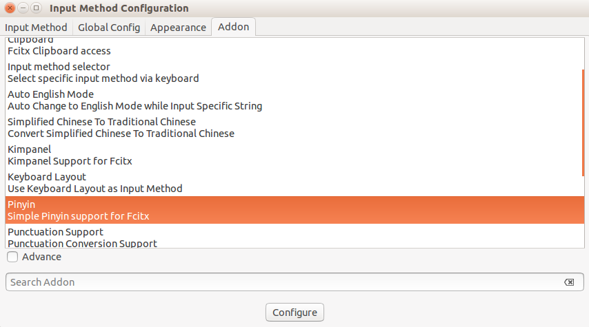
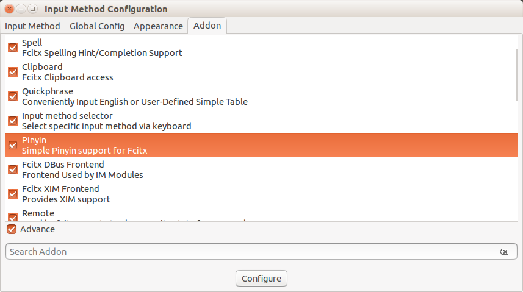
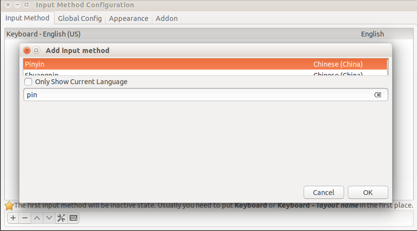
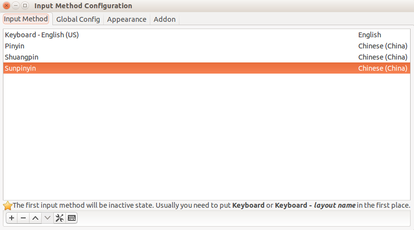

之前安装 ubuntu时候选择安装英文版，但是在查资料的时候难免的要输入中文
所以自己弄了一下中文输入法的安装 我安装的是fcitx小企鹅输入法 下面介绍一下安装的过程。。。。。
 
ubuntu默认的输入法是ibus，综合网上评论，fcitx的支持者更多，而且个人感觉fcitx也的确不错，可以满足日常输入。

###STEP1： 在Ubuntu Software Center 搜索fcitx，安装fcitx输入法框架，安装好后在任务栏右上角会出现fcitx设置图标（一个键盘）.###

###STEP2: 修改系统输入法：###

###STEP3： 在Terminal 下命令安装拼音输入法： sudo apt-get install fcitx-pinyin###

###STEP4： 在Text Entry Setting中增加Chinese###

###SEEP5： 设置fcitx输入法。此时在fcitx设置中已经检测到拼音输入法，添加就可以了。###

###注意勾选Advance，再来选择添加Pinyin输入法###

###然后添加输入法，注意点下面的小加号添加新的输入法###

###注意不要勾选：Only Show Current Language，不要只是显示当前系统语言（因为我的是安装英文版的ubuntu，这样的话只有英语）###

###输入pin搜索中文输入法，将三个都添加，如下图###

###在输入状态下直接Ctrl + Space 即可调出拼音输入法。###

 