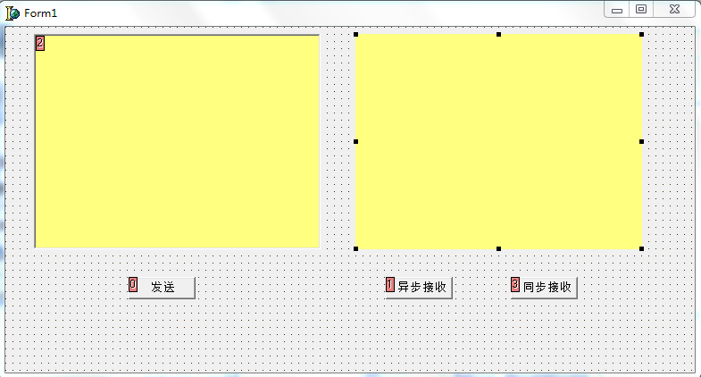
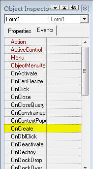
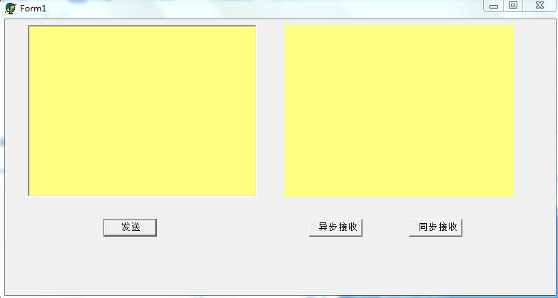

经常遇到这样的情况，在我们使用Delphi的可视化工具进行UI设计的时候，我们拖拽TEdit或者Label组件，并且在可视化界面上设置它们的长、宽

但是当我们编译和运行程序的时候，却发现真正显示出来的 TEdit或者TLabel组件并不是我们在可视化界面所拖拽的长和宽（显示的“有问题”）

具体的情况见下面的两张图

**1.我们在Delphi的可视化界面上需要一个TEdit和TLabel组件，于是我们拖拽了两个组件放在上面，并且设置拖拽设置了长和宽（为了显示清楚，我设置了颜色）**

 

这个时候通过拖拽设计界面上的组件设置

**2.但是按 F9 运行的时候显示的却是这样的效果**

 

明显图中显示的 TEdit、TLabel组件（两个黄色区域）根本就不是设置的时候的样子

###2015.08.07发现了本质原因###

上面出现的这个问题，我在2015.05.11专门写了博客说明解决方法（见本博客的下部分），那个方法确实可以解决问题，但是没有弄明白真正的原因，所以现在进行说明。

在可视化界面上通过拖拽设计TEdit或者TLabel的大小的时候，拖拽好了一个长和宽，但是在点击编译运行之后，发现出来的效果是不一样的（入上面的两张图）。

主要的问题就是出在TEdit的AutoSize属性（TLabel也有AutoSize属性），因为通过看该TEdit的Object Inspector配置面板，发现AutoSize为True，所以在Object Inspector配置面板上将AutoSize属性设置为False，然后再编译运行就可以看到实际的长和宽就是自己在设计时候拖拽出来的长和宽。

并不需要在窗体创建方法中声明。而且看下面的在窗体界面中来声明的解决方法其实还是将AutoSize设置为False，如果不讲AutoSize设置为False，而是直接显式声明TEdit的长和宽，编译后运行的效果还是有问题的，所以根本点在AutoSize属性上。（目前至少TEdit与TLabel都是这样的，要注意它们的AutoSize属性）

 
####在此问题上可以引申出Object Inspector配置界面的作用####

要想程序在编译运行之后有想要的刚启动时候的视觉效果，可以在对应组件的Object Inspector配置界面配置，也可以在窗口创建方法中显式声明，如果两者有冲突，那么窗体创建方法中的相关设置将覆盖组件在Object Inspector里面的配置。

关于组件配置的优先级，比如一个TEdit组件的大小（该控件放在一个窗体上）的配置，在Object Inspector里面进行了相关配置，在窗体创建方法中也有显式的声明，另外还有一个按钮，按钮点击方法中也有关于该TEdit的大小的改变的代码，那么在程序运行的时候，在刚启动程序的时候，首先是窗体创建方法中的配置会覆盖在Object Inspector里面的配置，如果点击了按钮，那么就会执行按钮的点击函数，此时会覆盖其在窗体创建方法中的相关设置。

不过还是建议在组件的Object Inspector配置界面里面配置相关的初始化的配置，这样就避免了在窗体创建方法中写太多的代码。

另外在研究源码的时候，尤其是研究涉及到控件的代码的时候，不要只是看代码，不要忘记了在组件的Object Inspector里面可能还有一些重要的配置信息。

###2015.05.11###

这个时候我们可以参考下面的具体事例解决：

当然这只是其中的一种方法，绝对还有其他的方法，而且我也不知道下面所讲的这种方法是不是很好的，所以还待补充

**1.我们在Delphi的可视化界面上需要一个TEdit和TLabel组件，于是我们拖拽了两个组件放在上面，并且设置拖拽设置了长和宽（为了显示清楚，我设置了颜色）**

  

这个时候通过拖拽设计界面上的组件确实

**2.但是按 F9 运行的时候显示的却是这样的效果**

 

明显图中显示的 TEdit、TLabel组件（两个黄色区域）根本就不是设置的时候的样子

**3.所以需要进行一些设置，在窗体创建的时候去显示的设置这两个组件的大小即可**

**3.1.**将鼠标点击到窗体上，再在Object Inspector的Events中双击窗体的OnCreate方法

 

**3.2.**然后跳回到代码编辑部分，开始编辑TForm的创建代码，并在这里面显式的设置那两个组件的大小

    procedure TForm1.FormCreate(Sender: TObject);
    begin
      edt1.AutoSize:=False;
      edt1.Height:=241;
      edt1.Width:=321;
    
      lbl1.AutoSize:=False;
      lbl1.Height:=241;
      lbl1.Width:=321;
    end;

特别注意，在设置对应组件的大小之前，一定要首先声明，比如：

    edt1.AutoSize:= False;

    lbl1.AutoSize:= False;

不过像TListBox等一些组件并不需要再设置长和宽之间设置其AutoSize（像TListBox就没有 AutoSize属性）

这样才能保证显示的效果是想要的

**4.然后在运行就可以显示想要的效果**

 