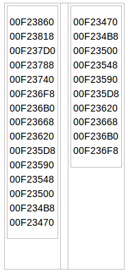

转载自：[http://www.cnblogs.com/qiusl/p/4028437.html?utm_source=tuicool](http://www.cnblogs.com/qiusl/p/4028437.html?utm_source=tuicool)

我估摸着内存分配+释放是个基础的函数，有些人可能没注意此类函数或细究，但我觉得还是弄明白好。

介绍下面内存函数之前，先说一下MM的一些过程，如不关心可以忽略：

    TMemoryManger = record
    GetMem: function(Size: Integer): Pointer;
    FreeMem: function(P: Pointer): Integer;
    ReallocMem: function(P: Pointer; Size: Integer): Pointer;
    end;
    
    var
    MemoryManger: TMemoryManager = (
    GetMem: SysGetMem;
    FreeMem: SysFreeMem;
    ReallocMem: SysReallocMem);

以上时D7版本的MM函数，其中变量MemoryManger我称为MM函数，请注意。

D2005-D2007以上版本（不确定是哪个版本），MM函数多了AllocMem以及RegisterLeak/UnRegisterLeak，与本文无关，就不多说了。

第三方MM接管的就是这MM的几个函数，达到外挂目的，而Sys打头的SysGetMem，SysFreeMem，，SysReallocMem则为本身系统自带的MM处理。

##New/Dispose##

此两函数，估计学习Delphi/Pascal就知道：为record/object此类数据进行分配和释放内存块。

然后分配与释放是调用的是GetMem/FreeMem函数，与GetMem/FreeMem不同之处是：New()在GetMem后，进行了initialize(x)操作，即对record/object的数据进行初始化的操作。

initialize函数，在system单元，该函数说白了，即对record.object里面含有string、interface、dync array、variant、record、array的字段，进行初始化为0（清空）。

这一步很重要，因为GetMem返回的内存块可能重复使用过，表示有值。

有值的情况下，再重复赋值，就表示旧地址对应的数据要先清空，清空随即地址的数据？AV就会出现了。。。

（不要想着，再GetMem后，进行每个字段初始化，容易出错的就是这个，在有以上字段的情况下，如果需要手动初始化，必须用fillchar，原因如上）

与之相反的Dispose()亦同，反操作，进行清空：finalize(x)，之后，再进行FreeMem，以保证record/object中，string、interface、dync array字段，不会因为直接调用FreeMem而泄露（Leak）。

总结是：

**1)** New==>GetMem(p, sizeof(TDataType)) + Initialize(p^)==>AllocMem(sizeof(TDataType);

它与AllocMem的区别是：initialize(x)不会对每个字节清0，只针对某些字段清0.

Dispose==Finalize(p^)+FreeMem(p);

没有可替代的函数，也不能少finalize(p^)这步操作，否则会有leak。

**2)** record/object 的指针类型，最好使用此对函数（New/Dispose)进行分配与释放。当然你也可以去自维护record/object里面的字段生存期。

但是New()只能获取对象的单个实体的内存大小，无法取得连续的存放多个对象的内存块，所以New适合分配record/object的内存，但是不适合动态分配数组内存。在这个方面GetMem就有优势

**3)** 如果调用system.Initialize或Finalize，出现提示：

[Hint] Unit1.pas(43): Expression needs no Initialize/Finalize

表示record/object 里面的字段，没有包含string,interface,dync array,variant,record,array，也就表示不需要调用Initialize或 Finalize进行操作

**4)** 多说一句：每个warn/hint都有其作用，请勿忽略，说不定小bug就在其中，请关注它们并干掉它们

##GetMem/FreeMem##

GetMem/FreeMem是MM的分配与释放内存块函数，多说一些与之相关的：此两函数，会因为分配或释放失败而抛出异常。

而MM对应的标准分配与释放函数是以返回值形式进行处理的，即失败了，只会返回空值（nil）或非0，而不是异常。

也就是说Get/FreeMem是针对MM的标准函数进行了异常封装。

异常信息：

* GetMem fail =>Out of Memory：分配失败，一般只会是进程的可用内存分配完毕，通常在内存泄露的情况下才会发生。
* FreeMem fail=>Invalid pointer operation：两次FreeMem同地址，第二次就有这个invalid pointer异常了

##GetMemory/FreeMemory##

Get/FreeMemory与Get/FreeMem基本相同，唯一的不同在于，它直接以MM的对应函数的返回值作为返回，而不进行异常处理。

即：GetMem调用MM.GetMem返回为nil，则有异常，而GetMemory则直接返回nil，交给调用者处理。

FreeMem调用MM.FreeMem返回非0（错误释放），则异常，而FreeMemory则直接返回0或非0，给调用者处理。

这点非常有用，在写程序的时候，可以减少异常，或者在Get/Fee出现错误时，写句assert(...)，让程序中断下来，检查并调试。

 
##SysGetMem/SysFreeMem##

SysGetMem/SysFreeMem与GetMemory/FreeMemory基本相同，区别在于，它直接调用MM的实现函数，而不是经过MM的管理器指针再行跳转。

即：SysGet/SysFreeMem，它使用的是系统自带的MM分配释放函数，当第三方MM加入后，以上三队函数都会由第三方MM接管，但SysGet/SysFreeMem它还是调用的本系统自带的MM函数处理，与第三方的MM无关。

 
##其他##

其他还有些Delphi单元的分配释放函数，不过基本是从以上四个函数扩展出来的，就不说明了。

当然也有从API扩展出来的分配+释放函数，则不在此列，它与Delphi系统的MM扩展无关。

##总结##

New+Dispose与GetMem+FreeMem，是基于VCL异常机制保护的分配+释放函数

GetMemory+FreeMemory与SysGetMem+SysFreeMem是由调用者自行控制返回，来决定是否返回异常或错误处理。

但是New()只能获取对象的单个实体的内存大小，无法取得连续的存放多个对象的内存块，所以New适合分配record/object的内存，但是不适合动态分配数组内存

##最后参考一篇比较好的博客，进行一些补充##

参考博客：[delphi dispose释放内存的方法 New 和 GetMem 的区别](http://bbs.fyjy.net/showthread.php?t=3732)

定义一个record 类型，经过多次new dispose后，从windows任务管理器看，占用的内存比启动时大了很多，似乎越来越大

设置 ReportMemoryLeaksOnShutdown := true; 再运行，仍然没有提示 memory leak。

其实就是dispose 本身的原因。

delphi设计的 dispose 释放内存时，只是标记这部分内存可以再用来被 new 等函数分配，并不是把从系统申请到的内存归还给操作系统，只在程序结束时，才全部释放给操作系统。

比如 new 申请 15 个记录（sizeof=64字节） 的空间，然后 dispose 释放。再使用 new 申请 10个，此时这 10 个就不再请求系统了，直接从刚才的 15个 (此时已经空闲) 中分10 个出来。只有在占用的空闲内存不够使用时，才请求操作系统分配内存（剩余部分）。

若前一次15个空间地址如左列，释放后，下一次10个空间的地址如右列，即从前次分配的最后一个地址开始，按前次的顺序，倒过来分配10个。 

 

如果操作一个 record 指针中的字符串变量，会不会丢失 string 的内存空间，造成内存泄漏？

结果是：使用 New() 分配的内存，会自动初始化 record 的内容，并且在 Dispose 时自动清除所有已分配的内存，包括 string 或其他动态数组的内存。GetMem/FreeMem 没有这个性质。事实上，New() 中调用了 GetMem，并且执行了一些初始化的操作。

代码如下：

    type
    PMyRecord = ^TMyRecord;
    TMyRecord = record
    I: Integer;
    S: string;
    V: Variant;
    end;
    
    
    {;$DEFINE NEW}
    
    
    procedure TForm1.Button1Click(Sender: TObject);
    var
    R: PMyRecord;
    I: Integer;
    begin
    for I := 1 to 1024 do
    begin
    {$IFDEF NEW}
    New(R); // 正确将 R.S 初始化
    SetLength(R.S, $FFFF);
    Dispose(R); // 正确释放 R.S 内存空间
    {$ELSE}
    GetMem(R, SizeOf(TMyRecord));
    R.S := ''; // 出错
    SetLength(R.S, $FFFF);
    FreeMem(R);
    {$ENDIF}
    end;
    end;

>GetMem 只负责分配空间，不会负责清空刚分配的空间，如果需要分配来就清空的空间可以用 AllocMem，AllocMem = GetMem + FillChar

哦，我上面犯错误了，以为 S = 0 时也会出错，所以没有 FillChar，其实不会。

这样就可以正确测出结果了：

(将 $DEFINE NEW 前面的 ; 去掉，可以从任务管理器中查看二种方法的内存占用)

    type
    PMyRecord = ^TMyRecord;
    TMyRecord = record
    I: Integer;
    S: string;
    V: Variant;
    end;
    
    
    {;$DEFINE NEW}
    
    
    procedure TForm1.Button1Click(Sender: TObject);
    var
    R: PMyRecord;
    I: Integer;
    begin
    for I := 1 to 1024 do
    begin
    {$IFDEF NEW}
    New(R); // 正确将 R.S 初始化
    SetLength(R.S, $FFFF);
    Dispose(R); // 正确释放 R.S 内存空间
    {$ELSE}
    GetMem(R, SizeOf(TMyRecord));
    FillChar(R^, SizeOf(TMyRecord), #0);
    SetLength(R.S, $FFFF);
    FreeMem(R); // 不会释放 R.S 内存空间 !!
    {$ENDIF}
    end;
    end;

>是的，FreeMem 不会释放其中的生存期自动管理的内容，因为在 FreeMem看来，那些都是一致的二进制数据，没有任何意义可言。不过可以通过一个Finalize 调用（或者 FinalizeRecord）解决该问题 我估计 Dispose 就直接或间接调用了 Finalize

呵呵，不用估计，帮助中明确地说明了。 

>In Delphi code, FreeMem destroys the variable referenced by P and returns its memory to the heap. If P does not point to memory in the heap, a runtime error occurs. If P points to a structure that includes long strings, variants, dynamic arrays, or interfaces, call Finalize before calling Freemem.
>......
>Note: It is preferable to use the New and Dispose procedures rather than GetMem and FreeMem. When using New and Dispose, there is no need to explicitly call Finalize.

guttier wrote:

呵呵，不用估计，帮助中明确地说明了。 

>In Delphi code, FreeMem destroys the variable referenced by P and returns its memory to the heap. If P does not point to memory in the heap, a runtime error occurs. If P points to a structure that includes long strings, variants, dynamic arrays, or interfaces, call Finalize before calling Freemem.
>......
>Note: It is preferable to use the New and Dispose procedures rather than GetMem and FreeMem. When using New and Dispose, there is no need to explicitly call Finalize.

这段英文我翻译一下。 

>“在DELPHI代码中，FreeMem根据变量所引用的指针释放内存，并将内存归还给堆。如果指针不是指向堆中的内存地址，将发生一个运行时错误。如果指针所指向的是一个数据结构，且其中包含有长字符串、Variants、动态数组、或接口，则在使用用FreeMem之前须调用Finalize ”
>"注意：使用New 和 Dispose 过程要强于使用GetMem与FreeMem。但我们使用New和Dispose的时候，不需要显示的调用Finalize "

翻译完了。肯定有不准确的地方。不过我有一个问题，内存分配既然new和Dispose要比GetMem与FreeMem容易使用，那么还有没有必要使用GetMem、FreeMem，在什么情况下使用它们？ 

----

内存分配既然new和Dispose要比GetMem与FreeMem容易使用 

容易使用”通常只能是一个相对的概念，在这里，我们讨论指向结构体的指针，在这种情况下，New/Dispose 通常是易用的。但是它们是有局限的，就是那个指针指向的空间的大小必须能够在编译期间确定，它们才知道需要分配多大的空间。对于指向结构体的指针，这个值就是结构体的大小，这当然是确定的，所以能够使用它们，并且能够带来便利。

可是还有一些情况，例如你只有一个 Pointer 类型，这是无类型指针，你把它传给 New，编译器就不知道它指向的是什么内容，也就不知道它指向的空间有多大，也就不知道需要分配多少空间，就根本不能用，更不用说易用了。

还有没有必要使用GetMem、FreeMem，在什么情况下使用它们？ 

当然有了，如前面提到的，相对来说，New/Dispose 操作更为高层一些，我们通常用它们来操作指向结构体的指针，即是说指针指向的内容是编译期间就已知的数据结构。而当我们需要更加低级的去操作一些内存空间的时候，比如你要自己处理字符串的时候，你的指针指向的就是只有你自己才知道或者说是你自己去进行理解的内存空间，没有编译期间的明确的数据结构与之对应。这个时候，就要用到 GetMem/FreeMem 了。

所以说，New/Dispose 的局限性实际上是很大的，或者说适用范围是很小的，而 GetMem/FreeMem 给了我们充分的自由，试用范围更广。当然，具体选用哪个，还要看实际情况而定。