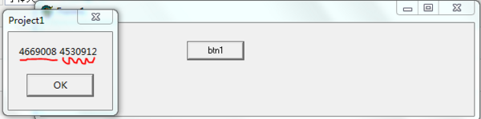

C/C++中的字符串、字符数组、字符指针分配的内存空间
===========================

我们知道在C/C++中，我们可以这样理解字符串和字符数组

1) 字符串，就是一个以 '\0' 结尾的字符数组

2) 字符数组，包括字符串，但是不一定要以 '\0' 结尾，如果不是以'\0' 结尾，那么就不能当做字符串使用

在C/C++中，使用字符串可以通过数组，也可以通过为字符指针动态分配内存来存放字符串，类似于字符数组，不过这种方法的内存需要程序员自己管理

不是以 '\0' 结尾的字符数组，不能作为字符串使用
--------------------------

    char c[2];
    c[0] = 'a';
    c[1] = 'b';

以 '\0' 结尾的字符数组，可以作为字符串使用
------------------------

    char c[4];
    c[0] = 'a'; c[1] = 'b'; c[2] = 'c';
    c[3] = '\0';
    
    /*
    等价于下面的方法
    char c[4] = "abc";
    */

动态分配的char指针指向的内存，不是以 '\0' 结尾的，不能作为字符串使用
---------------------------------------

    char *p = (char *)malloc(2);
    p[0] = 'a';
    p[1] = 'b';

动态分配的char指针指向的内存，以 '\0' 结尾的，能作为字符串使用
------------------------------------

    char *p = (char *)malloc(4);
    p[0]='a'; 
    p[1]='b'; 
    p[2]='c';
    p[3]='\0';

但是它并不等价于下面的代码

    char *p = (char *)malloc(4);
    p="abc";

这样不是往 p 所指向的内存中存储"abc"，而是将p 指针指向了字符串常量"abc"的地址，因此会造成之前分配的内存的地址没有被记录，也就没办法进行释放，所以就会造成内存泄露。

你可以通过两次输出 p 的地址来验证这个说法

    #include<stdio.h>
    
    int main(){
    char * p;
        p = (char *)malloc(4);
        printf("%d\n", (p));
        p="abc";
        printf("%d", p);
        return 0;
    }

我的测试时，两次输出的地址，一个是202720，一个是4206632，显然不是指向同一个地址。而

    char *p = (char *)malloc(4);
    printf("%d\n", p);
    p[0]='a'; 
    p[1]='b'; 
    p[2]='c';
    p[3]='\0';
    printf("%d\n", p);

因为是操作p 的元素，而不是直接操作 p指针的指向，所以上面的输出的两个地址一样

所以要理解 char型数组和char* 动态分配的内存、不同的赋值方法的本质是什么

Delphi中有字符串类型string等等
======================

但是这里只讨论字符数组、字符指针分配的内存空间和它们表示字符串的情况

其实Delphi的这方面的知识是和C/C++中的一样的，就像前面所讲的那样，它们是兼容的，所以在编写C/C++和Delphi兼容的代码时，Delphi要使用Char数组或者Pchar动态内存分配，而不使用string等字符串类型

数组无非就是内存分配在栈上，所以其他几个方面都类似下面讲解的PChar动态内存分配的情况

如果是对PChar指针进行内存分配（GetMem(p, size)）的话，那么这时候有两种情况（主要是一和二，三是额外讲解的一个特例情况）

以 '\0' 结尾的字符数组，可以作为字符串使用，不是以 '\0' 结尾的字符数组或PChar动态内存，不能作为字符串使用

类似于数组
-----

    var
        p: PChar;
        i: Integer;
    begin
        GetMem(p, 3);
        for i:= 0 to 2 do
            p[i]:='j';
    end;

这样就是一个字符数组，并且不是以#0结尾的，

或者指明最后一个元素为#0
-------------

    var
        p: PChar;
        i: Integer;
    begin
        GetMem(p, 3);
        for i:= 0 to 1 do
            p[i]:='j';
        p[2]:= #0; 
    end;

这里面并没有改变p 的指向

字符串
---

    var
        p: PChar;
        i: Integer;
    begin
        GetMem(p, 3);
        p:= 'jo';
    end;

参考C/C+部分的第四个例子，其实这里的程序三和程序二也是上面所讲的那种操作PChar指针的元素和直接操作PChar指针的情况

如果还不相信，那就进行测试来验证

    procedure TForm1.btn1Click(Sender: TObject);
    var
        p: PChar;
        i: Integer;
    begin
        GetMem(p, 3);
        i:= Integer(p); //保存为p动态分配内存之后的地址
        p:= 'jo';
    
        //下面比较P:= 'jo';前后的p所指向的内存的地址
        ShowMessage(IntToStr(i)+' '+IntToStr(Integer(p)));
    end;

结果如下（显然和C/C++中所讲的一样）
