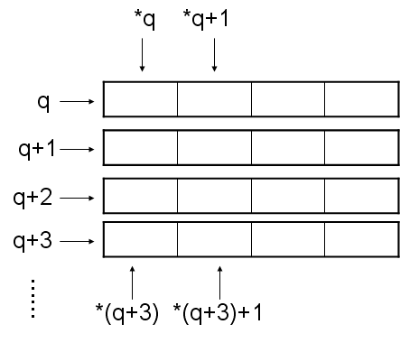

简单介绍
-----

C/C++中的这两种书写方法实在是很像，但是它们的含义有很大的不同，所以一定要能清晰地辨别它们。

简单地说，`int *p[4]`是指针数组，`int (*p)[4]`是指向数组的指针

指针数组：是一个元素全为指针的数组；数组指针：可以理解为指针，只是这个指针类型不是int而是int[4]类型的数组

`int *p[4]`，p是一个指针数组，每一个指向一个int型的，等价于`(int *) (p[4])`

`int (*p)[4]`，p是一个热指针，指向int[4]的数组

 

通过运算符优先级来理解
-----

上面的原因是，`*`(间接引用运算符) 的优先级低于 `[]` 的优先级。

首先看`int *p[4]`，[] 的优先级高，所以塔首先是一个大小为4的数组，即`p[4]`，剩下的`int *` 作为补充说明，即说明该数组的每一个元素为指向一个整数类型的指针。`int *p[4]`的存储结构如下：

再看`int (*p)[4]`。它首先是一个指针，即 `*p`，剩下的 `int[4]` 作为补充说明，即说明指针p 是指向一个长度为4的数组。`int (*p)[4]`的存储结构如下：
