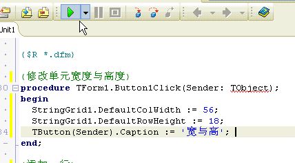

我是参考了[万一的博客里面的关于TStringGrid学习的教程](http://www.cnblogs.com/del/category/127352.html)，但是我也结合自己的实际操作和理解，加入了一些个人的补充，至少对我有用！

 
### 学用TStringGrid之——ColCount、RowCount、Cells

本例中使用到了Panel控件，只是比较简单的拖拽到界面上（比如可以在Panel上面放按钮……），详细的知识并没有涉及到，还是先学习TStringGrid。

本例的功能：

1. 获取StringGrid的行数、列数
2. 给单元赋值

**运行效果图 ：**

**代码如下：**

    unit Unit1;
    
    interface
    
    uses
      Windows, Messages, SysUtils, Variants, Classes, Graphics, Controls, Forms,
      Dialogs, StdCtrls, ExtCtrls, Grids;
    
    type
      TForm1 = class(TForm)
        StringGrid1: TStringGrid;
        Panel1: TPanel;
        Button1: TButton;
        Button2: TButton;
        procedure Button1Click(Sender: TObject);
        procedure Button2Click(Sender: TObject);
      end;
    
    var
      Form1: TForm1;
    
    implementation
    
    {$R *.dfm}
    
    {显示列数与行数}
    procedure TForm1.Button1Click(Sender: TObject);
    var
      cCount,rCount: Integer;
    begin
      cCount := StringGrid1.ColCount; {获取总列数}
      rCount := StringGrid1.RowCount; {获取总行数}
    
      Text := Format('总列数: %d; 总行数: %d', [cCount, rCount]); {显示在标题}
    end;
    
    {给每个单元赋值}
    procedure TForm1.Button2Click(Sender: TObject);
    var
      c,r: Integer;
    begin
      for c := 0 to StringGrid1.ColCount - 1 do
        for r := 0 to StringGrid1.RowCount - 1 do
          StringGrid1.Cells[c,r] := Format('%d,%d', [c,r]);
    end;
    
    end.

**我的补充：**

我尝试在我的电脑上编写了一样的程序，运行效果一样，我就纳闷了，为什么显示是有5行5列呢？于是我去看了一下代码中 TStringGrid的Object Inspector，看到了下面的图中的配置（以ColCount为例，ColCount为总列数，RowCount为总行数）

发现原来如果直接将TStringGrid组件拖拽到界面上，我的Delphi默认会设置有5行5列，如果想在程序刚启动的时候就显示不是5行5列，而是你自己个性化的配置，可以在Object Inspector里面去配置为你想要的行列数。或者显式在窗体的创建方法中用代码声明。

注意，在使用Delphi进行程序开发的时候，不光是要在代码编辑器中编辑代码，还要注意Object Inspector等工具的配合使用

另外可以学习其中Format函数的使用。用来格式化字符串，并且Format的返回值是string类型。

 
### 学用TStringGrid之——DefaultColWidth、DefaultRowHeight、Col、Row

**本例功能：**

1. 修改StringGrid单元的默认宽和高
2. 添加行和列
3. 确认当前单元并赋值

**运行效果图：**

**代码如下：**

    unit Unit1;
    
    interface
    
    uses
      Windows, Messages, SysUtils, Variants, Classes, Graphics, Controls, Forms,
      Dialogs, StdCtrls, ExtCtrls, Grids;
    
    type
      TForm1 = class(TForm)
        StringGrid1: TStringGrid;
        Panel1: TPanel;
        Button1: TButton;
        Button2: TButton;
        Button3: TButton;
        procedure Button1Click(Sender: TObject);
        procedure StringGrid1Click(Sender: TObject);
        procedure Button2Click(Sender: TObject);
        procedure Button3Click(Sender: TObject);
      end;
    
    var
      Form1: TForm1;
    
    implementation
    
    {$R *.dfm}
    
    {修改单元宽度与高度}
    procedure TForm1.Button1Click(Sender: TObject);
    begin
      StringGrid1.DefaultColWidth := 56;
      StringGrid1.DefaultRowHeight := 18;
      TButton(Sender).Caption := '宽与高';
      //也可以使用Button1.Caption:= '宽与高'; 的方式更改按钮上的文字
    end;
    
    {添加一行}
    procedure TForm1.Button2Click(Sender: TObject);
    begin
      StringGrid1.RowCount := StringGrid1.RowCount + 1;
      TButton(Sender).Caption := '加一行';
    end;
    
    {添加一列}
    procedure TForm1.Button3Click(Sender: TObject);
    begin
      StringGrid1.ColCount := StringGrid1.ColCount + 1;
      TButton(Sender).Caption := '加一列';
      //也可以使用Button3.Caption:= '加一列'; 的方式更改按钮上的文字
    end;
    
    {当前单元}
    procedure TForm1.StringGrid1Click(Sender: TObject);
    var
      c,r: Integer;
    begin
      c := StringGrid1.Col; {当前列}
      r := StringGrid1.Row; {当前行}
      StringGrid1.Cells[c,r] := Format('列:%d;行:%d', [c,r]);
      //注意TStringCell的Cells 属性的使用方式，而且它是一个string，表示对应列上的显示字符串
    end;
    
    end.

**我的补充：**

**1)** 注意代码中我对更改按钮上显示文字的说明
**2)** 注意代码中我对TStringGrid的Cells使用的相关说明
**3)** 代码中声明的StringGrid1Click方法可以通过在图形界面设计的时候双击TStringGrid控件，然后就可以在代码编辑器上添加这个方法并在其中添加你想要的代码了。

或者可以选中这个TStringGrid，在其Object Inspector上的Events中找到OnClick事件，然后双击Object Inspector上面的OnClick，也可以在代码编辑器上添加这个方法。很多组件的事件响应函数都可以通过双击Object Inspecto的Events里面列出的所有对应事件来进行声明。

**4)** 结合本文中的第一个程序的代码

单元格的行与列是从0而不是从1开始的，TStringGrid的Col 属性是返回当前单元格的列，Row属性是返回当前单元格的行

本段代码中的第三个按钮对应的方法：点击某个TStringGrid的单元格可以在上面显示字符串，但是对于第0行与第0列上所有的单元格都没有用，点击了也不会有反应

上面的这种方式没法通过点击TStringGrid的第0行与第0列上的单元格来使其响应，但是不是说明第0行与第0列上面是没办法添加数字的，具体例子比如本文的第一个程序。只是因为第0行与第0列的单元格没有办法对单击单元格的事件作出任何响应，比如你可以在单元格的单击事件中添加其他代码（比如弹出对话框），发现其他的单元格都可以响应，只有第0行与第0列的单元格不可以

 
### 其他的TStringGrid的知识

通过上面两个的简单总结，已经对TStringGrid有了初步的了解，更为深入、全面的学习可以直接参考[万一的博客中的相关内容](http://www.cnblogs.com/del/category/127352.html)。

并且最好自己写代码来玩玩！

* [学用 TStringGrid 1 - Cols、Rows](http://www.cnblogs.com/del/archive/2008/03/05/1091588.html)
* [学用 TStringGrid 4 - ColWidths、RowHeights](http://www.cnblogs.com/del/archive/2008/03/05/1091898.html）
* [学用 TStringGrid 5 - FixedCols、FixedRows、Color、FixedColor](http://www.cnblogs.com/del/archive/2008/03/05/1092123.html)
* [学用 TStringGrid 6 - Options](http://www.cnblogs.com/del/archive/2008/03/06/1093311.html)
* [学用 TStringGrid 7 - ColWidths[0]、RowHeights[0]、GridLineWidth](http://www.cnblogs.com/del/archive/2008/03/06/1094130.html)
* [学用 TStringGrid 8 - 字体列表](http://www.cnblogs.com/del/archive/2008/03/06/1094161.html)
* [学用 TStringGrid 9 - OnDrawCell
* [查看所有 Unicode 字符 Delphi 2009](http://www.cnblogs.com/del/archive/2008/08/13/1266470.html)
* [给 TStringGrid 添加鼠标拖动功能 - 回复 "dxx" 的问题](http://www.cnblogs.com/del/archive/2008/12/11/1353193.html)
* [如何在 TDrawGrid 的单元格中显示图片 - 回复 "巅枫" 的问题](http://www.cnblogs.com/del/archive/2011/02/09/1950102.html)