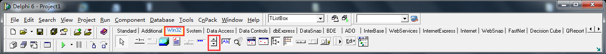
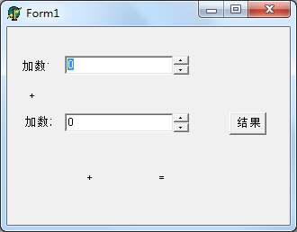

最近在开发中使用到了UpDown这个控件，但是因为之前没有使用过，所以很不熟悉，于是就编写了一个简单的demo来学习UpDown以及其结合TEdit的用法。

###初步的常用功能的简介###

目前（2015.08.07）只是涉及到其简单的用法，因为目前我所需要使用的就只有这些内容，系统化的使用和知识将会在以后需要的时候再补充。

目前涉及到的内容有UpDown组件与TEdit组件的配合使用、UpDown的Position属性。

####寻找UpDown：####

如下图，Win32下，用红色框框出来的

####先看一下这个程序的运行效果图：####

图1 程序启动时候的界面

图2 程序运行的效果

简单地对程序做一下说明：实现两个加数的相加操作，既可以在两个编辑框中直接输入数字，也可以通过UpDown组件来步进（步进数是1）对编辑框中的数字进行增减，然后点击按钮就会在下面显示相加的信息。

####程序分析：####

本例涉及到的程序使极其简单的，但是需要说明一下，因为这是一个小demo，所以我可能没注意其中组件、变量的命名规范，这是很不好的习惯，在真正的项目中是绝对禁止的，其实也应该从平时小demo的编写时候就要注意，所以再次以我的本段代码为一个反面教材！

    unit Unit1;
    
    interface
    
    uses
      Windows, Messages, SysUtils, Variants, Classes, Graphics, Controls, Forms,
      Dialogs, StdCtrls, ComCtrls;
    
    type
      TForm1 = class(TForm)
        ud1: TUpDown;
        edt1: TEdit;
        lbl1: TLabel;
        lbl2: TLabel;
        lbl3: TLabel;
        edt2: TEdit;
        ud2: TUpDown;
        lbl4: TLabel;
        lbl5: TLabel;
        lbl6: TLabel;
        lbl7: TLabel;
        btn1: TButton;
        lbl8: TLabel;
        procedure btn1Click(Sender: TObject);
        procedure FormCreate(Sender: TObject);
      private
        { Private declarations }
      public
        { Public declarations }
      end;
    
    var
      Form1: TForm1;
    
    implementation
    
    {$R *.dfm}
    
    procedure TForm1.FormCreate(Sender: TObject);
    begin
      ud1.Associate:= edt1;  //在窗体创建的时候，通过将ud1的Associate属性设置为edt1，将两个组件联系在一起，就可以通过ud1对edt1中的数字进行增减了
      ud2.Associate:= edt2;    //作用同上
    end;
    
    procedure TForm1.btn1Click(Sender: TObject);
    var
      res: Integer;
      plus1: Integer;
      plus2: Integer;
    begin
      plus1:= StrToInt(edt1.Text);   //可以使用该方式获取编辑框中的值  //TEdit的Text属性是string类型
      plus2:= ud2.Position;    //因为ud2.Associate:= edt2; 所以ud2与edt2联系在一起，所以也可以使用这样的方式获取编辑框中的值    // UpDown的Position属性是SmallInt类型
    
      res:= plus1 + plus2;
    
      lbl4.Caption:= IntToStr(plus1);
      lbl6.Caption:= IntToStr(plus2);
      lbl8.Caption:= IntToStr(res);
    end;
    
    end.

代码很简单，需要说明的知识点也都在代码中通过注释说明了。

 
####关于组件的Object Inspector的思考####

多说一句，我是通过在窗体创建的方法中显式声明了ud1.Associate:= edt1; 以及ud2与edt2的结合的，还有一种方式，以ud1和edt1为例，就是在图形界面的设计界面上选中ud1，然后去到Object Inspector这个配置界面来配置ud1 的相关属性，当然就可以配置ud1 的Associate 属性，将其设置为edt1，这样就不需要再在窗体的创建方法中通过代码来声明了。（此时既可以通过edt1的Text属性获取编辑框中的值，不过注意是string类型，也可以通过ud1的Position方法获取编辑框中的值，Position是SmallInt类型

这里介绍了Object Inspector是为了说明，可能有时候你在看一些代码的时候，发现很多东西没有在代码中，但是运行时候好像又有效果，可能是因为其是在Object Inspector里面进行的配置，而不是在代码中进行显式的说明。

关于Object Inspector还有另外一个例子，请参见《[解决Delphi的TEdit、TLable等组件手动拖拽固定大小，但是编译后显示有差别的情况](http://www.xumenger.com/delphi-form-tedit-tlable-20150511/)》

 
###限制TEdit中只能输入数字###

在TEdit和UpDown的配合使用中，往往需要限制只能在TEdit中输入整数，为了防止用户误操作而输入汉字或者字母，需要在代码中实现这个限制。

这里给出限制只能在编辑框中输入数字（小数点、'-'号、数字）的方法，具体的比如限制只能输入正整数、限制只能输入整数……方法可以参考实现。

    procedure Tform1.Edit1KeyPress(Sender: TObject; var Key: Char);
    var
     edt: TEdit;
     str, strL, strR: string;
     p: integer;
    begin
       // 获取当前文本内容, 注意要去掉选中部分(因为会被改写).
     edt := TEdit(Sender);
     str := edt.text;
     if Length(edt.SelText) <> 0 then
     begin
       strL := LeftStr(edt.text, edt.SelStart);
       strR := RightStr(edt.text, Length(edt.text) - edt.SelStart - edt.SelLength);
       str := strL + strR;
     end;
       // 限制输入数字/小数点/退格键
     if not (Key in [#8, #13, #127, '.', '-', '0'..'9']) then Key := #0;
       //限制只能输入一个小数点
     if Key = '.' then
     begin
       p := Pos('.', edt.Text);
       if p > 0 then Key := #0;
     end;
       //限制只能在第一位输入且只能输入一个'-'号
     if Key = '-' then
     begin
       if edt.SelStart > 0 then Key := #0;
       p := Pos('-', edt.Text);
       if p > 0 then Key := #0;
     end;
    end;
    
    //要uses StrUtils单元

如果程序里有很多的TEdit要做此限制，当然不必给每个控件写代码，把事件指定到同一个过程就行了。

注意其中的Tform1.Edit1KeyPress方法不是直接你在代码编辑器中声明就可以的，需要通过该编辑框组件的Object Inspector里面，找到Events->OnKeyPress这个事件，如下图

然后双击这个事件，就会在代码编辑器中出现该方法的声明，然后就可以进行编辑了，然后再看编辑框组件的Object Inspector里面的OnKeyPress事件，已经有方法了，如下图：

这也是很多其他组件在编写组件的事件时使用的方法。

 

###介绍UpDown的更多常用的属性和方法###