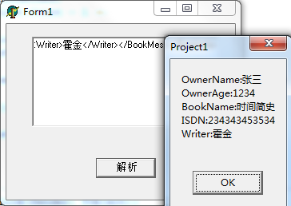
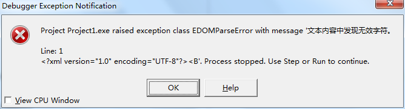

这个程序可以用于解析任何合法的XML字符串。

## 首先是看一下程序的运行效果：

以解析这样一个XML的字符串为例：

`<?xml version="1.0" encoding="UTF-8"?><BookInfo><Owner><OwnerName>张三</OwnerName><OwnerAge>1234</OwnerAge></Owner><BookMes><BookName>时间简史</BookName><ISDN>234343453534</ISDN><Writer>霍金</Writer></BookMes></BookInfo>`

首先是打开应用程序

然后将上面所示的字符串复制到文本编辑框中，然后点击解析按钮，会出现下面的效果

如上图所示，可以 “XML中的字段标签：XML中对应标签的值” 的格式显示解析的效果。

因为进行了异常处理（使用try..except..end，并且在异常处理中使用ShowMessage弹出异常信息），所以如果输入的字符串不是合法的XML格式的话，程序会正常报错，而不会异常终止。

比如没有输入直接点击解析按钮，效果如下：

有比如输入一个非法的字符串，效果如下

## 然后看一下代码

    unit Unit1;
    
    interface
    
    uses
      Windows, Messages, SysUtils, Variants, Classes, Graphics, Controls, Forms,
      Dialogs, StdCtrls, XMLIntf, XMLDoc;
    
    type
      TForm1 = class(TForm)
        edt1: TEdit;
        btn1: TButton;
        procedure btn1Click(Sender: TObject);
      private
        { Private declarations }
      public
        { Public declarations }
      end;
    
    var
      Form1: TForm1;
    
    implementation
    
    {$R *.dfm}
    
    procedure ReadXml(Node: IXMLNode; var showmess: string);
    var
      NodeList: IXMLNodeList;
      strName: string;
      i: Integer;
    begin
      if not Node.HasChildNodes then Exit;
      nodeList := node.ChildNodes;
      for i := 0 to nodeList.Count - 1 do
      begin
        strName := nodeList[i].NodeName;
        if nodeList[i].IsTextElement then //如果是元素
        begin
          showmess:= showmess + strName + ':' + NodeList[i].NodeValue + #13#10;
        end
        else if nodeList[i].HasChildNodes then //如果有子节点
        begin
          ReadXml(NodeList[i], showmess);
        end;
      end;
    end;
    
    procedure TForm1.btn1Click(Sender: TObject);
    var
      sXML, showmess: string;
      ComInstrXML: IXMLDocument;
      mainNode: IXMLNode;
    begin
       showmess:= '';
       sXML:= edt1.Text;
       sXML:= StringReplace(sXML, 'UTF-8', 'gbk', []);   //只替换<?xml version="1.0" encoding="UTF-8"?>里面的字符编码方式，因为往往这个是在最前面出现的，所以StringReplace的第四个参数是[]
       try  //一定不要忘记异常处理，保证程序的稳定性，能够正常处理异常而不至于在发生异常的时候导致程序崩溃
         ComInstrXML:= LoadXMLData(sXML);
         mainNode:= ComInstrXML.DocumentElement;
         readXML(mainNode, showmess);
    
         ShowMessage(showmess);
       except
         on E: Exception do
         begin
           ShowMessage(E.Message);
         end;
       end;
    end;
    
    end.

## 讲解一下代码

### 0.建议这样使用XML解包

本例中的程序，在解包之后是将标签以及对应的值显示在弹出框上，这样只是为了演示解析XML的效果。

建议在开发中将解析好的XML节点，以节点的标签作为Key，以节点的内容作为value，插入到一个可以搜索的链表或者其他什么可以根据Key进行搜索的容器类中，然后在之后使用的时候就可以很方便的搜索到解析后的值。

### 1.注意解析XML使用到相关的类、方法所属的单元

要使用IXMLDocument、IXMLNodeList和iXMLNode，需要引入 XMLIntf 单元。

要使用 LoadXMLData方法，需要引入XMLDoc 单元。 

### 2.递归解包XML

因为XML本身就是一个递归的结构，所以解包XML，也就是其中的ReadXML 方法使用的就是递归的方法，递归结束标志是：正在解析的XML标签是一个元素，没有子节点。

### 3.字符编码的问题 

在 TForm1.btn1Click(Sender: TObject) 方法中，我们可以看到首先将XML字符串中的 'UTF-8' 替换为 'gbk'，因为如果编码方式是UTF-8：<?xml version="1.0" encoding="UTF-8"?>，那么如果XML中存在中文，那么解析的时候会报错（如果全部为英文，那么就不会报错），如下图

如果将UTF-8替换为gbk，，那么在解析XML的时候就不会报这样的错误。

另外如果以不包含编码格式的XML字符串，如：`<BookInfo><Owner><OwnerName>张三</OwnerName><OwnerAge>1234</OwnerAge></Owner><BookMes><BookName>时间简史</BookName><ISDN>234343453534</ISDN><Writer>霍金</Writer></BookMes></BookInfo>，没有 <?xml version="1.0" encoding="UTF-8"?>`的话，此时就算有`sXML:= StringReplace(sXML, 'UTF-8', 'gbk', [rfReplaceAll]);`   这样的替换字符编码的代码也是没有用的，也没有办法改成gbk的编码，所以仍然会报上面的异常。

所以请注意字符编码的问题，尤其是既有中文又有英文的时候。

另外还有一个需要注意的点，我们只需要替换“<?xml version="1.0" encoding="UTF-8"?>”这个里面的UTF-8为gbk就行了，因为可能XML本身的其他字段就存储着什么关于字符编码的信息，但是与本条XML报文无关，纯粹只是一条需要传输的信息。下面的一条XML的报文就是例子：

`<?xml version="1.0" encoding="UTF-8"?><BookInfo><Charset>UTF-8</Charset><Owner><OwnerName>张三</OwnerName><OwnerAge>1234</OwnerAge></Owner><BookMes><BookName>时间简史</BookName><ISDN>234343453534</ISDN><Writer>霍金</Writer></BookMes></BookInfo>`

这时候在替换的时候，要注意只要替换XML本身的字符编码就好了，其他的XML需要传输的可能有关于字符编码的信息不能替换，否则可能导致传输的XML信息违背了其传输时候的初衷了！！

所以上面的代码中使用：sXML:= StringReplace(sXML, 'UTF-8', 'gbk', []); 　　其中StringReplace的第四个参数是[] 表示只替换第一个即可。

### 4.stringReplace函数的使用

    function StringReplace (const S, OldPattern, NewPattern: string; Flags: TReplaceFlags): string; 

* rfReplaceAll：全部替换 
* rfIgnoreCase：忽略大小写

例子

    var 
        aStr: String; 
    begin 
        aStr := 'This is a book, not a pen!'; 
        ShowMessage(StringReplace (aStr, 'a', 'two', []));//This is two book, not a pen!只替换了第一个符合的字符串 
        ShowMessage(StringReplace (aStr, 'a', 'two', [rfReplaceAll]));//This is two book, not two pen!替换了所有符合的字符串 
        aStr := 'This is a book, not A pen!'; 
        ShowMessage(StringReplace (aStr, 'a', 'two', [rfReplaceAll]));//This is two book, not A pen!只替换了符合的字符串(小写a) 
        ShowMessage(StringReplace (aStr, 'a', 'two', [rfReplaceAll, rfIgnoreCase]));//This is two book, not two pen!不管大小写替换了所有符合的字符串
    end;

### 5.换行

注意代码中有这样一行代码：

    showmess:= showmess + strName + ':' + NodeList[i].NodeValue + #13#10;

其中的 #13#10 表示换行
