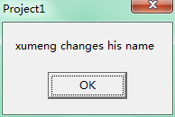

[此篇博客](http://xumenger.github.io/delphi-pointer-new/)中我总结的关于New和指针的问题，最近在使用Delphi的面向对象的时候，发现很多类似的问题，现在也要总结一下。

目前以下的总结是针对Delphi的，对于C++我还没有实验过。

**通过类声明的变量（对象名）就相当于一个指针，指向内存中的对象实体**

情况一：对一个对象变量多次Create　　　　　　　　　
=====

首先说一下对象声明的时候
-----

    var
        ObjectA: ClassA;

比如有一个类ClassA，用它来声明一个变量 ObjectA: ClassA; 

注意这个时候的对象名 ObjectA相当于一个空指针，因为此时并没有创建一个对象实体。在Delphi的面向对象编程中，对象名就是一个实实在在的指针。

> 在Delphi中的类声明的变量实际上是指向堆中的类实例数据的32 位指针，需要Create构造函数在内存中创建实体。
> 
> 当访问对象的域、方法和属性时，编译器会自动产生一些代码来处理这个指针。因此对于新手来说，对象就好像是一个静态变量。这意味着，Delphi无法像C++那样在应用程序的数据段中为类分配内存，而只能在堆中分配内存。
> 
> 所以Delphi的对象实例需要最后自己调用Free()方法来释放，而不能在作用域结束之后被自动释放。

接着说一下创建一个对象的时候
-----

    ObjectA:= ClassA.Create;

如上面的代码，此时才真正在内存中创建了一个对象实体，ObjectA指向这个实体。

其实还可以通过ObjectA再创建一个实体
-----

    ObjectA:= ClassA.Create;

此时又新建了一个对象实体，此时ObjectA指向这个新的对象实体，但是因为ObjectA指向了新的对象实体，而又没有对象指针指向原来的对象实体，所以就造成了原来的实体的丢失，也就是`内存泄露`。

以一个小例子更好的说明
-----

    unit Unit1;
    
    interface
    
    uses
      Windows, Messages, SysUtils, Variants, Classes, Graphics, Controls, Forms,
      Dialogs, StdCtrls;
    
    type
      TForm1 = class(TForm)
        btn1: TButton;
        procedure btn1Click(Sender: TObject);
      private
        { Private declarations }
      public
        { Public declarations }
      end;
    
      ClassA = class
      public
        name: string;
      end;
    
    var
      Form1: TForm1;
    
    implementation
    
    {$R *.dfm}
    
    procedure TForm1.btn1Click(Sender: TObject);
    var
      ObjectA: ClassA;
    begin
      ObjectA:= ClassA.Create;
      ObjectA.name:= 'xumeng';
    
      ObjectA:= ClassA.Create;
      if ObjectA.name ='xumeng' then
        ShowMessage('没有新建对象')
      else
        ShowMessage('新建了对象，并且ObjectA指向了新的对象，而原来的对象实体丢失了');
    end;
    
    end.

点击按钮，程序运行的效果图如下：

代码讲解
-----

这个例子中，再按钮的点击方法中先ObjectA:= ClassA.Create;，此时新建了一个ClassA对象实体，ObjectA指内存中的该实体。

然后将ObjectA的name 变量设置为 'xumeng'。

紧接着又进行了 ObjectA:= ClassA.Create; 此时又新建了一个ClassA对象实体，ObjectA指向新的对象实体。因为通过上面的代码运行之后可以看到这时候对象的name 不是 'xumeng' 了，所以就不再是原来的对象了，所以也就说明如果这样可能造成内存泄露。大多数的对象如果出现这种情况，因为丢失了对象的指针也就没有办法通过指针对对象进行释放，所以也就造成了内存泄露；也存在这样的情况，比如一个线程对象，其Execute方法是执行一个循环然后结束，并且将其FreeOnTerminate属性设置为True，那么该线程就会在执行完Execute之后自行释放，这种情况下就不会造成内存泄露。但是正如文字所描述的，这种情况实在是要有太多的前提条件，所以为了不出现内存泄露，保证软件项目的质量，一定要尽可能避免上面所提到的情况。

情况二：多个对象变量指向一个对象实体　
===========

可以直接来个代码看一下
----

    unit Unit1;
    
    interface
    
    uses
      Windows, Messages, SysUtils, Variants, Classes, Graphics, Controls, Forms,
      Dialogs, StdCtrls;
    
    type
      TForm1 = class(TForm)
        btn1: TButton;
        procedure btn1Click(Sender: TObject);
      private
        { Private declarations }
      public
        { Public declarations }
      end;
    
      ClassA = class
      public
        name: string;
      end;
    
    var
      Form1: TForm1;
    
    implementation
    
    {$R *.dfm}
    
    procedure TForm1.btn1Click(Sender: TObject);
    var
      ObjectA, ObjectB: ClassA;
    begin
      ObjectA:= ClassA.Create;
      ObjectB:= ObjectA;
    
      ObjectA.name:= 'xumeng';
      ObjectB.name:= 'xumeng changes his name';
    
      ShowMessage(ObjectA.name);
    
    end;
    
    end.

点击按钮，程序运行的效果如下

代码讲解
-----

首先是ObjectA:= ClassA.Create;　就是在内存中创建了一个ClassA对象实体，然后ObjectA指向该对象实体。

然后将ObjectA 赋值给ObjectB，注意这里的效果是ObjectB也指向了ObjectA所指向的那个内存实体，并没有新建一个内存实体。

所以先通过ObjectA.name:= 'xumeng'; 给这个内存实体的name 变量赋值之后，再通过ObjectB.name:= 'xumeng changes his name'; 就修改了这个对象实体的name。

像上面的代码就只是将两个指针指向了同一个内存实体而已。注意只有通过类的Create方法才能真正在内存中创建实体。变量名就只是相当于一个指针，用于指向内存中的实体。

上面的代码的效果对于Delphi里面的所有类都是一样的原理！！

另外一种情况讲解　　　　　　　　　　　　　　　　　　
=====

一些特殊的线程

往往很多的时候你会看到这样的线程代码

    type
        MyThread = class(TThread)
        ......
        end;
    
    begin
        MyThread.Create;
        MyThread.Create;
    end;

这里面是创建两个线程，并且线程运行，很多时候其实以这样方式创建的线程是在Execute方法里将其FreeOnTerminate设置为True，而且其Execute 函数是一个有限的循环，这样线程就一定会在未来某个时间点结束运行并且自己释放相关资源。

所以这样就不需要通过对象的变量名再去显式的操作线程。

其他的大多数情况
----

其他的大多数的类，需要通过指向对象实体的变量名（指针）来显式的释放资源

还有线程类（比如没有将FreeOnTerminate设置为True的线程，比如无限循环执行的线程），需要通过指向对象实体的变量名（指针）来显式结束线程并且释放资源。

例程

    type
        ClassA = class
        public
            name: string;
        end;
    
    begin
        ClassA.Create;
        ClassA.Create;
    end;

像上面的代码，创建了对象之后也就立即丢失了对象，这样就只能造成内存泄露，所以坚决杜绝！！

一定要保证创建的对象在使用完之后都释放掉，不要造成内存泄露。

