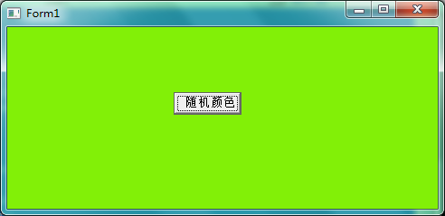

先讲解一下大致原理
=======

在DLL中可以封装窗体，需要解决的关键问题在于DLL中的Application对象和调用的Application对象是有区别的。

对于一般的应用程序来说，Application对象是VCL固定的，一般不需要修改Application对象指针。但是在DLL中，使用窗体或者使用Application对象时，那么使DLL的Application和调用程序一样，这样才不至于混淆。如果不修改Application对象，那么应用程序退出的时候，可能会出现错误。例如使用如下代码在调用程序中导出一个函数：

    function DllFunction(App: TApplication; PForm: TForm): TForm2; stdcall;
    begin
        Result:= TForm2.Create(PForm);
    end;

当主程序退出时，就可能发生错误。解决这个问题的步骤如下：

**第一步**：按照创建DLL的步骤新建一个DLL项目

**第二步**：在DLL项目中新建一个需要封装的窗体，并根据需要添加窗体代码

**第三步**：增加一个过程，过程以应用程序的句柄作为参数，并将此句柄赋值给DLL的Application对象的句柄，示例代码

    procedure SynAPP(App: THandle); stdcall;
    begin
        Application.Handle:= App;
    end;

**第四步**：编译生成DLL文件

**第五步**：应用程序中需要调用封装在DLL中的窗体时，首先调用SynAPP过程，然后进行其他操作

然后以一个示例进行具体说明　　　　　　　　　　　　　
=======

在DLL中封装一个窗体，窗体中只有一个“随机颜色”按钮，单击改按钮即可改变窗体的背景色。

首先，新建一个DLL项目工程，在这个项目里面新建一个窗体，并在这个窗体上添加一个名为“随机颜色”的按钮，其Click事件处理代码如下：

    procedure TFrmDLL.Button1Click(Sender: TObject);
    begin
        Color:= RandomRange(0,255*255*255);   //注意想要使用RandomRange函数，请引入Math单元。
    end;

然后，在窗体中增加方法SynApp和显示窗体的方法ShowForm，这里面特别需要注意的一点是因为SynAPP函数里面使用到了Application这个变量，所以必须使用Application的源码文件中导入Forms单元，因为这个变量是在Forms里面进行声明的：var Application: TAppliaction;。否则可能会报错：“没有声明Application对象”。

代码如下：

    interface
        {......}
    procedure SynAPP(App: THandle); stdcall;  //需要从DLL中导出的函数，一定要有stdcall关键字
    procedure ShowForm; stdcall;
    
    implementation
    procedure SynAPP(App: THandle); stdcall;
    begin
        Application.Handle:= App;     //请导入Forms单元。注意这样的赋值方式就可以不用在DLL里面再CreateApplication。
                                     //而是直接将加载DLL的应用程序的Application赋值给它（这个Application是在应用程序中已经Create了的）
    end;
    
    procedure ShowForm; stdcall;
    begin
        try
            frmDLL:= tFrmDLL.Create(Application);
            try
                frmDLL.ShowModal;
            finally
                frmDLL.Free;
            end;
        except
            on E: Exception do
                MessageDlg('Err in DLLForm:' + E.Message, mtError, [mbOK], 0);
        end;
    end;

　　

在DLL项目文件增加导出函数/过程的声明（注意如果里面涉及到string类型的运算，请第一个引入ShareMem单元）

    exports
        SynApp, ShowForm;

编译之后DLL就创建完成了。

在加载并使用DLL时，首先必须调用SynAPP，并且将主程序的Application的句柄作为参数传递，否则主程序在退出时会引起系统错误。

主程序也非常简单，有两种方案！

方案一
-------

就是在主程序的主窗体中添加一个按钮，点击按钮调用DLL封装的方法，显示窗体。

首先新建一个应用程序项目，在主窗体上添加一个按钮，保存项目文件和主窗体文件，并且把上面生成的DLL文件：FormDLL.dll拷贝到该项目的目录下。

接着使用静态加载（当然动态也可以）方法加载DLL，声明需要导入的函数

    interface
        {...}
    procedure SynAPP(App: THandle); stdcall; external 'FormDLL.dll';
    procedure ShowForm; stdcall; external 'FormDLL.dll';
    //之前创建的DLL项目生成的DLL被命名为FormDLL.dll

然后调用封装在DLL中的窗体的代码并添加在按钮的Click实践处理函数中

    procedure TForm1.Button1Click(Sender: TObject); 
    begin
        SynAPP(Application.Handle);
        ShowForm;
    end;

方案二
-----
**顺便讲解一下我对Delphi的项目、dpr文件、Application的理解**

但是方案一还需要在主程序中创建一个窗体，我们能不能不在主程序先创建一个窗体，通过点击按钮的方式显示DLL中的窗体，而是直接在打开主程序的时候显示的就是DLL中封装的窗体。

首先我们来看一下使用Delphi新建一个项目的时候（注意是应用程序项目，是EXE项目，新建的一个DLL项目并不是这样的），默认在编辑器中打开的文件是一个Unit.pas文件（当然可以保存时候修改其命名，新建的DLL项目打开的是一个dpr文件），这个Unit.pas文件中会有一个空窗体的类。

像我之前初学Delphi的时候，以为一个应用程序项目就是一个Form，所以导致后面学习的时候出现了很多的疑惑，现在终于明白了，其实每个应用程序都有一个项目文件（.dpr），不过Delphi默认在新建应用程序（.exe）的时候打开的是一个窗体的文件（其实你双击打开一个应用程序项目的dpr文件，它在编辑框打开的也是这个主窗体的源码文件），它是默认一个Application至少有一个可视化的主窗体的，不过这个默认不是强制，其实是可以不带窗体的，就像我们下面要讲到的，可以不要这个默认的窗体。

这样的默认打开主窗体文件的方式，使得很多初学者误会，所以现在我们需要打开dpr文件，看看里面到底是什么，怎么打开呢，看上面的描述好像是打不开的，其实还是有方法的，在Delphi的开发环境中打开的应用程序项目之后，是默认代开主窗体文件，这时候可以按快捷键：`Ctrl+F12`，然后会看到（以一个新建的空项目为例）

然后双击那个Type为Project的那个就是打开dpr文件，一个新建的空项目的dpr文件里面的代码如下

    program Project1;
    
    uses
      Forms,
      Unit1 in 'Unit1.pas' {Form1};
    
    {$R *.res}
    
    begin
      Application.Initialize;
      Application.CreateForm(TForm1, Form1);
      Application.Run;
    end.

在这里面我们可以看到有两个重要的变量：Application、Form1，那么首先看Application是在哪里声明的，按住Ctrl，鼠标左键点击这个变量，可以到达它声明的地方，看到它是在Delphi自带的Form单元里面声明的，这也就是为什么一个应用程序的dpr里面会引入Form的一个原因。

另外再看Form1，它是在默认创建的主窗体文件Unit.pas里面声明的，但是是在这里面创建的。

所以到现在我们可以知道，一个Delphi创建的应用程序的项目，不是“一个Form是一个应用程序”，而是“一个 Application是一个应用程序”，所以这也就解释了，上面使用DLL封装窗体的时候所讲到的“对于一般的应用程序来说，Application对象是VCL固定的，一般不需要修改Application对象指针。但是在DLL中，使用窗体或者使用Application对象时，那么使DLL的Application和调用程序一样，这样才不至于混淆。如果不修改Application对象，那么应用程序退出的时候，可能会出现错误”。

其实一个应用程序可以不需要有窗体，但是一定有一个DLL，我们可以进行一下测试，我们可以将这个dpr的文件修改为

    program Project1;
    
    uses
      Forms;
    
    {$R *.res}
    
    begin
      Application.Initialize;
      Application.Run;
    end.

然后保存这个项目，需要保存dpr项目文件，不用保存那个窗体的相关代码文件。

这时候可以通过Project->Options->Forms看到这个项目没有任何窗体（这个菜单路径可以用来设置应用的主窗体），如下图

明显这个项目没有任何的窗体了，这时候在Delphi开发环境下使用Ctrl+F9可以编译通过，使用F9快捷键可以执行这个项目（不过这时候项目会刚开始执行就结束，很快，但是能够感受到这个项目可执行，不信的话，在其中加个断电调试一下，发现可以停住在断点处，所以可以运行）。

**所以我们下面继续我们直接显示DLL中封装的窗体的讲解。**

新建一个项目，按Ctrl+F12，然后打开dpr文件，先保存项目，注意这时候不要保存那个窗体文件的相关代码文件，然后将FormDLL.dll拷贝到本程序源码所在的目录下。

需要编辑dpr文件如下：

    program Project1;
    
    uses
      ShareMem, Forms;   //注意如果加载的DLL中有string的运算的话，一定要在加载该DLL的应用程序的dpr文件中第一个引入ShareMem单元，
    　　　　　　　　　　　　//不过为了防止意外，不论有没有涉及到string运算，请都要第一个引入shareMem单元
    procedure SynAPP(App: THandle); stdcall; external 'FormDLL.dll';   //从DLL中导入的函数，一定要有stdcall关键字
    procedure ShowForm; stdcall; external 'FormDLL.dll';
    {$R *.res}
    
    begin
      SynAPP(Application.Handle);
      ShowForm;
      Application.Initialize;
      Application.Run;
      {
        顺序也可以是
      Application.Initialize;
      Application.Run;
      SynAPP(Application.Handle);
      ShowForm;
        
        顺序还可以是
      Application.Initialize;
      SynAPP(Application.Handle);
      ShowForm;
      Application.Run;
    
        上面提到的这两种放置Application.Initialize;和Application.Run;代码位置的方法
        都可以执行，都已经实验过，但是具体的原因我还说不出来
        }
    end.

然后就可以编译并且运行这个程序，运行结果如下（这个截图显示的是点击了按钮几次后随机变换颜色的效果）

