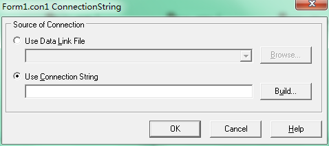
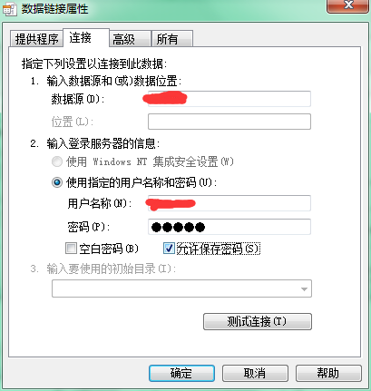
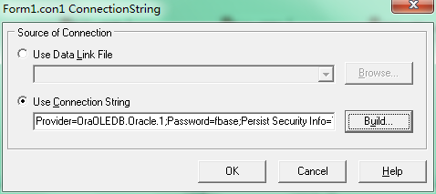

Delphi是一个可视化的编程工具，ADO编程也是这样，所以话不多言，直接通过代码、截图和语言来说明。

我的数据库是Oracle，为了测试，先建一个表：`create table practice(uno varchar(8), uname varchar(20));`这个表比较简单，只有两个字段。

我的Oracle数据库是安装在虚拟机上的（操作系统是Redhat），所以需要先在服务器上配置好，另外需要在Windows上进行相关的配置（监听程序配置和本地网络服务名配置）。否则后面就没有办法配置数据源……来连接数据库。具体怎么进行配置请自己上网搜索查询。

然后我们来做一个简单的增删改查的小工具。

#1.新建一个项目，上面放好需要控件#

如下图，其中最为重要的一个控件是用红框框起来的控件：TADOConnection


注意需要引入DB、ADODB这两个单元。

#2.双击TADOConnection控件进行配置#

双击TADOConnection打开



点击Build..按钮，先选择数据库驱动，我选择的是“Oracle Provider for OLE DB”


像我使用的是Oracle数据库，所以需要选择Oracle的数据库驱动，这里面提供的Oracle数据库驱动有两种（Oracle自己的驱动还有微软提供的Oracle驱动），如下图用红框标记的


点击下一步，配置数据源，用户名密码等信息，选择允许保存密码，点击确定



配置的数据源其实就是这个：在Oracle的tnsnames.ora文件中会配置数据源信息，比如下面（其中'TestSource'就是在图中数据源编辑框输入的信息）

```
TestSource =
  (DESCRIPTION =
    (ADDRESS_LIST =
      (ADDRESS = (PROTOCOL = TCP)(HOST = 192.168.88.79)(PORT = 1521))
    )
    (CONNECT_DATA =
      (SERVICE_NAME = orcl)
    )
  )
```

然后点击OK即可进行 下一步的编程工作



#3.然后实增删改查的功能#

###首先是在响应窗体创建事件的函数中打开TADOConnection对象con1###

    procedure TForm1.FormCreate(Sender: TObject);
    begin
      con1.Open;    
    end;  

这里不需要调用con1.Create，因为通过将控件直接拖拽到窗体上的方式，会在窗体创建的时候也创建这些控件，如果这里在Create就会重复创建，重复创建就会出错。
　　
###接着是实现 “增” 的功能双击设计面板上的按钮，编写按钮响应OnClick的方法###

    procedure TForm1.btn1Click(Sender: TObject);
    var
      adoQuery: TADOQuery;
      count: Integer;
    begin
      adoQuery := TADOQuery.Create(nil);
      adoQuery.Connection := con1;
      adoQuery.SQL.Text := 'INSERT INTO practice VALUES(''' + edt1.Text + ''', ''' + edt2.Text + ''')';
      count:= adoQuery.ExecSQL;
      if(count>0) then
        ShowMessage('成功插入' +IntToStr(count) + ' 条数据');
      adoQuery.Free;
    end;

注意其中的代码的一些细节。

将adoQuery的Connection属性设置为con1。

拼接SQL的时候，注意两个单引号 ''的使用规范。

对于往数据库中写数据的SQL，需要使用ExecSQL方法，insert、delete、update这样的写数据库的方法，需要调用ExecSQL方法，ExecSQL方法的返回值是这条SQL影响了数据库中的几条记录（比如：插入了几条记录、删除了几条记录、修改了几条记录），所以这个方法中会用到ExecSQL的返回值。

最后不要忘了释放adoQuery对象。保证不会出现内存泄露，因为如果不释放，那么每次点击按钮就会创建一个adoQuery对象。不过这样使用局部变量也不是很好，可以使用TADDOQuery创建一个全局变量，在程序打开的时候创建好，做好Connection属性的赋值，然后使用，最后使用完成在程序关闭的时候再释放，这样就可以防止每次点击按钮都要创建，不过使用TADOQuery全局变量也要有一些规范，参见下面的总结说明！

###补充说明TADOQuery###

要想执行SQL需要创建TADOQuery对象。我们可以将AdoQuery作为一个局部变量，然后这个小demo中需要实现的增删改查每个都创建自己的TADOQuery局部变量，执行完之后再Free，当然也可以创建全局变量，然后每个操作都使用这个全局变量。

但是如果使用全局变量的话，特别需要注意一点。在原来的使用TADOQuery局部变量的时候，每个操作之前先创建一个TADOQuery对象，然后将其Connection属性赋值为那个TADOConnection的变量，然后给SQL.Text赋值，然后就可以Open或者ExecSQL执行了，最后在程序结束的时候在进行Free即可。

但是如果使用TADOQuery全局变量的话，首先是Create好TADOQuery，然后给它的Connection赋好值，然后每个操作的时候，直接将其SQL.Text赋值，然后执行就好了。不过在这个过程中必须注意在给SQL.Text赋值之前需要执行TADOQuery的Close方法，然后再SQL.Clear，然后再赋值SQL，然后再执行。

    begin
        adoquery.close;
        adoquery.SQL.clear;
        adoquery.SQL.add('...'); 
        adoquery.open;  //如果是写操作的话就是adoquery.ExecSQL;
    end; 

**这是一个经典的语句，在每次查询之前先把上次删除给关了。 如果不关，第一次查询是没问题的，可如果adoqury1再用一次的话，就会有可能和上次发生冲突。 程序的不确定性很强，所以这样做是有必要的，防止出现意想不到的问题。**

**Close还是需要**。还有一点就是节约内存，用过就关，不然会一直呆在内存里面！！所以不管是使用adoquery.SQL.Text 还是adoquery.SQL.Add()，如果是全局变量的话，还是要使用Close方法。

**Clear看情况决定要不要**。不过如果是直接给adoquery.SQL.Text赋值的话，可以不用执行adoquery.SQL.Clear因为新赋的值将会覆盖原来的值。但是如果是使用adoquery.SQL.Add()的话，是在原来的SQL基础上追加，所以可能需要Clear原来的SQL，再添加新的SQL，保证可以不和上次冲突！

###再补充说明adoquery.SQL.Add和adoquery.SQL.Text的区别###

    //adoquery1.sql.add相当于添加一个值比如说
    adoquery1.sql.text:='a';
    adoquery1.sql.add('b');
    
    //那么就相当于直接
    adoquery1.sql.text='ab';

adoquery1.sql.text 就是说写一行完整的查询语句放在SQL的查询里。当在delphi中SQL语句太长，我们可以把adoquery1.sql.text 分开由多个adoquery1.sql.add()来分段写。

adoquery1.sql.add()主要起追加的作用。

###接着实现 “查” 的功能，同样编写按钮响应OnClick的方法###

    procedure TForm1.btn2Click(Sender: TObject);
    var
      adoQuery: TADOQuery;
    begin
      adoQuery := TADOQuery.Create(nil);
      adoQuery.Connection := con1;
      adoQuery.SQL.Text := 'SELECT * FROM practice WHERE uno = ''' + edt3.Text + '''';
      adoQuery.Open;
      adoQuery.First;
      while not adoQuery.Eof do
      begin
        ShowMessage(adoQuery.fieldByName('uno').AsString + ': ' + adoQuery.fieldByName('uname').AsString);
        adoQuery.Next;
      end;
      adoQuery.Free;
    end;

执行Select的SQL，需要使用Open，而不是ExecSQL方法。

通过判断Eof来进行循环展示搜索到的数据库中的符合条件的记录。判断是否Eof，注意Eof为True并不是指向了最后一条记录的时候，而是指向了最后一条记录之后，再Next时Eof才是True。

First是定位到所有搜索到的记录的第一条。Next是指向下一条。

根据字段名称获取每条记录的对应信息，注意这里面使用FieldByName获取字段对应的值的方法。因为前面是使用的select * from，所以可以既获得'uno'，有可以获得'uname'，假如用select uname from 的话，就只能使用fieldByName获得'uname'，不能获得'uno'，所以使用fieldByName时候需要注意select语句搜索了哪几项。
 
###接下来讲解删除功能的代码###

    procedure TForm1.btn3Click(Sender: TObject);
    var
      adoQuery: TADOQuery;
      count: Integer;
    begin
      adoQuery := TADOQuery.Create(nil);
      adoQuery.Connection := con1;
      adoQuery.SQL.Text := 'DELETE FROM practice WHERE uno = ''' + edt4.Text + '''';
      count:= adoQuery.ExecSQL;
      if count>0 then
        ShowMessage('删除' + IntToStr(count) + ' 条数据')
      else
        ShowMessage('没有删除数据');
      adoQuery.Free;
    end;
 

###最后是改数据库数据的功能代码###

    procedure TForm1.btn4Click(Sender: TObject);
    var
      adoquery: TADOQuery;
      count: Integer;
    begin
      adoQuery := TADOQuery.Create(nil);
      adoQuery.Connection := con1;
      adoquery.SQL.Text:= 'UPDATE practice SET uname = ''' + edt6.Text + '''WHERE uno = ''' + edt5.Text + '''';
      count:= adoquery.ExecSQL;
      ShowMessage('修改了' + IntToStr(count) + ' 条记录');
      adoQuery.Free;
    end;
 

#最后的所有的代码如下#

说明一下，TADOConnection、TADOQuery是以控件的形式拖到界面上进行配置的！

    unit Unit1;
    
    interface
    
    uses
      Windows, Messages, SysUtils, Variants, Classes, Graphics, Controls, Forms,
      Dialogs, StdCtrls, DB, ADODB;
    
    type
      TForm1 = class(TForm)
        con1: TADOConnection;
        edt1: TEdit;
        lbl1: TLabel;
        edt2: TEdit;
        lbl2: TLabel;
        btn1: TButton;
        edt3: TEdit;
        lbl3: TLabel;
        btn2: TButton;
        edt4: TEdit;
        lbl4: TLabel;
        btn3: TButton;
        edt5: TEdit;
        lbl5: TLabel;
        edt6: TEdit;
        lbl6: TLabel;
        btn4: TButton;
        procedure FormCreate(Sender: TObject);
        procedure btn1Click(Sender: TObject);
        procedure btn2Click(Sender: TObject);
        procedure btn3Click(Sender: TObject);
        procedure btn4Click(Sender: TObject);
      private
        { Private declarations }
      public
        { Public declarations }
      end;
    
    var
      Form1: TForm1;
    
    implementation
    
    {$R *.dfm}
    
    procedure TForm1.FormCreate(Sender: TObject);
    begin
      con1.Open;
    end;
    
    procedure TForm1.btn1Click(Sender: TObject);
    var
      adoQuery: TADOQuery;
      count: Integer;
    begin
      adoQuery := TADOQuery.Create(nil);
      adoQuery.Connection := con1;
      adoQuery.SQL.Text := 'INSERT INTO practice VALUES(''' + edt1.Text + ''', ''' + edt2.Text + ''')';
      count:= adoQuery.ExecSQL;
      if(count>0) then
        ShowMessage('成功插入' +IntToStr(count) + ' 条数据');
      adoQuery.Free;
    end;
    
    procedure TForm1.btn2Click(Sender: TObject);
    var
      adoQuery: TADOQuery;
    begin
      adoQuery := TADOQuery.Create(nil);
      adoQuery.Connection := con1;
      adoQuery.SQL.Text := 'SELECT * FROM practice WHERE uno = ''' + edt3.Text + '''';
      adoQuery.Open;
      adoQuery.First;
      while not adoQuery.Eof do
      begin
        ShowMessage(adoQuery.fieldByName('uno').AsString + ': ' + adoQuery.fieldByName('uname').AsString);
        adoQuery.Next;
      end;
      adoQuery.Free;
    end;
    
    procedure TForm1.btn3Click(Sender: TObject);
    var
      adoQuery: TADOQuery;
      count: Integer;
    begin
      adoQuery := TADOQuery.Create(nil);
      adoQuery.Connection := con1;
      adoQuery.SQL.Text := 'DELETE FROM practice WHERE uno = ''' + edt4.Text + '''';
      count:= adoQuery.ExecSQL;
      if count>0 then
        ShowMessage('删除' + IntToStr(count) + ' 条数据')
      else
        ShowMessage('没有删除数据');
      adoQuery.Free;
    end;
    
    procedure TForm1.btn4Click(Sender: TObject);
    var
      adoquery: TADOQuery;
      count: Integer;
    begin
      adoQuery := TADOQuery.Create(nil);
      adoQuery.Connection := con1;
      adoquery.SQL.Text:= 'UPDATE practice SET uname = ''' + edt6.Text + '''WHERE uno = ''' + edt5.Text + '''';
      count:= adoquery.ExecSQL;
      ShowMessage('修改了' + IntToStr(count) + ' 条记录');
      adoQuery.Free;
    end;
    
    end.
 
