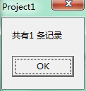

首先需要说明，这个问题的出现需要几个前提：使用微软的Oracle驱动（使用Oracle自己的驱动不会出现这个问题）、使用绑定变量法，使用Format等方式拼接SQL也不会出现这个问题，还有一些诡异的规律我还没有发现原因，将会在文中说明。

这个问题是工作中的一个功能模块出现的问题，但是我会在本文中通过一个程序重现这个问题，然后进行分析。

##首先给出重现这个问题的简单的程序##

首先为了重现这个问题，在程序开发时候配置TADOConnection，必须选择微软的驱动，如下图红框标记的第一个驱动就是微软的Oracle驱动

程序打开时候的图形界面如下

点击Ms-Format按钮，执行的SQL是使用Format拼接的SQL，这个能够正常执行，显示结果如下

但是点击 Ms-绑定变量，执行的是使用绑定变量法的SQL，就会出现异常，如下图

具体的代码是下面这样的

    unit Unit1;
    
    interface
    
    uses
      Windows, Messages, SysUtils, Variants, Classes, Graphics, Controls, Forms,
      Dialogs, StdCtrls, DB, ADODB;
    
    type
      TForm1 = class(TForm)
        con1: TADOConnection;
        btn1: TButton;
        btn2: TButton;
        procedure FormCreate(Sender: TObject);
        procedure btn1Click(Sender: TObject);
        procedure btn2Click(Sender: TObject);
      private
        { Private declarations }
      public
        { Public declarations }
      end;
    
    var
      Form1: TForm1;
      adoquery: TADOQuery;
    
    implementation
    
    {$R *.dfm}
    
    procedure TForm1.FormCreate(Sender: TObject);
    begin
      con1.Open;
      adoquery:= TADOQuery.Create(Application); 
      //这样的Create方式，adoquery会在程序关闭的时候销毁
      adoquery.Connection:= con1;
      //这个例子中的adoquery是一个全局变量
    end;
    
    procedure TForm1.btn1Click(Sender: TObject);  //这个按钮是使用Format拼接的SQL，然后执行 
    var
      count: Integer;
      no, name: string;
    begin
      adoquery.Close;
      no:= 'testno';
      name:= 'testname';
      adoquery.SQL.Text:= Format('select count(*) icount from practice where uno = ''%s'' and uname = ''%s'' ', [no, name]);
      try
        //注意因为可能会出现异常，所以最好是在这里捕捉一下异常，保证程序的稳健性
        adoquery.Open;
        adoquery.First;
        count:= adoquery.FieldByname('icount').AsInteger;
        ShowMessage('共有' + IntToStr(count) + ' 条记录');
      except
      on e:Exception do
        ShowMessage(e.Message);
      end;
    end;
    
    procedure TForm1.btn2Click(Sender: TObject);   //这个按钮是使用绑定变量的方法的SQL
    var
      count: Integer;
      no, name: string;
    begin
      adoquery.Close;
      no:= 'testno';
      name:= 'testname';
      adoquery.SQL.Text:= 'select count(*) icount from practice where uno = :no  and uname = :name';
      adoquery.Parameters.ParamByName('no').Value:= no;
      adoquery.Parameters.ParamByName('name').Value:= name;
      //注意里面的绑定变量法的使用规范，这样的方式使用微软的Oracle驱动会报错
      //但是使用Oracle自己的驱动是OK的
      try
        //注意因为可能会出现异常，所以最好是在这里捕捉一下异常，保证程序的稳健性
        adoquery.Open;
        adoquery.First;
        count:= adoquery.FieldByName('icount').AsInteger;
        ShowMessage('一共有' + IntToStr(count) + ' 条记录');
      except
      on e:Exception do
        ShowMessage(e.Message);
      end;
    end;
    
    end.
　　

##然后根据出现的问题去逐步进行理性的分析##

###首先当然是看这个ORA-00937错误是什么错误###

在网上搜索了Oracle的错误信息，大概的解释就是下面这样的

    select 列表项中除了包含聚合函数（比如count、avg等）外，还包含了表的某些列，那么你将必须使用group by语句，否则语法通不过。
    
    例如这样的SQL：select deptno,job,avg(sal)  from emp;
    
    　　ERROR 位于第 1 行:   ORA-00937: 非单组分组函数
    
           其实这里也非常容易理解，你既然指定了聚合函数，又同时制定了其他列，还想不按照指定的列来分组，你到底想让oracle怎么做呢？
    
           这根本就得不出结果。就像你需要统计班上男女生的人数，但是又不能分组，只能在一条数据里表示出来，怎么能办得到呢？
    
    
    所以这里的group by是必须的。
    
    上面的错误纠正为： select deptno,job,avg(sal) from emp group by deptno,job;
    
    就OK了

既然找到了错误的解释，就可以进行下一步了。

###接着是看看使用Format方式拼接的SQL和使用绑定变量法的SQL的具体格式是什么样的###

当然最先想到的办法就是在程序中加断点，然后看看。

但是只能看到Format方式拼接的SQL是什么样的，没有办法看到绑定变量法的SQL是什么样的。这时候就没有思路了，就去各种讨论群、论坛中提问，有个人提供了一个很好的思路：可以在Oracle服务器上监视到最近都执行了什么SQL，当然前台程序中进行数据库编程连接Oracle服务器执行的SQL也是可以被记录并且查询到的。

###接着就是上网搜索怎么查看Oracle执行SQL的记录###

v$sql：使用select sql_text, last_load_time from v$sql order by last_load_time 查找执行过的SQL语句的记录。但是假如你的SQL太长的话，可能取出的sql_text会无法显示SQL的全部内容，所以这时候需要取sql_fulltext获取全部的SQL内容！

注意：另外如果你在9:00执行了一条全新的SQL，在9:07又执行了这条SQL，last_load_time是9:00而不是9:07，所以如果你在测试的时候想要及时看到最近执行的SQL，可以将SQL的格式稍微做一下修改（比如多加一个搜索字段、换一个搜索字段……总之和之前执行过的SQL语句要不一样），就会通过last_load_time 显示出来。

>具体v&sql里面的各个字段的含义，还有oracle数据库的原理目前我还是不太清楚，所以我也还无法解释这个现象！！

但是还有一个问题，就是在这个表（还是视图？我还不太清楚）里面只能看到语法正确的SQL，所以出错的SQL是不会被记录的。这个时候又没头绪了，幸好有人给我发了一个链接：[ORA-00979: not a GROUP BY expression报错处理](http://blog.itpub.net/29154652/viewspace-772504/)，我就想能不能参考人家查找ORA-00979问题的原因的思路来处理我遇到的ORA-00937 问题。不管能不能成功，都要先试一下。

###参考别人排查 ORA-00979问题的思路去查找ORA-00937问题的原因###

具体的步骤参见这篇博客：[http://blog.itpub.net/29154652/viewspace-772504/](http://blog.itpub.net/29154652/viewspace-772504/)

注意要严格按照那篇博客的步骤顺序来操作。

注意：可能按照那篇文章找不到他所说的某个文件的所在目录，那么可以使用 find 命令去查找，很方便。

最后在日志里面看到的SQL是这样的：`select rowid, count(*) icount from practice where uno = :no and uname = :name`，所以显然会出现ORA-00937错误。至此问题就找到了。使用微软的数据库驱动就会导致最终执行的SQL是这样的，所以出错；而使用Oracle自己的驱动，使用绑定变量法就不会出现这样的SQL语法错误。

 
##参考文章##

* OLAP、OLTP的介绍和比较：[http://blog.csdn.net/zhangzheng0413/article/details/8271322/](http://blog.csdn.net/zhangzheng0413/article/details/8271322/)
* 如何查看Oracle SQL绑定变量？：[http://blog.sina.com.cn/s/blog_81095bbb0101fl89.html](http://blog.sina.com.cn/s/blog_81095bbb0101fl89.html)
* 查看oracle数据库最近执行了哪些sql语句：[http://www.cnblogs.com/toowang/archive/2012/12/12/2814893.html](http://www.cnblogs.com/toowang/archive/2012/12/12/2814893.html)和[http://blog.sina.com.cn/s/blog_4a80a5730101oxnk.html](http://blog.sina.com.cn/s/blog_4a80a5730101oxnk.html)
* Oracle如何使用绑定变量提升效率zz ：[http://blog.chinaunix.net/uid-23177306-id-2531248.html](http://blog.chinaunix.net/uid-23177306-id-2531248.html)
* Oracle绑定变量详解(原创)：[http://czmmiao.iteye.com/blog/1489625](http://czmmiao.iteye.com/blog/1489625)
* 深入理解Oracle的并行操作(原创)：[http://czmmiao.iteye.com/blog/1487568](http://czmmiao.iteye.com/blog/1487568)

 