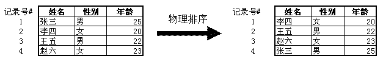
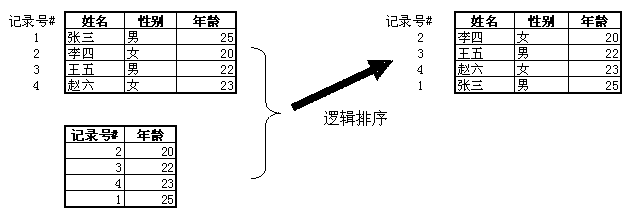

因为最近要用到visual foxpro来操作DBF文件，所以需要学习visual foxpro，然后就在网上找到了这篇不错的文章《[从Visual FoxPro中的记录号与逻辑删除谈起...](http://www.cnblogs.com/zhenyulu/articles/28418.html)》，首先需要强调的是这篇文章是人家写于2004-07-29的，而现在已经是2015-10-23了，所以其实visual foxpro这个东西现在也用的不多了，我也只是简单的了解visual foxpro的一些简单操作，但是这篇文章讲解的关于visual foxpro的原理以及和其他数据库的区别是很有助于自己理解数据库原理的，所以有必要好好看看，并且进行转载。

---

有几年没有再使用VFP开发新系统了，但是我对这个多年的朋友还是有些“看法”的，在这里写出来，留个纪念。

Visual FoxPro中有两个概念在Access和SQL Server中是不存在的，那就是“记录号”与“逻辑删除”。这两个概念给VFP的使用者带来了很多的方便也惹了不少麻烦。很多VFP学习者在学习SQL Server时会问：为什么VFP中就可以更新的表，升迁到了SQL Server后就不行了？为什么SQL Server没有逻辑删除？为什么VFP中执行PACK时报告“必须以独占方式打开”？为什么VFP对INSERT BEFORE不再支持的那么好？为什么...让我们从新的角度重新审视VFP，会看得无比清晰。下面将从“VFP的记录号”、“VFP的索引”、“逻辑删除与物理删除”以及“沉重的历史包袱”四个角度对VFP尽量做一个客观的评论。

##一、VFP的记录号##

VFP中的记录号可以这么理解：它表示记录在数据库中的物理排列顺序。还记得上大学时用C语言编写读写DBF文件的程序，VFP数据库DBF文件在物理存储上分成两部分，在文件开始部分记录了表的表结构信息，紧接着后面是各条记录，按照先后顺序排列，每条记录的长度是固定的（不象SQL Server，分CHAR和VARCHAR类型，记录长度可能不定）。这种存储格式使得VFP中出现了记录号的概念，并承担了非常重要的作用。比如说要访问记录号为5的记录，可能会输入命令：GO 5，那么VFP用“记录的长度×(5-1)+表头长度位移”就可以得到这条记录的起始位置，当用户DISPLAY时，便可从这个位置读取出该条记录。记录号可以唯一标识表中的一条记录。

##二、VFP的索引##

索引的可以提高对数据的检索效率，VFP中有人将SORT称为“物理排序”，将INDEX称为“逻辑排序”，记录号在这里也起到了关键的作用。记录号是记录的物理排列顺序，唯一标识了某条记录。在VFP中执行SORT，会对物理记录顺序重新进行调整，并生成一个新的表文件，这便造成了记录号的改变，所以从表现形式上来说，执行“物理排序”了（如图）。从图中可以看到，记录号为3的“王五”经过排序后，在新表中记录号变为了2。

而索引（在这里我们只讨论单索引文件，复合索引文件原理与单索引基本相同）之所以称为“逻辑排序”就是因为它不会改变记录的物理排列顺序。索引作用于表后，记录号不会发生变化，仅仅是记录的排列顺序变了，从表面上看记录号不再从1开始，顺序被打乱了。索引文件的格式虽然很复杂，在这里我们可以这么理解：索引文件只包括两个字段：“记录号”与“索引表达式”字段，并且是按索引表达式值的循序排列的。有了这个索引，我们就可以加快数据检索速度了（如图）：

例如，我们在应用索引的情况下查找年龄为22的学生，因为索引文件是经过排序的，所以从索引中定位年龄22的学生非常快，定位后可以知道他的记录号为3，于是根据记录号从数据库中迅速定位记录。“记录号”在索引中起到了关键的作用。

VFP记录号的作用还不止如此，细心的用户可能会发现，在VFP中允许两条记录完全相同，而且可以成功更新对其中一条记录的修改而不影响另外一条记录，这在SQL Server中是做不到的。SQL Server需要一个主键来唯一标识一条记录，或可以通过不同字段的不同值来生成UPDATE命令，以确保更新时不会张冠李戴。为什么VFP不会误更新两条记录呢？“记录号”就是答案，VFP在这里将记录号当作“主键”来使用，所以不会出现任何更新问题。这点会给初学者带来很大的方便，用户不需要知道什么主键、索引的概念，只需要“更改－保存”就行了。但随着学习的深入，渐渐会发现将“记录号”当作主键使用会带来很多弊端，VFP也不得不在很多地方作出让步，“逻辑删除与物理删除”就是其中之一。

##三、逻辑删除与物理删除##

逻辑删除是VFP的特色，很多人对此也有看法。逻辑删除乍一看就象回收站，误删除的记录还可以还原回来，确认不需要的再清空。可也有很多VFP编程人员养成了一个习惯，就是DELETE后立即PACK，凭什么删除还犹豫呢？可他们很快就发现，PACK命令似乎总和他们作对，有时一PACK，窗口上的网格控件只剩下白板一块，什么都没有了，有时执行PACK会报错，说“必须以独占方式打开表”，反正总是不顺。为什么会这样呢？

话又转到“记录号”上来了。假设我们要删除年龄为22的记录，因为VFP将记录号做“主键”来用，若VFP直接执行物理删除的话，那么当第三条记录从磁盘上清理掉后，原来记录号为 4 的记录就变成了记录号为 3 的记录（物理顺序变了），在这个时候，如果另外一个用户更新了原有记录号为 3 的记录并进行提交，就会误修改原来记录号为 4 （现在记录号为 3）的记录。VFP为了防止这种共享冲突，添加了两个限制：一是先逻辑删除再物理删除，二是物理删除时必须以独占方式打开表。这样的话，用户执行逻辑删除仅仅是在记录上加一个删除标识，不会从磁盘文件中真正删除，也就不会改变记录号，所以可以避免并发冲突。当用户想真正物理删除数据时，必须以独占方式打开表，以确保没有其他人正在使用数据库，便不会产生共享问题了。

此外，VFP为了让用户感觉不到逻辑删除记录的存在，保留了SET DELETE ON、SET DELETE OFF设置，力争将逻辑删除带来的影响减少到最小。但怎么可能呢？有谁会注意到在SET DELETE OFF时使用“SELECT * FROM STUDENT”命令需要加上条件“WHERE NOT DELETED()”以排除逻辑删除的记录呢？甚至通过“SELECT COUNT(*) FROM STUDENT”统计学生人数时，DELETE状态也会影响检索结果！

由此可见很多麻烦都是“记录号”惹的祸，也可以看出VFP在这里的良苦用心。

##四、沉重的历史包袱##

既然存在这些问题，为什么VFP到了9.0还没有解决呢？实际上解决这些问题并不困难，只要取消记录号的主键的作用就可以了。我们从VFP的历史就可以看出缘由：VFP背负了沉重的历史包袱。VFP的前身可以追述到dBase，后来的FoxBase的出现可以说是dBase的一个翻版，只不过性能大幅度提升而已，微软收购了Fox公司后推出的Visual FoxPro始保持向下兼容，于是dBase中存在的问题在VFP中无法直接解决，只能采取别的方法绕过问题。

例如，VFP中存在两个表概念“自由表”与“数据库表”，自由表基本上等价于原有的FoxBase表，而数据库表是VFP创造的，提供了很多新功能，包括长表名、长字段名、视图、存储过程、触发器等。可这些新功能背后又有谁能了解VFP的苦衷呢？为了不违反DBF字段名不超过10字符的老规矩，在数据库表中，虽然允许长字段名，但这个长字段名是存储在数据库（.DBC）中的，在表DBF中仍然是不多于10字符的字段名（为了确保DBF文件的文件格式不变），VFP数据库提供了一种映射关系，让用户感觉不到他们的DBF其实用的是短字段名。但是，一旦数据库表经移除变为了自由表，马上长字段名就没有了。即使再添加到同一个数据库中，也不会再有长字段名了。这一点可以通过使用命令

USE ***.DBC

打开数据库文件，BROWSE一下就知道了。（有一点不得不佩服VFP，它的数据库文件、报表文件、表单文件、类库文件其实都是DBF，都可以使用USE打开的。VFP将关系理论发挥的淋漓尽致。）

正是因为这些历史包袱，使得VFP不得不在提供新功能的同时还要考虑保留老规矩，在很多问题上变得进退两难。国内很多VFP的书只会从老规矩出发讲VFP，以至于学出来的学生根本没能了解VFP的妙处，于是人云亦云，让VFP背上了不好用的骂名。

真希望VFP有朝一日能够脱胎换骨变做VFP.NET，到那个时候，VFP完全可以摆脱历史的束缚，在.net的大家庭中自由翱翔。
