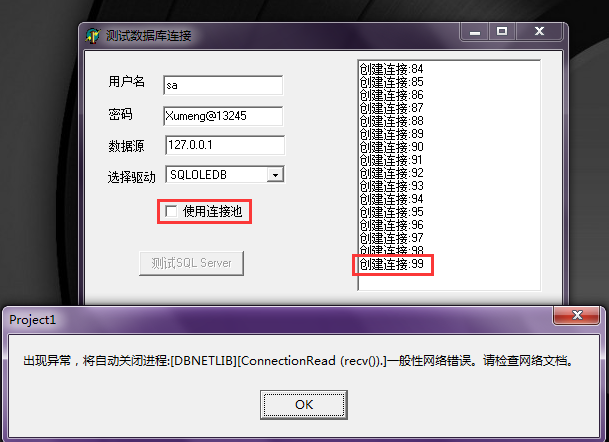
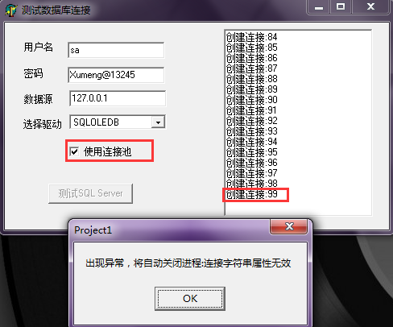

## 扩展资料

* [《亲测SQLServer的最大连接数》](http://www.cnblogs.com/wlb/archive/2012/04/08/2437617.html)
* [《SQL Server 和 Oracle 以及 MySQL 有哪些区别？》](https://www.zhihu.com/question/19866767)
* [《SQL Server 查询性能优化 相关文章》](http://www.cnblogs.com/xcsn/p/4929724.html)
* [《W3School SQL 教程》](http://www.w3school.com.cn/sql/index.asp)

## 提前了解一些信息

* 获取当前SQL Server连接数配置：
  * `select value from  master.dbo.sysconfigures where [config]=103`
  * 默认是0，代表不限制，但最大连接数是32767
  * 使用 user connections 选项以指定SQL Server上允许同时建立的最大用户连接数
  * 实际允许的用户连接数还取决于正使用的 SQL Server 版本以及应用程序和硬件的限制
  * SQL Server允许的最大用户连接数为 32767
* 设置SQL Server的最大连接数限制
  * `exec sp_configure 'show advanced options', 1` 
  * 设置show advanced options 值为1 才能允许下面对数据库连接数进行设置
  * 执行`RECONFIGURE`语句使之生效
  * `exec sp_configure 'user connections', 100`
  * 用以配置最大连接数为100
  * 执行`RECONFIGURE`语句使之生效
  * **但此时并没有真正生效，需重启SQL Server的服务才能生效**
  * 重启服务：打开SQL Server Management Studio-->右键数据库实例-->重新启动
* 更多有用的SQL Server命令介绍
  * 查看已经使用的连接数个数：`select count(*) from sys.dm_exec_connections`
  * 查看当前所有连接的详细信息：`select * from sys.dm_exec_connections`
  * 查看当前有多少会话：`select count(*) from sys.dm_exec_sessions`
  * 一个连接可以有多个会话
  * 查看当前所有会话的详细信息：`select * from sys.dm_exec_sessions`

## 意外问题排查

* 2016-05-20，编程测试数据库连接数限制，用上面方法设置连接数限制为1
* 当时没有生效，因为不知道要重启数据库服务，当时也想不通，就暂时没有继续细究
* 三天后，2016-05-23，重启机器，使用SQL Server Management Studio登录报错
* 【报错信息】：已成功与服务器建立连接，但是在登录过程中发生错误。 
* 【报错信息续】：(provider: 共享内存提供程序, error: 0 - 管道的另一端上无任何进程。)
* Google了好多博客都没有解决这个问题，所有的解决方法都对我的问题无效
* 回想起之前测试数据库连接，将连接数限制设置为1，后来重启机器相当于重启服务，导致设置生效
* 现在用SQL Server Management Studio登录，底层是需要建立连接的，不过限制最多为1，所以报错
* 【解决方法】：重新设置数据库的最大连接数，然后重启服务使其生效即可解决这个报错问题
* 因为无法登陆SQL Server Management Studio，所以暂时无法使用SQL命令来重设
* 打开SQL Server Management Studio，右键数据库实例-->属性-->连接，重设连接数，重启服务即可
* 上面不需要登录，只要连接上就可以设置，不过可能有时需要重启计算机，才能重新连接SQL Server

## 疑问点列举

* 连接和会话的关系？
* 长连接和短连接？
* SQL Server连接和Oracle连接？
* 数据库连接和网络连接？

## 编程测试SQL Server连接

* 假如使用上面的方法设置SQL Server的最大连接数为100
* 测试任务的运行截图有在下面贴出来
* 分别测试“使用连接池”和“不使用连接池”，详细运行效果看下面的图
* 暂时没有发现在使用上面的方法设置数据库连接时是否用连接池的差异点！
* 测试过程中，就算测试程序不释放数据库连接，当最后进程死掉后，还是会自动释放
* 设置100个连接，测试SQL Server Management Studio工具对连接的影响
  * 不使用Management Studio登录，测试程序新建99个连接报异常
  * 使用Management Studio登录，测试程序新建98个连接就报异常
  * 使用Management Studio登录，新建一个查询，测试程序新建96个连接就可能报异常

## 运行效果图展示

**程序打开**


**不使用连接池**



**使用连接池**



## 源码展示

```
unit Unit1;

interface

uses
  Windows, Messages, SysUtils, Variants, Classes, Graphics, Controls, Forms,
  Dialogs, StdCtrls, DB, ADODB, ExtCtrls;
const
  SQLConnStr = 'Provider=%0:s;User ID=%s;Password=%s;Data Source=%s;Persist Security Info=True';

type
  TForm1 = class(TForm)
    btn1: TButton;
    lbl5: TLabel;
    lbl6: TLabel;
    lbl7: TLabel;
    lbl8: TLabel;
    edt4: TEdit;
    edt5: TEdit;
    edt6: TEdit;
    cbb1: TComboBox;
    mmo1: TMemo;
    chk1: TCheckBox;
    procedure btn1Click(Sender: TObject);
    procedure FormCreate(Sender: TObject);
  private
    { Private declarations }
  public
    { Public declarations }
  end;

var
  Form1: TForm1;

implementation

{$R *.dfm}

procedure TForm1.btn1Click(Sender: TObject);
var
  ConnectionString: string;
  adoConn: TADOConnection;
  i: Integer;
begin
  btn1.Enabled := False;
  ConnectionString := Format(SQLConnStr, [cbb1.Text, edt4.Text, edt5.Text, edt6.Text]);
  if chk1.Checked then
  begin
    ConnectionString := ConnectionString + ';Pooling=true;Max Pool Size=40000;Min Pool Size=0;';
  end;

  try
    for i:= 1 to 40000 do
    begin
      Application.ProcessMessages;
      adoConn:= TADOConnection.Create(nil);
      adoConn.LoginPrompt := False;
      adoConn.ConnectionString := ConnectionString;
      adoConn.Open;
      mmo1.Lines.Add('创建连接:' + IntToStr(i));
    end;
  except
    on E: Exception do
    begin
      ShowMessage('出现异常，将自动关闭进程:' + E.Message);
      Application.Terminate;
    end;
  end;
end;

procedure TForm1.FormCreate(Sender: TObject);
begin
  cbb1.Items.Add('SQLOLEDB');
  cbb1.Items.Add('SQLNCLI');
  cbb1.ItemIndex := 0;                //程序启动时默认在窗体上显示第一项
  cbb1.Style := csOwnerDrawFixed;

  edt4.Text := 'sa';            //用户名
  edt5.Text := 'Xumeng@13245';  //密码
  edt6.Text := '127.0.0.1';     //数据源
end;

end.
```
