## 简介

* 本文是在通过慕课网的[《Python开发简单爬虫》](http://www.imooc.com/learn/563)时顺便整理的
* 相关的图片也是来自该课程截图
* 通过该教材学习一个简单的Python爬虫开发，对于复杂的爬虫暂时没有学到
* 复杂的爬虫需考虑更多的场景：比如需要登录后才可以爬取、有的网页内容是使用js异步更新的
* 目前只是考虑的场景只有静态网页的内容抓取

## 爬虫简介

* 爬虫是一段自动抓取互联网信息的程序
* 爬虫就是自动爬取互联网，提取有意义数据的程序
* 爬虫的价值：互联网数据，为我所用


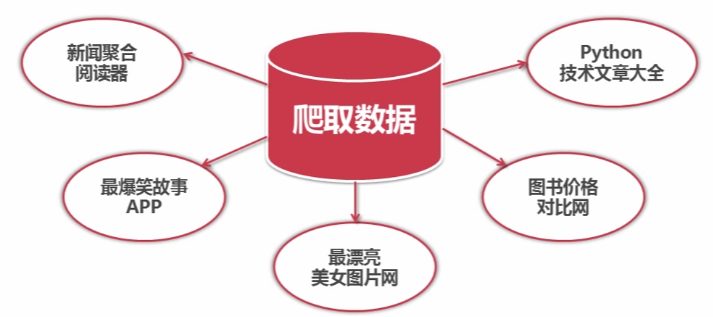

## 简单爬虫架构

* 爬虫调度端：来启动爬虫、停止爬虫、监视爬虫的运行情况
* URL管理器：对将要爬取的和已经爬取的URL进行管理
* 网页下载器：
  * 从URL管理器中获取一个将要爬取的URL，传给网页下载器
  * 下载器将URL指向的网页下载并存储为一个字符串
* 网页解析器：
  * 将网页下载器下载下来的字符串进行解析
  * 一方面获取价值数据
  * 另一方面每个URL中往往还有指向其他页面的URL，需要补充到URL管理器中
* 上面的逻辑就形成了一个循环，只要有相关联的URL，就可以一直运行下去
* 这个简单的爬虫架构的运行，就可以将互联网上相关联的所有网页都爬取下来

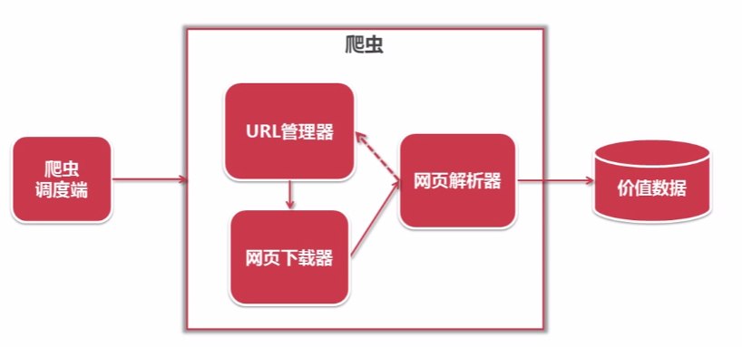

## 简单爬虫架构的运行流程

* 调度器询问URL管理器是否有待爬取的URL？
* URL管理器返回是/否
* 如果是，调度器会从URL管理器中获取一个待爬取的URL
* URL管理器将URL返回给调度器
* 调度器将URL传给下载器对网页内容进行下载
* 下载好后下载器将URL内容返回给调度器
* 调度器将URL内容传递给解析器进行网页的解析
* 解析之后将价值数据和新的URL列表传给调度器
* 一方面调度器会将价值数据传递给应用进行数据的收集
* 另一方面将新的URL列表补充进URL管理器
* 如果URL管理器中还有未爬取的URL，那么将会一直执行上面的循环，直到爬取完所有URL
* 最后调度器会调用应用的方法将价值数据进行输出，将价值数据输出到需要的格式


## URL管理器

* URL管理器用来管理待抓取URL集合和已抓取URL集合
* 防止重复抓取和循环抓取
  * 因为每个网页都有很多指向其他网页的URL
  * 其他网页也有指向本网页的URL，就可能存在URL循环指向的问题
* URL管理器需要支持的最小功能范围
  * 添加新的URL到待爬取集合中
  * 判断待添加的URL是否已经存在容器中
  * 从容器中获取一个待爬取的URL
  * 判断容器中还有没有待爬取的URL
  * 将URL从待爬取集合移动到已爬取集合

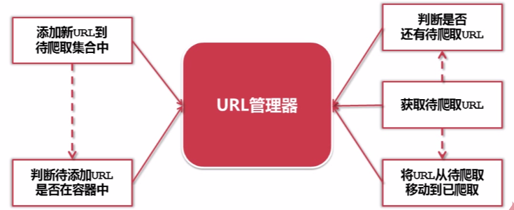

* URL管理器实现方式介绍：
* 将已爬取和未爬取的URL集合都存储在内存中
  * 使用Python的set类型
  * 因为Python的set类型可以自动去除集合中重复的数据元素
* 使用关系数据库
  * 比如在MySQL中建立一张表
  * 有两个字段：url、is_crawled，表示URL和是否被抓取过
* 缓存数据库，比如使用redis，redis本身就支持set数据结构
* 目前大型的网络公司因为redis的性能比较高，一般都使用redis
* 其实使用关系型数据库对于一般的开发也就够了

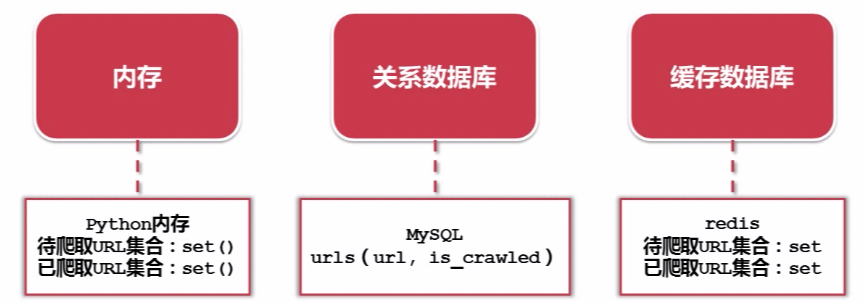

## 网页下载器

* 使用Python自带的urllib2模块
* 将互联网上URL对应的网页下载到本地的工具，因为将网页下载到本地才能进行后续的分析和处理
* 类似于网页浏览器
* 将URL对应的网页下载到本地存储为本地文件或者内存字符串，然后才能进行分析


* urllib2模块：
  * 支持直接的URL网页下载
  * 或者向网页发送一些需要用户输入的数据
  * 甚至支持需要登录网页的cookie处理、需要代理访问的代理处理
* requests：第三方插件，功能更强大

urllib2三种下载网页的方法，分别给出对应代码

最简洁的方法：
	
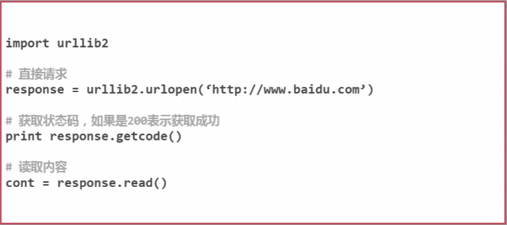

添加data、http header：

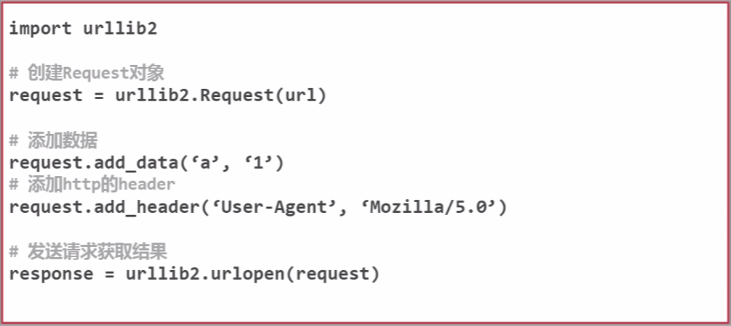

添加特殊情景的处理器：

* 有些网页需要用户登录才能处理，需要cookie的处理，可以使用HTTPCookieProcessor
* 有的网页需要代理才能访问，使用ProxyHandler
* 有些网页使用https加密访问，使用HTTPSHandler
* 有些网页，它的URL是相互自动的跳转关系，使用HTTPRedirectHandler
		
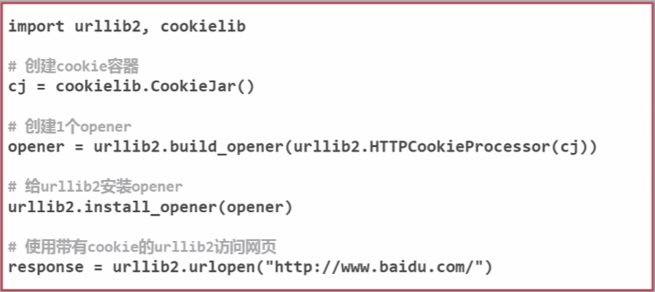

## urllib2测试实例

* urllib2实例代码如下
* 在ubuntu上测试，新建test.py，输入以下代码，执行python test.py执行
* 如果网络不好的情况下，可以发现执行的速度会很慢

```
# coding:utf8

import urllib2
import cookielib

url = "http://www.baidu.com"

print "第一种方法"
response1 = urllib2.urlopen(url)
print response1.getcode()
print len(response1.read())

print "第二种方法"
request = urllib2.Request(url)
request.add_header("user_agent", "Mozilla/5.0") #伪装成一个浏览器
response2 = urllib2.urlopen(request)
print response2.getcode()
print len(response2.read())

print "第三种方法"
cj = cookielib.CookieJar()
opener = urllib2.build_opener(urllib2.HTTPCookieProcessor(cj))
urllib2.install_opener(opener)
response3 = urllib2.urlopen(url)
print response3.getcode()
print cj
print response3.read()
```

## 网页解析器

* 使用第三方插件BeautifulSoup
* 将互联网上的网页爬取到本地后，需要对它们进行解析才能提取出需要的内容
* 网页解析器是从网页中提取出有价值数据的工具

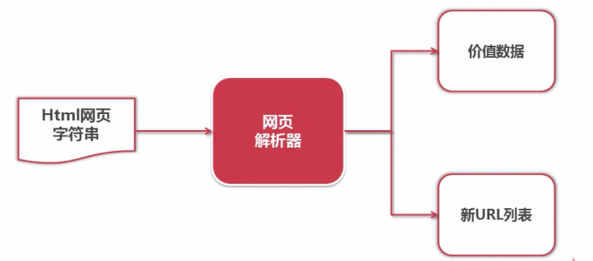

* Python有哪些网页解析器：正则表达式、html.parser、BeautifulSoup、lxml
* 正则表达式是一种模糊匹配的方式
* 其他三种使用的是结构化的解析
* 将整个网页文档下载成一个DOM（Document Object Model）树
* 使用这种方式，DOM就像整个文档加载成一个树形结构
* 使用树形的上下级关系可以很方便的定位到每个元素，访问这个元素的属性、文本……

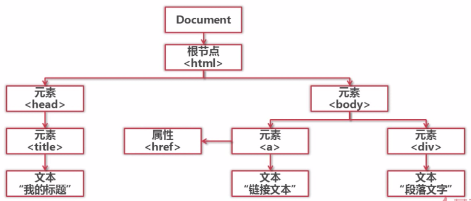

## BeautifulSoup下载安装

* [BeautifulSoup官网](https://www.crummy.com/software/BeautifulSoup/bs4/doc/)
* BeautifulSoup安装
  * 安装：pip install BeautifulSoup4
  * 测试：import bs4
* BeautifulSoup的语法
  * 根据一个下载好的html网页字符串可以创建一个BeautifulSoup对象
  * 创建这个对象的同时就将整个html字符串加载成一个DOM树
  * 然后根据这个DOM树搜索节点（find_all、find）
  * find_all会搜索到所有满足条件的节点
  * find只会搜索第一个满足条件的节点

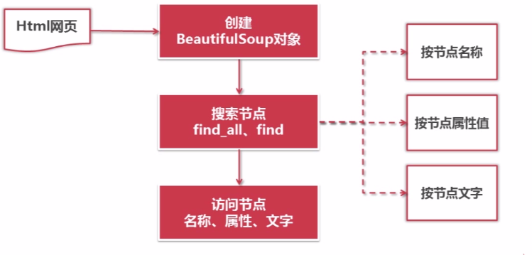

## BeautifulSoup语法

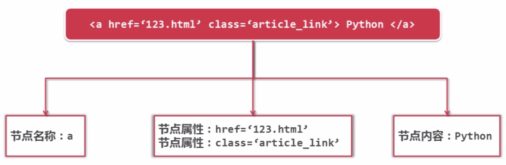

针对上图中的html字符串进行解析的代码

创建BeautifulSoup对象：

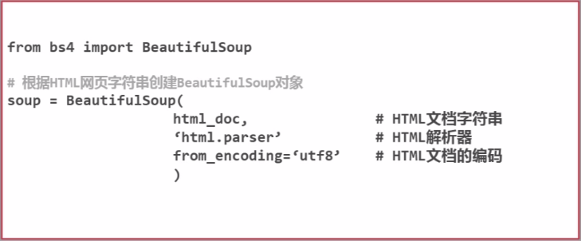

搜索节点（find_all、find）：

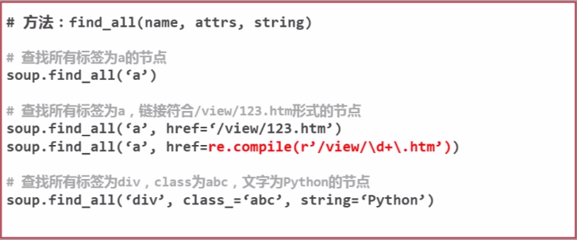

访问节点信息：

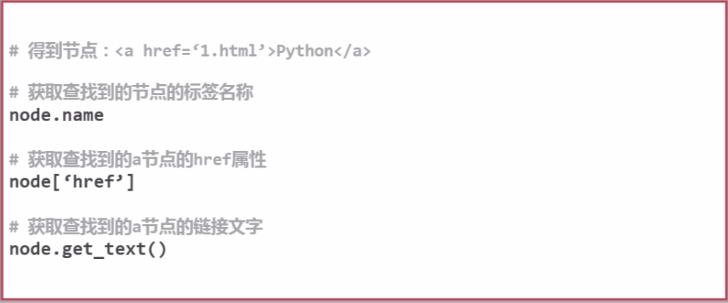

## BeautifulSoup实例测试

下图是该代码实例所解析的html字符串：

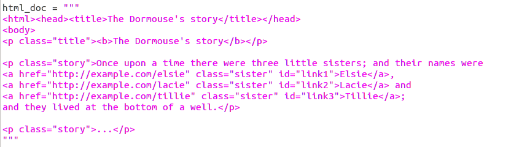

```
# coding:utf8

from bs4 import BeautifulSoup
import re

html_doc = """???"""    #具体的HTML内容就是上图中对应的字符串

soup = BeautifulSoup(html_doc, 'html.parser', from_encoding='utf-8')

print '获取所有链接'
links = soup.find_all('a')
for link in links:
    print link.name, link['href'], link.get_text()

print '获取lacie的链接'
link_node = soup.find('a', href='http://example.com/lacie')
print link_node.name, link_node['href'], link_node.get_text()

print '正则表达式模糊匹配'
link_node = soup.find('a', href=re.compile(r"ill"))
print link_node.name, link_node['href'], link_node.get_text()

print '获取p段落文字'
p_node = soup.find('p', class_='title')
print p_node.name, p_node.get_text()
```