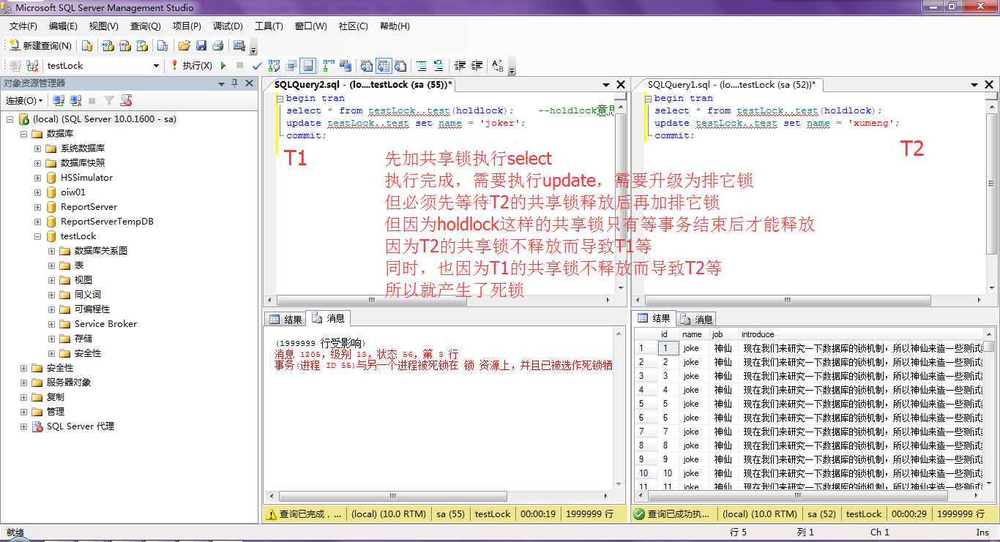

##基础数据准备

本次进行测试的数据库选择SQL Server 2008，在测试之前需要做好基础的数据准备工作！

先创建一个数据库

```
CREATE DATABASE testLock
```

然后在该数据库中创建用于测试的表

```
USE [testLock]
GO

SET ANSI_NULLS ON
GO

SET QUOTED_IDENTIFIER ON
GO

SET ANSI_PADDING ON
GO

CREATE TABLE [dbo].[test](
  [id] [int] NOT NULL,
  [name] [char](10) NULL,
  [job] [char](10) NULL,
  [introduce] [nvarchar](1024) NULL,
 CONSTRAINT [PK_test] PRIMARY KEY CLUSTERED 
(
  [id] ASC
)WITH (PAD_INDEX = OFF, STATISTICS_NORECOMPUTE = OFF, IGNORE_DUP_KEY = OFF, ALLOW_ROW_LOCKS = ON, ALLOW_PAGE_LOCKS = ON) ON [PRIMARY]
) ON [PRIMARY]
GO

SET ANSI_PADDING OFF
GO
```

然后模拟200万条测试数据，为了保证执行时间够长，能明显的看出效果

```
DECLARE @i int
SET @i=1
WHILE @i<2000000
   BEGIN   
   INSERT INTO testLock..test (id, name, job, introduce) 
   VALUES(@i, 'xumenger', '神仙', '现在我们来研究一下数据库的锁机制，所以神仙来造一些测试数据')   
   SET @i=@i+1   
END; 
```

##前言

参考博客[《数据库锁》](http://www.cnblogs.com/zhouqianhua/archive/2011/04/15/2017049.html)

数据库大并发操作要考虑死锁和锁的性能问题。为下面描述方便，这里用T1代表一个数据库执行请求，T2代表另一个请求，也可以理解为T1为一个线程，T2为另一个线程。T3、T4以此类推

在SQL Server 2008中，可以通过在SQL Server Management Studio新建多个会话的方式，每个会话相当于T1、T2……的角色

##共享锁（Shared Lock）##

**例1**

```
T1：
select * from testLock..test;

T2：
update testLock..test set name = 'joker';
```

过程如下

```
T1运行  （加共享锁）
T2运行
if T1还没有执行完
   T2等待......
else
   锁被释放
   T2执行
endif
```

T2之所以要等，是因为T2在执行update之前，试图对testLock..test表加一个排它锁，而数据库规定同一资源上不能同时共存共享锁和排它锁。所以T2必须等T1执行完，释放了共享锁，才能加上排它锁，然后才能开始执行update语句

**例2**

```
T1：
select * from testLock..test;

T2：
select * from testLock..test;
```

这里T2不用等待T1执行完，而是可以马上执行

分析其执行过程：

* T1运行，则testLock..test被加锁，比如lockA
* T2运行，再对testLock..test加一个共享锁，比如叫lockB

两个锁是可以同时存在于同一资源上的（比如同一个表上）。这被称为共享锁与共享锁兼容。这意味着共享锁不阻止其他session同时读资源，但阻止其他session update

**例3**

```
T1：
select * from testLock..test；

T2：
select * from testLock..test;

T3：
update testLock..test set name = 'xumenger';
```

这次，T2不用等T1运行完就能运行，T3却要等T1和T2都运行完才能运行。因为T3必须等T1和T2的共享锁全部释放才能进行加排它锁然后执行update操作

**例4：死锁的发生**

```
T1：
begin tran
select * from testLock..test(holdlock);    --holdlock意思是加共享锁，直到事务结束才释放
update testLock..test set name = 'joker';
commit;

T1：
begin tran
select * from testLock..test(holdlock); 
update testLock..test set name = 'xumeng';
commit;
```

假设T1和T2同时达到select

* T1对testLock..test加共享锁，T2也加共享锁
* 当T1的select执行完，准备执行update时，根据锁机制，T1的共享锁需要升级到排它锁才能执行接下来的update。
* 在升级排它锁之前，必须等testLock..test上的其他共享锁释放，但因为holdlock这样的共享锁只有等事务结束后才释放
* 所以因为T2的共享锁不释放而导致T1等（等T2释放共享锁，自己好升级排它锁）
* 同时，也因为T1的共享锁不释放而导致T2等
* 死锁产生了！

这个例子中，在SQL Server Management Studio中执行T1，然后马上执行T2，最后运行确实会发生死锁，详细如下图：



**例5**

```
T1：
begin tran
update testLock..test set name = 'xmxmxmxm' where id = 10;
commit;

T2：
begin tran
update testLock..test set name ='jkjkjjk' where id = 20;
commit;
```

这种语句虽然最为常见，很多人觉得它有机会产生死锁，但实际上要看情况：

* 如果id是主键上面有索引，那么T1会一下子找到该条记录（id=10的记录）
  * 然后对该条记录加排它锁
  * T2同样一下子通过索引定位到记录
  * 然后对id=20的记录加排它锁
  * 这样T1和T2各更新各的，互不影响
  * T2也不需要等
* 但如果id是普通的一列，没有索引
  * 那么当T1对id=10这一行加排它锁后
  * T2为了找到id=20，需要对全表扫描
  * 那么就会预先对表加上共享锁或更新锁或排它锁
  * 依赖于数据库执行策略和方式，比如第一次执行和第二次执行数据库执行策略就会不同
  * 但因为T1已经为一条记录加了排他所，导致T2的全表扫描进行不下去，就会导致T2等待

死锁怎么解决呢？一种办法如下：

**例6**

```
T1：
begin tran
select * from testLock..test(xloack);  --xlock意思是直接对表加排它锁
update testLock..test set name ='xxmm';
commit;

T2：
begin tran
select * from testLock..test(xlock);
update testLock..test set name ='jjkk';
commit;
```

这样，当T1的select执行时，直接对表加上排它锁，T2在执行select时，就需要等T1事务完全执行完才能执行。排除了死锁发生

但当第三个user过来想执行一个查询语句时，也因为排它锁的存在而不得不等待，第四个、第五个user也会因此而等待

但在大并发情况下，让大家等待显然不太友好，所以，这里引入了更新锁

##更新锁（update lock）

为了解决死锁，引入更新锁

**例7**

```
T1：
begin tran
select * from testLock..test(updlock);    --加更新锁
update testLock..test set name = 'xxxmmm';
commit;

T2：
begin tran
select * from testLock..test(updlock);
update testLock..test set name = 'jjjkkk';
commit;
```

更新锁的意思是：“我现在只想读，你们别人也可以读，但我将来可能会做更新操作，我已经获取了从共享锁（用来读）到排它锁（用来更新）的资格”。一个事务只能有一个更新锁获此资格

T1执行select，加更新锁

T2运行，准备加更新锁，但发现已经有一个更新锁在那儿了，只好等

当后来由user3、user4……需要哦查询testLock..test中的数据时，并不会因为T1的select在执行就被阻塞，照样能查询，相比于例6，这提高了效率

**例8**

```
T1：
select * from testLock..test(updlock);  --加更新锁

T2：
select * from testLock..test(updlock);  
--等待，直到T1释放更新锁，因为同一时间不能在统一资源上有两个更新锁

T3：
select * from testLock..test;
--加共享锁，但不用等待updlock释放，就可以读
```

这个例子是说明：共享锁和更新锁可以同时在同一个资源上。这被称为共享锁和更新锁是兼容的

**例9**

```
T1：
begin tran
select * from testLock..test(updlock);  --加更新锁
update testLock..test set name = 'xum';
--重点：这里T1做update时，不需要等T2释放什么，而是直接把更新锁升级为排它锁，然后执行update
commit;

T2：
begin tran
select * from testLock..test;   --T1加的更新锁不影响T2读取
update testLock..test set name ='jok';
--T2的update需要等T1的update做完才能执行
commit;
```

我们以这个例子来加深更新锁的理解：

* 第一种情况：T1先到达，T2紧接着达到
  * T1先对表加更新锁，T2对表加共享锁
  * 假设T2的select先执行完，准备执行update
  * 发现已有更新锁存在，T2等
  * T1执行这时才执行完select，准备执行update，更新锁升级为排它锁
  * 然后执行update，执行完成，事务结束，释放锁，T2才轮到执行update
* 第二种情况：T2先到达，T1紧接着达到
  * T1对表加更新锁
  * 假设T2 select结束，准备update
  * 发现已有更新锁，则等待
  * 后面步骤就跟第一种情况一样了

这个例子说明：排它锁与更新锁是不兼容的，它们不能同时加在同一资源上

##排它锁（独占锁，Exclusive Locks）

这个简单，即其他事务既不能读，又不能改排它锁锁定的资源

**例10**

```
T1：
update testLock..test set name = 'xmmm' where id < 10000;

T2：
update testLock..test set name = 'jkkk' where id > 10000;
```

假设T1先到达，T2随后到达，这个过程中T1会对id<10000的记录施加排它锁，但不会阻塞T2的update

**例11**

假设id都是自增长且连续的

```
T1：
update testLock..test set name = 'xxxxm' where id < 10000;

T2：
update testLock..test set name ='jjjjk' where id > 9000;
```

假设T1先达，T2立即也到，T1加的排它锁会阻塞T2的update

##意向锁（Intent Locks）

意向锁就是说在屋（比如代表一个表）门口设置一个标志，说明屋子里有人（比如代表某些记录）被锁住了。另一个人想知道物资里是否有人被锁，不用进屋子里一个一个的去查，直接看门口标志就行了

当一个表中的某一行被加上排它锁后，该表就不能再被加表锁。数据库程序如何知道该表不能被加表锁？一种方式是逐条的判断该表中的每一条记录是否已经有排它锁，另一种方式是直接在表这一层级检查表本身是否有意向锁，不需要逐条判断，显然后者效率高

**例12**

```
T1：
begin tran
select * from testLock..test(xlock) where id = 10;  --对id=10这一行强加排它锁
commit;

T2：
begin tran
select * from testLock..test(tablock);  --加表级锁
commit;
```

假设T1先执行，T2后执行，T2执行时，欲加表锁，为判断是否可以加表锁，数据库逐条判断testLock..test表每行记录是否已有排它锁，如果发现其中一行已经有排它锁了，就不允许再加表锁。只是这样逐条判断效率太低了

实际上，数据库系统不是这样工作的。当T1的select执行时，系统对表testLock..test的id=10的这一行加了排它锁，还同时悄悄的对整个表加了意向排它锁，当T2执行表锁时，只需要看这个表已经有意向排它锁存在，就直接等待，而不需要逐条检查资源了。

**例13**

```
T1：
begin tran
update testLock..test set name  ='xmxxm' where id =1;
commit;

T2：
begin tran
update testLock..test set name = 'jkjjkk' where id = 1;
commit;
```

这个例子和上面的例子实际效果相同，T1执行，系统对testLock..test同时对行加排它锁、对页加意向排它锁，对表加意向排它锁

##计划锁（Schema Locks）

**例14**

```
alter testLock..test ...
```

加Schema Locks，称之为Schema modification(Sch-M) Locks

DDL语句都会加Sch-M锁，该锁不允许任何其他session连接该表。连都连不了这个表了，当然更不同说想对该表执行什么SQL语句了

**例15**

用JDBC向数据库发送了一条新的SQL语句，数据库要先对之进行编译，在编译期间，也会加锁，称之为：Schema stability(Sch-S) Locks

```
select * from testLock..test
```

编译这条语句过程中，其他session可以对表testLock..test做任何操作（update、delete、加排它锁等等），但不能做DDL（不如alter table）操作

##何时加锁？

如何加锁？何时加锁？加什么锁？你可以通过hint手工强行指定，但大多四数据库系统自动决定的。这就是为什么我们为什么可以不懂加锁也可以高高兴兴的写SQL

**例16**

```
T1：
begin tran
update testLock..test set name = 'xxmmmm' where id = 1
commit;

T2：
SET TRANSACTION ISOLATION LEVEL READ UNCOMMITTED  --事务隔离级别为允许脏读
go
select * from testLock..test where id = 1;
```

这里，T2的select也可以查出结果。如果事务隔离级别不设为脏读，则T2会等T1事务执行完才能读出结果

数据库如何自动加锁的？

* T1执行，数据库自动加排它锁
* T2执行，数据库发现事务隔离级别允许脏读，便不加共享锁
  * 不加共享锁，则不会与已有的排它锁冲突
  * 所以可以脏读

**例17**

```
T1：
begin tran
update testLock..test set name = 'name' where id = 1;
commit;

T2：
select * from testLock..test where id = 1;
--为指定隔离级别，则使用系统默认隔离级别，它不允许脏读
```

如果事务级别不设为脏读，则

* T1执行，数据库自动加排它锁
* T2执行，数据库发现事务隔离级别不允许脏读
  * 便准备为此次select过程加共享锁
  * 但发现加不上，因为已经有排它锁了
  * 所以就只能等
  * 直到T1执行完，释放了排他锁，T2才加上了共享锁，然后开始读....

##锁的粒度

锁的粒度就是指锁的生效范围，就是说是行锁，还是页锁，还是整表锁。锁的粒度同样既可以由数据库自行管理，也可以通过手工指定hint来管理

**例18**

```
T1：
select * from testLock..test(paglock);

T2：
update testLock..test set name = 'xjxj' where id > 10;
```

T1执行时，会先对第一页加锁，读完第一页后，释放锁，再对第二页加锁，以此类推。假设前10行恰好就是一页（当然，一般不可能一页只有10行记录），那么T1执行到第一页查询时，并不会阻塞T2的更新

**例19**

```
T1：
select * from testLock..test(rowtable);

T2：
update testLock..test set name = 'xxjj' where id = 10;
```

T1执行时，对每行加共享锁，读取，然后释放，再对下一行加锁；T2执行时，会对id=10的那一行试图加锁，只要该行没有被T1加上行锁，T2就可以顺利执行update操作

**例20**

```
T1：
select * from testLock..test(tablock);

T2：
update testLock..test set name = 'xmxmx' where id = 10;
```

T1执行，对整个表加共享锁，T1必须完全查询完，T2才可以允许加锁，并开始更新

以上3例是手工指定锁的粒度，也可以通过设定事务隔离级别，让数据库自动设置锁的粒度。不同的事务隔离级别，数据库会有不同的加锁策略（比如加什么类型的锁？加什么粒度的锁）

##锁与事务隔离级别的优先级

手工指定的锁优先

**例21**

```
T1：
GO
SET TRANSACTION ISOLATION LEVEL SERIALIZABLE
GO
BEGIN TRANSACTION
select * from testLock..test(NOLOCK)
GO

T2：
update testLock..test set name = 'xmxxxx' where id = 10;
```

T1是事物隔离级别为最高级，串行锁，数据库系统本应对后面的select语句自动加表级锁，但因为手工指定了NOLOCK，所以该select语句不会加任何锁，所以T2也就不会有任何阻塞。

##数据库的其他重要Hint以及它们的区别

**holdlock**

对表加共享锁，且事务不完成，共享锁不释放

**tablock**

对表加共享锁，只要statement不完成，共享锁不释放，与holdlock区别

```
T1：
begin tran
select * from testLock..test(tablock);
commit;

T2：
begin tran
update table testLock..test set name = 'jjj' where id = 10;
commit;
```

T1执行完select，就会释放共享锁，然后T2就可以执行update，此之谓tablock

```
T1：
begin tran
select * from testLock..test(holdlock);
commit;

T2：
begin tran
update table testLock..test set name = 'jjj' where id = 10;
commit;
```

 T1执行完select，共享锁仍然不会释放，仍然会被hold(持有），T2也因此必须等待而不能update。当T1最后执行了commit或rollback说明这一个事务结束了，T2才取得执行权

**tablockx**

对表加排它锁

```
T1：
select * from testLock..test(tablocks)
```

强行排它锁，其他session就无法对这个表进行读和更新了，除非T1执行完，就会自动释放排它锁

```
T1：
begin tran
select * from testLock..test(tablockx)
```

这次，单单select执行完还不行，必须整个事务完成（执行了commit或rollback后）才会释放排他锁

**xlock**

加排它锁，那它跟tablockx有何区别呢？

它可以这样用

```
select * from testLock..test(xlock paglock)
--对page加排他锁，而TABLELOCX不能这么用
```

xlock还可这么用：

```
select * from testLock..test(xlock tablock) 
--效果等同于select * from testLock..test(tablockx)
```

##锁的超时等待

set lock_timeout 4000 用来设置锁等待时间，单位是毫秒

可以用select @@LOCK_TIMEOUT查看当前session的锁超时设置。-1 意味着
永远等待。

```
T1：
begin tran
update testLock..test set name = 'xmjk' where id = 10;

T2：
set lock_timeout 4000
select * from testLock..test where id = 10;
```

T2执行时，会等待T1释放排他锁，等了4秒钟，如果T1还没有释放排他锁，T2就会抛出异常： Lock request time out period exceeded。

##各种锁的兼容关系表

| Requested mode                     | IS  | S   | U   | IX  | SIX | X  |
| ---------------------------        |-----|-----|-----|-----|-----|----|
| Intent shared (IS)                 | Yes | Yes | Yes | Yes | Yes | No |
| Shared (S)                         | Yes | Yes | Yes | No  | No  | No |
| Update (U)                         | Yes | Yes | No  | No  | No  | No |
| Intent exclusive (IX)              | Yes | No  | No  | Yes | No  | No |
| Shared with intent exclusive (SIX) | Yes | No  | No  | No  | No  | No |
| Exclusive (X)                      | No  | No  | No  | No  | No  | No |

##如何提高并发效率

**悲观锁**

利用数据库本身的锁机制实现。通过上面对数据库锁的了解，可以根据具体业务情况综合使用事务隔离级别与合理的手工指定锁的方式比如降低锁的粒度等减少并发等待

**乐观锁**

利用程序处理并发。原理都比较了解，基本一看即懂。方式大概有以下3种

* 对记录加版本号
* 对记录加时间戳
* 对将要更新的数据进行提前读取、事后对比

不论是数据库本身的锁机制，还是乐观锁这种业务数据级别上的锁机制，本质上都是对状态位的读、写、判断

**提前加载**

假如数据库中的一些基础数据，不会变化的，那么不要每次需要用的时候都使用select进行搜索，而是建议在程序一开始的时候进行搜索，将需要的数据加载到内存中的链表，等到程序运行时需要搜索时就可以直接在内存中快速搜索，而避免了每次都进行IO搜索而提升效率
