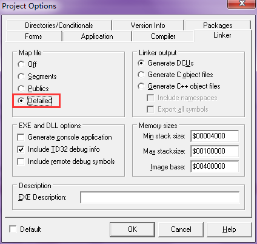
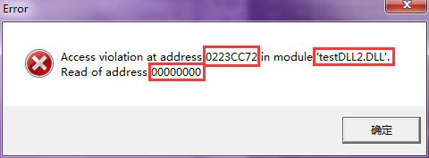
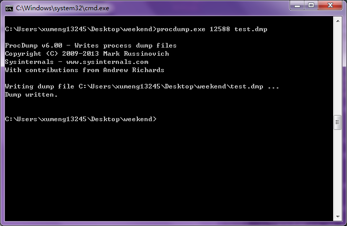
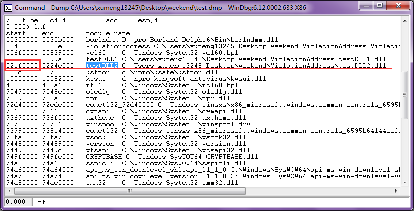
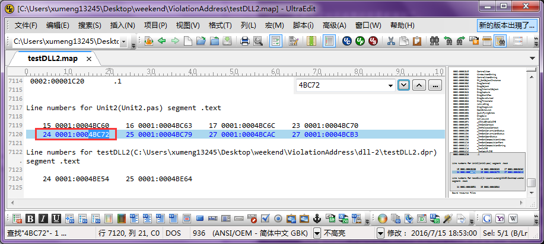
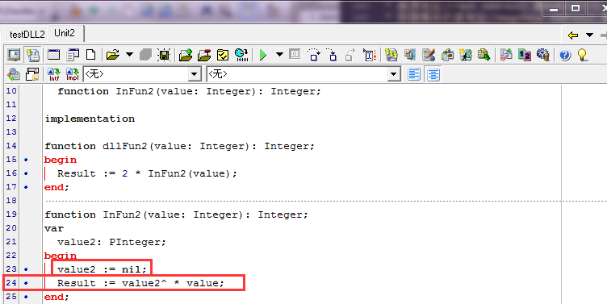

##相关下载和参考资料

**本文相关资料下载**

* [本文使用的测试程序和map文件](../download/20160715/ViolationAddress.zip)
* [本文对应的dump文件](../download/20160715/test.zip)
* [procdump下载地址](../download/20160715/procdump.zip)

**参考文章和问答**

* [《Delphi下生成Map文件方法，免杀或调试用的》](http://www.ej38.com/showinfo/delphi-134184.html)
* [《利用WinDbg找出程序崩溃的代码行号》](http://www.cctry.com/forum.php?mod=viewthread&tid=41078&fromuid=1817)
* [《How to analyze a dump file from a Delphi DLL file?》](http://stackoverflow.com/questions/1237988/how-to-analyze-a-dump-file-from-a-delphi-dll-file)

##提前做好基础设置和基础信息了解

* 首先参考[《WinDbg配置Symbol(符号)》](http://www.xumenger.com/windbg-symbol-20160521/)在安装好WinDbg后进行基础的初步的设置
* 设置Delphi工程生成MAP文件：
  * 【Project】-->【Options】-->【Linker】-->【Map File】设置为Detailed
  * 编译连接的时候就会生成map文件
  * map文件与Delphi工程是一对一的
  * 比如一个EXE工程会有一个 map、一个DLL工程会有一个 map
* 什么是 MAP 文件？简单地讲：
  * MAP 文件是程序的全局符号、源文件和代码行号信息的唯一的文本表示方法
  * 它可以在任何地方、任何时候使用，不需要有额外的程序进行支持
  * 而且，这是唯一能找出程序崩溃的地方的救星
  * 本文主要是讲解如何使用Map文件定位到发生错误对应的代码行
* 计算崩溃行偏移涉及到的公式如下：
  * 崩溃行偏移 = 崩溃地址(Crash Address) - 报错模块的基地址(ImageBase Address) - 0x1000

##分析dump文件的常用命令

* **!analyze** 扩展显示当前异常或bug check的信息。一般使用 **!analyze -v**
* 线程相关的命令
  * 出错的线程调用栈信息输出使用 **kL** 或者 **kbL** 或者 **kbn** 命令
  * **~** 命令输出所有线程的信息
  * **!threads** 显示所有线程
  * **~0s**、 **~1s** 进入某个线程
  * **~\*kb** 打印所有线程的 callstack
  * **~\*kv** 查看所有线程堆栈
* **.lastevent** 命令显示最近一次发生的异常或事件
* **LM** 输出进程运行所加载的所有 dll
* **lmf** 输出更详细的 dll信息，包括这个 dll的堆栈开始和结束地址
  * 使用 **lmf** 输出的模块地址，是程序启动时就需要加载的栈地址
  * 堆地址是程序运行时申请的内存
  * **lmf** 输出的模块地址中不包含堆地址，因为堆地址不属于某个具体模块
  * 本文用到的命令主要是 **lmf** 命令
* 以及更多更强大的命令

##一步步展示如何使用dump和Map文件定位错误行

首先是编写一个用于测试的小工程，其逻辑是这样的：

* 一个 exe加载 dll1，调用 dll1的导出函数
* dll1加载 dll2，并且调用 dll2的导出函数
* 在dll2中的方法会访问非法地址，模拟非法地址报错
* 可以点击[这里](../download/20160715/ViolationAddress.zip)进行下载

对所有的工程设置，保证其编译时生成.map文件：【Project】-->【Options】-->【Linker】-->【Map File】设置为Detailed



编译  EXE、DLL1、DLL2，可以看到分别编译输出 EXE、DLL，以及对应的 Map文件

开始测试程序，点击按钮，可以看到程序报错，报错信息如下：



可以看到是在testDLL2.DLL的 0x0223CC72报的错误，错误原因是对地址

在程序报错框弹出的时候，参考以下命令，使用 procdump获取该进程的 dump文件

```
cd 【procdump.exe所在的路径】

procdump.exe -ma 【进程ID】 【输出dump文件的地址】
```



到这一步，必要的信息都有了：

* 所有 EXE和 DLL的 Map文件，在工程编译的时候生成
* 进程运行时获取的 dump文件，在程序运行的时候获取
* 注意，这些信息需要一一对应，不能使用第一次编译生成的 map文件分析第二次编译生成的程序

继续开始排查错误流程！

使用WinDbg打开 dump文件，输入 lmf命令，因为是testDLL.DLL报非法地址访问错误，所以我们来看一下testDLL.DLL的地址信息



testDLL2.DLL加载到进程中的地址是 0x021f0000到 0x0224c000，基地址就是 0x021f0000

目前公式中所需要的变量都得到了：

* 崩溃地址(Crash Address) 是0x0223CC72
* 报错模块的基地址(ImageBase Address) 是0x021f0000
* 0x1000

崩溃行偏移 = 崩溃地址(Crash Address) - 报错模块的基地址(ImageBase Address) - 0x1000

崩溃行偏移 = 0x0223CC72 - 0x021f0000 - 0x1000 = 0x4BC72

然后使用文本编辑器打开testDLL2.DLL对应的 Map文件testDLL2.map，搜索 4BC72

搜索的情况如下图：



可以看到4BC72在Unit2.pas中，所在的行是24

因为这是一个简单测试程序，本身代码量很少，所以当然在map文件中展示的行也就少，如果是一个大的工程，代码量很多，那么相应的代码行以及对应地址信息将会有很多，可以试着编译有几千行代码的工程，生成map文件后，搜索关键字【Line numbers for】，找到一个代码量很多的pas，可以看到其中的地址信息是很多的。因为本文只是展示这个方法，所以给出的代码量很少，对应的Map文件中的地址信息也是很少，但是不要以为就只有这么多！可以点击[这里](../download/20160715/unishbondtask.zip)看一个有数千行代码的工程编译连接生成的map文件

好，我们使用Delphi打开testDLL2.DLL的工程，找到Unit2.pas的第24行



很明显，可以看到这里非法使用空指针nil，导致访问非法地址的报错！

##补充：基地址的规律

* EXE基地址固定是 0x00400000
  * 对于Windows7，所有机器的所有进程的基地址都是 0x00400000
* 底层 DLL比如kernel32.dll、kernelbase.dll每次被加载到进程中的基地址都是固定的
  * 比如kernelbase.dll固定的基地址是 0x764B0000
  * 对于每一个进程的每一次对底层 DLL的加载，其基地址都是固定的
  * 不过需要注意在不同的操作系统、机器上的情况一般是不同
  * 亲自验证，在不同的四台不同机器上的 kernelbase.dll在进程的基地址都是不同的
* 但是像我们自己开发的 DLL，每次加载到程序中的基地址是不固定的
  * 所以每次如果是第三方 DLL报错，报错地址一般都是变化的
  * 但是也有一个规律，同样的报错，报错地址相对于基地址的偏移量是固定的
* 因为在某台机器上第三方开发者的 DLL每次加载的基地址不同，那么怎么获取呢
  * 就使用本文所展示的方法，在该进程运行的过程中对其进行 dump
  * 使用 WinDbg分析 dump文件，使用 lmf命令可以看到进程本次运行时候加载某个 DLL的基地址
