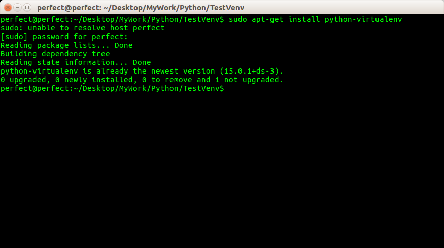
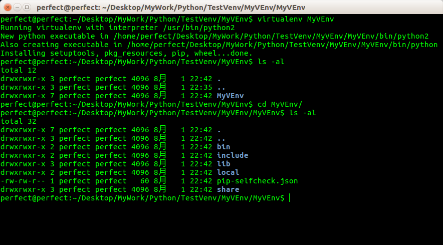
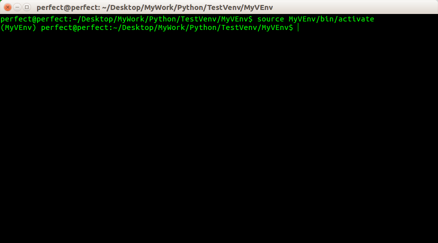
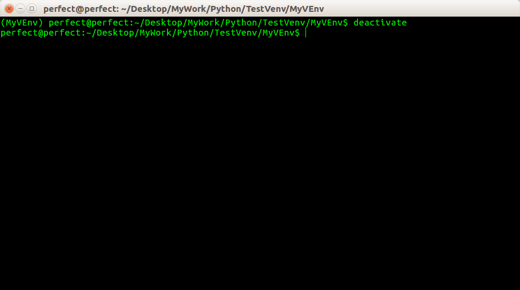
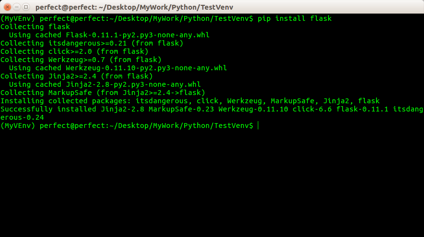
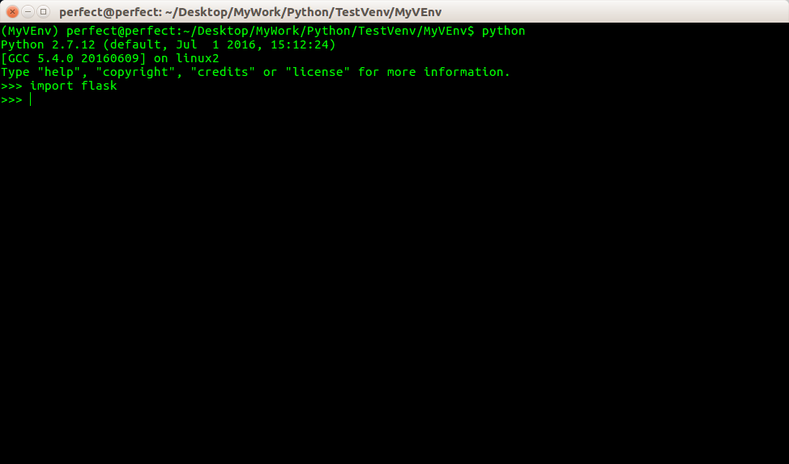

##说明

虚拟环境是 Python解释器的一个私有副本，在该环境中可安装私有包，且不会影响系统中安装的全局 Python解释器

虚拟环境非常有用，可以在系统的Python解释器中避免包的混乱和版本的冲突。为每个程序单独创建虚拟环境可以保证程序只能访问虚拟环境中的包，从而保持全局解释器的干净整洁，使其只作为创建（更多）虚拟环境的源。

##虚拟环境安装

虚拟环境使用第三方实用工具**virtualenv**创建，Ubuntu环境可以执行以下命令安装这个工具：

上面截图中说明该工具之前已经安装过了

##创建Python虚拟环境

使用 virtualenv命令即可以在当前目录下创建 Python虚拟环境。这个命令只有一个必须参数：即虚拟环境的名字

创建虚拟环境后，目录下会出现一个子目录，名字就是上述命令中指定的参数，与虚拟环境相关的文件都保存在该目录下

截图如下：

>注意：如果在包含汉字的目录下创建虚拟环境，会报错

本文对应的例子是在目录**~/Desktop/MyWork/Python/TestVenv/MyVEnv**下创建一个虚拟环境，其名为 MyVEnv

现在，目录下有一个名为 MyVEnv的子目录，里面保存了一个全新的虚拟环境，其中有一个私有的 Python解释器

在使用这个虚拟环境之前，需要先将其**激活**，在 Ubuntu环境下，执行以下命令即可激活这个虚拟环境：

可以看到在激活虚拟环境后，在命令行前面会加入环境名，以上图为例，加入了：(MyVEnv)

激活虚拟环境后，其中 Python解释器的路径被添加到PATH中，但这种改变不是永久性的，只会影响当前的命令行会话

当虚拟环境中的工作完成后，如果想回到全局 Python解释器中，可以执行下面的命令：

可以看到，命令行前面的环境名也没有了

##使用pip安装Python包

大多 Python包都可以使用 pip安装，使用 virtualenv创建虚拟环境的时候会自动安装 pip（可能会有些版本的 Python的虚拟环境并不会自动安装 pip，还需要开发者自己手动安装）。激活虚拟环境后，pip所在的路径会被添加到 PATH中

比如可以执行下面的命令在虚拟环境中安装 Flask及其依赖

可以启动 Python解释器，尝试导入 Flask验证 Flask是不是安装成功

