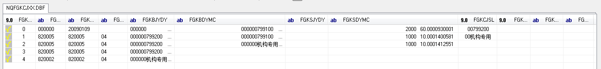
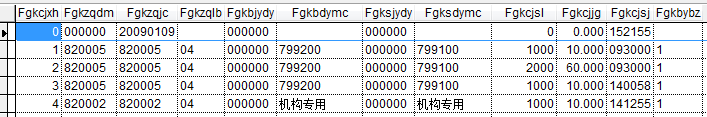
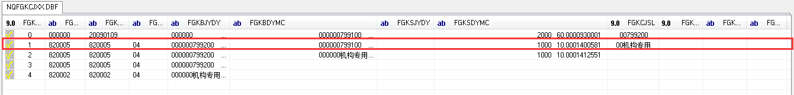
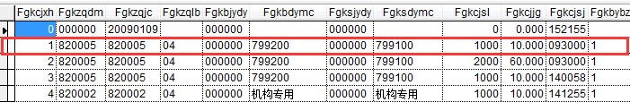
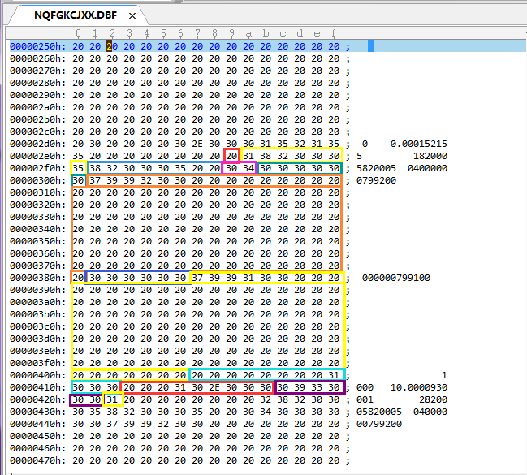

##说明

* 本文展示的的例子是分析一个有问题的DBF文件
* 之前我自己整理过一篇文章[《深入理解DBF文件格式》](http://www.xumenger.com/dbf-20160703/)
* 本文对应的DBF文件可以点击[【这里】](../download/20160802/NQFGKCJXX.DBF)下载

##用不同的工具查看该DBF文件

使用DBFViewer查看的效果

使用Visual FoxPro查看的效果

很明显，两种DBF查看工具看到的效果完全不同！

##分析该DBF文件的二进制内容

上面的截图中可以明显地看出使用不同的工具查看同一个DBF看到的效果完全不同

参考[《深入理解DBF文件格式》](http://www.xumenger.com/dbf-20160703/)来分析一下文件的二进制内容

选择其中的第二条记录，分别使用DBFViewer、Visual FoxPro、Ultra Edit查看和分析

使用DBFViewer看到的效果是这样的

使用Visual FoxPro看到的效果是这样的

再去使用Ultra Edit分析第二行记录的二进制格式

需要先参考[《深入理解DBF文件格式》](http://www.xumenger.com/dbf-20160703/)了解该文件在文件头中对各个字段的精确定义，这里就不做解释了

知道了该文件的各个字段在文件头中对字段名、长度、精度、数据类型等的定义之后，对该条记录的各个字段的分析如下图所示

很明显，通过分析二进制内容，使用Visual FoxPro所展示的效果和实际的二进制内容是一致的，DBFViewer工具所展示的效果是有问题的