##说明

python自带pdb库，使用pdb调试python程序还是很方便的。但是远程调试、多线程，pdb是搞不定的

多说一句，Python的调试器是pdb，可以对应学习Linux下C的调试器gdb

本文参考的相关文章如下：

* [《指针和字符串和字符串常量、用gdb来获取非法内存中的内容》](http://www.xumenger.com/pointer-string-const-gdb/)
* [《Linux gdb调试器用法全面解析》](http://www.xumenger.com/linux-gdb-debug/)
* [《用PDB库调试Python程序》](http://www.cnblogs.com/dkblog/archive/2010/12/07/1980682.html)

##用pdb调试有多种方式

使用pdb调试Python的程序的方式主要是下面的三种！下面逐一介绍

###命令行加-m参数

命令行启动目标程序，加上-m参数，这样调用testPdb.py的话断点就是程序执行的第一行之前

本文接下来重点讲到的实例展示就是使用这种方式进行调试的！

```
python -m pdb testPdb.py
```

###在python交互环境调试

```
>>> import pdb
>>> import testPdb
>>> pdb.run('testPdb.test()')
```

###代码中插入一段程序

比较常用的，就是在程序中间插入一段程序，相对于在一般IDE 里面打上断点然后启动debug，不过这种方式是hardcode的

```
if __name__ == "__main__":
  a = 1
  import pdb
  pdb.set_trace()
  b = 2
  c = a + b
  print(c)
```

然后正常运行脚本：**python testPdb.py**到了pdb.set_trace()那里就会定下来，然后就可以看到调试的提示符(Pdb)了

针对上面的这段小程序的调试情况如下：

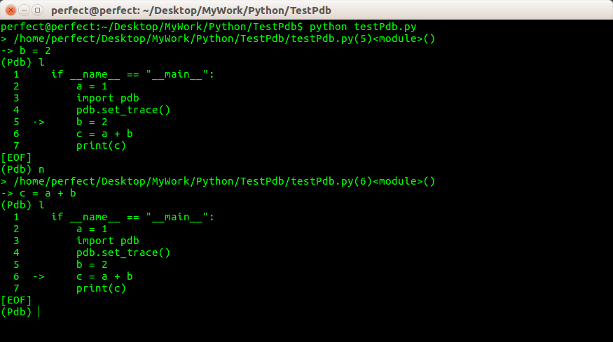

##准备测试程序

接下来使用上面介绍的第一种方式来调试Python程序，以此来介绍pdb常用的命令，不过在开始之前先要准备好测试的程序代码：

###testFun.py

这是一个会被主模块调用的子模块，用于测试使用Pdb调试的时候，是不是可以断点从主模块跟踪进入子模块（后续有说明）

```
#!/usr/bin/python
# -*- coding: utf-8 -*-

def add(a, b):
    return a + b
```

###testPdb.py

这是下面被调试的主模块的代码

```
#!/usr/bin/python
# -*- coding: utf-8 -*-

def sub(a, b):
    return a - b

if __name__ == "__main__":
    
    print ''
    import testFun
    i = 0
    a = 1
    while(i < 100):
        a = testFun.add(a, 1)
        i = i + 1
    print "累加结果：", a
    print ""

    for letter in 'Pdb':
        print "当前字母：", letter
    print ""

    fruits = ['banana', 'apple', 'mango']
    for fruit in fruits:
        print "当前水果：", fruit
    print ""


    ret = 0
    for num in range(10, 12):
        ret = sub(ret, num)
    print '循环结果：', ret
    print ""

    d = {'abc': 123, 123: "abc"}
    for (k,v) in d.items():
        print "当前键值对：", k, '-', v
    print ""
```

##总结常用的命令

###基础命令

h(elp)命令：会打印当前版本Pdb可用的命令，如果要查询某个命令，可以输入**h [command]**，例如**h l**可以查看list命令


l(ist)命令：可以列出当前将要运行的代码块


###断点管理

b(reak)：设置断点

比如**b 12**就是在当前脚本的第9行加上断点

比如**b sub**就是在当前脚本的sub函数定义处加断点

除了可以在当前的脚本中添加断点之外，还可以在当前脚本对其他脚本下断点，以上面用到的代码为例**b testFun.add**就可以实现在testFun.py脚本中的add函数处加断点

如果只用**b**就会显示现有的全部断点

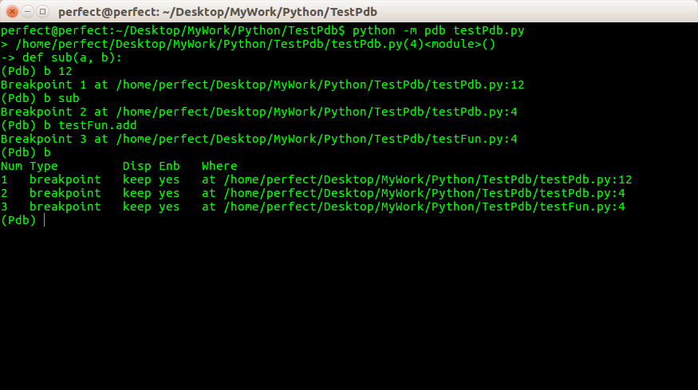

condition bpnumber [condition]：设置条件断点，比如**condition 2 a==0**，就是在第二个断点出加条件“a==0”

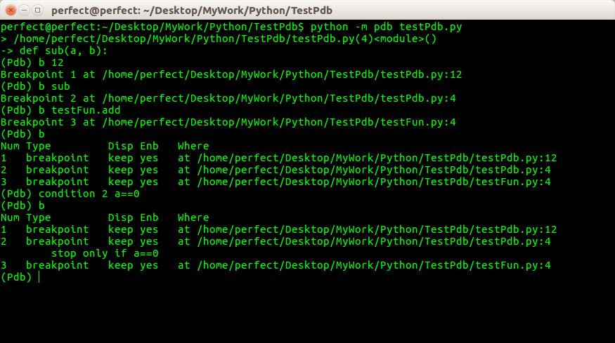

cl(ear)：删除断点，如果后面带有参数，就是清楚指定的断点；如果不带参数就是清除所有的断点


disable/enable：禁用/激活断点

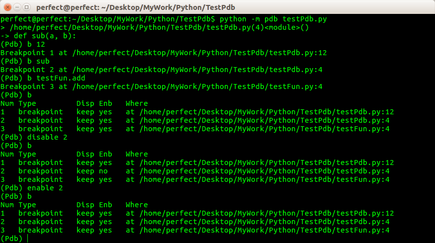

###程序逻辑控制

下面展示的几个命令，需要知道对应的脚本的代码和行号，所以这里先截图展示下面测试需要用到的前几行代码

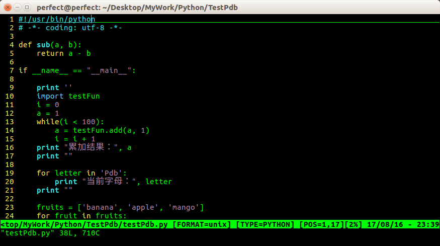

c(ont(inue))，让程序正常运行，直到遇到下一个断点

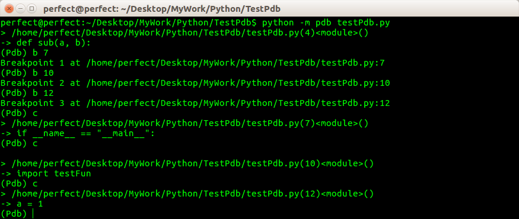

n(ext)，让程序运行下一行，如果当前语句有一个函数调用，用n是不会进入被调用的函数体中的

下图中展示的，当对脚本断点调试到testFun.add(a, 1)时，继续执行n，并不会进入testFun.add(a, 1)的函数内部

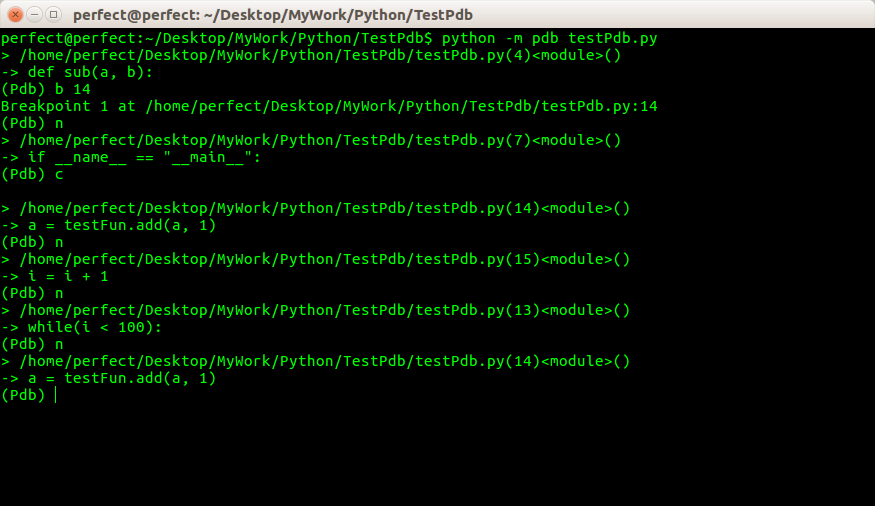

s(tep)，跟n相似，但如果当前有一个函数调用，那么s会进入被调用的函数体中 

下图中展示的，当对脚本断点调试到testFun.add(a, 1)时，继续执行s，会进入testFun.add(a, 1)对应的函数定义内部，虽然testFun.add不是本脚本中定义的函数

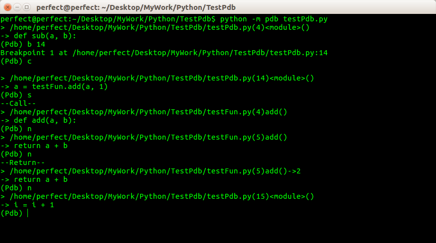

j(ump)，让程序跳转到指定的行数

假如当前所在行是10，注意：假如执行了**j 20**之后，那么相当于程序直接跳到20行，中间的11~19行其实就直接跳过去根本没有被执行到，所以如果这段代码中有变量的声明或对象的初始化需要在20行及之后被用到，那么等到用到的时候就可能导致报错！

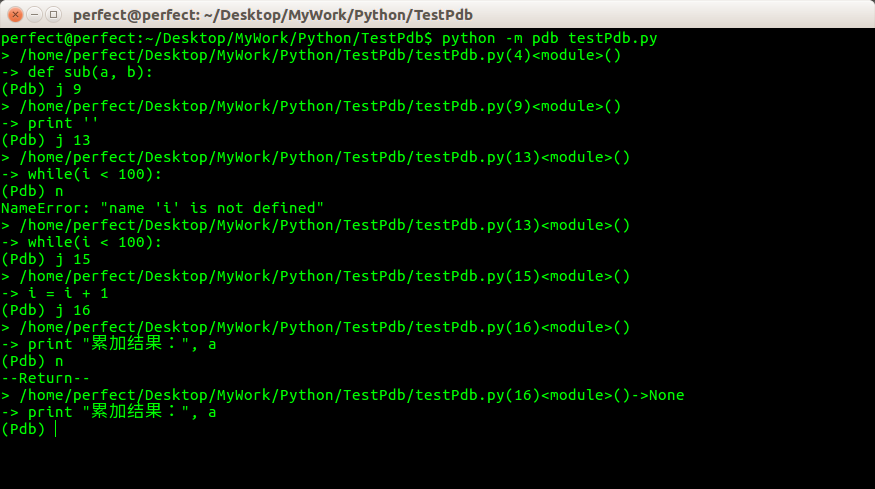

###打印重要信息

a(rgs)，打印当前函数的参数。比如下图就是展示断点进入到testFun.add内部之后，打印testFun.add的参数

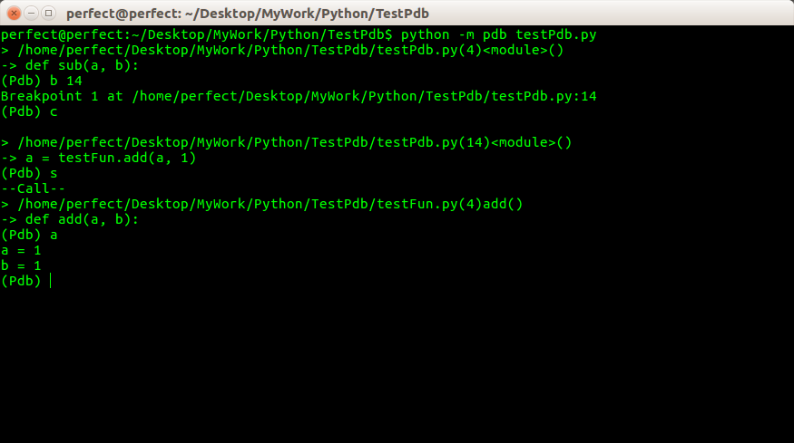

p，打印某个变量

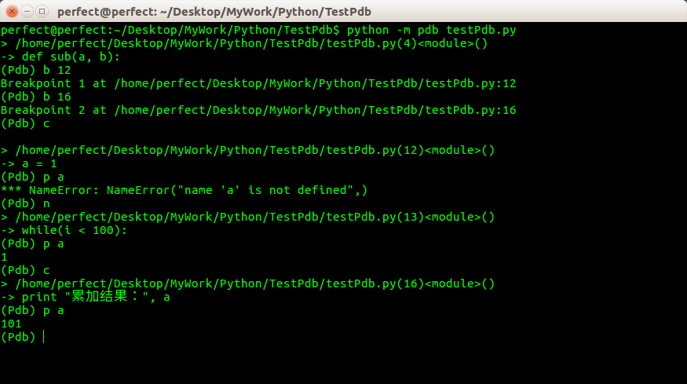

###退出调试

q，直接退出调试；或者使用Ctrl+D的方式退出

##最后说一句

上面展示的使用Pdb调试的过程其实是很简单的，文章中主要通过截图展示运行的效果。如果单纯的看一遍文章，不出意外，会很没有头绪，甚至感觉截图中的命令、输出乱七八糟，但是如果亲自动手跟着走一遍流程，花不了一小时，但是效果绝对极佳！