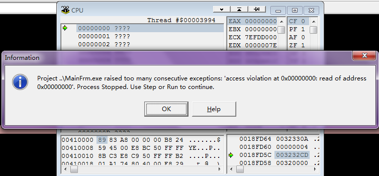
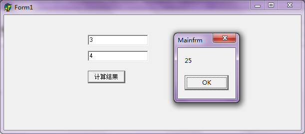

## 说明

之前在[《Delphi和VC++使用DLL配合开发》](http://www.xumenger.com/delphi-cpp-dll-20160412/)中所提到的例子就是在本文中要详细展示的

主要展示在Windows平台，Delphi和VC++具体如何实现跨语言开发，下面的程序只是展示了语法上的东西，所以在异常保护等方面就没有做考虑

开发工具说明

* VC++版本：Microsoft Visual C++ 6.0
* Delphi版本：Delphi 6

[《Delphi和VC++使用DLL配合开发》](http://www.xumenger.com/delphi-cpp-dll-20160412/)有实现过一个稍微复杂一点的，本文就做一个简单的，重点是对整个过程、步骤进行详细说明

* C++的dll被Delphi的dll加载
* Delphi的dll被Delphi的EXE加载
* C++端DLL实现一个简单的加法的方法
* 并且C++端DLL实现一个注册回调函数的接口

开发规范

* DLL导出函数、回调函数的定义必须完全一致，包括返回值、参数类型、参数顺序、stdcall等关键字
* 如果涉及使用结构体来交互，必须保证结构体的成员的顺序、大小、内存对齐方式完全一致
* 总之使用DLL开发，如果在建立对应关系的时候出现一个bit的误差就会导致严重的内存错误

## VC++端DLL实现

* 【文件】-->【新建】-->【工程】-->【Win32 Dynamic-Link Library】
* 【选择工程路径】-->【工程命名，命名为cppdll】-->【一个空的DLL工程】
* 在Visual C++的IDE中，在cppdll工程中的Resource Files创建文件interfaceFun.def
* 将导出的函数名列在该文件，否则最后C++端导出的函数名用DLL查看工具看到的会是乱码
* 【工程】-->【设置】-->【连接】，设置dll输出路径：..\bin\cppdll.dll

**Func.h的代码内容**

```
#ifndef FUNC_H
#define FUNC_H

#include<stdio.h>

//定义函数指针
typedef int (__stdcall *TFuncPointer)(int i);

//实现加法
_declspec(dllexport) int __stdcall Add(int a, int b);
//注册回调函数
__declspec(dllexport) void __stdcall RegisterCallback(void *funcAddr);

#endif
```

在DLL的导出函数中 `__stdcall` 关键字的使用，为了保证Delphi和C++的兼容

**__stdcall**是Pascal程序的缺省调用方式，参数采用从右到左的压栈方式,由调用者完成压栈操作，被调函数自身在返回前清空堆栈。WIN32 Api都采用\_\_stdcall调用方式，这样的宏定义说明了问题：`#define WINAPI _stdcall`

**__cdecl**是C/C++的缺省调用方式，参数采用从右到左的压栈方式，由调用者完成压栈操作，传送参数的内存栈由调用者维护。\_\_cedcl约定的函数只能被C/C++调用，每一个调用它的函数都包含清空堆栈的代码，所以产生的可执行文件大小会比调用\_\_stdcall函数的大

**Func.cpp的代码内容**

实现头文件Func.h中定义那些方法

```
#include "Func.h"

//定义函数指针变量
TFuncPointer func = NULL;

//实现加法
int __stdcall Add(int a, int b)
{
	if(NULL == func){
		return a + b;
	}
	else{
		return func(a) + func(b);
	}
}

//注册回调函数
void __stdcall RegisterCallback(void *funcAddr)
{
	//将函数 指针func指向对应函数实现的内存地址
	func = (TFuncPointer)funcAddr;
}
```

**interfaceFun.def的内容**

```
;dll导出函数，没有这个文件，导出的dll使用exeScope等工具打开后看到的是乱码

LIBRARY cppdll
EXPORTS
	Add
	RegisterCallback
```

## Delphi端DLL实现

实现一个最简单的DLL程序，就是将VC++导出的函数做一层封装，然后再导出新的DLL

【File]-->【New】-->【Other】-->【DLL Wizard】-->创建一个工程叫delphidll

**delphidll.dpr代码如下**

```
library delphidll;

{ Important note about DLL memory management: ShareMem must be the
  first unit in your library's USES clause AND your project's (select
  Project-View Source) USES clause if your DLL exports any procedures or
  functions that pass strings as parameters or function results. This
  applies to all strings passed to and from your DLL--even those that
  are nested in records and classes. ShareMem is the interface unit to
  the BORLNDMM.DLL shared memory manager, which must be deployed along
  with your DLL. To avoid using BORLNDMM.DLL, pass string information
  using PChar or ShortString parameters. }

uses
  ShareMem,
  Forms,
  Windows,
  SysUtils,
  Classes,
  U_Func in 'U_Func.pas';

{$R *.res}

exports
  DelInit, NewAdd, NewRegisterCallback, DelRelease;

begin
end.
```

**U_Func.pas代码实现**

```
unit U_Func;

interface
uses
  SysUtils, Windows, Dialogs;

type
  {定义C++端导出函数类型}
  TCppAdd = function(a: Integer; b: Integer): Integer; stdcall;
  TCppRegisterCallBack = procedure(func: Pointer); stdcall;

  procedure DelInit; stdcall; export;
  function NewAdd(a: Integer; b: Integer): Integer; stdcall; export;
  procedure NewRegisterCallback(func: Pointer); stdcall; export;
  procedure DelRelease; stdcall; export;

var
  CppDLL: THandle;
  CppAdd: TCppAdd;
  CppRegisterCallBack: TCppRegisterCallBack;

implementation

procedure DelInit; 
begin
  CppDLL := LoadLibrary('.\cppdll.dll');

  CppAdd := GetProcAddress(CppDLL, 'Add');
  CppRegisterCallBack := GetProcAddress(CppDLL, 'RegisterCallback');
end;

function NewAdd(a: Integer; b: Integer): Integer;
begin
  Result := CppAdd(a, b);
end;

procedure NewRegisterCallback(func: Pointer); 
begin
  CppRegisterCallBack(func);
end;

procedure DelRelease;
begin 
  FreeLibrary(CppDLL);
end;

end.
```

## Delphi端EXE实现

**delphiExe.dpr代码**

```
program delphiExe;

uses
  ShareMem,
  Forms,
  MainFrm in 'MainFrm.pas' {Form1};

{$R *.res}

begin
  Application.Initialize;
  Application.CreateForm(TForm1, Form1);
  Application.Run;
end.
```

这里有一个特别需要注意的点，就是ShareMem 的使用，如果本次例程中delphidll.dpr 中没有引用ShareMem 单元，delphiExe.dpr 中引用了ShareMem 单元，那么没问题，程序正常运行；如果两个Delphi 工程的dpr 文件中都没有引用ShareMem，那么程序也正常运行；如果两个Delphi 的dpr 文件中都有引用ShareMem 单元，那么程序也是正常运行；但如果在delphidll.dpr 中有引用ShareMem 这个单元，但是在delphiExe.dpr 中没有引用，如果在调试场景下，发现在运行到delphiExe 工程的FreeLibrary 去释放delphidll 的时候会出现如下报错



上面这个问题花了我好久才查出来

关于ShareMem 的作用还有这样的一篇文章[《Delphi的DLL中导出函数若有string参数，请引入ShareMem单元》](http://www.xumenger.com/delphi-dll-string-sharemem-20150812/)

但是这都是总结出来的关于ShareMem 的一些特殊现象，关于这背后的原理目前还不清楚，有必要以这次练习中遇到的问题为契机去深入研究一下

**MainFrm.pas代码**

```
unit MainFrm;

interface

uses
  Windows, Messages, SysUtils, Variants, Classes, Graphics, Controls, Forms,
  Dialogs, StdCtrls;

type
  TForm1 = class(TForm)
    btn1: TButton;
    edt1: TEdit;
    edt2: TEdit;
    procedure FormCreate(Sender: TObject);
    procedure btn1Click(Sender: TObject);
    procedure FormDestroy(Sender: TObject);
  private
    { Private declarations }
  public
    { Public declarations }
  end;

  {定义回调函数指针类型}
  TOnCallBack = function(i: Integer): Integer; stdcall;

  {定义Delphi端导出函数类型}
  TInit = procedure; stdcall;
  TNewAdd = function(a: Integer; b: Integer): Integer; stdcall;
  TNewRegisterCallback = procedure(func: Pointer); stdcall;
  TRelease = procedure; stdcall;

var
  Form1: TForm1;
  DelphiDLL: THandle;
  DelInit: TInit;
  NewAdd: TNewAdd;
  NewRegisterCallback: TNewRegisterCallback;
  DelRelease: TRelease;

function OnCallBack(i: Integer): Integer; stdcall;

implementation

{$R *.dfm}

function OnCallBack(i: Integer): Integer; 
begin
  Result := i * i;
end;

procedure TForm1.FormCreate(Sender: TObject);
var
  sDLLPath: string;
begin
  //加载DLL
  DelphiDLL := LoadLibrary( '.\delphidll.dll');

  //获取导出函数
  DelInit := GetProcAddress(DelphiDLL, 'DelInit');
  NewAdd := GetProcAddress(DelphiDLL, 'NewAdd');
  NewRegisterCallBack := GetProcAddress(DelphiDLL, 'NewRegisterCallback');
  DelRelease := GetProcAddress(DelphiDLL, 'DelRelease');

  //初始化
  DelInit;
  //注册回调函数
  NewRegisterCallback(@OnCallBack);
end;

procedure TForm1.btn1Click(Sender: TObject);
var
  num1, num2: Integer;
  ret: Integer;
begin
  num1 := StrToInt(edt1.Text);
  num2 := StrToInt(edt2.Text);

  ret := NewAdd(num1, num2);
  ShowMessage(IntToStr(ret));
end;

procedure TForm1.FormDestroy(Sender: TObject);
begin
  DelRelease; 
  FreeLibrary(DelphiDLL);
end;

end.
```

最后将cppdll.dll、delphidll.dll、delphiExe.exe 放在一个目录下，运行程序的效果如下


