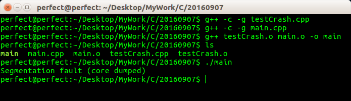
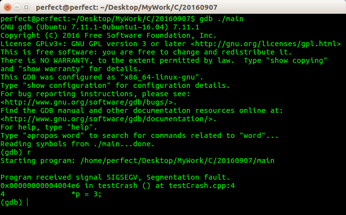
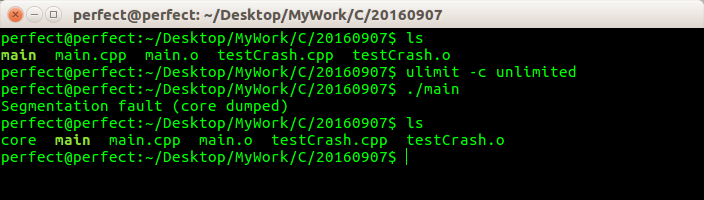
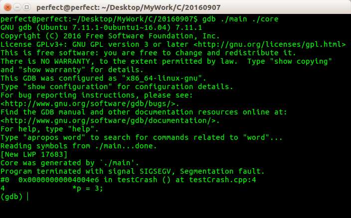
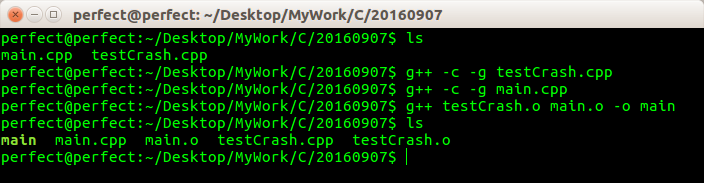
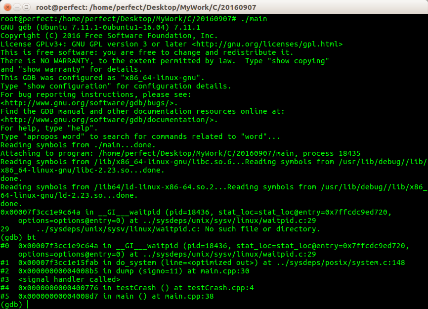

之前初步了解过Windows 下强大的调试工具WinDbg，也简单的整理了一个初级的文章[《使用WinDbg、Map文件、Dump文件定位Access Violation的代码行》](http://www.xumenger.com/windbg-map-access-violation-20160715/)，在Linux 下面也有对应的功能强大的调试工具：GDB，它可以用来断点调试C/C++ 的程序，也可以用于分析Linux 下的C/C++ 程序运行崩溃产生的Core 文件

另外对于GDB 工具，在[《Linux gdb调试器用法全面解析》](http://blog.csdn.net/21cnbao/article/details/7385161)这篇文章中详细的介绍了怎么使用GDB 去调试C/C++ 代码

本文通过一个简单的例子展示怎么使用GDB 分析Core 文件，但就像我一直强调的，完全停留在一个很肤浅的入门级的水平，只是先让自己能有一个对GDB 的感性的认知，其实GDB 很强大，它能做的事情远不止于本文所提到的这些皮毛

本文的内容也是参考了网络上很多的文章，然后结合自己的验证整理出来的

* [《Linux gdb调试器用法全面解析》](http://blog.csdn.net/21cnbao/article/details/7385161)
* [《详解coredump》](http://blog.csdn.net/tenfyguo/article/details/8159176)
* [《Unix 用gdb分析core dump文件》](http://www.cnblogs.com/playerken/p/4157481.html)
* [《gdb core 调试》](http://blog.csdn.net/hanchaoman/article/details/5583457)
* [《linux下用core和gdb查询出现"段错误"的地方》](http://blog.chinaunix.net/uid-26833883-id-3193279.html)

##Core文件和段错误

当一个程序奔溃时，在进程当前工作目录的Core 文件中复制了该进程的存储图像。Core　文件仅仅是一个内存映像(同时加上调试信息)，主要用来调试的

通常情况下，Core 文件会包含程序运行时的内存、寄存器状态、堆栈指针、内存管理信息还有各种函数调用堆栈信息等。我们可以理解为是程序工作当前状态存储生成第一个文件，许多程序出错时都会产生一个Core 文件，通过工具分析这个文件，我们可以定位到程序异常退出时对应的堆栈调用等信息，找出问题所在并进行及时解决

段错误，就是大名鼎鼎的Segmentation Fault，这通常是由指针错误引起的。简而言之，产生段错误就是访问了错误的内存段，一般是你没有权限，或者根本就不存在对应的物理内存，尤其常见的是访问0 地址。

一般而言，段错误就是指访问的内存超出了系统所给这个程序的内存空间，通常这个值是由gdtr 来保存的，这是一个48位的寄存器，其中的32位是保存由它指向的gdt 表，后13位保存相应于gdt 的下标，最后3位包括了程序是否在内存中以及程序在CPU 中的运行级别。指向的gdt 是由以64位为一个单位的表，在这张表中就保存着程序运行的代码段以及数据段的起始地址以及与此相应的段限、页面交换、程序运行级别、内存粒度等的信息。一旦一个程序发生了越界访问，CPU 就会产生相应的异常保护，于是Segmentation fault就出现了

在编程中有以下几种做法容易导致段错误，基本都是错误地使用指针引起的：

* 访问系统数据区，尤其是往系统保护的内存地址写数据，最常见的就是给指针以0地址
* 内存越界(数据越界、变量类型不一致等)访问到不属于你的内存区域

程序在运行过程中如果出现段错误，那么就会收到SIGSEGV 信号，SIGSEGV 默认handler 的动作是打印“段错误”的出错信息，并产生Core 文件

##GDB 断点调试以定位错误代码行

**testCrash.cpp**

```
void testCrash()
{
    int* p = 1;	//p指针指向常量1 所在的内存地址
    *p = 3;     //将p指针指向的地址的值改为3，
    //因为本来p指向一个常量，是不允许被修改的
    //强行访问系统保护的内存地址就会出现段错误
}
```

**main.cpp**

```
#include <stdio.h>

void testCrash();

int main()
{
    testCrash();
    return 0
}
```

**编译执行，报段错误**

注意g++ 编译的时候，需要使用参数-g，否则GDB 无法找到symbol 信息，从而无法定位问题



**断点调试**



很明显，在GDB 断点调试的过程中，已经将错误的代码行输出了：在testCrash.cpp 的第4行，在testCrash()方法里面，而且也将错误的代码`*p = 3;`打印出来了

还发现进程是由于收到了SIGSEGV 信号而结束的。通过进一步的查阅文档(man 7 signal)，SIGSEGV 默认handler 的动作是打印”段错误"的出错信息，并产生Core　文件

##分析Core 文件

**设置Core文件大小，运行程序生成Core文件**

执行`ulimit -c unlimited`表示不限制生成的Core 文件的大小，注意这个命令只在当前的bash 下生效！然后运行这个有bug 的程序，可以看到在当前目录下生成了core文件



**GDB 分析Core 文件**



同样也是一步到位的定位到错误所在的代码行！

接着考虑下去，在Windows 系统下的运行程序时，可能会出现“运行时错误”，这个时侯如果恰好你的机器上又装有Windows 的编译器的话，它会弹出来一个对话框，问你是否进行调试，如果你选择是，编译器将被打开，并进入调试状态，开始调试

Linux下可以做到吗？可以让它在SIGSEGV 的handler中调用gdb

##段错误时启动调试

**testCrash.cpp**

```
void testCrash()
{
    int* p = 1;	//p指针指向常量1 所在的内存地址
    *p = 3;     //将p指针指向的地址的值改为3，
    //因为本来p指向一个常量，是不允许被修改的
    //强行访问系统保护的内存地址就会出现段错误
}
```

**main.cpp**

```
#include <stdio.h>
#include <stdlib.h>
#include <unistd.h>
#include <signal.h>
#include <string.h>

void testCrash();

void dump(int signo)
{
    char buf[1024];
    char cmd[1024];
    FILE *fh;

    snprintf(buf, sizeof(buf), "/proc/%d/cmdline", getpid());
    if(!(fh = fopen(buf, "r")))
    {
        exit(0);
    }
    if(!fgets(buf, sizeof(buf), fh))
    {
        exit(0);
    }
    fclose(fh);
    if(buf[strlen(buf) - 1] == '\n')
    {
        buf[strlen(buf) - 1] = '\0';
    }
    snprintf(cmd, sizeof(cmd), "gdb %s %d", buf, getpid());
    system(cmd);

    exit(0);
}

int main()
{
    signal(SIGSEGV, &dump);
    testCrash();
    return 0;
}
```

**编译程序**

注意g++ 编译的时候，需要使用参数-g，否则GDB 无法找到symbol 信息，从而无法定位问题



**运行程序**

首先必须要切换到root 用户运行，否则因为权限问题导致无法调试，另外就是进入调试模式后执行`bt`以显示程序的调用栈信息！




