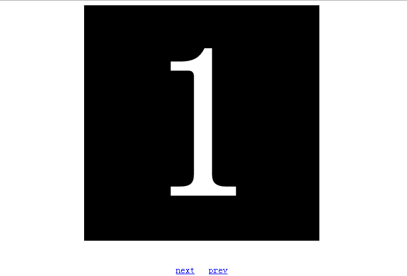
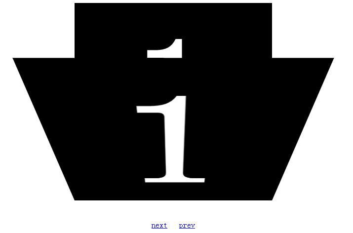
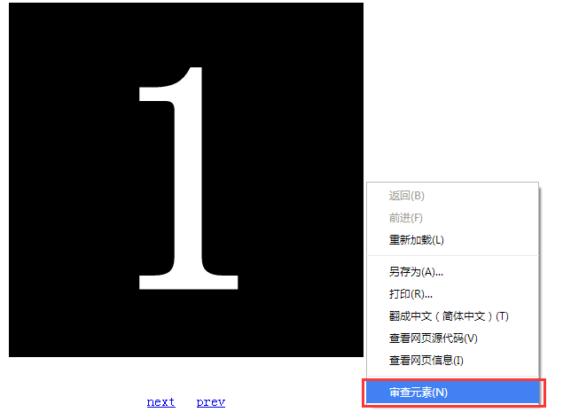
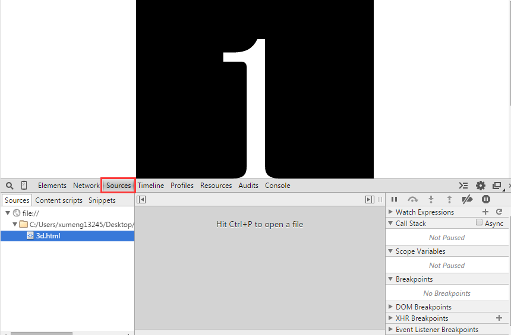
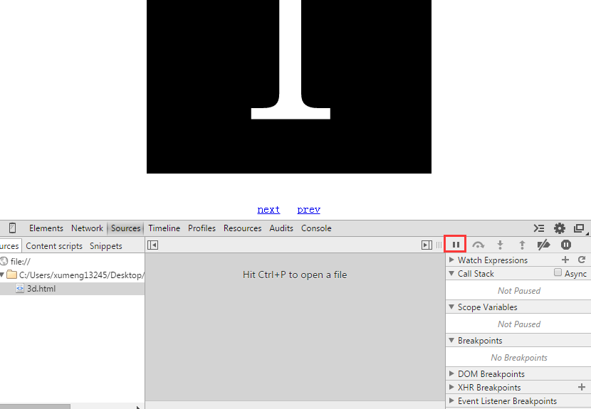
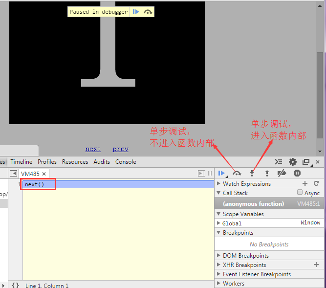
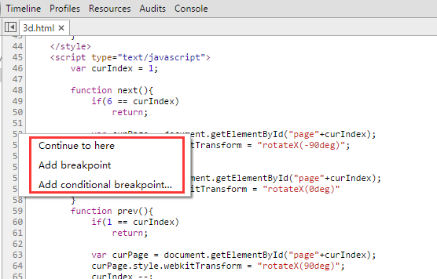
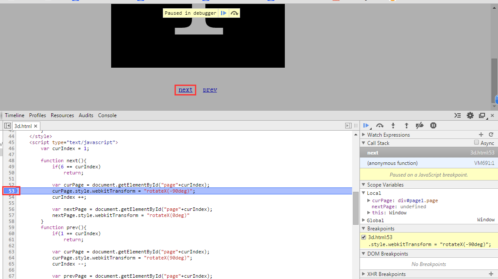
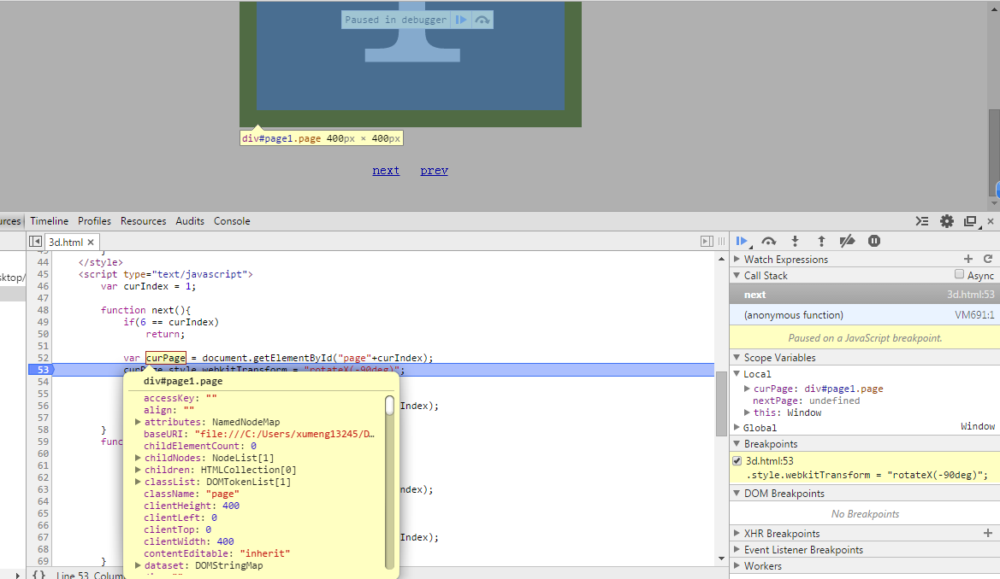
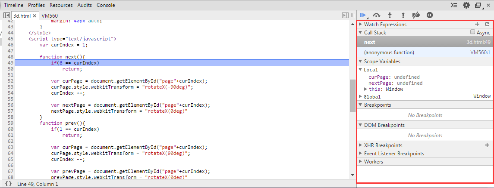

##简介

本文通过一个简单的例程讲解，页面效果可以点击[【这里】](../download/20160919/3d.html)查看，对应可以通过在浏览器上【右键】-->【查看页面源代码】查看对应的代码

使用Chrome打开3d.html，可以看到这个小程序有3D 翻转效果

##开始调试

【右键】-->【审查元素】

打开后，选择【Sources】

先点击下面的按钮，可以让JavaScript运行第一步就挂起

然后点击【Next】链接，让JavaScript运行起来，就可以看到JavaScript的代码运行并停止住等待单步调试

上面的方法是从程序的一开始就将其挂起，其实还可以在JavaScript代码中添加断点。如下图在想要加断点的行右键即可选择添加断点

点击【Next】链接后，可以看到程序直接运行到这个断点处才停止

单步跟踪到next()函数内部后，鼠标悬停在某个变量上面，可以看到这个变量的详细信息

另外在【审查元素】的右面部分，还可以查看调用栈、断点等很多其他信息

