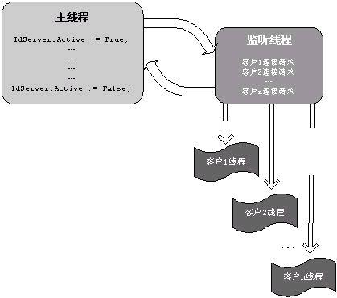
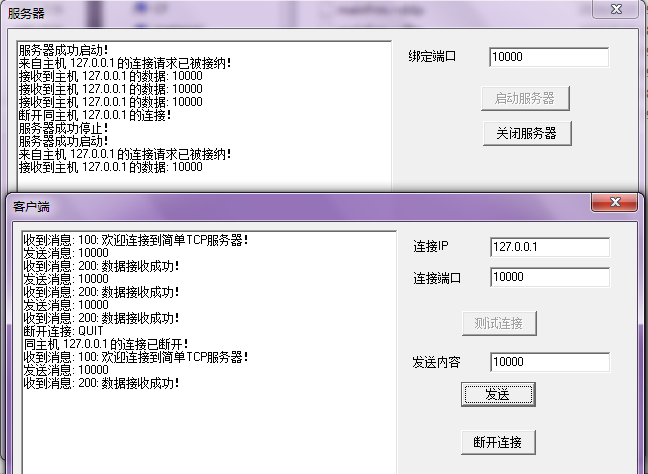

##说明

>参考[《Delphi 7中用Indy组件开发Socket应用程序》](http://www.cnblogs.com/tangqs/archive/2011/09/18/2180544.html)

>本文对应的测试代码是用的Delphi 6 的开发环境

Delphi 中自带两套TCP Socket 组件：Indy Socket 组件（IdTcpClient和IdTcpSerever）和Delphi 原生的TCP Socket 组件（ClientSocket和ServerSocket）。但Borland 已宣称ClientSocket 和ServerSocket 组件即将被废弃，建议用相应的Indy 组件来代替

开放源代码的Internet 组件集----Internet Direct（Indy）是一组开放源代码得到Internet 组件，涵盖了几乎所有流行的Internet 协议。Indy用Delphi编写，被包含在Delphi 6、KyLix 1 和C++ Builder 6 及以上各个版本的Borland 开发环境中。Indy 曾经叫做WinShoes（双关于WinSock----Windows 的Socket库），是由Chad Z.Hower 领导的一群开发者构建的，可以从Indy 的站点[ www.nevrona.com/indy ](www.nevrona.com/indy)上找到更多的信息并下载最新版本

基于Indy 的组件，可以开发基于各种协议的TCP 客户端和服务器应用程序，并处理相关的编码和安全问题。可以通过前缀Id 来识别Indy 组件

##Indy是阻塞式(Blocking)的

当在使用WinSock 开发网络应用程序时，从Socket 中读取数据或者向Socket 写入数据都是异步发生的，这样就不会阻断程序中其他代码的执行。在收到数据时，WinSock 会向应用程序发送相应的消息。这种访问方式就是非阻塞式连接，它要求你对事件作出响应，设置状态机，并通常还需要一个等待循环

与通常的WinSock 编程方法不同的是，Indy 使用了阻塞式Socket 调用方式。阻塞式访问更像是文件存取。当你读取数据，或是写入数据时，读取和写入函数将一直等到相应的操作完成后才返回。比如说，发起网络连接只需要调用Connect 方法并等待它返回，假如该方法执行成功，在结束时就直接返回，假如未能成功执行，则会抛出相应的异常。同文件访问不同的是，Socket 调用可能会需要等待更长的时间，因为要读写的数据可能不会立即就能预备好（在很大程度上依赖于网络带宽）

**阻塞式并非恶魔**

长期以来，阻塞式Socket 都遭到了毫无理由的攻击。其实阻塞式Socket 并非如通常所说的那样可怕，这还要从WinSock 的发展说起

当Socket 被从Unix 移植到Windows 时，一个严重的问题立即就出现了。Unix 支持fork，客户程序和服务器都能够fork 新的进程，并启动这些进程，从而能够很方便地使用阻塞式Socket。而Windows 3.x 既不支持fork 也不支持多线程，当使用阻塞式Socket 时，用户界面就会被“锁住”而无法响应用户输入

所谓的“锁住”其实就是主线程当时在Socket 的读写上，无法响应窗体的事件消息，从而产生“锁住”的效果

为了克服Windows 3.x 的这一缺陷，微软在WinSock 中加入异步扩展，以使WinSock 不会“锁住”应用程序的主线程（也就是唯一的线程）。然而，这需要一种完全不同的编程方式。于是有些人为了掩饰这一弱点，就开始强烈地诽谤阻塞式Socket

当Win32 出现的时候，它能够很好地支持线程。但既成的观念已经很难改变，并且说出去的话也无法收回，因此对阻塞式Socket 的诽谤继续存在着

事实上，阻塞式Socket 仍然是Unix 实现Socket 的唯一方式，并且它工作地很好

**阻塞式Socket的优点**

归结起来，在Windows 上使用阻塞式Socket 开发应用程序具有如下优点

* 编程简单：阻塞式Socket 应用程序很容易编写，所有的用户代码都写在同一个地方，并且顺序执行
* 轻易向Unix 移植：由于Unix 也是用阻塞式Socket，编写可移植的代码就变得比较容易。Indy 就是利用这一点来实现其多平台支持而又单一源代码的设计
* 很好地利用了线程技术：阻塞式Socket 是顺序执行的，其固有的封装特性使得它能够很轻易地使用到线程中

**阻塞式Socket的缺点**

事物都具有两面性，阻塞式Socket 也不例外。它的一个主要缺点就是使客户程序的用户界面“锁住”。当在程序的主线程中进行阻塞式Socket 调用时，由于要等待Socket 调用完成并返回，这段时间就不能处理用户界面消息，使得Update、Repaint 以及其他消息得不到及时响应，从而导致用户界面被“冻结”

Indy 使用一个非凡的组件TIdAntiFreeze 来透明地解决客户程序用户界面“冻结”的问题。TIdAntiFreeze 在Indy内部定时中断对栈的调用，并在中断期间调用Application.ProcessMessages 方法处理消息，而外部的Indy 调用继续保持阻塞状态，就似乎TIdAntiFreeze 对象不存在一样。你只要在程序中的任意地方添加一个TIdAntiFreeze 对象，就能在客户程序中利用到阻塞式Socket 的所有优点而避开它的一些显著缺点

**Indy使用了线程技术**

阻塞式Socket 通常都采用线程技术，Indy 也是如此。从最底层开始，Indy 的设计都是线程化的。因此用Indy 创建服务器和客户程序跟在Unix 下十分相似，并且Delphi 的快速开发环境和Indy 对WinSock 的良好封装使得应用程序创建更加容易

**Indy服务器模型**

一个典型的Unix 服务器有一个或多个监听进程，它们不停地监听进入的客户连接请求。对于每一个需要服务的客户，都fork 一个新进程来处理该客户的所有事务。这样一个进程只处理一个客户连接，编程就变得十分轻易

Indy 服务器工作原理同Unix 服务器十分类似，只是Windows 不像Unix 那样支持fork，而是支持线程，因此Indy 服务器为每个客户连接分配一个线程

Indy 服务器组件创建一个同应用程序主线程分离的监听线程来监听客户连接请求，对于接受的每一个客户，都创建一个新的线程来为该客户提供服务，所有与这一客户相关的事务都由该线程来处理

Indy 客户端组件并未使用线程。但在一些高级的客户程序中，程序员可以在自定义的线程中使用Indy 客户端组件，以使得用户界面更加友好



##一个简单的服务器客户端应用实例

下面将创建一个简单的TCP 客户端程序和一个简单的TCP 服务器来演示Indy 的基本使用方法。客户程序使用TCP 协议通服务器连接，并向服务器发送用户所输入的数据

我这里不是使用Delphi 6 自带的Indy，而是下载Indy 9 放在源码下公共单元引用，对应程序的源码点击[【这里】](../download/20160920/Example.zip)下载

**客户端代码**

```
unit mainFrm;

interface

uses
  Windows, Messages, SysUtils, Variants, Classes, Graphics, Controls, Forms,
  Dialogs, StdCtrls, IdTCPClient;

type
  TForm1 = class(TForm)
    lbl1: TLabel;
    lbl2: TLabel;
    edtHost: TEdit;
    edtPort: TEdit;
    btnConnect: TButton;
    mmo1: TMemo;
    edtSend: TEdit;
    lbl3: TLabel;
    btnSend: TButton;
    btnDisConnect: TButton;
    procedure FormCreate(Sender: TObject);
    procedure btnConnectClick(Sender: TObject);
    procedure btnSendClick(Sender: TObject);
    procedure btnDisConnectClick(Sender: TObject);
  private
    { Private declarations }
  public
    { Public declarations }
  end;

var
  Form1: TForm1;
  TcpClient: TIdTCPClient;

implementation

{$R *.dfm}

procedure TForm1.FormCreate(Sender: TObject);
begin
  TcpClient := TIdTCPClient.Create(nil);

  btnSend.Enabled := False;
  btnDisConnect.Enabled := False;
  mmo1.Clear;
end;

procedure TForm1.btnConnectClick(Sender: TObject);
begin
  TcpClient.Host := edtHost.Text;
  TcpClient.Port := StrToInt(edtPort.Text);
  try
    TcpClient.Connect(5000);  //连接，并设置连接超时时间 
    try
      mmo1.Lines.Add('收到消息: ' + TcpClient.ReadLn());
      btnConnect.Enabled := False;
      btnSend.Enabled := True;
      btnDisConnect.Enabled := True;
    except
      mmo1.Lines.Add('远程主机无响应！');
      TcpClient.Disconnect();
    end;
  except
    on E: Exception do
    begin
      ShowMessage('连接失败：' + E.Message);
    end;
  end;
end;

procedure TForm1.btnSendClick(Sender: TObject);
begin
  mmo1.Lines.Add('发送消息: ' + edtSend.Text);
  try
    TcpClient.WriteLn(edtSend.Text);
    mmo1.Lines.Add('收到消息: ' + TcpClient.ReadLn());
  except
    on E: Exception do
    begin
      mmo1.Lines.Add('发送数据出现异常: ' + E.Message);
      TcpClient.DisConnect();
      mmo1.Lines.Add('同主机 ' + EdtHost.Text + ' 的连接已断开！');
      btnConnect.Enabled := True;
      btnSend.Enabled := False;
      btnDisConnect.Enabled := False;
    end;
  end;
end;

procedure TForm1.btnDisConnectClick(Sender: TObject);
begin
  mmo1.Lines.Add('断开连接: QUIT');
  try
    TcpClient.WriteLn('QUIT');
  finally
    TcpClient.Disconnect;
    mmo1.Lines.Add('同主机 ' + EdtHost.Text + ' 的连接已断开！');
    btnConnect.Enabled := True;
    btnSend.Enabled := False;
    btnDisconnect.Enabled := False;
  end;
end;

end.
```

**服务器代码**

```
unit mainFrm;

interface

uses
  Windows, Messages, SysUtils, Variants, Classes, Graphics, Controls, Forms,
  Dialogs, StdCtrls, IdTCPServer, IdBaseComponent, IdComponent,
  IdTCPConnection, IdTCPClient;

type
  TForm1 = class(TForm)
    lbl1: TLabel;
    edtPort: TEdit;
    btnStart: TButton;
    btnStop: TButton;
    mmo1: TMemo;
    procedure FormCreate(Sender: TObject);
    procedure btnStartClick(Sender: TObject);
    procedure btnStopClick(Sender: TObject);
    procedure FormDestroy(Sender: TObject);
  private
    procedure IdTCPServerConnect(AThread: TIdPeerThread);
    procedure IdTCPServerDisConnect(AThread: TIdPeerThread);
    procedure IdTCPServerExecute(AThread: TIdPeerThread);
  public
    { Public declarations }
  end;

var
  Form1: TForm1;
  TcpServer: TIdTCPServer;

implementation

{$R *.dfm}

procedure TForm1.FormCreate(Sender: TObject);
begin
  TcpServer := TIdTCPServer.Create(nil);

  //设置客户端针对每个连接的回调函数
  TcpServer.OnConnect := IdTCPServerConnect;
  TcpServer.OnDisconnect := IdTCPServerDisConnect;
  TcpServer.OnExecute := IdTCPServerExecute;

  btnStop.Enabled := False;
  mmo1.Clear;
end;

procedure TForm1.btnStartClick(Sender: TObject);
begin
  //绑定端口
  TcpServer.DefaultPort := StrToInt(edtPort.Text);
  TcpServer.Active := True;
  btnStart.Enabled := False;
  btnStop.Enabled := True;
  mmo1.Lines.Add('服务器成功启动！');
end;

procedure TForm1.btnStopClick(Sender: TObject);
begin
  TcpServer.Active := False;
  btnStart.Enabled := True;
  btnStop.Enabled := False;
  mmo1.Lines.Add('服务器成功停止！');
end;

procedure TForm1.IdTCPServerConnect(AThread: TIdPeerThread);
begin
  mmo1.Lines.Add('来自主机 '  + AThread.Connection.Socket.Binding.PeerIP + ' 的连接请求已被接纳！');

  AThread.Connection.WriteLn('100: 欢迎连接到简单TCP服务器！');
end;

procedure TForm1.IdTCPServerDisConnect(AThread: TIdPeerThread);
begin
  mmo1.Lines.Add('来自主机 '  + AThread.Connection.Socket.Binding.PeerIP + ' 的连接断开！');
end;

procedure TForm1.IdTCPServerExecute(AThread: TIdPeerThread);
var
  sCommand: string;
begin
  sCommand := AThread.Connection.ReadLn();
  if SameText(sCommand, 'QUIT') then
  begin 
    mmo1.Lines.Add('断开同主机 ' + AThread.Connection.Socket.Binding.PeerIP + ' 的连接！'); 

    AThread.Connection.Disconnect;
  end
  else
  begin
    mmo1.Lines.Add('接收到主机 ' + AThread.Connection.Socket.Binding.PeerIP + ' 的数据: ' + sCommand);

    AThread.Connection.WriteLn('200: 数据接收成功！');
  end;
end;

procedure TForm1.FormDestroy(Sender: TObject);
begin
  //如果没有这一句，在没有关闭TCP 服务的情况下就关闭服务器的界面的话，在任务管理器中看到服务器进程依然存在！
  if True = TcpServer.Active then
  begin
    TcpServer.Active := False;
  end;
end;

end.
```

运行效果如下：



* “启动”按钮设置IdTCPServer 的Active 属性为True 来启动服务器，“停止”按钮设置Active 属性为False 来关闭服务器。
* IdTcpServerConnect 方法作为IdTcpServer 的OnConnect 事件响应过程，向客户端发送欢迎信息。OnConnect 事件在一个客户连接请求被接受时发生，为该连接创建的线程AThread 被作为参数传递给IdTCPServerConnect 方法
* IdTCPServerExecute 方法是IdTCPServer 的OnExecute 事件响应过程。OnExecute 事件在TIdPeerThread 对象试图执行其Run 方法时发生。OnExecute 事件与通常的事件有所不同，其响应过程是在某个线程上下文中执行的，参数AThread 就是调用它的线程。这一点很重要，它意味着可能有多个线程同时调用OnExecute 这就需要特别考虑线程安全问题。在连接被断开或中断前，OnExecute 方法会被反复执行
* 注意OnConnect、OnDisConnect、OnExecute是会被多个子线程调用的，所以需要考虑线程安全的问题
* 下面展示两种典型的线程安全错误！

##典型错误一

像上面的那种服务端代码，在简单测试的时候确实可以正常工作，但存在一个巨大的隐患，就是当有多个客户端发起连接时，对应就会创建多个线程，那么OnConnect、OnExecute、OnDisconnect 方法就会被多个线程调用，再加上主线程，那么就会出现多线程操作VCL 控件的情况，而VCL 控件是典型的非线程安全的，所以以上的代码在大量连接导致创建大量子线程并发的时候，就极有可能出现各种诡异的异常！

你可能想到修改成这样

```
unit mainFrm;

interface

uses
  Windows, Messages, SysUtils, Variants, Classes, Graphics, Controls, Forms,
  Dialogs, StdCtrls, IdTCPServer, IdBaseComponent, IdComponent,
  IdTCPConnection, IdTCPClient;

type
  TForm1 = class(TForm)
    lbl1: TLabel;
    edtPort: TEdit;
    btnStart: TButton;
    btnStop: TButton;
    mmo1: TMemo;
    procedure FormCreate(Sender: TObject);
    procedure btnStartClick(Sender: TObject);
    procedure btnStopClick(Sender: TObject);
    procedure FormDestroy(Sender: TObject);
  private
    procedure IdTCPServerConnect(AThread: TIdPeerThread);
    procedure IdTCPServerDisConnect(AThread: TIdPeerThread);
    procedure IdTCPServerExecute(AThread: TIdPeerThread);
  public
    MemoMsg: string;
    procedure UpdateToMemo;
  end;

var
  Form1: TForm1;
  TcpServer: TIdTCPServer;

implementation

{$R *.dfm}

procedure TForm1.FormCreate(Sender: TObject);
begin
  TcpServer := TIdTCPServer.Create(nil);

  //设置客户端针对每个连接的回调函数
  TcpServer.OnConnect := IdTCPServerConnect;
  TcpServer.OnDisconnect := IdTCPServerDisConnect;
  TcpServer.OnExecute := IdTCPServerExecute;

  btnStop.Enabled := False;
  mmo1.Clear;
end;

procedure TForm1.btnStartClick(Sender: TObject);
begin
  //绑定端口
  TcpServer.DefaultPort := StrToInt(edtPort.Text);
  TcpServer.Active := True;
  btnStart.Enabled := False;
  btnStop.Enabled := True;
  mmo1.Lines.Add('服务器成功启动！');
end;

procedure TForm1.btnStopClick(Sender: TObject);
begin
  TcpServer.Active := False;
  btnStart.Enabled := True;
  btnStop.Enabled := False;
  mmo1.Lines.Add('服务器成功停止！');
end;

procedure TForm1.IdTCPServerConnect(AThread: TIdPeerThread);
begin
  MemoMsg := '来自主机 '  + AThread.Connection.Socket.Binding.PeerIP + ' 的连接请求已被接纳！';
  AThread.Synchronize(UpdateToMemo); 

  AThread.Connection.WriteLn('100: 欢迎连接到简单TCP服务器！');
end;

procedure TForm1.IdTCPServerDisConnect(AThread: TIdPeerThread);
begin
  MemoMsg := '来自主机 '  + AThread.Connection.Socket.Binding.PeerIP + ' 的连接断开！';
  AThread.Synchronize(UpdateToMemo);
end;

procedure TForm1.IdTCPServerExecute(AThread: TIdPeerThread);
var
  sCommand: string;
begin
  sCommand := AThread.Connection.ReadLn();
  if SameText(sCommand, 'QUIT') then
  begin
    MemoMsg := '断开同主机 ' + AThread.Connection.Socket.Binding.PeerIP + ' 的连接！';
    AThread.Synchronize(UpdateToMemo);

    AThread.Connection.Disconnect;
  end
  else
  begin
    MemoMsg := '接收到主机 ' + AThread.Connection.Socket.Binding.PeerIP + ' 的数据: ' + sCommand;
    AThread.Synchronize(UpdateToMemo);

    AThread.Connection.WriteLn('200: 数据接收成功！');
  end;
end;

procedure TForm1.FormDestroy(Sender: TObject);
begin
  //如果没有这一句，在没有关闭TCP 服务的情况下就关闭服务器的界面的话，在任务管理器中看到服务器进程依然存在！
  if True = TcpServer.Active then
  begin
    TcpServer.Active := False;
  end;
end;

procedure TForm1.UpdateToMemo;
begin
  mmo1.Lines.Add(MemoMsg);
end;

end.
```

##典型错误二

修改成上面的代码逻辑之后，多线程操作VCL 控件的线程安全问题是被解决了，但还有一个巨大的隐患：其中的字符串MemoMsg 依然是全局的，当有多个客户端连接到服务器时，会创建多个子线程，这时候多个子线程操作同一个字符串，是非线程安全的，这时候也可能导致出现一些异常的现象！

所以可能需要使用一个可以加锁的线程安全队列，各个子线程将对应客户端发到的消息先放到队列中，然后主线程中使用一个Timer 定时从队列中取出数据更新到界面上

而实际的场景中在服务端一般不会使用可视化的界面，想想如果有很多客户端连接过来，大量的发消息，而主线程通过一个Timer 更新到界面上明显主线程的负担会很重！本文因为是要更直观的展示，所以才使用客户端和服务端都用可视化界面的方式进行展示

本文只是一个介绍性文档，对于这个线程安全问题就不在此详细列出解决的代码了！
