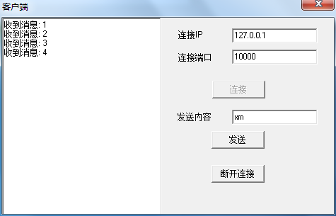
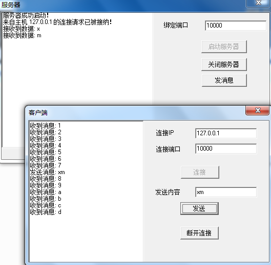
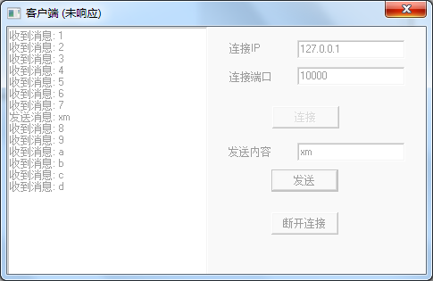
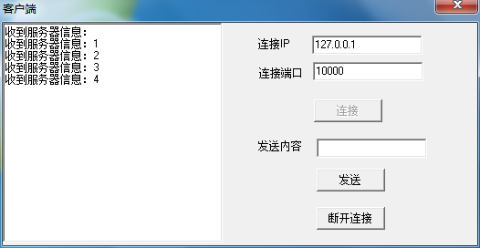
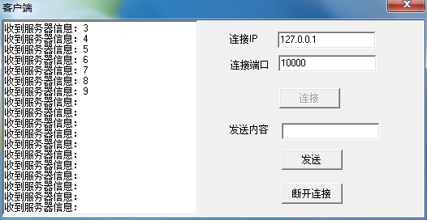
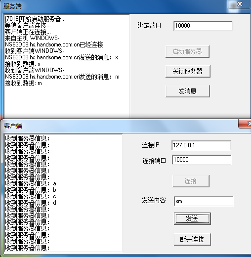
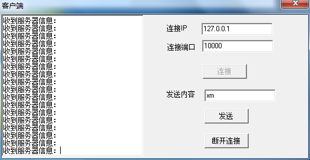
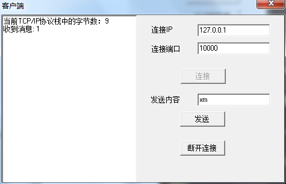
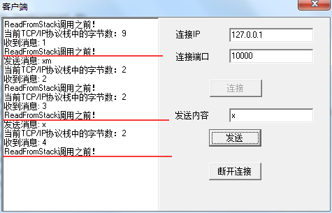

[《Delphi网络编程：使用IdTcpServer/IdTcpClient》](http://www.xumenger.com/windows-delphi-socket-20160929/)和[《Delphi网络编程：使用ServerSocket/ClientSocket》](http://www.xumenger.com/windows-delphi-socket-20161010/)分别展示了使用IdTcpServer/IdTcpClient 和ServerSocket/ClientSocket 进行网络编程时线程策略的区别

IdTcpServer/IdTcpClient 只能是支持阻塞模式编程

而ServerSocket/ClientSocket 既可以是非阻塞模式，也可以是阻塞模式的。ServerSocket 通过将ServerType 设置成stNonBlocking 或stThreadBlocking 来设置为非阻塞或阻塞；ClientSocket 通过将ClientType 设置成ctNonBlocking 或ctBlocking 来设置为非阻塞或阻塞。如果不设置，ServerSocket/ClientSocket 都默认是非阻塞的

因为他们都是基于TCP协议的，所以以下的组合都是可以通信的

   通信模式         	| ServerSocket 阻塞 | ServerSocket 非阻塞   | IdTcpServer 阻塞  
----------------    	| ------------------| --------------------- |---------------------
**ClientSocket 阻塞**   | 可通信  			| 可通信				| 可通信	
**ClientSocket 非阻塞** | 可通信   			| 可通信				| 可通信	
**IdTcpClient 阻塞**    | 可通信  			| 可通信				| 可通信	

到目前为止都只是停留在阻塞、非阻塞这两个概念术语上的“争论”，那么到底什么是阻塞、什么是非阻塞、阻塞和非阻塞到底在运行时有什么现象、阻塞和非阻塞到底适用的场景是什么样的……

## 阻塞和非阻塞的区别

以下的内容是直接从[《阻塞和非阻塞的区别》](http://www.cnblogs.com/orez88/articles/2513460.html)Copy 过来的

简单点说：阻塞就是干不完不准回来；非阻塞就是你先干，我现在看看有其他事没有，完了告诉我一声

我们拿最常用的send 和recv 两个函数来说吧......

比如你调用send 函数发送一定的Byte，在系统内部send 做的工作其实只是把数据传输（Copy）到TCP/IP 协议栈的输出缓冲区，它执行成功并不代表数据已经成功的发送出去了，如果TCP/IP 协议栈没有足够的可用缓冲区来保存你Copy 过来的数据的话...这时候就体现出阻塞和非阻塞的不同之处了：对于阻塞模式的socket send 函数将不返回直到系统缓冲区有足够的空间把你要发送的数据Copy 过去才返回；而对于非阻塞模式的socket 来说send 会立即返回WSAEWOULDDBLOCK 告诉调用者说：“发送操作被阻塞了！你想办法处理吧......”

对于recv 函数，同样道理，该函数的内部工作机制其实是在等待TCP/IP 协议栈的接收缓冲区通知它说：“嗨，你的数据来了！”。对于阻塞模式的socket 来说，如果TCP/IP 协议栈的接收缓冲区没有通知一个结果它就一直不返回，消耗着系统资源；对于非阻塞模式的socket 该函数会马上返回，然后告诉你：WSAEWOULDDBLOCK---“现在没有数据,回头在来看看”

>在进行网络编程时，我们常常见到同步、异步、阻塞和非阻塞四种调用方式，这些方式彼此概念并不好理解。下面是我对这些术语的理解

**同步**

所谓同步，就是在发送一个功能调用时，在没有得到结果之前，该调用就不返回。按照这个定义，其实绝大多数函数都是同步调用的（例如sin、isdigit等）。但一般而言，我们在说同步、异步的时候，特指那些需要其他部件协作或者需要一定时间完成的任务。最常见的例子就是SendMessage。该函数发送一个消息给某个窗口，在对方处理完消息之前，这个函数不返回。当对方处理完毕以后，该函数才把消息处理函数返回的LRESULT 值返回给调用者

**异步**

异步的概念和同步相对。当一个异步过程调用发出后，调用者不能立刻得到结果。实际处理这个调用的部件完成后，通过状态、通知和回调来通知调用者。以CAsyncSocket 类为例（注意，CSocket 从CAsyncSocket 派生，但其功能已经由异步转化为同步），当一个客户端通过调用Connect 函数发出一个连接请求后，调用者线程立刻可以向下运行。当连接真正建立起来以后，socket 底层会发送一个消息通知该对象

这里提到执行部件和调用者通过三种途径返回结果：状态、通知和回调。可以使用哪一种依赖于执行部件的实现，除非执行部件提供多种选择，否则不受调用者控制。如果执行部件用状态来通知，那么调用者就需要每隔一定时间检查一次，效率就很低（有些初学多线程编程的人，总喜欢用一个循环去检查某个变量的值，这其实是一种很严重的错误）。如果是使用通知的方式，效率则很高，因为执行部件几乎不需要额外的操作。至于回调函数，其实和通知没有太大区别

**阻塞**

阻塞调用是指调用结果返回之前，当前线程会被挂起。函数只有在得到结果之后才会返回。有人也许会把阻塞调用和同步调用等同起来，实际上它们是不同的。对于同步调用来说，很多时候当前线程还是激活的，只是从逻辑上当前函数没有返回而已

一个同步调用的例子：我们在CSocket 中调用Receive 函数，如果缓冲区中没有数据，这个函数就会一直等待，直到有数据才返回。而此时，当前线程还会继续处理各种各样的消息。如果主窗口和调用函数在同一个线程中，除非你在特殊的界面操作函数中调用，其实主界面还是应该可以刷新

一个阻塞调用的例子：socket 接收数据的另外一个函数recv 则是一个阻塞调用的例子。当socket 工作在阻塞模式的时候，如果没有数据的情况下调用该函数，则当前线程就会被挂起，直到有数据为止，完全无法响应其任何消息

**非阻塞**

非阻塞和阻塞的概念是相对应的，指在不能立刻得到结果之前，该函数不会阻塞当前线程，而是会立刻返回

**对象的阻塞模式和阻塞函数调用**

对象是否处于阻塞模式和函数是不是阻塞调用有很强的相关性，但并不是一一对应的。阻塞对象上可以有非阻塞的调用方式，我们可以通过一定的API 去轮询状态，在适当的时候调用阻塞函数，就可以避免阻塞。而对于非阻塞对象，调用特殊的函数也可以进入阻塞调用。函数select 就是这样的例子

更多关于阻塞和非阻塞的资料：

* [《怎样理解阻塞非阻塞与同步异步的区别？》](https://www.zhihu.com/question/19732473)
* [《什么是阻塞，非阻塞，同步，异步？》](https://www.zhihu.com/question/26393784)
* [《Indy TIdTCPClient伪非阻塞式的解决方案》](http://blog.csdn.net/qustdong/article/details/46728961)
* [《Socket 阻塞模式和非阻塞模式(转) 》](http://yjxandsp.blog.163.com/blog/static/163679712012411115039584/)

## 运行效果展示

之前的两篇文章中已经展示了阻塞模式客户端对接阻塞模式服务端、非阻塞模式客户端对接非阻塞模式服务端的运行情况。不过上面两篇展示的运行效果其实还基于这样一个事实：客户端、服务端都位于同一台机器上

本文将详细展示更多种配合情况下的通信运行效果。这样更有助于对于阻塞、非阻塞这个冷冰冰的概念有深入的感性上的认知！补充：经过测试，下面的各种配合情况在本地通信和跨机器通信的运行效果是相同的

以下各种场景的测试代码基于以上两篇文章中的测试代码并加以简单的修改

下面的8种场景对应测试程序的逻辑都是这样的：

* 服务端开启，并监听某个端口
* 客户端开启，连接到服务端
* 客户端成功连接到服务端后，服务端给客户端发送"123456789"
* 【点击按钮】客户端调用接口发送字符串："xm"
* 服务端先调用对应接口读取一个字符"x"，打印到界面，然后发送"ab"给客户端
* 服务端再调用对应接口读取一个字符"m"，打印到界面，然后发送"cd"给客户端
* 客户端接收服务端发来信息的模式是这样的：使用Timer，时间间隔是1s，每次读取一个字符并打印到Memo
* 服务端可以通过一个按钮主动给唯一的客户端发送"987654321"信息

点击[这里](../download/20161011/Example.rar)下载本文对应的所有测试程序源码。使用IdTcpServer开发的服务端仍然有线程安全问题，本例展示阻塞和非阻塞，所以暂未解决这个线程安全问题；另外在实现服务端程序的时候，也只考虑一个客户端连接的场景，不考虑多客户端同时连接一个服务端的场景

## 客户端(阻塞)<-->服务端(阻塞)

客户端使用IdTcpClient；服务端使用IdTcpServer

客户端连接上服务端后，开始逐个字节收到"123456789"信息



客户端给服务端发送"xm"信息，可以看到服务端和客户端的输出信息



然后客户端收到所有服务端发送来的内容后，客户端卡死了，其实就是在调用`TcpClient.ReadString(1)`时出现了阻塞，因为Timer的代码是在主线程中的，所以主线程阻塞了，所以看到客户端程序卡死，无法响应任何点击操作，这就是一个线程被阻塞以至于无法工作的实际效果



然后再点击服务端的发消息按钮给客户端发消息，发现客户端主线程收到消息了，从阻塞中出来了，所以客户端界面又可以正常响应点击等操作了


收完所有的消息后，客户端主线程又被阻塞了，界面又卡住了，所以如果使用阻塞模式的网络编程，因为会阻塞当前线程，所以还是建议使用多线程实现！


## 客户端(非阻塞)<-->服务端(非阻塞)

客户端使用ClientSocket，并将ServerType 设置成stNonBlocking；服务端使用ServerSocket，并将ClientType 设置成ctNonBlocking

客户端连接上服务端后，开始逐个字节收到"1234..."信息



收完所有的"123456789"之后，看到客户端还在运行，只是没有从TCP栈上读到任何信息而已，这就是非阻塞：函数不会阻塞当前线程，而是会立刻返回。同样到这里可以看到不管是阻塞还是非阻塞都是同步的，和异步并没有什么关系！并不是阻塞等价于同步、非阻塞等价于异步！



客户端给服务端发送"xm"信息，可以看到服务端和客户端的输出信息



继续运行，客户端依然正常运行，没有被阻塞。综上这就是非阻塞对应的运行现象！



## 客户端(非阻塞)<-->服务端(阻塞)

客户端使用ClientSocket，并将ClientType 设置成ctNonBlocking；服务端使用IdTcpServer

直观看起来的运行现象和**客户端(非阻塞)<--\>服务端(非阻塞)**一样的，简单的解释起来，就是客户端是单线程的，又是非阻塞，所以正常运行没有卡死，可以理解。而服务端因为是多线程的，就算线程卡死也不是主线程卡死，而是子线程卡死，所以从界面的层面还是看不出效果！

## 客户端(阻塞)<-->服务端(非阻塞)

客户端使用IdTcpClient；服务端使用ServerSocket，并将ServerType 设置成stNonBlocking

直观看起来的运行现象和**客户端(阻塞)<--\>服务端(阻塞)**一样的，服务端正常运行，客户端在收完所有的消息后又阻塞导致界面卡死，简单的解释起来，就是客户端是单线程的，又是阻塞，所以收完消息后再去尝试收消息，发现没有消息了就阻塞进行等待，可以理解！

## IdTcpClient的不同Read方法

上面的IndyClient的程序从TCP/IP协议栈中收取数据使用的方法是ReadString，下面在针对IdTcpClient的各种Read..方法进行讲解，对应的测试程序源码点击[这里](../download/20161011/IndyTest.rar)下载

首先就是ReadString，对应**客户端(阻塞)<--\>服务端(阻塞)**的客户端代码片段

```
procedure TForm1.tmr1Timer(Sender: TObject);
var
  cout: Integer;
  buf: array of Byte;
  str: string;
begin
  if isConnect then
  begin
    mmo1.Lines.Add('收到消息: ' + TcpClient.ReadString(1));
  end;
end;
```

每次读取一个字符，比如第一次连接成功后，服务端先给客户端发送"123456789"，客户端收到后先将其放到TCP/IP协议栈中，每次客户端调用ReadString(1)的时候，就从客户端的TCP/IP栈中读取一个字符，知道读完所有9个字符，再去调用ReadString的时候，发现TCP/IP协议栈没有数据了，此时就阻塞了当前线程，对应也就是我们在上面看到的运行效果

或者我们可以使用ReadBuffer方法，也可以获得和上面相同的效果

```
procedure TForm1.tmr1Timer(Sender: TObject);
var
  cout: Integer;
  buf: array of Byte;
  str: string;
begin
  if isConnect then
  begin
    //每次读取一个字符
    SetLength(buf, 1);
    TcpClient.ReadBuffer(buf[0], 1);
    SetLength(str, 1);
    Move(buf[0], str[1], 1);
    mmo1.Lines.Add('收到消息: ' + str);
  end;
end;
```

运行效果以及背后的原理和上面调用ReadString相同。其实ReadString的代码实现就是通过调用ReadBuffer：

```
function TIdTCPConnection.ReadString(const ABytes: Integer): string;
begin
  SetLength(result, ABytes);
  if ABytes > 0 then begin
    ReadBuffer(result[1], Length(result));
  end;
end;
```

接下来就讲一下之前因为自己第一次使用IdTcpClient编程并不知道其各个API的原理，“按照自己的错误理解”调用API导致运行的效果和预期的效果大相径庭

当时的详细代码就不在此列举了，大概就是这样的，不过并不是在主线程中实现的，而是专门开了一个线程去读取TCP/IP协议栈的信息

```
procedure TForm1.tmr1Timer(Sender: TObject);
var
  cout: Integer;
  buf: array of Byte;
  str: string;
begin
  if isConnect then
  begin
    cout := TcpClient.ReadFromStack;
    if cout <> 0 then
    begin
      mmo1.Lines.Add('当前TCP/IP协议栈中的字节数：' + IntToStr(cout));
      //每次读取一个字符
      SetLength(buf, 1);
      TcpClient.ReadBuffer(buf[0], 1);
      SetLength(str, 1);
      Move(buf[0], str[1], 1);
      mmo1.Lines.Add('收到消息: ' + str);
    end;
  end;
end;
```

当时的想法是先调用ReadFromStack获取当前协议栈中的字节数，如果大于0再去读取，否则就不读取。对应的运行现象是这样的：



正确的获取了当前TCP/IP协议栈的字节数是9，但调用ReadBuffer一次之后就阻塞了，剩余的8字节就读不出来了

首先说一点，因为IdTcpClient是阻塞的，所以完全没有必要去使用ReadFromStack去判断当前协议栈的字节是不是大于0，因为如果调用ReadBuffer是当前协议栈中的字节数不足时，会阻塞住，只有等到数据攒齐了之后才会继续向下运行

试着修改一下当前的客户端程序，还是先调用ReadFromStack，再调用ReadBuffer，不过是在子线程中调用，而不在主线程中调用，这里为了展示运行效果，也不考虑线程安全的问题，直接在子线程中更新界面了，当然这只是为了演示的目的，实际开发中一定要坚决拒绝。修改多线程的程序如下：

```
procedure TReceiveThread.Execute;
var
  cout: Integer;
  buf: array of Byte;
  str: string;
begin 
  while not Terminated do
  begin 
    if isConnect then
    begin
      Form1.mmo1.Lines.Add('ReadFromStack调用之前！');
      cout := TcpClient.ReadFromStack;
      if cout <> 0 then
      begin
        Form1.mmo1.Lines.Add('当前TCP/IP协议栈中的字节数：' + IntToStr(cout));
        //每次读取一个字符
        SetLength(buf, 1);
        TcpClient.ReadBuffer(buf[0], 1);
        SetLength(str, 1);
        Move(buf[0], str[1], 1);
        Form1.mmo1.Lines.Add('收到消息: ' + str);
      end;
    end;
    Sleep(1000);
  end;
end;
```

运行效果如下：



建立连接后，子线程开始运行时先从TCP/IP协议栈中获取一个字节，然后在调用ReadFromStack时阻塞住

点击发送按钮先发送"xm"，接着调用ReadFromStack从阻塞中出来，可以看到ReadFromStack的返回值是2，因为服务端收到"xm"后，先判断第一个是'x'则发回"ab"，所以这时候客户端ReadFromStack的返回值是2，接下来ReadBuffer读到'1'之后的字节'2'；之后服务端又判断是'm'发回"cd"，这时候ReadFromStack又从阻塞中出来，返回值2，再调用ReadBuffer读到'2'之后的字节'3'。然后继续在调用ReadFromStack的时候阻塞住

接下来客户端发送消息'x'，服务端收到'x'返回'ab'，所以客户端线程又从ReadFromStack的阻塞中出来，返回值是2，接下来ReadBuffer才能继续读取'3'之后的字节'4'

综上，每次都是在调用ReadFromStack的地方阻塞，导致后面的ReadBuffer虽然不阻塞，但只能一次一次的调用。而且看起来像是只要客户端给服务端发送了消息之后才能从ReadFromStack阻塞中出来，其实是因为客户端发送消息引发服务端给客户端返回消息，而正是因为服务端给客户端发来的消息导致客户端线程从ReadFromStack的阻塞中走出来！简而言之，客户端的ReadFromStack的阻塞与否是与服务端是否给其发送数据一一对应的！

就像前面说的，如果想使用IdTcpClient实现阻塞模式的网络编程，其实根本不需要先调用ReadFromStack来获取当前TCP/IP协议栈中的字节数，直接调用ReadBuffer或ReadString去读取就行了，反正ReadBuff和ReadString在读不到数据时自己就会阻塞等待数据，本身也是安全的！

## 简单总结

之前在[《Delphi网络编程：使用IdTcpServer/IdTcpClient》](http://www.xumenger.com/windows-delphi-socket-20160929/)中说阻塞并没有那么可怕，但是经过上面的一系列实验，发现阻塞相对于非阻塞其实还是不好，因为阻塞会导致线程卡死，在客户端还好，毕竟只有一个连接。但在服务端，会有好多的客户端并发连接，因为会有阻塞，所以需要为每个客户端分配一个专门的线程，而且绝大多数时间线程都是阻塞等待客户端的数据，所以这样明显会导致资源的浪费！

就目前的实践情况而言，感觉还是非阻塞在网络编程中更好一些，尤其是服务端编程！
