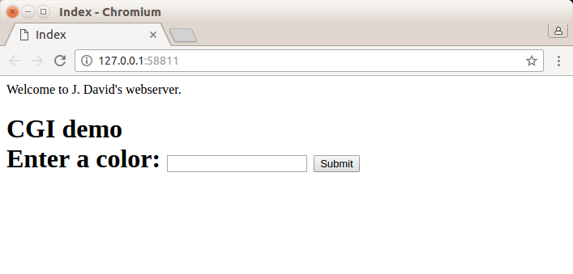

##背景知识

webbench 是由Lionbridge 公司开发的知名的网站压力测试工具。它能测试处于相同硬件上，不同服务的性能以及不同硬件上同一个服务的运行状况

webbench 的标准测试可以向我们展示服务器的两项内容：每秒响应请求数量和每秒传输数据量

webbench 不仅能够具有针对静态页面的测试能力，还能对动态页面(ASP、PHP、Java、CGI)进行测试的能力。还有就是它支持对含有SSL 的安全网站例如电子商务网站进行静态或动态的性能测试。webbench 最多可以模拟3 万个并发连接去测试网站的负载能力

tinyhttpd 是超轻量型的http server。下面将尝试部署一个服务器，并用webbench 测试其性能

##环境准备

操作系统使用Ubuntu 14 

webbench 下载地址[http://home.tiscali.cz/~cz210552/webbench.html](http://home.tiscali.cz/~cz210552/webbench.html)

tinyhttpd 下载地址[https://sourceforge.net/projects/tinyhttpd/?source=typ_redirect](https://sourceforge.net/projects/tinyhttpd/?source=typ_redirect)

执行以下命令分别对代码包进行解压

```
$ tar -xzvf webbench-1.5.tar.gz
$ tar -xzvf tinyhttpd-0.1.0.tar.gz
```

##编译安装tinyhttpd

将tinyhttpd 源码拷贝到/usr/local/src，在命令行操作的过程中可能会出现权限问题，所以cp 操作需要先切换到超级管理员

进入/usr/local/src/tinyhttpd-0.1.0/，查看下面的文件

```
root@perfect:/# cd /usr/local/src/tinyhttpd-0.1.0/
root@perfect:/usr/local/src/tinyhttpd-0.1.0# ls
htdocs  httpd.c  Makefile  README  simpleclient.c
```

可以看到tinyhttpd-0.1.0 文件夹下有MakeFile 文件，没有./configure 文件，说明可以直接执行make 命令编译。不过直接执行make 发现编译报错。编译之前需要参照httpd.c 中注释行的要求对httpd.c 和 makefile 文件进行修改

查看httpd.c 程序，可以看到其中的注释信息

```
root@perfect:/usr/local/src/tinyhttpd-0.1.0# cat httpd.c 
/* J. David's webserver */
/* This is a simple webserver.
 * Created November 1999 by J. David Blackstone.
 * CSE 4344 (Network concepts), Prof. Zeigler
 * University of Texas at Arlington
 */
/* This program compiles for Sparc Solaris 2.6.
 * To compile for Linux:
 *  1) Comment out the #include <pthread.h> line.
 *  2) Comment out the line that defines the variable newthread.
 *  3) Comment out the two lines that run pthread_create().
 *  4) Uncomment the line that runs accept_request().
 *  5) Remove -lsocket from the Makefile.
 */
```

因为tinyhttpd 本来是在solaris 上实现的，貌似在socket 和pthread 的实现上和一般的Linux 还是不一样的。程序开始的英文注释告诉我们不要使用pthread，大概是当时的Linux还没有是下面pthread这种POSIX标准吧！现在Linux已经支持pthread了，所以不需要按照英文注释那样改代码了。按照以下的说明进行修改：

httpd.c 的第33 行

```
void accept_request(int);

修改为

void *accept_request(void *);
```

httpd.c 的第51、52、53行

```
void accept_request(int client)
{
  char buf[1024];
  ...
}

修改为
void *accept_request(void* tclient)
{
  int client = *(int *)tclient;
  char buf[1024];
  ...
```

httpd.c 的第77 行

```
return;

修改为

return NULL;
```

httpd.c 的第129 行，添加

```
return NULL;
```

httpd.c 的第438 行

```
int namelen = sizeof(name);

修改为

socklen_t namelen = sizeof(name);
```

httpd.c 的第483 行

```
int client_name_len = sizeof(client_name);

修改为

socklen_t client_name_len = sizeof(client_name);
```

httpd.c 的第497 行修改为

```
if (pthread_create(&newthread , NULL, accept_request, (void*)&client_sock) != 0)
```

MakeFile中

```
gcc -W -Wall -lsocket -lpthread -o httpd httpd.c

修改为

gcc -W -Wall -o httpd httpd.c -lpthread
```

然后在执行make 命令，可以看到成功的编译出httpd 文件

httpd 是可执行文件，不需要在进行安装，直接执行`./httpd` 命令，就可以运行起一个webserver。然后在浏览器的地址栏输入`http://127.0.0.1:58811/`，回车，即可看到页面如下



##编译安装webbench

将tinyhttpd 源码拷贝到/usr/local/src，在命令行操作的过程中可能会出现权限问题，所以cp 操作需要先切换到超级管理员

进入/usr/local/src/webbench-1.5/，查看下面的文件

```
root@perfect:/# cd /usr/local/src/webbench-1.5/
root@perfect:/usr/local/src/webbench-1.5# ls
ChangeLog  COPYRIGHT  debian  Makefile  socket.c  webbench.1  webbench.c
```

接着直接执行make 命令编译，正常不会报错，查看生成了webbench 这个可执行文件，如果这个过程中出现编译报错，对应报错信息去搜索解决方法

执行make install 进行安装，有如下输出说明安装成功

```
root@perfect:/usr/local/src/webbench-1.5# make install
install -s webbench /usr/local/bin	
install -m 644 webbench.1 /usr/local/man/man1	
install -d /usr/local/share/doc/webbench
install -m 644 debian/copyright /usr/local/share/doc/webbench
install -m 644 debian/changelog /usr/local/share/doc/webbench
```

##用webbench测试tinyhttpd

首先在
