## 背景说明

参考[《VC6.0配置Proc开发环境：》](http://blog.csdn.net/qq387732471/article/details/6960881)，在自己的机器上搭建proc 的开发环境

版本说明

* 操作系统：Windows 7
* 开发工具：Visual C++ 6.0
* Oracle客户端：11.2.0.1
* Oracle服务端：11.2.0.4，部署在VmWare 虚拟机的Linux 内

以下的路径信息、环境变量信息根据每个人的实际环境而具体选择

## 开始搭建开发环境

**设置环境变量**

需要设置环境变量：USERID、ORACLE_HOME、MSVCDir

USERID配置的信息是连接到的Oracle服务器的用户名、密码、连接实例信息，格式是：`用户名/密码@Oracle实例`，比如`user/password@OracleDB`

ORACLE\_HOME配置的是Oracle安装在本地的路径，比如我的环境是：`D:\pro\app\xumeng13245\product\11.2.0\client_1`

MSVCDir配置的是VC的编译信息，比如我的环境是：`D:\pro\Microsoft Visual Studio\VC98`

**配置proc编译器路径**

【工具】-->【选项】

在可执行文件路径中添加proc 路径。其实就是设置环境变量Path。配置后在配置Proc*C++ 定制工具命令只需写proc，而不用写全路径

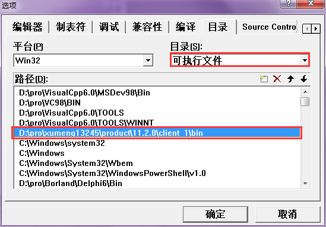

**添加proc 头文件**

按照下面截图添加两个路径：D:\PRO\XUMENG13245\PRODUCT\11.2.0\CLIENT_1\OCI\INCLUDE 和D:\PRO\XUMENG13245\PRODUCT\11.2.0\CLIENT_1\PRECOMP\PUBLIC

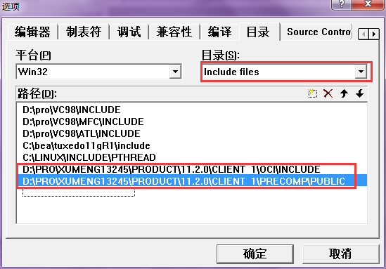

**添加库文件**

路径分别为：D:\PRO\XUMENG13245\PRODUCT\11.2.0\CLIENT_1\OCI\LIB 和D:\PRO\XUMENG13245\PRODUCT\11.2.0\CLIENT_1\LIB 和D:\PRO\XUMENG13245\PRODUCT\11.2.0\CLIENT_1\PRECOMP\LIB

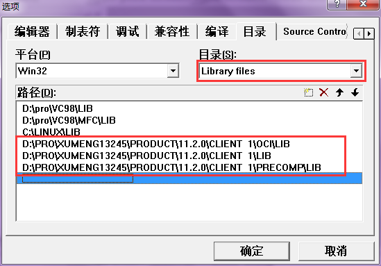

修改pcscfg.cfg 文件，该文件的目录是：D:\pro\xumeng13245\product\11.2.0\client_1\precomp\admin\pcscfg.cfg

修改成以下内容（可能需要管理员权限），具体的VC 路径、Oracle 路径与每个人的机器相关

```
define=(WIN32_LEAN_AND_MEAN)
parse=full
include="D:\pro\VC98\Include"
include="D:\pro\xumeng13245\product\11.2.0\client_1\oci\include"
include="D:\pro\xumeng13245\product\11.2.0\client_1\precomp\public"
```

到此为止基本环境配置完成

## 创建工程

**选择orasql11.lib文件**

在编译c文件之前，将orasql11.lib 添加到Source Files目录。可能工程默认选择的是orasql9.lib，那么就会在编译时报错

```
LINK : fatal error LNK1104: cannot open file "..\..\..\..\..\..\..\..\..\..\oracle\product\10.2.0\client_1\precomp\LIB\orasql9.lib"
执行 link.exe 时出错.
Creating browse info file...

procgetent.dll - 1 error(s), 0 warning(s)
```

orasql11.lib 对应在机器的目录：D:\pro\xumeng13245\product\11.2.0\client_1\precomp\LIB

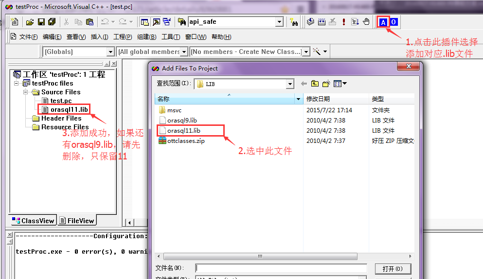

图中的VC6.0 插件是FileTool.exe，请自己搜索如何安装

**Proc*C++工具定制**

【工具】-->【定制】

proc.exe 所在路径是：D:\pro\xumeng13245\product\11.2.0\client_1\BIN\proc.exe

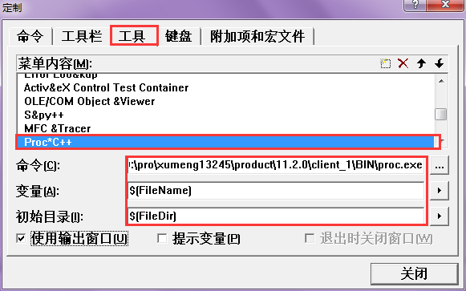

**配置编译选项**

新建文本文件，保存为后缀名为pc的文件，该文件就是proc的源文件，打开该文件使用刚才配置的Proc\*C++工具编译，得到和pc文件名你相同的C文件，再使用VC进行构建，就可以运行了

也可以设置为构建时自动编译，右键单击pc文件>>设置，设置如下：

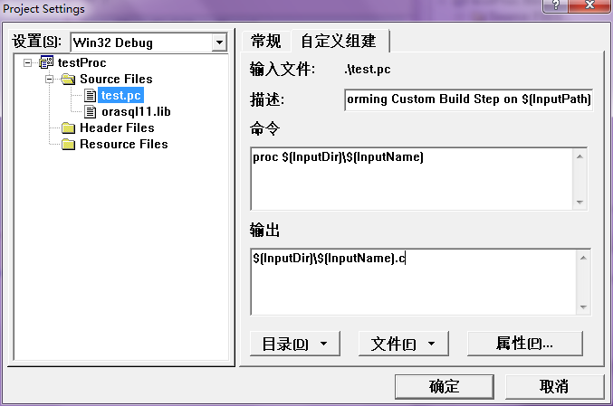

**pc文件源码如下**

点击[这里](../download/20161014/Example.zip)下载程序

```
#include <iostream.h>
#include <stdio.h>
#include <string.h>
#include <stdlib.h>
#include <sqlca.h>

void connect();
void sql();
void sql_error();

void main()
{
  exec sql whenever sqlerror do sql_error();
  connect();
  sql();
  sql();
  system("pause");
}


void connect()
{
  exec sql begin declare section;
  char username[20], password[20], server[20];
  exec sql end declare section;

  printf("输入用户名:");
  gets(username);
  printf("输入口令:");
  gets(password);
  printf("输入网络服务名:");
  gets(server);
  exec sql connect :username identified by :password using :server;
  if(0 == sqlca.sqlcode) 
  {
    printf ("用户%s成功地连接到了服务器%s上！\n" , username, server);   
    }
  else
  {
    printf("连接数据库失败，错误代码：%ld，错误信息：%s\n", sqlca.sqlcode, (char *)sqlca.sqlerrm.sqlerrmc);  
    system("pause");
    exit(0);
  }
}


void sql_error()
{
  printf("发生错误！\n");
}


void sql()
{
  exec sql begin declare section;
  char name[10];
  exec sql end declare section;
  exec sql select 'hello' into :name from dual;
  if (0 == sqlca.sqlcode)
  {
    printf("执行成功，输出结果：%s\n",name);
  }
  else
  {
    printf("错误代码：%ld，错误信息：%s\n", sqlca.sqlcode, (char *)sqlca.sqlerrm.sqlerrmc);  
  }
  exec sql commit work release;
}
```

* sqlcode：最近执行的SQL语句的状态。有以下值：
  * 0：正确执行，没有错误和例外
  * \>0：执行了语句，但出现了一个例外。如没有行找到
  * <0：未执行语句，出现错误
  * 在Oracle中，“记录没有找到”的错误码有两个：在ANSI模式下是100，在Oracle模式下是1403
* sqlerrm.sqlerrml：保存sqlerrm.sqlerrmc中信息文本的长度
* sqlerrm.sqlerrmc：保存与sqlcode相对应的错误信息文本
  * 最长不超过70个字符
  * 要获得超过70个字符的完整信息，需要使用sqlglm()函数

**编译程序**

经过上面的配置之后，使用快捷键Ctrl+F7 编译proc 文件，生成test.c 文件

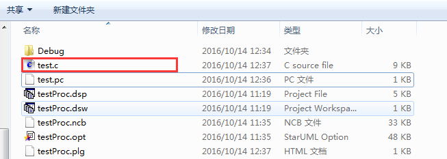

按F7，组建程序，发现编译报错

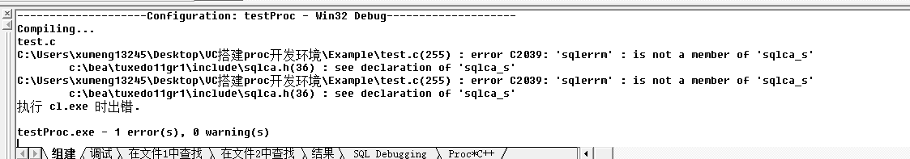

检查报错信息中的提示有：c:\bea\tuxedo11gr1\include\sqlca.h

检查头文件的配置如下，发现tuxedo 的配置顺序在Oracle 之上


我们在pc 程序的sql_error 方法中用到的sqlca 正常其数据类型的定义是在D:\pro\xumeng13245\product\11.2.0\client_1\precomp\public\sqlca.h 这个头文件中，但是c:\bea\tuxedo11gr1\include\sqlca.h 中也定义了这个数据类型，并且因为我在配置头文件的时候，顺序是Oracle 头文件放在tuxedo之后，就出现了类型冲突


修改成下面这样，tuxedo 头文件的配置放到最后，这样就不会和Oracle 定义的数据类型出现冲突了，就可以正确编译了


## 运行程序

上面的编译问题解决好了之后，在Debug目录下生成了可执行文件，运行该exe 文件

在 D:\pro\xumeng13245\product\11.2.0\client_1\network\admin\tnsnames.ora 中配置的一个数据库连接是这样的

```
MINE =
  (DESCRIPTION =
    (ADDRESS_LIST =
      (ADDRESS = (PROTOCOL = TCP)(HOST = 192.168.20.20)(PORT = 1521))
    )
    (CONNECT_DATA =
      (SERVICE_NAME = orcl)
    )
  )
```

HOST：Oracle服务器IP；PORT：Oracle服务器端口；SERVICE_NAME：数据库名称

首先输入错误的登录信息看看：登录报错

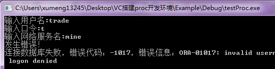

在试着使用正确的用户名、密码、服务名进行登录，登录成功，可以看到调用第一个sql() 函数执行成功，输出正确的结果；但是第二次执行sql() 的时候报错：ORA-01012：没有登录

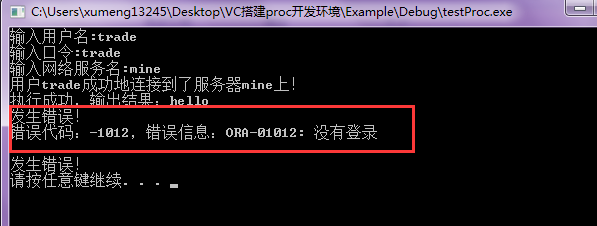

调试发现使用`exec sql connect :username identified by :password using :server;`登录的方式，登录之后执行第一条SQL 没有问题，但是接下来要想再执行新的SQL 必须重新再进行登录Oracle 服务器，对应main 函数修改为：

```
void main()
{
  exec sql whenever sqlerror do sql_error();
  connect();
  sql();

  //这种连接方式必须在执行sql之前再进行登录
  printf("\n重新登录\n");
  connect();
  sql();
  system("pause");
}
```

然后新的程序运行效果如下

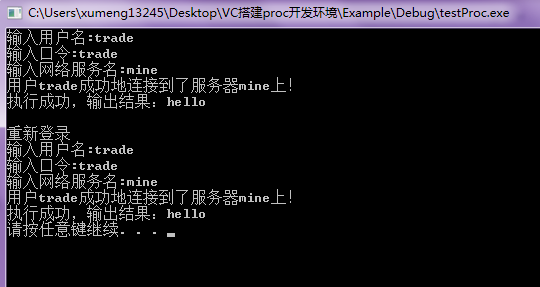

或者有什么保证登陆一次然后就可以多次执行SQL？

## Proc编译可能遇到的报错

上面编译exe 工程，在编译的过程中没有问题，但我们项目组中的一个使用proc 开发的dll 在编译的时候报错

**PCC-F-021104，无法连接到 Oracle**


解决方法是这样的，需要修改为下面的配置：新增或者修改USERID 变量为trade/trade@MINE，具体根据自己的环境做配置

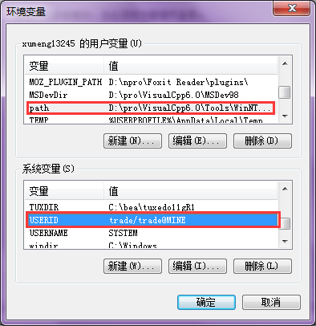

如果需要用到Tuxedo，如上图，添加TUXDIR 变量，值为C:\bea\tuxedo11gR1，同样具体值根据自己的环境做配置

**PCC-F-02107, 在 CODE = CPP 时, 不能指定 PARSE = FULL**

Proc 既可以编译得到C 源码，也可以编译得到 C++源码，上面的例子是Proc 编译得到C 源码，但是这个dll 工程是将Proc 编译得到C++ 源码，出现编译报错：PCC-F-02107, 在 CODE = CPP 时, 不能指定 PARSE = FULL

解决方法是修改D:\pro\xumeng13245\product\11.2.0\client_1\precomp\admin\pcscfg.cfg

```
define=(WIN32_LEAN_AND_MEAN)
parse=full
include="D:\pro\VC98\Include"
include="D:\pro\xumeng13245\product\11.2.0\client_1\oci\include"
include="D:\pro\xumeng13245\product\11.2.0\client_1\precomp\public"
```

修改为

```
define=(WIN32_LEAN_AND_MEAN)
include="D:\pro\VC98\Include"
include="D:\pro\xumeng13245\product\11.2.0\client_1\oci\include"
include="D:\pro\xumeng13245\product\11.2.0\client_1\precomp\public"
```

**orannzsbb11.dll丢失**

报错信息如下

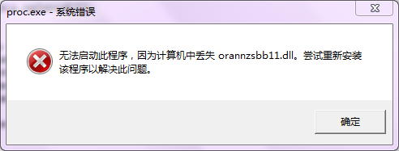

检查该DLL是在`D:\pro\app\xumeng13245\product\11.2.0\client_1`目录下，也就是Oracle的安装目录下

可能是在VC的配置时出现问题，需要【工具】-->【选项】-->【目录】下添加如下配置项

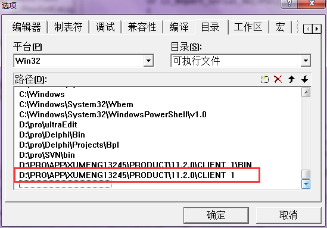

**PCC-F-NOERRFILE**

编译时报错信息如下

```
Performing Custom Build Step on .\test.pc
PCC-F-NOERRFILE, unable to open error message file, facility PR2
执行 c:\windows\system32\cmd.exe 时出错.
```

一般是因为ORACLE_HOME环境变量配置出错导致的，比如我在配置该环境变量时，应该配置为

```
D:\pro\app\xumeng13245\product\11.2.0\client_1
```

但我多加了一个`;`，配置为下面的值，导致出错

```
D:\pro\app\xumeng13245\product\11.2.0\client_1;
```