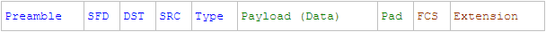

layout: post
title: 《协议森林》、《TCP 的那些事儿》笔记一
categories: 深入学习之网络原理
tags: 网络 TCP UDP IP HTTP 网络协议 二进制 路由器 交换机 以太网 WiFi 协议 规范 光纤 电缆 Socket
---

##参考文章

* [《协议森林》](http://www.cnblogs.com/vamei/archive/2012/12/05/2802811.html)系列文章
* [《TCP 的那些事儿（上）》](http://coolshell.cn/articles/11564.html)
* [《TCP 的那些事儿（下）》](http://coolshell.cn/articles/11609.html)

只是对这两个系列文章进行极其简单的整理，两个系列文章本身的知识结构组织、语言表达、网络知识的背景介绍都是很有特色、很出彩的！

我理解的协议：就是在“沟通双方”规定的一种统一的标准，保证甲方说的话，乙方可以理解，乙方给甲方的回答，甲方也可以理解，这样双方才可以互相理解

假如对于a这个字符，甲方理解其是1，乙方理解其是2，那么甲乙之间通过a字符进行沟通的时候，明显接收方理解的含义和发送方想要传达的含义是不同的，那么这样的通信明显是会出大问题的

>尽信书不如无书

##网络协议的层结构

**物理层**

光纤、电缆或电磁波等真实存在的物理媒介。比如用高电压表示1，低电压表示0，这样就可以在物理层传输0/1二进制码了

**连接层**

以帧为单位传输，帧就是一段有限的0/1序列。以太网、WiFi是目前最常见的连接层协议

Mac地址是连接层的一个概念。集线器、交换机是作用于连接层的网络设备

**网络层**

如何让WiFi上的一台计算机和一台网上的一台计算机进行通信呢？需要一个中间人，这个中间人要能从物理层上在两个网络中的接收和发送0/1序列，能同时理解以太网和WiFI的帧格式。路由器就是为此产生的“翻译”，一个路由器有多个网卡，比如几个以太网卡、几个无线网卡

其通信流程是这样的：WiFi上的计算机1 -> 路由WiFi接口 -> 路由以太网接口 -> 以太网上的计算机2

网络层的协议是IP协议

**传输层**

以上的三层协议是让不同的计算机之间可以通信，但是实际的通信的是以进程为单位的，计算机A的进程a和计算机B的进程b进行通信

在整个网络中，网络层使用IP地址标识计算机、传输层使用端口识别进程

网络层的两个主要协议是TCP和UDP

**应用层**

通过上面的几层协议，已经可以在任意两个进程之间进行通信。比如HTTP就是典型的应用层协议

##重要协议的包结构

每一种网络协议都有对应的报文结构规范，发送方在对应的网络层按照对应协议的报文格式规范进行打包重要信息，接收方按照对应协议的报文格式进行解包得到重要信息，就像本文前面所提到的那个简单的a是1还是2的例子，必须发送方和应答方对协议格式有完全一致的理解，才能正确进行“沟通”，而不至于出现鸡同鸭讲的尴尬

理解网络协议的包结构规范是后续能正确理解网络协议工作原理的绝对前提条件！

**以太网协议**



说一下其中的最初7个byte，被称为序言（Preamble）。它的每个byte都是0xAA（这里是十六进制，也就是二进制的10101010）。通常，我们都会预定好以一定的频率发送0/1序列（比如每秒10bit）。如果接收设备以其他频率接收（比如每秒5bit），那么就会错漏掉应该接收的0/1信息。但是，由于网卡的不同，发送方和接收方即使预订的频率相同，两者也可能由于物理原因发生偏差。这就好像两个人约好的10点见，结果一个人表快，一个人表慢一样。序言是为了让接收设备调整接收频率，以便与发送设备的频率一致，这个过程就叫做时钟复原(recover the clock)

**IP协议**


**UDP协议**


**TCP协议**


**HTTP协议**

HTTP是一种很简单的应用层协议：一求一答，它的流程是这样的：

* 用户在浏览器发起请求（POST、GET、…）
* 客户端将请求信息打包成HTTP格式，发送给服务器
* 服务器收到请求，解析HTTP请求报文
* 服务器针对该请求进行应答，按照HTTP格式打包应答，发送给客户端
* 客户端收到应答，解析（HTML、CSS、JS），展示给用户

HTTP请求报文


HTTP应答报文


##IP协议运行原理

网络层是实现互联网的最重要的一层。正是在网络层面上，各个局域网根据IP协议互相连接，最终构成覆盖全球的Internet。更高层的协议，无论是TCP还是UDP都必须通过网络层的IP数据包来传递信息。操作系统也会提供该层的socket，从而允许用户直接操作IP包

**子网掩码**

通过子网掩码来将IP分为两个部分，第一部分来区分局域网，第二部分来区分该局域网内的主机

比如子网掩码255.0.0.0（也就是前8个1，后24个0）表示前8位用于区分局域网，后24位用于区分主机

**网卡**

IP地址识别的是网卡，网卡是计算机的一个硬件，它在接收到网络信息后，将信息交给计算机（处理器/内存），当计算机需要发送信息的时候，也要通过网卡发送

一台计算机可以有不只一个网卡，比如笔记本就有一个以太网卡和一个WiFi网卡。计算机在接收或者发送信息的时候，要先决定想要通过哪个网卡

**路由器**

路由器实际上就是一台配置有多个网卡的专用计算机，它让网卡接入到不同的网络中。比如下图中位于中间位置的路由器有两个网卡，地址分别是199.165.145.17和199.165.146.3。它们分别接入到两个网络：199.165.145和199.165.146


IP包的传输要通过路由器的接力。每一个主机和路由中都存有一个路由表。路由表根据目的地址的IP地址，规定了等待发送的IP包所应该走的路线。比如从主机145.17生成发送到146.21的IP包：铺开信纸，写好信的开头（剩下数据部分可以是TCP包，可以是UDP包，也可以是任意乱写的字，我们暂时不关心），注明目的地IP地址（199.165.146.21）和发出地IP地址（199.165.145.17）。主机145.17随后参照自己的routing table，里面有三行记录

```
145.17 routing table （Genmask为子网掩码，Iface用于说明使用哪个网卡接口）

Destination        Gateway             Genmask             Iface

199.165.145.0      0.0.0.0             255.255.255.0       eth0

0.0.0.0            199.165.145.17      0.0.0.0             eth0
```

第一行表示，如果IP目的地是199.165.145.0这个网络的主机，那么只需要自己在eth0上的网卡直接传送（“本地社区”：直接送达），不需要前往router（Gateway 0.0.0.0 = “本地送信”）

第二行表示所有不符合第一行的IP目的地，都应该送往Gateway 199.165.145.17，也就是中间router接入在eth0的网卡IP地址

我们的IP包目的地为199.165.146.21，不符合第一行，所以按照第二行，发送到中间的router。主机145.17会将IP包放入帧的payload，并在帧的头部写上199.165.145.17对应的MAC地址，然后在局域网中发送 

中间的router在收到IP包之后（实际上是收到以太协议的帧，然后从帧中的payload读取IP包），提取目的地IP地址，然后对照自己的routing table，和上面的处理相同：如果目的地址在当前路由器的路由表中，则直接发送，否则继续转发到下一个路由器

IP包如此接力，达到更远的主机。IP包从主机出发，根据沿途路由器的routing table指导，在router间接力。IP包最终到达某个router，这个router与目标主机位于一个局域网中，可以直接建立连接层的通信。最后，IP包被送到目标主机。这样一个过程叫做routing（我们就叫IP包接力好了，路由这个词实在是混合了太多的意思）。整个过程中，IP包不断被主机和路由封装入帧（信封）并拆开，然后借助连接层，在局域网的各个NIC之间传送帧。整个过程中，我们的IP包的内容保持完整，没有发生变化。最终的效果是一个IP包从一个主机传送到另一个主机。利用IP包，我们不需要去操心底层（比如连接层）发生了什么

**扩展知识**

* ARP协议用于查询IP和Mac地址的对应关系
* RIP协议可以生成自治系统内部合理的routing table
* BGP协议可以生成自治系统外部的routing table
* IPv4存在地址耗尽的危机，但是IPv6又有无法兼容IPv4的尴尬
* IP协议认为自己所处的环境是不可靠的：注入路由器坏掉等异常，所以IP只能提供“我尽力”的传输，并不能保证一定能发送给目标主机
* IP协议包头部有一个16位的Header Checksum，用于存储校验和，尽可能保证IP传输过程中的数据一致性，具体的计算方法不在此列举
* ICMP协议是介于网络层和传输层的协议，主要功能是传输网络诊断信息，是IP协议的排错帮手
* [《转windows route 命令详解》](http://blog.chinaunix.net/uid-66396-id-2688898.html)
* [《linux route命令的使用详解》](http://www.cnblogs.com/snake-hand/p/3143041.html)
* [《TCP/IP详解 卷1：协议》](https://book.douban.com/subject/1088054/)

##简单说一下UDP

就像《协议森林》中所讲的，UDP传输与IP传输非常类似，可以将UDP协议看作IP协议暴露在传输层的一个接口

那为什么不直接使用IP协议，而要额外增加一个UDP协议呢？一个重要的原因就是IP协议中没有端口的概念，IP协议进行的是IP地址到IP地址的传输，这意味着两台计算机之间的对话。但每台计算机中需要有多个通信通道，并将多个通信通道分配给不同的进程使用。一个端口就代表了这样的一个通信通道

UDP是传输层（transport layer）协议，这意味着UDP的数据包需要经过IP协议的封装（encapsulation），然后通过IP协议传输到目的电脑。随后UDP包在目的电脑拆封，并将信息送到相应端口的缓存中

##端口与Socket

端口（Port）是伴随传输层诞生的概念，它可以将网络层的IP通信分送到各个通信通道。UDP协议和TCP协议尽管在工作方式上有很大的不同，但它们都建立了从一个端口到另一个端口的通信

Socket是操作系统提供的一个编程接口，它用来代表某个网络通信。应用程序通过socket来调用系统内核分别处理网络协议的模块，而这些内核模块会负责具体的网络协议的实施。这样，我们可以让内核来解决网络协议的细节，而我们只需要提供所要传输的内容即可，内核会帮我们控制格式，并进一步向底层封装。因此，在实际应用中，我们并不需要知道具体怎么构成一个UDP包，而只需要提供相关信息（比如IP地址，比如端口号，比如所要传输的信息），操作系统内核会在传输之前会根据我们提供的相关信息构成一个合格的UDP包（以及下层的包和帧）

