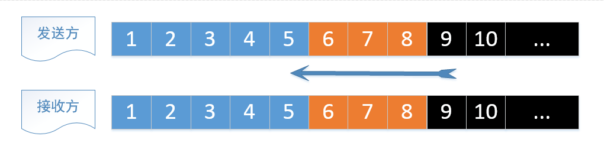

上一篇是针对网络层次结构、IP协议、UDP协议、Socket的学习笔记，本文整理TCP的学习笔记

所有的网络协议中最复杂的应该就是TCP了，TCP也几乎包含了网络知识的绝大部分，比如重传机制、滑窗机制、TCP的连接、TCP连接的双向性、三次握手、四次挥手、堵塞控制等等，但这里仅仅只是谈谈其皮毛而已，所以只能叫做“初识”

本文仍然是结合[《协议森林》](http://www.cnblogs.com/vamei/archive/2012/12/05/2802811.html)、[《TCP 的那些事儿》](http://coolshell.cn/articles/11564.html)系列文章，展示一下TCP的产生背景、用于解决什么样的实际问题、各个特性被设计出来的原因等等，要想学习一个知识点，最好是从其产生背景、用于解决什么问题、如何解决各个具体问题的等各个方面进行了解和学习。真的不是简单的知道TCP有什么三次握手、什么TCP可靠而UDP不可靠等这种虚无缥缈，或者不知为什么的纯粹死记硬背是意义不大的

**IP报文格式**

**UDP报文格式**

**TCP报文格式**

##TCP“流”通信

IP协议是不保证发送的包的达到顺序的，后发出的数据包可能早到

UDP传输与IP传输非常类似，可以将UDP协议看作IP协议暴露在传输层的一个接口，UDP存在的意义只是基于这样的原因：IP只能实现计算机到计算机之间的通信，但无法实现进程到进程的通信，UDP通过在报文头中提供端口字段，保证可以实现计算机A中进程a和计算机B中进程b之间的通信

比如有一个大文件要从本地发送到远程主机，所以采用UDP的传输方式，需要等到所有数据到达后，进行排序，才能组装成大的文件。很显然不得不使用大量的计算机资源来存储已经达到的数据，直到所有数据都到达，才能开始进行处理

而TCP协议则实现了“流”形式的通信，确保了数据的到达顺序和文本流顺序相符，同样处理上面接收大文件的要求，因为“流”方式可以保证顺序到达，所以可以一边接收一边将流存入文件系统，这样等到“流”接收完了，硬盘的写入操作也就完成了

“流”的要点是次序，但因为TCP是基于IP的，最终数据传输还是以IP数据包为单位进行的，如果一个文本流很长的话，不可能将整个文本流放入到一个IP数据包中，那样可能会超过MTU，所以TCP协议封装到IP包的不是整个文本流，而是TCP协议所规定的片段

TCP片段的头部会存有该片段的序号（Sequence Number），接收的计算机就可以知道接收到的片段在原文本流中的顺序了，也可以知道自己下一步需要接收哪个片段以形成流。比如已经接收到片段1、2、3，那么接收主机就开始期待片段4。如果接收到不符合顺序的数据包（比如片段8），接收方的TCP模块就可以拒绝接收，从而保证呈现给接收主机的信息是符合次序的“流”

##TCP同步发送和重新发送

片段编号这个初步的想法并不能解决所有问题，因为IP是不可靠的，所以IP数据包可能在传输过程中发送错误或丢失。另一方面，如果按照上面的描述，因为IP不保证顺序，所以假如确实是非顺序达到，那么岂不是会被丢掉？所以只靠序号这一个手段是不能彻底解决问题的！

**序号可以解决了顺序性问题，但没法处理丢包等异常场景**，所以需要再找到其他方法去弥补使用序号的缺陷

TCP解决这个问题的方法是：在每收到一个正确的、符合次序的片段后，就像发生方（也就是连接的另一端）发生一个特殊的TCP片段，用来告知（ACK，acknowledge）发生方：我已经收到那个片段了。这个特殊的TCP片段叫做ACK回复。如果一个片段序号为L，对应ACK回复有回复好L+1，也就是接收方期待接收的下一个发送片段的序号。如果发送方在一定时间等待后还是没收到ACK回复，那么它推断之前发送的片段一定发生了异常，发送方会重复发送那个异常的片段，等待ACK回复，如果还没有收到，那么再重复发送原片段......直到收到该片段对应的ACK回复（回复号是L+1的ACK）

当然也可能是ACK发送回来的路上出了异常，发送方也以为是发送出了问题，也是会重新发送，而接收方就会重复收到，接收方收到重复的信息，基本可以推测出来是ACK丢失了，此时接收方会重新发送ACK回复

发送方保持：发送-->等待ACK-->发送-->等待ACK...的单线工作方式

##TCP滑窗机制

以上通过ACK同步发送和出现异常时重新发送可以“完美”的解决丢包或网络包异常的问题，提升了TCP通信的可靠性，但明显这样一求一答的方式，牺牲了网络通信的效率。在等待ACK的时间段内，网络都处于闲置（idle）状态

**ACK和重复发送解决丢包和网络包异常的问题，但是又产生了网络通信效率下降的问题**，所以就希望能有一个方法可以同时发送多个片段以提升网络通信效率

为了可以在每次发送多个片段的情况下还可以保证顺序，在接收端需要利用缓存来存储收到的片段，然后进行排序。如果每次发送的片段很少，那么网络的利用率还是不够高；但如果每次发送很多的片段，可有一个乱序片段是在太过提前了，该片段为了等待其它片段来了再做排序，那就会长时间占用缓存

所以又有一个折中的方法来解决该问题：利用缓存保留一些“不那么乱”的片段，期望能在一段时间内补充上之前的片段（暂不处理，但发生相应的ACK）；对于“乱的比较厉害”的片段，则将它们拒绝（不处理，也不发送对应ACK）

滑窗机制可同时应用于接收方和发送方，以解决以上问题。发送方和接收方各有一个滑窗。当片段位于滑窗中时，表示TCP正在处理该片段；滑窗中可以有多个片段，也就是可以同时处理多个片段。滑窗越大同时处理的片段数目也多，当然计算机也必须分配出更多的缓存供滑窗使用

假设有一个可容纳三个片段的滑窗，从左向右排列（1、2、3、4、5、6、7、8、9、...）

对于发送方来说：滑窗左侧为已发送并已ACK过的片段序列；滑窗右侧为尚未发送的片段序列；滑窗中的片段（比如6、7、8）已被发送出去并等待ACK。如果收到片段6的ACK，滑窗将向右移动，这样新的片段9将从右侧进入滑窗，被发送并进入等待状态；在接收到片段6的ACK之前，滑窗不会移动，即使先收到了7、8的ACK。这样就可以保证滑窗左侧的序列是已经发送的、且收到ACK的、符合顺序的片段序列

对于接收方来说：滑窗的左侧是已经正确收到并ACK回复过的片段（比如1、2、3、4、5），也就是正确接收到的文本流（明显符合顺序性要求）。滑窗中是期望接收的片段（6、7、8），同样，如果7、8先到达，那么滑窗不会移动；如果6先到达，那么滑窗会向右移动，以等待接收新的片段。如果出现滑窗之外的片段，比如10，那么滑窗将拒绝接收

>在实际中TCP的滑窗不是固定大小的，TCP协议有实时调整滑窗大小的算法，以实现最优效率

##TCP连接

TCP连接是双向的，上面文字所描述的都是单向的情景。双向连接实际上就是建立两个方向的TCP传输，所以直接将上面讲的单向扩展成双向的情景即可。这时候，连接的每一方都需要两个滑窗，分别处理发送的文本流和接收的文本流。由于连接的双向性，也就需要为两个方向的文本流编号。这两个文本流的编号相互独立。为文本流分段和编号由发送方来处理，回复ACK则由接收的一方进行

在深入TCP连接之前，需要对TCP片段的头部格式有一些了解，TCP片段分为头部和数据，数据部分为TCP真正传输的文本流数据

* 一个TCP头部需要包含出发端口（source port）和目的地端口（destination port），这些与IP头中的两个IP地址共同确定了连接
* 每个TCP短短都有序号（sequence number），这些序号最终将数据的文本片段整理成为文本流
* ACK是一位（bit），只有ACK位设定时，回复号（acknowledgement number）才有效。ACK回复号说明了接收方期待接收的下一个片段，所以回复号为最后接收到的片段序号加1
* ACK后面是SYN和FIN，它们也各占据一位

三次握手建立连接

四次挥手断开连接：中断连接端可以是Client端，也可以是Server端

TCP网络传输和Socket接口的对应关系

TCP网络传输和TCP状态机的对应关系

