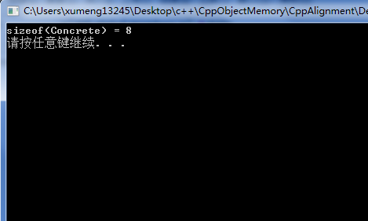
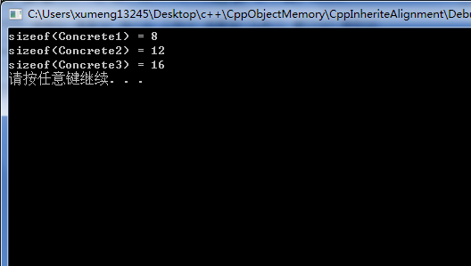
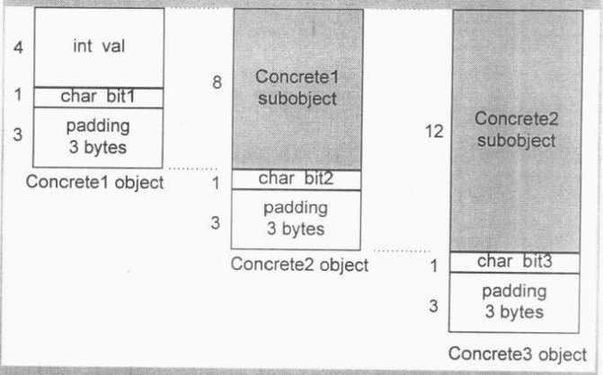
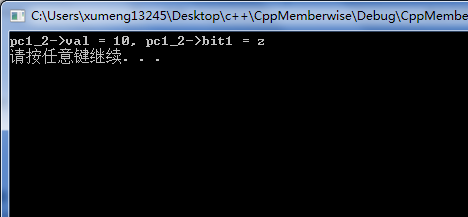
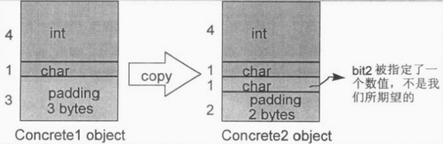

之前有在文章[《Delphi配合VC++开发：结构体对齐机制》](http://www.xumenger.com/delphi-vc-dll-2-20160903/)中详细总结了C/C++中结构体struct的内存对齐机制，以及Delphi中record的内存对齐机制，其实在C++的class中也是有内存对齐机制的，在之前的文章[《C++对象内存模型：编译器对C++的影响》](http://www.xumenger.com/cpp-object-memory-02-20161105/)中也有简单的讲到

以下的例子也是《深度探索C++对象模型》中一个典型的例子

##先看这个简单的类

源码点击[这里](../download/20161105/CppAlignment.zip)可以下载

```
#include<stdio.h>
#include<stdlib.h>
#include<iostream>

using namespace std;

class Concrete{
	public:
		int val;
		char bit1;
		char bit2;
		char bit3;
};

int main()
{
	cout << "sizeof(Concrete) = " << sizeof(Concrete) << endl;

	system("pause");
	return 0;
}
```

运行效果如下



分析其内存分布很简单：

* int val占4byte
* bit1、bit2、bit3各占1byte
* 因为内存对齐机制，需要再多1byte
* 正好总共8byte，到此和struct的内存分布是一样的

##将其分解成三层继承模式

源码点击[这里](../download/20161105/CppInheriteAlignment.zip)可以下载

```
#include<stdio.h>
#include<stdlib.h>
#include<iostream>

using namespace std;

class Concrete1{
	public:
		int val;
		char bit1;
};

class Concrete2 : public Concrete1{
	public:
		char bit2;
};

class Concrete3 : public Concrete2{
	public:
		char bit3;
};

int main()
{
	cout << "sizeof(Concrete1) = " << sizeof(Concrete1) << endl;
	cout << "sizeof(Concrete2) = " << sizeof(Concrete2) << endl;
	cout << "sizeof(Concrete3) = " << sizeof(Concrete3) << endl;

	system("pause");
	return 0;
}
```

运行效果如下



Concrete1的内存大小为8byte，很好解释：

* int val占4byte
* bit1占1byte
* 因为内存对齐机制，需要再多3byte
* 正好总共8byte

但为什么sizeof(Concrete2)为12byte、sizeof(Concrete3)为16byte？不也应该是8byte吗？

首先上面解释了Concrete1的内存大小是8byte，到目前为止没有什么需要抱怨的，但这种典型的布局会导致轻率的程序员犯下错误。Concrete2加了唯一一个nonstatic data member，即bit2，数据类型是char。轻率的程序员（我）以为它会和Concrete1捆绑在一起，占用原来用来填补控件的1byte，于是Conccret2 object的大小为8byte，其中2byte用于填充空间

然而Concrete2的bit2实际上却是被放在填补空间所用的3byte之后的，于是其大小变成12byte，而不是8byte，其中6byte浪费在填补空间上

同样的道理，Concrete3 object的大小是16byte，其中9byte用于填补空间！

下图可以说明Concrete1、Concrete2、Concrete3的对象布局：



##继续以Concrete来做实验

声明一组指针

```
Concrete2 *pc2;
Concrete1 *pc1_1, *pc1_2;
```

其中pc1_1、pc1_2两者都可以指向前述三种class object。下面的操作

```
*pc1_1 = *pc1_2;
```

应该执行一个默认的“memberwise”复制操作（复制一个个的member），对象是被指之以object的Concrete1的那一部分。如果pc1_1实际指向一个Concrete2 object或Concrete3 object，则上述操作应该将复制内存指定给其Concrete1 subobject

比如[例程](../download/20161105/CppMemberwise.zip)

```
#include<stdio.h>
#include<stdlib.h>
#include<iostream>

using namespace std;

class Concrete1{
	public:
		Concrete1(int _v, char _b1){ val = _v; bit1 = _b1; }
		int val;
		char bit1;
};

class Concrete2 : public Concrete1{
	public:
		Concrete2(int _v, char _b1, char _b2) : Concrete1(_v, _b1){ bit2 = _b2; }
		char bit2;
};

class Concrete3 : public Concrete2{
	public:
		Concrete3(int _v, char _b1, char _b2, char _b3) : Concrete2(_v, _b1, _b2){ bit3 = _b3; }
		char bit3;
};

int main()
{
	Concrete2 *pc2;
	Concrete1 *pc1_1, *pc1_2;

	pc2 = new Concrete2(10, 'z', 'y');
	pc1_1 = pc2;	//另pc1_1指向Concrete2对象
	
	pc1_2 = new Concrete2(100, 'a', 'b');
	*pc1_2 = *pc1_1;

	//derived class subobject被覆盖了
	//于是其bit2 member现在有了一个并非预期的值，是'b'而不是'y'
	//目前因为pc1_2是Concrete1类型指针，所以语法上暂时无法显示其指向的Concrete2的bit2成员值
	//但其在内存中确实还是'b'，而没有将pc2指向的内存中的bit2('y')拷贝给pc1_2指向的内存中的bit2
	cout << "pc1_2->val = " << pc1_2->val << ", pc1_2->bit1 = " << pc1_2->bit1 << endl;	

	system("pause");
	return 0;
}
```

运行效果为



为什么pc1\_1指向Concrete2 object，pc1\_2也指向Concrete2 object，但通过\*pc1\_2 = \*pc1\_1;赋值后，pc1\_2指向的Concrete2 object的val、bit1成员变量都按照预期是从pc1\_1指向的Concrete2 object的val、bit1拷贝过来的，但为什么bit2还是保持原值，没有拷贝过来？

我的理解是，虽然pc1\_1和pc1\_2确实是指向Concrete2 object，但它们都是Concrete1类型的指针，通过\*pc1\_2 = \*pc1\_1;赋值的时候，编译器认为是两个Concrete1类型的在赋值，而Concrete1类没有bit2成员，所以最终bit2成员就没有赋值！

这个只是我个人通俗的解释，以下是《深度探索C++对象模型》中的解释

如果“base class subobject在derived class中的原样性”受到破坏，也就是说，编译器把base class object原本的填补空间让出来给derived class member使用，像这样


那么当发生Concrete1 subobject的复制操作时，就会破坏Concrete2 member

