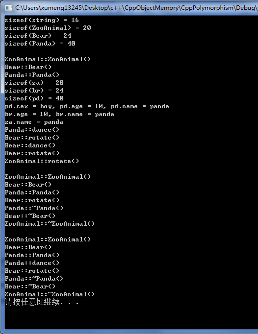
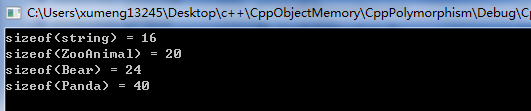
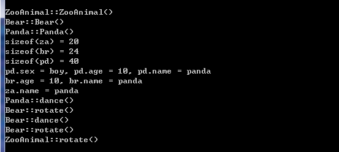
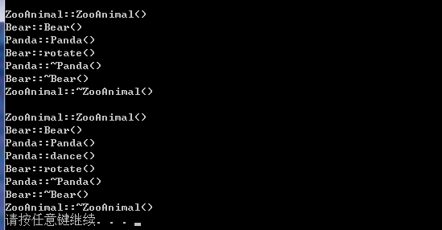

本文对应的测试环境依然是64位Windwos 7、Visual C++ 6.0

下面测试的是C++的继承、多态，并通过该测试程序展示这部分特性下的对象模型。点击[这里](../download/20161105/CppPolymorphism.zip)下载程序源码

```
#include<stdio.h>
#include<stdlib.h>
#include<iostream>
#include<string>

using namespace std;

class ZooAnimal{
	public:
		ZooAnimal( string nameval ){
			name = nameval;
			cout << "ZooAnimal::ZooAnimal()" << endl;
		}
		virtual ~ZooAnimal(){
			cout << "ZooAnimal::~ZooAnimal()" << endl;
		}
		virtual void rotate(){
			cout << "ZooAnimal::rotate()" << endl;
		}
		string showname(){
			return name;
		}
	protected:
		string name;
};

class Bear : public ZooAnimal{
	public:
		Bear( int ageval, string nameval ) : ZooAnimal( nameval ){
			age = ageval;
			cout << "Bear::Bear()" << endl;
		}
		~Bear(){
			cout << "Bear::~Bear()" << endl;
		}
		void rotate(){
			cout << "Bear::rotate()" << endl;
		}
		virtual void dance(){
			cout << "Bear::dance()" << endl;
		}
		int showage(){
			return age;
		}
	protected:
		int age;
};

class Panda : public Bear{
	public:
		Panda( string sexval, int ageval, string nameval ) : Bear(ageval, nameval){
			sex = sexval;
			cout << "Panda::Panda()" << endl;
		}
		~Panda(){
			cout << "Panda::~Panda()"  << endl;
		}
		void dance(){
			cout << "Panda::dance()" << endl;
		}
		string showsex(){
			return sex;
		}
	protected:
		string sex;
};


int main()
{
	cout << "sizeof(string) = " << sizeof(string) << endl;
	cout << "sizeof(ZooAnimal) = " << sizeof(ZooAnimal) << endl;
	cout << "sizeof(Bear) = " << sizeof(Bear) << endl;
	cout << "sizeof(Panda) = " << sizeof(Panda) << endl << endl;

	Panda pd("boy", 10, "panda");
	Bear br = pd;
	ZooAnimal za = br;
	cout << "sizeof(za) = " << sizeof(za) << endl;
	cout << "sizeof(br) = " << sizeof(br) << endl;
	cout << "sizeof(pd) = " << sizeof(pd) << endl;
	cout << "pd.sex = " << pd.showsex() << ", pd.age = " << pd.showage() << ", pd.name = " << pd.showname() << endl;
	cout << "br.age = " << br.showage() << ", br.name = " << br.showname() << endl;
	cout << "za.name = " << za.showname() << endl;
	pd.dance();			
	pd.rotate();	
	br.dance();		//虽然br通过pd赋值，但这里调用的是Bear的dance而不是Panda的dance
	br.rotate();	
	za.rotate();	//虽然za也是通过pd赋值，但这里调用的是ZooAnimal的rotate而不是Panda的rotate
	cout << endl;

	//这就是面向对象的多态，虽然_za是ZooAnimal指针，但是通过Panda动态创建
	ZooAnimal *_za = new Panda("girl", 11, "panda");
	_za->rotate();	//因为Panda没有实现rotate，Panda继承自Bear，所以Bear的rotate就是Panda的rotate
					//这里调用的是Bear的rotate(也就是Panda的rotate），而不是ZooAnimal的rotate
	delete _za;
	cout << endl;
	
	//这里也是面向对象的多态，虽然_br是Bear指针，但是通过Panda动态创建
	Bear *_br = new Panda("boy", 19, "panda");
	_br->dance();	//因为Panda实现自己的dance，这里是调用Panda的dance
	_br->rotate();
	delete _br;

	system("pause");
	return 0;
}
```

程序的运行效果如下图



##分析各个对象的内存模型

```
	cout << "sizeof(string) = " << sizeof(string) << endl;
	cout << "sizeof(ZooAnimal) = " << sizeof(ZooAnimal) << endl;
	cout << "sizeof(Bear) = " << sizeof(Bear) << endl;
	cout << "sizeof(Panda) = " << sizeof(Panda) << endl << endl;
```

这部分对应的运行结果如图：



对于ZooAnimal，其中有成员变量string name;占16byte，而sizeof(ZooAnimal)值是20byte，剩下的4byte存储的是\_vptr，也就是虚函数表指针；而Bear类继承自ZooAnimal，并且多了一个int age;成员变量，对应内存空间要多4byte，所以sizeof(Bear)的值是24byte；同理Panda相比于Bear多了一个string sex;变量，所以又在24byte的基础上多了16byte，所以sizeof(Panda)的值是40byte

补充关于C++ string内存结构的相关文章：

* [《标准C++类std::string的内存共享和Copy-On-Write技术》](http://blog.csdn.net/haoel/article/details/24058)
* [《Delphi使用FillChar时候如果有string可能导致内存泄漏》](www.xumenger.com/delphi-string-memory-20151118/)

##直接使用类变量无多态特性

```
	Panda pd("boy", 10, "panda");
	Bear br = pd;
	ZooAnimal za = br;
	cout << "sizeof(za) = " << sizeof(za) << endl;
	cout << "sizeof(br) = " << sizeof(br) << endl;
	cout << "sizeof(pd) = " << sizeof(pd) << endl;
	cout << "pd.sex = " << pd.showsex() << ", pd.age = " << pd.showage() << ", pd.name = " << pd.showname() << endl;
	cout << "br.age = " << br.showage() << ", br.name = " << br.showname() << endl;
	cout << "za.name = " << za.showname() << endl;
	pd.dance();			
	pd.rotate();	
	br.dance();		//虽然br通过pd赋值，但这里调用的是Bear的dance而不是Panda的dance
	br.rotate();	
	za.rotate();	//虽然za也是通过pd赋值，但这里调用的是ZooAnimal的rotate而不是Panda的rotate
	cout << endl;
```

这部分程序的运行效果如下图



* pd.dance()的运行结果是：Panda::dance()，可以理解
* pd.rotate()的运行结果是：Bear::rotate()，因为Panda继承自Bear，Panda没有实现rotate而Bear有实现，所以就对应调用其父类的方法
* br.dance()的运行结果是：Bear::dance()，虽然br通过pd赋值，但这里调用的是Bear的dance而不是Panda的dance
* br.rotate()的运行结果是：Bear::rotate()，可以理解
* za.rotate()的运行结果是：ZooAnimal::rotate()，虽然za也是通过pd赋值，但这里调用的是ZooAnimal的rotate而不是Panda的rotate

对于ZooAnimal za = br;，如果初始化函数将一个object内容完整拷贝到另一个object去，为什么za的vptr不指向Bear的vptr？《深度探索C++对象模型》一书中的解释是：编译器在初始化及指定操作之间做了个仲裁。编译器必须确保如果某个object含有一个或一个以上的vptrs，哪些vptrs的内容不会被base class object初始化而改变。

ZooAnimal za = br;后为什么za.rotate()调用的是ZooAnimal::rotate()而不是Bear::rotate()？因为za并不是也绝对不会是一个Bear，它是并且只能是一个ZooAnimal。多态所造成的“一个以上的类型”的潜在力量，并不能够实际发挥在“直接存取objects”这件事情上。有一个似是而非的观念：OO程序设计并不支持对object的直接处理

其实在ZooAnimal za = br;这句语句执行的时候会引起切割，因为Bear类型有age变量，以及继承自ZooAnimal的name变量。但是za只有name变量，所以就会在赋值的时候引起切割，因为za的内存相比于br的内存要小，不可能将不属于ZooAnimal的变量硬塞给它，否则就会溢出它所配置得到的内存

>当一个base class object被直接初始化（或是被指定为）一个derived class object时，derived object就会被切割以塞入较小的base type内存中，derived type将没有留下任何蛛丝马迹。多态于是不再呈现，而一个严格的编译器可以在编译时期解析一个“通过此object而触发的virtual function调用操作”，因而回避virtual机制。如果virtual function被定义为inline，则更有效率上的大收获

##使用类指针才有多态特性

```
	//这就是面向对象的多态，虽然_za是ZooAnimal指针，但是通过Panda动态创建
	ZooAnimal *_za = new Panda("girl", 11, "panda");
	_za->rotate();	//因为Panda没有实现rotate，Panda继承自Bear，所以Bear的rotate就是Panda的rotate
					//这里调用的是Bear的rotate(也就是Panda的rotate），而不是ZooAnimal的rotate
	delete _za;
	cout << endl;
	
	//这里也是面向对象的多态，虽然_br是Bear指针，但是通过Panda动态创建
	Bear *_br = new Panda("boy", 19, "panda");
	_br->dance();	//因为Panda实现自己的dance，这里是调用Panda的dance
	_br->rotate();
	delete _br;
```

这部分代码对应的运行效果是这样的：



* \_za->rotate()的运行结果是：Bear::rotate()而不是ZooAnimal::rotate()，这里就是C++的多态，虽然\_za是ZooAnimal的指针，但其却是通过new Panda("girl", 11, "panda");进行动态初始化的，而且不像上面是类变量而是类指针再动态初始化，所以对于虚方法会调用子类自己的而不是父类的对应方法，又因为Panda没有实现rotate方法，所以子类会调用实现了该方法并且距离它最近的父类的方法，所以就调用Bear的rotate
* \_br->dance()的运行结果是：Panda::dance()而不是Bear::dance()，根据以上的解释很好理解为什么调用Panda::dance()方法
* \_br->rotate()的运行结果是：Bear::rotate()

一个pointer或一个reference之所以支持多态，是因为它们并不引发内存中任何“与类型有关的内存委托操作”；会受到改变的，只有它们所指向的内存的“大小和内容解释方式”而已
