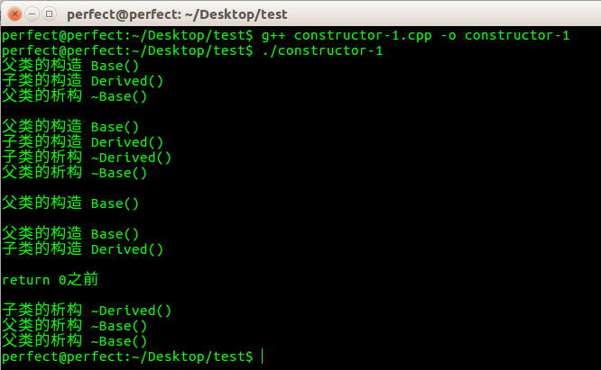
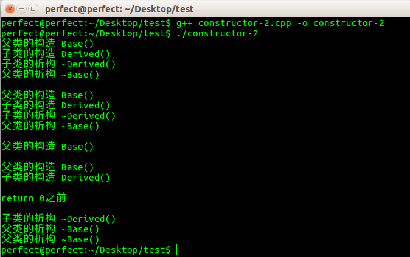
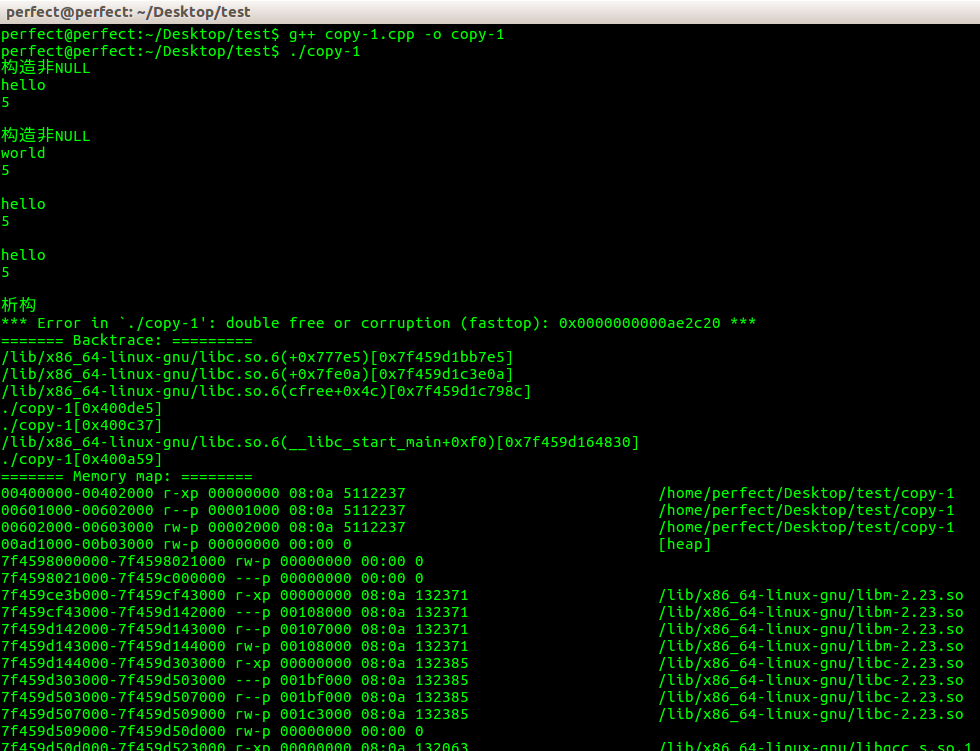
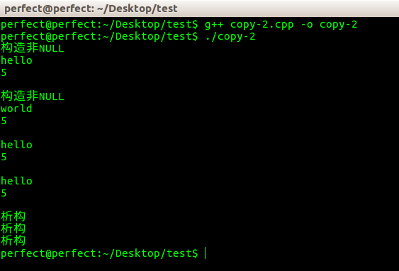

本文对应的测试程序是在Ubuntu 16 上使用g++ 5.4.0 进行编译的。无奈自己的Windows 机器突然硬盘坏了，所有的重要数据都丢了！！

##单一继承下的构造与析构

下面是[本测试程序](../download/20161113/constructor-1.cpp.zip)的源码

可以看到例程中的类是简单的单一进程关系，没有用到virtual关键字，所以也就和多态没有什么关系

```
#include<iostream>

using namespace std;

class Base{
	public:
		Base(){
			cout << "父类的构造 Base()" << endl;
		}
		~Base(){
			cout << "父类的析构 ~Base()" << endl;
		}
};

class Derived : public Base{
	public:
		Derived(){
			cout << "子类的构造 Derived()" << endl;
		}
		~Derived(){
			cout << "子类的析构 ~Derived()" << endl;
		}
};

int main()
{
	//通过父类指针构造、析构子类对象
	Base *bpt = new Derived();
	delete bpt;
	cout << endl;

	//通过子类指针构造、析构子类对象
	Derived *dpt = new Derived();
	delete dpt;
	cout << endl;

	//直接声明一个父类对象
	Base b;
	cout << endl;

	//直接声明一个子类对象
	Derived d;
	cout << endl;

	return 0;
}
```

程序的运行结果如下：



一般情况下，在C++编程中会在类的构造方法中申请一些内存等资源，在析构方法中再来释放这些资源。本测试程序只是在构造和析构方法中输出一些信息，用于展示调用的顺序。本例分别展示了简单的单一继承下四种不同调用方式：

* 通过父类指针构造、析构子类对象：先调用父类构造方法，再调用子类的构造方法；**没有调用子类的析构方**法，再调用父类的析构方法。所以如果在子类的构造方法中申请了资源，在子类的析构方法中来释放这些资源，那么明显因为子类的析构方法没有被调用会导致资源泄漏！
* 通过子类指针构造、析构子类对象：先调用父类构造方法，再调用子类的构造方法；先调用子类的析构方法，再调用父类的析构方法。对于资源的管理是安全的！
* 直接声明一个父类对象：这种情况下通过程序的输出可以看到，Base对象的析构方法在该对象声明的时候被调用，**其析构方法在main()方法结束的时候被调用**
* 直接声明一个子类对象：这种情况下通过程序的输出可以看到，Derived在声明的时候先调用父类的构造方法，再调用子类的构造方法；**在main()方法结束的时候进行析构**，先调用的是子类的析构方法，再调用父类的析构方法

>注意：因为上面的类对象是在main()中声明的，所以在main()结束的时候会调用其析构方法，并不是表示所有的类对象的析构方法都是在main()结束前被调用，各种可能的场景可以自己编写测试程序去通过运行效果来进行验证！

##为什么要定义虚析构方法

[本测试程序](../download/20161113/constructor-2.cpp.zip)简单在上面的测试源码上进行修改，其修改点只有一个：将父类的析构方法定义为virtual

```
#include<iostream>

using namespace std;

class Base{
	public:
		Base(){
			cout << "父类的构造 Base()" << endl;
		}
		//父类的析构方法声明为虚方法
		virtual ~Base(){
			cout << "父类的析构 ~Base()" << endl;
		}
};

class Derived : public Base{
	public:
		Derived(){
			cout << "子类的构造 Derived()" << endl;
		}
		~Derived(){
			cout << "子类的析构 ~Derived()" << endl;
		}
};

int main()
{
	//通过父类指针构造、析构子类对象
	Base *bpt = new Derived();
	delete bpt;
	cout << endl;

	//通过子类指针构造、析构子类对象
	Derived *dpt = new Derived();
	delete dpt;
	cout << endl;

	//直接声明一个父类对象
	Base b;
	cout << endl;

	//直接声明一个子类对象
	Derived d;
	cout << endl;

	return 0;
}
```

程序的运行结果如下：



相比于第一个例程，后三种运行情况都没有变化，唯一的变化是：使用父类指针创建的子类对象，再delete的时候，正确的调用了子类的析构方法，所以不会像第一个例程一样出现资源泄漏。这也就是为什么要将父类的析构方法声明为virtual的原因！、

##深拷贝与浅拷贝

通过C++类的拷贝构造函数和拷贝赋值函数进行展示！

**浅拷贝**

如果默认使用C++自动生成的拷贝构造函数、拷贝赋值函数就会出现浅拷贝的情况

```
#include<string.h>
#include<iostream>
using namespace std;

class String{
	public:
		String(const char *s){
			if(str != NULL){
				len = strlen(s);
				str = new char[len + 1];
				strcpy(str, s);
				cout << "构造非NULL" << endl;
			}else{
				str = new char[1];
				*str = '\0';
				len = 0;
				cout << "构造NULL" << endl;
			}
		}
		virtual ~String(){
			delete[] str;
			cout << "析构" << endl;
		}
		char *getStr(){
			cout << str << endl;
		}
		int getLen(){
			cout << len << endl;
		}
	private:
		char *str;	//指向字符串的指针
		int len;	//保存当前长度
};

int main()
{
	String a("hello");
	a.getStr();
	a.getLen();
	cout << endl;

	String b("world");
	b.getStr();
	b.getLen();
	cout << endl;

	//展示默认的拷贝构造函数
	String c(a);
	c.getStr();
	c.getLen();
	cout << endl;

	//展示默认的拷贝赋值函数
	b = a;
	b.getStr();
	b.getLen();
	cout << endl;

	return 0;
}
```

运行效果是：



分析上面这个例子，a.str的内容是"hello"，b.str的内容是"world"。将a赋值给b，默认赋值函数的“按成员拷贝”意味着执行`b.str = a.str;`。同理调用默认拷贝构造函数`String c(a)`的时候也一样，会造成3个错误（下面以默认拷贝赋值函数为例进行讲解）

* b.str原持有的内存没有释放，造成内存泄漏，这个倒不会导致运行期报错
* b.str和a.str指向同一块内存，a或b任何一方变动都会影响另一方
* 在对象析构时（上面的例子讲到，对于类变量，会在main()函数结束时调用其析构方法），str被delete两次，这也就是上面的运行效果图中报错的原因！

**深拷贝**

上面的例子展示了如果使用C++默认生成的拷贝构造函数、拷贝赋值函数，如果在成员变量中有通过指针来动态申请和管理内存的时候会导致严重的问题。所以在这种情况下就不能再使用C++提供的默认拷贝函数，需要我们自己实现

下面的这个程序实例展示了如何自己实现拷贝函数，保证内存的正确管理！

```
#include<string.h>
#include<iostream>
using namespace std;

class String{
	public:
		String(const char *s){
			if(str != NULL){
				len = strlen(s);
				str = new char[len + 1];
				strcpy(str, s);
				cout << "构造非NULL" << endl;
			}else{
				str = new char[1];
				*str = '\0';
				len = 0;
				cout << "构造NULL" << endl;
			}
		}
		virtual ~String(){
			delete[] str;
			cout << "析构" << endl;
		}
		//自定义拷贝构造函数
		String(const String &other){
			int l = strlen(other.str);
			str = new char[l + 1];
			strcpy(str, other.str);
			len = l;
		}
		//自定义赋值拷贝函数
		String &operator=(const String &other){
			//检查自赋值
			if(this != &other){
				//分配新的内存资源，并复制内容
				char *temp = new char[strlen(other.str) + 1];
				strcpy(temp, other.str);	//同时拷贝了'\0'
				//释放原有的内存资源
				delete[] str;
				str = temp;
				len = strlen(other.str);
			}
			//返回本对象的引用
			return *this;
		}
		char *getStr(){
			cout << str << endl;
		}
		int getLen(){
			cout << len << endl;
		}
	private:
		char *str;	//指向字符串的指针
		int len;	//保存当前长度
};

int main()
{
	String a("hello");
	a.getStr();
	a.getLen();
	cout << endl;

	String b("world");
	b.getStr();
	b.getLen();
	cout << endl;

	//展示默认的拷贝构造函数
	String c(a);
	c.getStr();
	c.getLen();
	cout << endl;

	//展示默认的拷贝赋值函数
	b = a;
	b.getStr();
	b.getLen();
	cout << endl;

	return 0;
}
```

运行效果是：



结合上面分析为什么在浅拷贝的时候会导致内存泄漏、运行时地址错误，可以很好的理解这个例程为什么是没有问题的！
