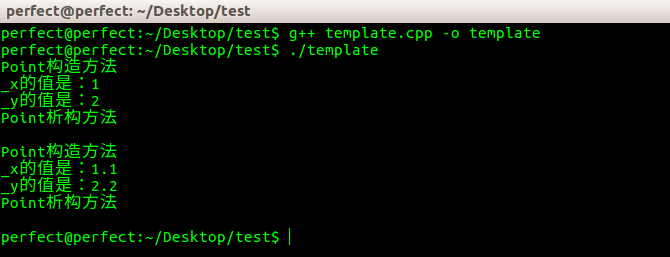
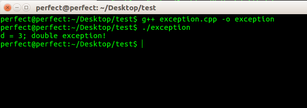

##C++模板

先通过一个[例程](../download/20161113/template.cpp.zip)简单复习一下模板的语法

```
#include<iostream>
using namespace std;

template<class Type>
class Point{
	public:
		Point(Type x = 0, Type y = 0){
			_x = x;
			_y = y;
			cout << "Point构造方法" << endl;
		}
		~Point(){
			cout << "Point析构方法" << endl;
		}
		Type x(){
			cout << "_x的值是：" << _x << endl;
		}
		Type y(){
			cout << "_y的值是：" << _y << endl;
		}
	private:
		Type _x, _y;
};

int main()
{
	Point<int> *pi;
	pi = new Point<int>(1, 2);
	pi->x();
	pi->y();
	delete pi;
	cout << endl;

	Point<float> *pf;
	pf = new Point<float>(1.1, 2.2);
	pf->x();
	pf->y();
	delete pf;
	cout << endl;

	return 0;
}
```

程序的运行效果如下：



##异常处理

同样的，先复习一下C++异常处理机制的简单语法：

```
#include<iostream>
using namespace std;

int main()
{
	try{
		throw 3.0;
	}
	catch(int){
		cout << "int exception!" << endl;
	}
	catch(double d){
		cout << "d = "<< d << "; double exception!" << endl;
	}
	catch(...){
		cout << "unknown exception!" << endl;
	}

	return 0;
}
```

程序的运行效果如下：



##RTTI

异常处理机制在1989年加入C++语言，由于它是在运行时当异常抛出时才会执行具体的异常匹配操作，而不是在编译时就匹配好的，因此，它需要一种能够在运行时检查一个对象类型信息的手段。何况一个异常类型可能是多态类型，当抛出的异常对象为派生类对象时，如果找不到确切的处理过程就应该尝试去匹配其基类的处理过程，这也是在运行时检查一个对象的类型信息。于是直接导致了RTTI(Run-time Type Identification)机制的诞生。RTTI后来的实现不仅解决了异常处理机制中的问题，它还能够完成虚函数不能完成的工作

在[《C++对象内存模型：通过重载与覆盖理解虚函数表指针》](http://www.xumenger.com/cpp-override-overload-20161106/)一文中对应展示的Virtual Table可以看到其第一个指针所指向的就是类的type_info


其实C++最初并没有type_info是出于以下几个方面的考虑：

* 保持对C语言的向后兼容，因为如果支持运行时对一个对象确切类型的检索，就需要修改对象的内存映射，比如插入一个指针来指向其类型信息。虚拟机制出现后，类型信息就被放到了vtable中
* RTTI不光需要额外的内存开销(为每一个类型增加了一个type_info)对象，而且运行时检索对象的类型信息需要一定的时间开销
* 在多数情况下虚函数的功能对于运行时对象类型的匹配已经足够了

然而，C++还支持多重继承以及虚拟继承这些更为复杂的特征，此时静态类型检查和虚函数动态绑定就更加不能满足对正确判断一个对象确切类型的要求了，因此RTTI和type\_info就被加入C++中了

RTTI和虚函数并非一回事！实际上虚函数的动态绑定并没有使用对象的type\_info信息，因此两者不相交，可以从编译器对虚汗数调用语句的改写手法上看出这一点

>《深度探索C++对象模型》：早在RTTI特征于1993年被引入C++之前，C++对多台的唯一支持就是对虚函数调用的动态绑定。有了RTTI之后，就能够在运行时检查一个多台指针或引用指向的具体对象的类型了！

还是基于[《C++对象内存模型：通过重载与覆盖理解虚函数表指针》](http://www.xumenger.com/cpp-override-overload-20161106/)一文的那个例子，展示其类型信息：

>注：原文程序在Windows 7上的Visual C++ 6.0实现，本文程序使用Ubuntu 16的g++ 5.4.0 编译

```
#include<string>
#include<typeinfo>
#include<iostream>

using namespace std;

class Base{
	private:
		int _x;
	public:
		void testOverload(){
			cout << "Base::testOverload" << endl;
		}
		virtual void testOverride1(){
			cout << "Base::testOverride1" << endl;
		}
		virtual void testOverride2(){
			cout << "Base::testOverride2" << endl;
		}
};

class Derived : public Base{
	private:
		int _y;
	public:
		void testOverload(){
			cout << "Derived::testOverload" << endl;
		}
		void testOverride1(){
			cout << "Derived::testOverride1" << endl;
		}
};

typedef unsigned int UNIT;

int main()
{
	cout << "typeid(UNIT)   : " << typeid(UNIT).name() << endl;
	cout << "typeid(int)    : " << typeid(int).name() << endl;
	cout << "typeid(float)  : " << typeid(float).name() << endl;
	cout << "typeid(double) : " << typeid(double).name() << endl;
	cout << "typeid(string) : " << typeid(string).name() << endl;
	cout << "typeid(Base)   : " << typeid(Base).name() << endl;
	cout << "typeid(Derive) : " << typeid(Derived).name() << endl;
	
	return 0;
}
```

运行效果如下：


typeid()运算符就像sizeof()一样是C++语言直接支持的，它以一个对象或类型名作为参数，**返回一个匹配的const type\_info对象**，它表明该对象的确切信息

##补充：type_info的定义

**C++ Standard**中对type\_info的定义如下

```
class type_info {
	public:
		_CRTIMP virtual ~type_info();
		_CRTIMP int operator==(const type_info& rhs) const;
		_CRTIMP int operator!=(const type_info& rhs) const;
		_CRTIMP int before(const type_info& rhs) const;
		_CRTIMP const char* name() const;
	private:
		void *_m_data;
		char _m_d_name[1];
		type_info(const type_info& rhs);
		type_info& operator=(const type_info& rhs);
};
```

如上面的例子，通过`const char* name() const;`传回class原始名称

编译器必须提供的最小信息量是class的真是名称和type\_info object之间的某些排序算法（这就是before()函数的目的），以及某些形式的描述器，用来表现explicit class type和这一class的任何subtypes

在描述exception handling的原始文章中，曾建议实现一种描述器。MicroSoft的Visual C++就是采用编码后的字符串作为描述器，所以Visual C++的typeinfo.h中对于type\_info的定义就比上述的C++ Standard所定义的还多一个member：

```
class type_info {
	public:
		_CRTIMP virtual ~type_info();
		_CRTIMP int operator==(const type_info& rhs) const;
		_CRTIMP int operator!=(const type_info& rhs) const;
		_CRTIMP int before(const type_info& rhs) const;
		_CRTIMP const char* name() const;		//传回class原始名称
		_CRTIMP const char* raw_name() const;		//传回class名称的编码字符串
	private:
		void *_m_data;
		char _m_d_name[1];
		type_info(const type_info& rhs);
		type_info& operator=(const type_info& rhs);
};
```
