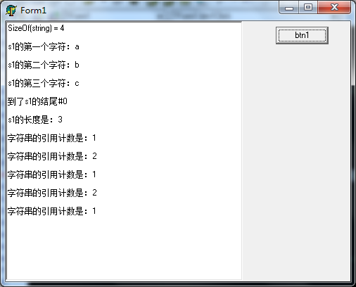
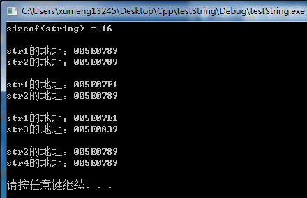

之前在[《Delphi配合VC++开发：跨语言传字符串》](http://www.xumenger.com/delphi-vc-dll-5-20160903/)有讲到当Delphi对接VC++开发时如何传递字符串；在[《Delphi使用FillChar时候如果有string可能导致内存泄漏》](http://www.xumenger.com/delphi-string-memory-20151118/)有转载了关于Delphi的string类的Copy-On-Write技术以及可能导致的内存泄漏问题；陈皓的文章[《标准C++类std::string的内存共享和Copy-On-Write技术》](http://blog.csdn.net/haoel/article/details/24058)有讲到C++中string类的一些特性

##Delphi对接VC++开发遇到的问题

最近开发的一个项目中有涉及到调用别人封装好的API，该API是在C++环境下的，但我们是使用Delphi进行开发的，所以在VC++中简单封装，并通过DLL导出该API

该API的其中加密和发送加密信息的函数原型是这样的：

```
//对称加密，size_t其实是unsigned int
__declspec(dllexport) int __stdcall safe_encrypt(const unsigned char *src, const size_t len, unsigned char *dst, size_t *cap);

//发送加密消息请求
__declspec(dllexport) int __stdcall send_msg(const char * encrypted_msg, unsigned int len);
```

然后在Delphi中使用静态加载的方式加载DLL，并获取相关方法

参考[《Delphi配合VC++开发：基础数据类型对应关系》](http://www.xumenger.com/delphi-vc-dll-1-20160903/)我们知道C++端的unsigned char和Delphi端的Byte是对应的；C++端的unsigned int和Delphi端的Cardinal是对应的

```
//0:成功；-1:失败
function SafeEncrypt(const src: PByte; len: Cardinal; dst: PByte; cap: PCardinal): Integer; stdcall; external 'api.dll' name 'safe_encrypt';

//0:成功；-1:参数为NULL；-2:内存分配失败；-4：尚未建立连接
function SendEncMsg(const enc_msg: PChar; len: Cardinal): Integer; stdcall; external 'api.dll' name 'send_msg';
```

还有一个限制，就是其中的加密方法是非线程安全的，所以又在Delphi中做了一层封装进行保护

```
//线程安全的加密函数
function Encrypt(const src: PByte; len: Cardinal; dst: PByte; cap: PCardinal): Integer;
begin
  EnterCriticalSection(Encrypt_Lock);
  try
    Result := SafeEncrypt(src, len, dst, cap);
  finally
    LeaveCriticalSection(Encrypt_Lock);
  end;
end;
```

而且一般是加密完成之后就立即发送，所以又将线程安全的加密和发送方法封装到一起

```
//加密并发送密文包
//0：处理成功；1：加密失败；2：异常；-1:参数为NULL；-2:内存分配失败；-4：尚未建立连接
function EncAndSendMsg(GemsPkg: string): Integer;
var
  EncMsg: array[0..MAX_GTP_MSG_LENGTH] of Char;
  EncMsgLen: Integer;
begin
  Result := -1;
  try
    {0：成功；-1：失败}
    if 0 = Encrypt(PByte(GemsPkg), Length(GemsPkg), @EncMsg, @EncMsgLen) then
    begin 
      {0:成功；-1:参数为NULL；-2:内存分配失败；-4：尚未建立连接}
      Result := SendEncMsg(EncMsg, EncMsgLen);
    end
    else
    begin
      Result := 1;
    end;
  except
    on E: Exception do
    begin
      Result := 2;
    end;
  end;
end;
```

然后就可以在多线程的应用程序中调用该方法去发送报文了

**调用方法一**

```
var
	Msg: string;
begin
	//按照接口规范打包一个报文
	Msg := PackMsg(...);	

	//加密并发送
	iRet := EncAndSendMsg(PChar(Msg));
end;
```

大概有3个线程都有这样的调用，但是只有一处是加密并发送成功的，其他的都是加密失败

**调用方法二**

```
var
	Msg: string;
begin
	//按照接口规范打包一个报文
	Msg := PackMsg(...);	

	//加密并发送
	iRet := EncAndSendMsg(Msg);
end;
```

换成这样的调用方法后，绝大多数地方的加密和发送是成功的，但还有少部分地方的加密仍然是失败的

**调用方法三**

怀疑是上面的方法都是通过将Delphi的string转成PChar，或者转成PByte的方法来调用C++的API的，但Delphi的string本身的内存结构是比较特殊的，怀疑就算转成PChar、就算转成PByte还是不能和C++的safe\_encrypt方法内部实现兼容，所以先将加密和发送方法做一层修改，直接使用PChar转PByte

```
//0：处理成功；1：加密失败；2：异常；-1:参数为NULL；-2:内存分配失败；-4：尚未建立连接
//GemsPkg必须将一个字符数组传进来，不能传string，否则会导致部分加密成功部分加密失败的情况
function EncAndSendMsg(GemsPkg: PChar; GemsLen: Integer): Integer;
var
  EncMsg: array[0..MAX_GTP_MSG_LENGTH] of Char;
  EncMsgLen: Integer;
begin
  Result := -1;
  try
    {0：成功；-1：失败}
    if 0 = Encrypt(PByte(GemsPkg), GemsLen, @EncMsg, @EncMsgLen) then
    begin 
      {0:成功；-1:参数为NULL；-2:内存分配失败；-4：尚未建立连接}
      Result := SendEncMsg(EncMsg, EncMsgLen);
    end
    else
    begin
      Result := 1;
    end;
  except
    on E: Exception do
    begin
      Result := 2;
    end;
  end;
end;
```

调用的代码是这样的

```
var
	Msg: string;
	MsgArr: array[0..MAX_GTP_MSG_LENGTH] of Char;
begin
	//按照接口规范打包一个string类型的报文
	MsgArr := PackMsg(...);	

	//将string的内容拷贝到字符数组中
	StrCopy(MsgArr, PChar(Msg));

	//加密并发送
	iRet := EncAndSendMsg(MsgArr, Length(Msg));
end;
```

这样的修改后，所有调用EncAndSendMsg方法的代码都返回0，都是调用成功的

经过这次开发遇到的问题，所以不建议像[《Delphi配合VC++开发：跨语言传字符串》](http://www.xumenger.com/delphi-vc-dll-5-20160903/)中在Delphi端将string转成PChar再对接C++接口的方法，还是推荐直接通过Delphi的Char数组和VC++的char数组进行对接！否则就可能像上面描述的那样出现一些意想不到的错误！

>Delphi中有string这个类，C++中也有一个string类，它们都是使用Copy-On-Write技术实现的，但它们的内存结构都是什么样的呢？能不能直接进行对接呢？

##Delphi的string类

在[《Delphi使用FillChar时候如果有string可能导致内存泄漏》](http://www.xumenger.com/delphi-string-memory-20151118/)中有讲到一种因为string的写时复制可能导致的内存泄漏；另外推荐文章[《【Delphi】string内存结构》](http://blog.csdn.net/aqtata/article/details/38905387)

Delphi中string类的内存结构如下图


* 01~02 字节是代码页，如上面的0x03A8为十进制的936，表示简体中文GBK
* 03~04 字节表示每个字符所占的字节数（ANSI为1，Unicode为2）
* 05~08 字节是该字符串的引用计数
* 09~12 字节是该字符串的字符个数
* 13~?? 字节就是字符串实际的内容了
* ??    最后一个字节是00，字符串的结束符

>这里需要注意的是，在Delphi 2009以前的版本中是没有描述代码页的4字节的（代码页+字符宽度），而是直接从第05字节开始（引用计数）

>对于常量字符串，引用计数总是0xFFFFFFFF，也就是-1。若有N处相同的字符串常量时，就有N份的拷贝，这样就造成了空间上的浪费，Delphi并未作出优化

下面的测试程序是在Windows 7上使用Delphi 6实现的，Delphi 6是Delphi 2009之前的版本，所以没有前4个字节，对应的string的内存结构是这样的


实现一个[测试程序](../download/20161116/Delphi.rar)验证一下

```
unit MainForm;

interface

uses
  Windows, Messages, SysUtils, Variants, Classes, Graphics, Controls, Forms,
  Dialogs, StdCtrls;

type
  TForm1 = class(TForm)
    btn1: TButton;
    mmo1: TMemo;                         
    procedure FormCreate(Sender: TObject);
    procedure btn1Click(Sender: TObject);
  private
    { Private declarations }
  public
    { Public declarations }
  end;

var
  Form1: TForm1;

implementation

{$R *.dfm}

procedure TForm1.FormCreate(Sender: TObject);
begin
  mmo1.Clear;
end;

procedure TForm1.btn1Click(Sender: TObject);
var
  s1, s2: string;
  p, temp1, temp2: PChar;     //Char型指针，每次加减一都移动1Byte
  pi: PInteger;               //Integer型指针，每次加减一都移动4Byte
  pw: PWord;                  //Word型指针，每次加减一读移动2Byte
  i: Integer;
begin
  mmo1.Lines.Add('SizeOf(string) = ' + IntToStr(SizeOf(string)) + #13#10);
  s1 := 'abc';

  p := Pointer(@s1[1]);
//通过p获取s1的各个字符
  temp1 := p;
  mmo1.Lines.Add('s1的第一个字符：' + Char(temp1^) + #13#10);
  Inc(temp1, 1);
  mmo1.Lines.Add('s1的第二个字符：' + Char(temp1^) + #13#10);
  Inc(temp1, 1);
  mmo1.Lines.Add('s1的第三个字符：' + Char(temp1^) + #13#10);
  Inc(temp1, 1);
  if #0 = temp1^ then
  begin
    mmo1.Lines.Add('到了s1的结尾#0' + #13#10);
  end;
  
//前移4个byte，获取长度，Delphi 6字符串长度信息存储在string的第5~第8个字节中
  temp1 := p;
  Dec(temp1, 4);
  pi := PInteger(temp1);
  mmo1.Lines.Add('s1的长度是：' + IntToStr(pi^) + #13#10);
  
//前移8个byte，获取引用计数，Delphi 6引用计数信息存储在string的第1~第4字节中
  temp1 := p;
  Dec(temp1, 8);
  pi := PInteger(temp1);
  mmo1.Lines.Add('字符串的引用计数是：' + IntToStr(pi^) + #13#10);
  
//将s1赋值给s2，这样s1的引用计数就加一了
  s2 := s1;
  temp1 := p;
  Dec(temp1, 8);
  pi := PInteger(temp1);
  mmo1.Lines.Add('字符串的引用计数是：' + IntToStr(pi^) + #13#10);
  
//将s2赋值为其他字符串，这样s1对应的引用计数就减一了
  s2 := 'def';
  temp1 := p;
  Dec(temp1, 8);
  pi := PInteger(temp1);
  mmo1.Lines.Add('字符串的引用计数是：' + IntToStr(pi^) + #13#10);

//再将s1赋值给s2，这样s1的引用计数又加一了  
  s2 := s1;
  temp1 := p;
  Dec(temp1, 8);
  pi := PInteger(temp1);
  mmo1.Lines.Add('字符串的引用计数是：' + IntToStr(pi^) + #13#10);

//为什么下面这样的代码之后，引用计数是1，而不再是2？
  @s1[1];
  temp1 := p;
  Dec(temp1, 8);
  pi := PInteger(temp1);
  mmo1.Lines.Add('字符串的引用计数是：' + IntToStr(pi^) + #13#10);
end;

end.
```

其运行效果如下：



上面的大多数输出对应程序代码我们都可以很好的根据string的引用计数原理来解释，但是为什么最后的输出中引用计数是1而不是2？为什么经过了`@s1[1];`这么个“无关痛痒”的代码后，引用计数变了？

这里不做解释，看完下面关于对于C++的string类测试程序的第三对输出信息，以及下面对应的解释就可以理解了！

##C++中的string类

以下的实验内容请一定结合文章[《C++ STL string的Copy-On-Write技术》](http://coolshell.cn/articles/12199.html)来看，文章中也有讲到了一种因为string的写时拷贝技术可能导致的程序crash！

Windows 7上使用VC++ 6.0实现一个[测试程序](../download/20161116/Cpp.rar)验证一下。下面的例子参考[《浅析基于引用计数的字符串类string》](http://www.cppblog.com/mildcat1982/archive/2010/07/14/120390.aspx)

```
#include<stdio.h>
#include<stdlib.h>
#include<string>
#include<iostream>

using namespace std;

int main()
{
  printf ("sizeof(string) = %d\n\n", sizeof(string));

  string str1 = "hello";
  string str2(str1);
   
  //第一对输出
  printf( "str1的地址：%p\n", str1.c_str());
  printf( "str2的地址：%p\n", str2.c_str());
  printf( "\n" );

  //第二对输出
  str1[0];
  printf( "str1的地址：%p\n", str1.c_str());
  printf( "str2的地址：%p\n", str2.c_str());
  printf( "\n" );

  //第三对输出
  string str3(str1);
  printf( "str1的地址：%p\n", str1.c_str());
  printf( "str3的地址：%p\n", str3.c_str());
  printf( "\n" );
  
  //第四对输出
  string str4(str2);
  printf( "str2的地址：%p\n", str2.c_str());
  printf( "str4的地址：%p\n", str4.c_str());
  printf( "\n" );

  system("pause");
  return 0;
}
```

其运行效果如下：



**sizeof(string)的值**

对于Delphi程序和C++程序，Delphi程序的sizeof(string)的值是4，而C++程序中sizeof(string)的值是16，这是为什么？

假如Delphi中有类Base，C++中也有类Base

Delphi有以下代码

```
var
  b: Base;
begin
  b := Base.Create;

end;
```

这里的变量b，其实是一个指针，它指向Base创建的对象

与之对应的C++代码是这样的

```
{
  Base *b;
  b = new Base();

}
```

而C++还支持这样的语法，直接通过类声明一个对象：

```
{
  Base b;
}
```

所以Delphi中sizeof(string)是获取一个指针变量所占用的内存大小；而C++中的sizeof(string)获取就是一个string对象所占用的内存大小

**第一对输出，为什么str1和str2的地址一致？**

因为string内部的实现机制为引用计数，string的拷贝构造函数并非真正的去进行字符串拷贝，只是将字符串的引用数加1

str1.c_str()和str2.c_str()实际上指的还是同一个字符串，同一块内存

**第二对输出，为什么经过了str1[0]这个“无关痛痒”的一行代码后，地址不同了？**

具体而言是str1的地址发生了变化，str2的地址保持不变。str1[0]到底做了什么？string重载了[]，一个是non-const版本，一个是const版本：

```
char& operator[](size_t idx);

const char& operator[](size_t idx)const;
```

上面的代码中，调用的是non-const版本，由于这个函数本身是无法得知代码上下文中调用自己是为了读还是为了写。理论上在读的时候不需要拷贝，只有在写时才需要对原字符串拷贝，但是由于无法区分读和写，或者区分起来很困难，所稳妥起见对于这种情况就默认其是写，所以就发生了写时拷贝

**第三对输出，为什么str1拷贝给str3后，两者地址不一致？**

是的，这个比较令人费解，尤其是考虑到str1刚拷贝给str2后，str1与str2的地址却是一致？貌似这是相悖的。

其实不然，仔细看一下，不难发现，str1是在调用完operator[]后才变成这个样子的。

看来operator[]不仅是进行了字符串拷贝，还对str1对象做了其他手脚。究竟是什么呢？

先撇开这个问题，看一下代码：

```
string s1("test");
char *p = &s1[0];
string s2(s1);
*p = 'T';
```

上述代码中，第2行取了s1[0]的地址，然后在未来的某一时刻再通过指针更改s1[0]的值(第4行代码)。在未来的某个时刻到来之前，所有对于s1的拷贝都不能进行引用计数，只能老老实实的进行字符串拷贝，否则一旦通过指针更改s1[0]的取值，那么所有s1的拷贝对象的值都将被修改！

假如operator[]的实现中只是进行了字符串拷贝，那么在上述第4行代码执行后，s1与s2的值将都被改变，即s1 = s2 = 'Test'。这显然是和事实不符的，正确的结果应该是s1 = 'Test'，s2 = 'test'；所以这就需要operator[]的实现中增加一个共享标志位，用来表示该字符串是否还可以被共享，每当调用每当调用operator[]，operator[]都会将这个标志位置成非共享状态(默认值是共享状态)，一旦设置成非共享状态，那么将永远不会再还原！

所以凡是调用了operator[]函数的string对象，都将从共享状态转变成非共享状态，对于这种对象的拷贝，都无法进行引用计数。再回到原来的那个问题，就可以理解为什么str1拷贝给str3之后，str1和str3的地址不一致了

**第四对输出**

有了上面的铺垫和解释，可以很好的理解为什么str2和str4的地址是相同的了

不过在[《C++ STL string的Copy-On-Write技术》](http://coolshell.cn/articles/12199.html)提到：在最新的STL中，COW这个特性已经被去掉了。有一个原因是线程不安全！COW其实还是比较危险的

##简单总结

>虽然Delphi的string和C++的string都是使用Copy-On-Write、引用计数的技术实现的，但明显两者的内存布局完全不同！而且不同版本的Delphi、不同版本的STL之间也都存在着差异，所以跨语言开时，最稳的传递字符串的方法还是使用字符数组！
