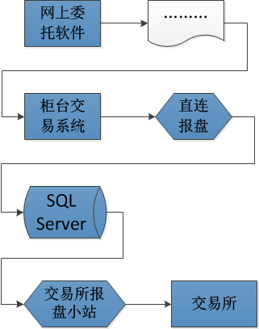
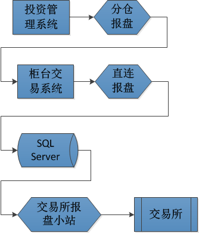

##资本市场

上一篇[《浅谈金融市场：银行和货币市场》](http://www.xumenger.com/finance-knowledge-02-20161119/)中讲到了货币市场。金融市场是一个复杂巨大的体系，有时候把金融市场进行分类，对于更好的认识是有必要的。最一般的划分方法是按照交易的期限将其分为货币市场和资本市场

那资本市场是证券融资和交易期限正在一年以上（不含一年）的金融工具的金融市场。与货币市场相比，资本市场满足的是长期（比如10年或以上）和大额资金的需求，风险也更大，因此也更需要发达的、多层次市场来分散风险，以吸引资金供给者获投资者进入市场。主要包括股票市场、债券市场、中长期存贷款市场和基金市场

##证券公司

证券公司，更普遍的叫法是券商。相信美国电影都有看过，其中一直提及的投资银行对应就是中国的证券公司，比如前些年倒闭的雷曼兄弟就是比较出名的投资银行

相对于商业银行主要经营货币，投资银行（证券公司）主要经营债券和股票。货币流通于货币市场，债券和股票流通于资本市场。货币市场和资本市场两个概念，从根本上界定了银行和证券公司的不同功能

现代意义上的投资银行（简称投行）产生于18世纪，产生以后发展迅速。1929~1933年的大萧条之前，美国证券视察昂一篇繁荣景象，商业银行把原本用来放贷的钱也投到了股票市场。那时政府对证券业几乎没有任何监管。危机突然爆发，股市崩盘，投资银行和商业银行纷纷破产。大萧条之后，美国政府痛感商业银行卷入股市的巨大风险，于是痛感《格拉斯 — 斯蒂格尔法案》，对投资银行和商业银行实行分业管理，对商业银行管制很紧，对投资银行则较为宽松

以美国为例，投资银行有两个主要来源：一是由商业银行分解而来，比如当初的摩根银行，就分解为摩根士丹利（投资银行）和摩根大通（商业银行）；二是由证券经济业务公司转化而来的，比如美林证券

按照《证券法》，我国证券公司的业务范围包括：

* 证券经纪业务
* 证券投资咨询业务
* 与证券交易、证券投资活动有关的财务顾问业务
* 证券承销与保荐业务
* 证券自营业务
* 证券资产管理业务
* 融资融券业务
* 证券公司中间介绍业务
* 直接投资业务

##投行业务

比如企业A有很好的前景，但没钱，需要长期融资，只能通过发行债券、或股票来获得企业所需要的资金，这时候他们就不能找银行了，而是要找投资银行（券商）。于是证券公司替他们设计一个证券方案，可能是一只5年期的企业债券，或是股票，然后证券公司还要去找一批人（或者是法人）来买这些证券。证券公司在其中就是起到一个中介的作用：企业发行股票。投资者来买股票

现在证券公司发行股票的流程主要是：

* 首先向中国的几十家开放式基金管理公司和其他专门做股票投资的投资机构发出发售这个企业股票的意向（网下询价），要求他们愿意认购的花就打钱过来同时告诉我你想以多少价格买多少股票
* 再委托上交所或深交所向广大的几千万的个人股民发行这只股票（网上申购），往往大家都会踊跃申购，申购冻结的资金极其庞大
* 如果最后供不应求，那就需要抽签，目前中国市场上新股申购一般都是供不应求，所以中签率都不高，像中彩票的概率一样
* 等到认购期结束，几个亿的资金就流入了这家上市公司的腰包
* 当然证券公司也很辛苦，所以证券公司的投资银行部也能获得3%的佣金，而这部分其实就是证券公司主要的盈利业务

通过交易所完成的发行叫做“网上认购、发行”，不通过交易所直接由证券公司ECM部门联系的大资金量的买家叫做“网下认购、发行”，我国的发行方式正在经历一个由网上发行为主向网下发行为主的过渡期

上面提到的证券公司作为中介帮助企业发行证券来进行融资，其实是在一级市场的行为，一级市场也就是常说的发行市场。而对于我们这样的普通投资者，能接触到的其实是二级市场，也就是交易市场，比如所谓的“炒股”

投资银行业务是解决企业长期融资的需求（短期融资需求由银行贷款来满足），企业可以选择发行股票，或者发行债券来获得长期融资。发行企业债就是投资银行的一项核心业务。

在90年代后期，政府（主要是国家计划委员会，现在的国家发改委）开始允许大型国有企业发行企业债券，例如一些大型铁路、水电、火电、核电等企业的债券，每只债券都是50亿人民币以上的规模。证券公司就挤迫头抢这些企业债券的发行项目（跟IPO一样）。拿到这些项目以后，就到银行、企业财务那里去推销（其实不是推销，而是别人求着你来买这些债券）这些债券，或者自己吃下这些债券。一级市场的买卖，或者二级市场的买卖双方都必须在“中央债券登记公司”开设帐户，通过这个公司的电脑系统完成债券的交割。于是，证券公司搀和进了原来只有国债和银行之间的所谓“银行间债券市场”。（注意：这时候，这个“银行间”名词已经名不副实，但沿用了下来。）负责企业债券发行或者交易的证券公司的业务部门叫“定息收益部”，意思是：相对股票没有固定的分红而言，债券是有固定利息的。这个部门可能独立设立，也可能划归投资银行部来管。

##经纪业务

比如你想买股票（可以是个人，也可以是法人），那么就去某一家证券营业部，在营业部受理柜台上，出示身份证件后要求柜台小姐为你开设上海证券登记公司和深圳证券登记公司的股东账户，有了这两个账户，就在上交所和深交所注册了，股东账户卡是在交易所做股票交易的必要条件。这时这两个账户实时地被记录进了上海登记公司和深圳登记公司的主机数据库。然后还需要再开立一个证券资金账户，这个账户将来存放你用来买卖股票的钱（交易结算保证金）。然后柜台小姐在柜台交易系统中为你开设一个资金账户，并且把刚才开立的两个股东账户关联到这个资金账户上。（当然现在开户也都可以直接通过网络来完成了）

接着在和营业部签署电话、Internet委托的协议，这样就可以通过电话或者网上委托的方式很方便的买卖股票、封闭式基金等证券产品了

以上的交易模式就是对应证券公司的证券经纪业务。证券经纪业务是证券公司的另一个主要收入来源，一般占一个综合类证券公司总收入的40%~60%比例。相对于投行业务主要从一级市场上收取企业销售证券的中介佣金，经纪业务是从二级市场上获取客户买卖证券的佣金。投行业务的佣金比例一般是3%，而经纪业务一般比例是0.2%

>价值链的概念：你的价值是帮助你的上家完成它的价值，而你的下家的价值是能否帮你完成你的价值。你们的任何经纪活动几句是在千丝万缕的价值链中完成的。你们必须清楚地知道自己所在链条上的位置。否则很容易迷失方向，进入纯搞技术的误区

柜台交易系统是每个证券公司的IT价值核心所在。在国外的大投行中，其核心交易系统基本是自主开发，但在中国，柜台系统主要由两家开发商：杭州的恒生和深圳的金证（当然还有金仕达、根网等等，但规模都小得多）。证券公司只需要花钱就能买来一整套的交易系统，由恒生和金证的工程师调好系统，按系统现有功能来展开业务就是了

以前大部分证券公司的柜台系统是以营业部为基本单元的。就是说，每个营业部有自己独立的柜台服务器，电话委托、网上委托、银证转账都是基于营业部，几十个营业部各管各的，互不相关。现在基本都集中到公司总部

交易所都提供了专门的数据报盘系统，这些系统通过高度专线连接到交易所机房。作为柜台交易系统的一个核心部件，恒生（金证）提供了报盘程序（叫Trans），这个程序不断的从柜台数据库的另一张重要表格Entrust（客户委托表）的内容往交易所报盘系统转发，或者反过来。Trans以毫秒计的不停的工作。做权证短线的投资客们在意的就是这些毫秒（有点夸张，但他们绝对在意秒，差1秒，他们绝对能感觉出来）

上交所的模式是这样的：恒生或金证的报盘程序将委托信息写到SQL Server，交易所的报盘系统从SQL Server中读取数据再发送到交易所；而深交所在以前使用的是DBF来进行过度，现在则是恒生或金证的报盘程序通过网关直接将委托数据以网络流的方式发送到交易所

营业部已经越来越作为营销场所和开户场所存在，目前75%以上的交易实际上是客户通过网上委托完成的。核新、通达信等软件公司开发了从客户端软件（就是我们经常见到的证券公司网站上的那些可以下载的交易软件），到服务端的解决方案。这些服务端再通过上边提到的柜台系统的AR（应用路由）软件进入交易系统的网络世界

中国的散户太多了，机构也是散户化的，交易频繁，交易模式单一，证券公司内部更本不去自主创新业务管理发展方式，监管机构也从来就不放心让证券公司自己管好自己，所以下来的操作指引也是无比的细则化，搞得大家都一个样，大家都指望一套IT系统自动的完成所有的事情。苦了金证（恒生），也成就了他们，他们俨然成了业务顾问了

**个人投资者如何买卖股票**

股民张三准备买10手万科的股票，他先在电脑打开一个网上委托软件，输入代码、价格、股数、买卖方向，回车。委托数据被打包，发给一个互联网上的IP。这个IP物理上也许在某个大城市的某个高科技园区内的某个点心公司的托管机房里，这个IP地址被绑定到某台服务器的一块网卡上。这个服务器上运行着网上交易服务端软件

接收到这个数据包后，网上交易服务端软件，再把数据转发到金证（恒生）公司的交易系统的某个AR程序，这个AR程序通过检索本地硬盘上的路由表，发现应该交给中心机房的另一个AR程序，于是数据通过内部广域网来到中心机房。（实际上可以无数个AR间转发这笔请求，只要你愿意费神配置它们的路由表。这听起来像是大学中学到的网络课程。实际上这些应用路由的转发其实与IP路由转发是一个道理）

这个汇总AR再分析数据请求，发现是申请买入股票的请求，就发给一台应用服务器，这个应用服务器通过请求的功能号触发约定好的一个DLL文件，这个可执行程序文件把这个请求终于放到Oracle数据库中的Entrust表中

另一个报盘程序，每毫秒的扫描这个Entrust表，一旦发现新委托，马上取出，写入交易所的接口表中（上交所是SQL Server；深交所之前是DBF，现在直接是网络流）。交易所的报盘程序也在不停的扫描这个接口表，一旦发现新委托，马上通过DDN专线发给了交易所通信中心，直到交易所主机所主机

大概的流程图是这样的：

##自营业务

“投行”、“经纪”和“资产管理”号称是证券公司三大业务板块。早期，资产管理业务就叫做“自营业务”，意思是说证券公司用自己的钱（就是股东的钱）在二级市场上投资赚钱。对应的业务部门叫做“投资部”或者“自营部”，领导叫做投资总监

在96年全民疯狂炒股但证券市场的监管又不成熟的年代，作为大机构的证券公司很容易从信息闭塞的中小户那里赚到大钱。甚至通过“坐庄”的方式赚钱（信息不对称）

什么是坐庄呢？就是由某个大资金，作为某只股票背后的控制力量，通过来回自买自卖，操纵股价。建仓完毕后，逐渐拉高股价，迷惑中小散户。然后，串通这只股票的发行公司，或者一些黑嘴股评家，散布有关于这只票的好消息，让大家都认为股价还会上涨，纷纷买进，这个庄家趁机大规模抛售股票，从而实现低价买入高价卖出的套利

当然现在这种情况已经从监管层面拒绝了

证券公司的资产管理业务就是如何把资金在二级市场上增值，需要一套资产管理系统来管理自己的资金、投资，大概的报单通路是这样的：

另外基金公司等大型的金融公司和证券公司的资产管理业务本质是完全一致的。都是如何把资金在二级市场上增值。只是原来坐庄的行为不透明，是私募基金；现在的基金管理公司，高度透明，搞得是阳光投资。一批原来做资产管理的投资专家到基金公司做了基金经理

一家证券公司的自营部门、或者大型的基金公司，它们可能直接就有对接交易所的席位，所以它们可以不通过证券公司的中转，而是直接从基金公司将委托信息发送到交易所，另外还有这样的模式：虽然是机构投资者，但是并没有直接对接交易所的权利，那么就还是需要走券商柜台这个中转再报单到交易所

交易所除了场内“有形席位”（就是那个穿红马夹的坐在一个“席位”上接受公司指令替客户买卖股票）的交易模式以外，提供了“无形席位”的交易模式。所谓“无形席位”就是指证券公司通过一个卫星报盘系统，用电脑自动交换业务数据，往交易所主机里发买卖股票的指令，或者接受交易所的成交确认数据。

如果仔细观察你会发现，每一个证券营业部所在大楼的楼顶都会有四个直径1.2到1.5米不等的锅型卫星天线，对准东南方向的亚洲一号通讯卫星，在上交所和深交所同样有很多很多的卫星天线也对着这颗卫星。这样通过无线信号，把两个交易所和2000家证券营业部联系在一起。（某邪教疯狂作乱的时候就试图干扰那颗卫星的工作而扰乱中国的金融秩序。）

营业部向上交所发送股票买卖的申请，上交所往营业部的信息反馈，由于这个过程需要双向交换数据，故称知为“上海双向小站”；

上交所往营业部实时发送交易所股票交易行情数据，这个过程营业部只需要被动接受就可以，称知为“上海单向小站”，（这种类似卫星电视接受的机制，确实给营业部接受亚洲一号卫星上的电视节目提供了完备的物理基础，以至于很多营业部购买的卫星电视解码设备，为大户提供了外国电视欣赏服务。）；

同样，深交所也有自己的单向小站和双向小站

这四个卫星天线通过几十米的电缆，联入了营业部的机房，分别接在4台类似卧式台式电脑主机大小叫做“卫星室内单元”的铁盒子的后部。这四个盒子的背部还分别有4个网口，通过4根网线连在4台PC机上。这4台PC机，分别运行交易所提供的4套软件，分别是“上海双向小站”报盘程序、“上海单向小站”数据接收程序、“深圳双向小站”报盘程序、“深圳单向小站”数据接受程序

从93年开始，证券营业部电脑部的很重要的一项任务就是，一定要保证这些卫星通讯程序的正确运行，99年行情火爆的时候，这些程序的数分钟的中断都可能使电脑人员遭受数千元的高额处罚（当然，当时电脑人员的奖金也是极其丰厚的）

好了，有了这套卫星报盘系统，营业部与交易所的数据交换瓶颈得到完全的解决

##融资融券业务

国务院《证券公司监督管理条例》规定，融资融券业务是指证券交易所或者国务院批准的其他证券交易场所进行的证券交易中，证券公司向客户出借资金供其买入证券，或者出借证券供其卖出，并由客户交存相应担保物的经营活动

##证券公司研发部门

证券公司研发部门研究的主要内容有：

**宏观经济研究**。主要对过去的、现在的、和将来的国家或者世界的宏观经济运行情况、政府经济政策，作出深入的研究和分析。对应的大学课程有《宏观经济学》《微观经济学》等等。做宏观经济研究的往往都是有资深阅历、深厚理论功底、丰富的人脉。中国的好的经济学家都在学校或者国务院研究机构等政府背景的机构里，美国最好的经济学家无一例外的在证券公司（美国称投资银行）的研究部门里。这也是中国的趋势

**产业行业研究**。这部门工作占据了最多的研究人员。大家往往有分工，你负责哪个行业，我负责那个行业；你负责哪几个指标上市公司；我又负责哪几个上市公司。每人就利用一些手段收集他所负责的那个行业（或企业）的财务数据和业务发展情况，作出准确的分析和评级。行业研究人员一方面服务公司内部的业务部门，例如投行、并购的调研、推介、路演活动等等；另一方面，为公司客户，例如：大的机构经纪客户、基金公司的基金经理等等，提供行业（或上市公司）研究报告。（要说明一下：中国的基金公司和证券公司专业分工不明确，很多基金公司会觉得我要你的研究报告干嘛，我自己的分析可能比你还好。这种不信任的思维定势在中国社会的方方面面普遍存在。）《机构投资者》是亚洲地区一份基金经理普遍阅读的刊物，每年评选最佳分析员排名。如果你排名靠前，是一件十分光荣的事情

**二级市场战略分析**。就是我们经常看到的做股评的人。这个工作最好理解，也是普通大众最常看到的。不多讲了

以上三个档次，1最高，2次之，3最次。越高端的证券公司，第一部分做的就最好。例如美国的高盛，经济学家的言论在世界范围内都有很强的影响力。如果是纯做中小散户的证券经纪公司，往往就只有第三部分内容。我们的国泰君安、中信、中金，第二部分做得很好