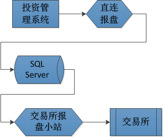
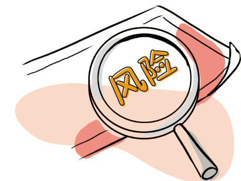

##柜台交易系统

柜台交易系统是每个证券公司的IT价值核心所在。在国外的大投行中，其核心交易系统基本是自主开发，但在中国，柜台系统主要由两家开发商：杭州的恒生和深圳的金证（当然还有金仕达、根网等等，但规模都小得多）。证券公司只需要花钱就能买来一整套的交易系统，由恒生和金证的工程师调好系统，按系统现有功能来展开业务就是了

以前大部分证券公司的柜台系统是以营业部为基本单元的。就是说，每个营业部有自己独立的柜台服务器，电话委托、网上委托、银证转账都是基于营业部，几十个营业部各管各的，互不相关。现在基本都集中到公司总部

交易所都提供了专门的数据报盘系统，这些系统通过高度专线连接到交易所机房。作为柜台交易系统的一个核心部件，恒生（金证）提供了报盘程序（叫Trans），这个程序不断地从柜台数据库的另一张重要表格Entrust（客户委托表）的内容往交易所报盘系统转发，或者反过来。Trans以毫秒计的不停的工作。做权证短线的投资客们在意的就是这些毫秒（有点夸张，但他们绝对在意秒，差1秒，他们绝对能感觉出来）

上交所的模式是这样的：恒生或金证的报盘程序将委托信息写到SQL Server，交易所的报盘系统从SQL Server中读取数据再发送到交易所；而深交所在以前使用的是DBF来进行过度，现在则是恒生或金证的报盘程序通过网关直接将委托数据以网络流的方式发送到交易所

营业部已经越来越作为营销场所和开户场所存在，目前75%以上的交易实际上是客户通过网上委托完成的。核新、通达信等软件公司开发了从客户端软件（就是我们经常见到的证券公司网站上的那些可以下载的交易软件），到服务端的解决方案。这些服务端再通过上边提到的柜台系统的AR（应用路由）软件进入交易系统的网络世界

中国的散户太多了，机构也是散户化的，交易频繁，交易模式单一，证券公司内部根本不去自主创新业务管理发展方式，监管机构也从来就不放心让证券公司自己管好自己，所以下来的操作指引也是无比的细则化，搞得大家都一个样，大家都指望一套IT系统自动的完成所有的事情。苦了金证（恒生），也成就了他们，他们俨然成了业务顾问了

##投资交易系统

投资交易系统主要应用于一些大型的基金公司、保险公司、证券自营部门等，并不像柜台交易系统那样接受外来的委托，而是根据自己的投资计划自己产生委托然后报送出去。投资交易系统的主要功能是给大机构提供丰富的交易手段完成交易工作、实时的风险控制、灵活的资产管理架构和严密的流程控制

相对于柜台系统一方面接受个人或者机构的委托，然后使用报盘程序将委托发送给交易所。投资交易系统则不接受外来的委托，所有的委托都是使用该投资交易系统的机构下单的，然后直接报送出去，具体的报单模式可以参见下面的《报盘与行情》

本文对于投资交易系统也只是一个极其皮毛的介绍，可以想见一个大型的成熟的投资交易系统在计算机软件的设计和实现层面会有多么大的复杂度

* 高并发保证尽可能快的报单
* 涉及到钱的东西一定要一万个小心，所以各个流程中的灾备需要保证好
* 在多线程、多进程的并发下处理钱、证券可用如何保证数据的一致性
* 一个完善的投资系统既可以投资现货，又可以投资期货，既要支持投资股票，又允许进行网络投票，如何合理的设计数据库表结构以兼容各种业务、各种账户模式
* 证券业务层面的需求经常变化，如何保证整个系统变动尽可能少又能适应各种需求变化和新增需求
* 像股转做市、期权做市等业务，需要产生大量的委托，对应交易所也返回大量的确认信息、废单信息、成交信息，委托需要落地到数据库，确认信息废单信息等都需要实时更新到数据库，所以如何保证在完成这些工作的情况下尽可能降低对数据库的压力
* 系统需要接收行情，而上交所、深交所都有几千只股票代码，另外还有期货交易所的很多合约行情，其最新价、五档行情几乎是实时变化，而这些信息必须实时同步到系统以方便交易员、基金经理在前台查看，如果全都更新到数据库，可以想见对数据库的压力，所以对于一些变动十分频繁的行情信息需要通过使用共享内存技术来实现同步，以减少对数据库的压力
* 等等各方各面的技术细节在一个大型的系统中的应用

##报盘和行情

交易所除了场内“有形席位”（就是那个穿红马夹的坐在一个“席位”上接受公司指令替客户买卖股票）的交易模式以外，还提供了“无形席位”的交易模式。所谓“无形席位”就是指证券公司、基金公司通过一个卫星报盘系统，用电脑自动交换业务数据，往交易所主机里发买卖股票的指令，或者接受交易所的成交确认数据。大概的报单通路是这样的：

另外基金公司等大型的金融公司和证券公司的资产管理业务本质是完全一致的。都是如何把资金在二级市场上增值。只是原来坐庄的行为不透明，是私募基金；现在的基金管理公司，高度透明，搞得是阳光投资。一批原来做资产管理的投资专家到基金公司做了基金经理

如果仔细观察你会发现，每一个证券营业部所在大楼的楼顶都会有四个直径1.2到1.5米不等的锅型卫星天线，对准东南方向的亚洲一号通讯卫星，在上交所和深交所同样有很多很多的卫星天线也对着这颗卫星。这样通过无线信号，把两个交易所和2000家证券营业部联系在一起。（某邪教疯狂作乱的时候就试图干扰那颗卫星的工作而扰乱中国的金融秩序）

营业部向上交所发送股票买卖的申请，上交所往营业部的信息反馈，由于这个过程需要双向交换数据，故称知为“上海双向小站”

上交所往营业部实时发送交易所股票交易行情数据，这个过程营业部只需要被动接受就可以，称知为“上海单向小站”，（这种类似卫星电视接受的机制，确实给营业部接受亚洲一号卫星上的电视节目提供了完备的物理基础，以至于很多营业部购买的卫星电视解码设备，为大户提供了外国电视欣赏服务）

交易所下发行情也是有多种模式的，比如当前上交所一般使用txt文件下发行情；深交所之前使用DBF文件下发行情，现在改用网络流的方式

同样，深交所也有自己的单向小站和双向小站

这四个卫星天线通过几十米的电缆，联入了营业部的机房，分别接在4台类似卧室台式电脑主机大小叫做“卫星室内单元”的铁盒子的后部。这四个盒子的背部还分别有4个网口，通过4根网线连在4台PC机上。这4台PC机，分别运行交易所提供的4套软件，分别是“上海双向小站”报盘程序、“上海单向小站”数据接收程序、“深圳双向小站”报盘程序、“深圳单向小站”数据接收程序

从93年开始，证券营业部电脑部的很重要的一项任务就是，一定要保证这些卫星通讯程序的正确运行，99年行情火爆的时候，这些程序的数分钟的中断都可能使电脑人员遭受数千元的高额处罚（当然，当时电脑人员的奖金也是极其丰厚的）

好了，有了这套卫星报盘系统，营业部与交易所的数据交换瓶颈得到完全的解决

一家证券公司的自营部门、或者大型的基金公司，它们可能直接就有对接交易所的席位，所以它们可以不通过证券公司的中转，而是直接从基金公司将委托信息发送到交易所。另外还有这样的模式：虽然是机构投资者，但并没有直接对接交易所的权利，那么就还是需要走券商柜台这个中转再报单到交易所，这时候投资交易系统直接对接的是柜台交易系统而不是交易所，所以投资交易系统要使用资金账号而不是席位来进行报单

##风险控制(风控)

由于证监会对基金公司、券商、保险公司等资产管理机构的投资有严格控制，并且机构在此范围内也会做相应的资产控制，所以就有了风险控制。其作用是实时的监控指令、委托以及整个基金当前的状况是否违反了风控系统中设置的规则，并根据风控设置的具体情况进行相应的处理

##清算

证券公司一直强调的一条铁的纪律：“清算”业务一定要由业务人员来做，IT人员绝对不允许代替他们做清算操作！这里边隐含了一些值得注意的信息

* “清算”是一个很容易让人困惑的业务
* 营业部的清算人员（一般都是财务人员）对柜台系统的“清算”过程十分的不了解，出了问题都交给IT人员处理，次数多了，就干脆由IT人员代劳了
* “清算”是很容易出问题的环节

什么是“清算”，涉及哪些业务要素，哪些业务人员，哪些IT系统，业务要素之间的关系是怎样的？

前面讲过，每个股民在柜台系统中都有一个唯一的“资金账号”，同时每个资金账号下边可以挂多个股东账号（这个股东账号就是你在登记公司开设的那个，是你在交易所买卖股票的身份凭证）。资金账号下可以有3个币种，分别存放人民币、美元、港币资金。股东账户可能有多个，如：上海A股账户、上海B股、深圳A股、深圳B股，分别存放股票份额。资金账户由证券公司管理，股东账户由登记公司管理，柜台系统中的数据只是登记公司的一个拷贝。这就是基本簿记结构。所谓“清算”就是这些账户的变动管理行为

9:15到15:00的交易时间内，柜台交易系统不断的接受客户的买卖股票的委托，向交易所报盘，和从交易所接受成交是否成功的成交回报信息。柜台系统内部有一系列的额资金记账逻辑，例如，买了股票就把客户资金减少，卖了股票就增加客户可用资金。但这些在交易时间内发生的这些资金和证券余额的变动都是临时性质的，必须通过一次“清算”活动，来把当天的所有这些业务，记录到客户的账户余额上，把当天的每笔交易情况归并到历史交易记录中

注意，交易所实时返回的成交回报记录只是对是否成交的通知，成交产生的结果必须由登记公司说了算。交易所和登记公司的不同法律定位，交易所只对交易负责，登记公司才决定哪些人拥有哪些股票。登记公司每天5点多钟，会对每天发生的交易业务生成一些具有法律认同作用的DBF文件（包含白天每笔交易情况的成交回报数据、股份变动通知等等信息），通过卫星通讯系统发给每个营业部。根据这些数据记录，营业部的柜台系统再把交易涉及的资金和股份变动情况记到每个股民头上

有没有可能白天交易所给我数据与登记公司给我的数据不一致，理论上而言，这是有可能的，并且必须以登记公司发来的数据作为给客户记帐的凭据。（仅仅是理论上，事实上从没有不一致过。这样描述只是为了让大家明白，交易时间交易所给我们的，以及我们给股民的那些信息从理论上讲都是不算数的，只有等登记公司发来数据后，我们再把这些数据记录到股民户头上，整个一天的交易才算数）

>归根到底，交易和结算时两个完全不同的业务活动，我们国家目前的证券交易行为最致命的风险就是这两个活动混在一起，大家都说不清道不明

交易活动，一般只是客户服务行为，虽然可以看到交易的结果，但不对交易产生的股票归属负责；结算，是交易产生的归属权的变更的负责。客户白天看到的交易产生的自己帐户上余额的变化信息只是一个通知，这些归属权的变动必须在晚上证券公司做完清算以后才有效

**三级清算**：相对登记公司对证券公司的以及清算，证券公司总部对证券公司营业部的二级清算，营业部对具体客户的清算叫做三级清算

投资交易系统的日终清算功能是系统根据交易所发送的清算数据及登记公司发的结算数据对当天交易业务和权益类数据进行处理