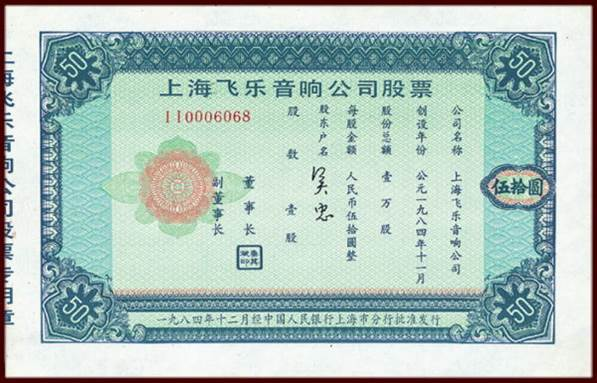
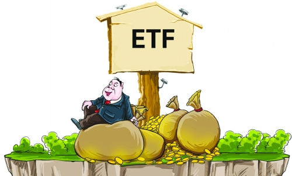
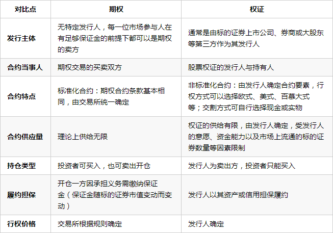
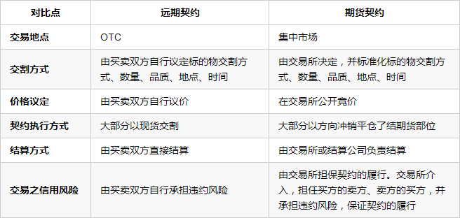

##债券

债券是指债务人发行的承诺在未来还本付息的凭证

比如中央政府发行的国债，地方政府发行的地方债。还有企业因为融资的需要可能会发行公司债，比如我购买了公司A发行的公司债，那么就相当于公司A欠了我相应数量的钱，换句话说，我和公司A之间的关系就是债权人和债务人的关系。既然是借钱，那就不能免俗先要确定一下借钱的利息问题，按照大家正常的思维国债的利率要低于公司债的利率，这里就又涉及到金融证券市场的两个关键词：信用和风险。很显然一个公司发行债券，购买债券的人总会担心这家公司可能会经营不利，可能会到时候没办法连本带息的还给我们；而国债是我们将钱借给中央政府，一个国家的信誉绝大多数情况下要好于一个普通的企业。信用越高、风险越低，当然利率也就越低

除了国债、地方债、企业债，还有金融债，金融债是由银行或其他金融机构发行的融资工具。银行的信誉高于企业，低于国家，因此金融债的利率水平，介乎国债和公司债的利率之间

英国经济学家威廉·配第认为：利息是暂时放弃货币的使用权所应获得的报酬。配第的这个利息定义，十分简洁、清晰，至今仍然是经典的利息定义。暂时放弃货币的使用权为什么应该收货报酬，首先我把货币借给了你，那么我多少要承担你未来不能偿还的风险；另外在借钱给你用的时间段内，我还会损失其他可能更好的投资机会；还要通货膨胀等各种现实存在的风险

在我国，你拥有的债券可以托管在中央债券登记公司，也可以托管在中国证券登记公司（下辖上海、深圳两个分公司），分别在银行间债券交易市场和交易所交易。两个登记公司都提供转托管服务，债券所有人可以任意在不同的登记公司之间转来转去。银行间市场是典型的货币市场，而证券交易所是典型的资本市场，所以债券成了跨越两个市场的交叉产品

直接买卖债券，那么这个债券就叫现货。但很多时候，两个金融机构直接只是想互相借钱（调拨头寸），债券只是一个抵押物，那么比如商业银行借多少钱要多少抵押物呢？每周登记公司会根据历史价格通过一个固定的复杂公式算出每只债券的“折算率”（例如：0.95，越是信用高的债券折算率越高）。这只债券的交易价格乘以这个折算率，就是所谓“标准券”。银行有多少标准券，就能借多少钱。一般银行有多少标准券（就是现货的价值再通过折算率打个折扣。抵押物嘛都要打折扣），那么银行就能借多少钱进来。标准券是虚的，只是一种计算方法

>总之债券是货币市场和资本市场之间的边缘产品，拥有浓厚的货币市场特征

##股票

股票是股份有限公司在筹集资本时提供给出资人的股份凭证。每一份股票（公司资本的最小单位）代表一份相等的所有权。持有公司股份的人是股东，有收取股息和红利、参加股东大会、参与公司经营以及选举权和被选举权等权利

股份有限公司的最大特点就是责任有限，个人对公司的全部经济责任，只限于出资额，公司无权要求股东承担超出出资额的任何责任。而公司也只以其全部的财产对公司的债务负责。公司破产时，公司不能动用股东的家产还债。通俗说，股份有限公司不用股东搭上全部身家。而个人独资、合伙企业等公司制企业则迥然不同！

股票转让的方式包括场内交易和场外交易，在我国场内交易就是在沪深股票市场内集中和竞价交易

这里区分一下债券和股票。一个企业既可以通过发行债券也可以通过发行股票来进行融资。假如我买的是一个企业发行的债券，则我和这个企业的关系是：这个企业欠我的钱；而如果我是买的一个企业发行的股票，则我和这个企业的关系是：我拥有这个企业的一部分资产。更明显的差别是在企业破产的时候，剩余的资产当然先要用来还钱，也就是现将剩余资产还给拥有企业债券的人，剩下的钱才是按照大家的股份，分给持有该企业股票的投资者

##基金

基金一般指的是证券投资基金，是通过发行基金单位集中投资人的资金，由基金托管人托管，由基金管理人管理，投资于股票、债券，再将受益按照基金份额分配的金融产品

基金的品种繁多，为不同的投资者提供了适合自己的选择，下面列举一些比较特殊的基金种类

**ETF：交易型开放式指数基金**

ETF是以某一选定的指数所包含的成分证券为投资对象，依据构成指数的股票种类和比例，采取完全复制和抽样复制，进行被动投资的指数基金

所谓实物申购、赎回机制，是指投资者向基金管理公司申购ETF，需要拿这只ETF指定的一篮子股票来换取；赎回时得到的不是现金而是相应的一篮子股票，如果想变现，需要再卖出这些股票。当然只有资金达到一定规模的投资者才能参与ETF一级市场的实物申购、赎回

假如像我们这样的个人投资者，钱不多那能不能投资ETF呢？是可以的，只是不能在一级市场进行申赎，而是在二级市场进行买卖

当同一商品在不同市场上价格不一致时就存在套利的机会，而ETF正好是一种既可以在一级市场申赎，又可以在二级市场买卖的基金品种，当两个市场上的价格不一致时，就存在套利的机会

**LOF：上市开放式基金**

封闭式基金指基金份额在基金合同期限内固定不变，基金份额可以在依法设立的证券交易所交易，但基金份额持有人不得申请赎回的一种基金运作方式；对应的，开放式基金是指基金份额不固定，基金份额可以在基金合同约定的时间和场所申赎的一种基金运作方式

上市开放式基金，按照字面的理解，首先是一种开放式基金，可以在场外市场进行基金份额申赎，同时又可以在交易所进行基金份额交易和基金份额申赎。和ETF相比，尽管同样是交易所交易的开放式基金，但就产品特性看，深交所推出的LOF在世界范围内具有首创性

与ETF相区别

* LOF不一定采用指数基金模式，也可以是主动管理型基金
* 申购和赎回均以现金进行，对申购和赎回没有规模上的限制
* 可以在交易所申购、赎回，也可以在代销网点进行

LOF所具有的可以在场内外申购、赎回，以及场内外转托管的制度安排，使LOF不会出现封闭式基金大幅度折价交易的现象

**分级基金**

分级基金通过实现约定基金的风险收益分配，将基础份额分为预期风险收益较低的子份额和预期风险收益较高的子份额，并可将其中一类或全部类别份额上市交易的结构化证券投资基金。一般将预期风险收益较低的子份额称为A类份额，将预期风险收益较高的子份额称为B类份额

以我国目前股票型分级基金为例，基础份额一般被拆分为A、B两类子份额，其中A类份额根据基金合同的约定可以获得基准收益，通常是约定一个固定的年化收益率，当基金投资出现亏损时，B类份额需弥补A两类份额的本金损失并满足最低回报要求。作为补偿，在基金表现较好时，A类份额将部分或全部的超额收益让渡给B类份额，作为B类份额承担较高风险的补偿。所以这样使得一只基金同时具有了风险收益特征不同的三类份额：A类份额具有低风险、收益稳定的特征，适合保守型投资者；B类份额具有高风险、高回报的特征，适合激进投资者；基础份额等同于普通激进份额，风险、收益适中，适合稳健性投资者

与LOF类似，分级基金可以通过场外、场内两种方式募集，通过场外与场内获得的基金份额分别被注册登记在场外系统和场内系统，但基金份额可以通过跨系统转托管实现在场外市场和场内市场的转换。基金成立后，场内的基础份额拆分为A类份额和B类份额，并上市交易，即场内可存在三类份额：基础份额、A类份额、B类份额，实现了不同风险收益特征的A类份额和B类份额可分离交易

按照募集方式不同，可将分级基金分为合并募集和分开募集两种类型。合并募集是统一以母基金代码进行募集，募集完成后将基金份额按比例分拆为子份额；分开募集是分别以子代码进行募集，通过比例配售实现子份额的配比

**QDII基金**

QDII的意思是：合格境内机构投资者。QDII基金市值在一国境内设立，经该国有关部门批准从事境外证券市场的股票、债券等有价证券投资的基金。它为国内投资者参与国际市场投资提供了便利

##黄金

我国有专门成立的上海黄金交易所可以从事黄金现货交易、Au(T+D)交易；除此之外，还可以在上海期货交易所从事黄金期货的交易

##金融衍生工具

按照产品形态，金融衍生工具可分为期权、远期、期货和互换，它们有三个共同特点

第一，金融衍生工具交易的不是标的资产而是合约。金融衍生工具交易的对象，不是衍生出它们的金融资产或者实物资产，而是衍生工具合约

第二，金融衍生工具实行保证金交易，和买卖股票、债券需要十足的相当于这些股票债券的价格投入不同，金融衍生工具一般只需投入合约标的总金额的一个较小的比例，即保证金，就可以了。这就是保证金交易。保证金交易是一种杠杆工具，以小博大，投资者用一笔相对小的资金，就能支配很大金额的标的资产价值

第三，金融衍生工具是在未来的某一天结算，也就是跨期结算。这也不同于传统金融佛那工具的现货结算方式

##期权

期权是买方和卖方签订的一份合约，它给予买方在将来的某个日期或者该日期之前，以双方约定的价格买入或卖出标的资产的权利。期权的买方就是付出期权费的一方，卖方就是收到期权费的一方。期权的买方到了规定日期，不管是否执行期权（买入或卖出），都不能收回期权费。卖方一定能收到期权费，但除此之外并不其他所得

**看涨期权**

看涨期权就是给期权的买家，在给定的时间内，以约定的价格，买进标的物资产的权利。因为买家可以因标的物价格的上涨获利，所以叫做看涨期权

比如一个大豆期权，以一个月为期限，执行价格是3800元/吨

1月1日，买家在执行价格为3800元/吨时，买入这个权利，支付10元的期权费，卖家卖出这个期权，收入10元的期权费

假如2月1日，大豆价格上涨到3900元/吨，买家有两种选择：

第一：从市场以3800元/吨的价格向卖家买进大豆，卖家必须接受。买家获取90（3900-3800-10）元；第二：出售这个权利，价格是100元（完全可能，当然实际价格也许稍低，因为谁拥有了这个期权就可以赚取100元），同样获利90（100-10）元

假如2月1日大豆价格下跌了，买家没有交易的义务，选择不交易，只损失10元的期权费

**看跌期权**

看跌期权是给期权的买家在设定时间内，以约定价格卖出标的资产的权利。因为买家可以因标的物价格下跌而获利，所以加看跌期权

比如一个大豆期权，以一个月为期限，执行价格是3800元/吨

1月1日，买家在执行价格为3800元/吨时买入这个权利，支付10元的期权费，卖家卖出这个权利，收入10元

假如2月1日，大豆价格价下跌到3700元/吨，因为大豆价格下跌，出现了100元的价格差，看跌期权的价格涨至100元，因为谁拥有这个权利，就可以通过出售获利100元。此时买家有两种选择：

第一：可以以3700元/吨的价格从市场上买入大豆，然后以3800元/吨的价格出售给卖家，后者必须接受，买家从中获利90（3800-3700-10），卖家损失90元；第二：买家也可以把这个权利以100元的价格卖出，同样获利90（100-10）元

另一种情况是，2月1日，大豆价格上涨，买家就会放弃这个期权，损失10元期权费，卖家则净赚10元的期权费

以上的例子再次说明，期权的买家，无论在看涨期权还是看跌期权，都只有权利而没有义务，即不一定非得买或卖，他的风险是非常有限的，最多仅仅损失期权费，而获利在理论上时候无限的；与买家相反，期权的卖家，无论是卖出看涨期权还是看跌期权，都只有义务而没有权利，如果买家行使权利，他不能拒绝，他的最大收益仅仅是买家最初交给他的期权费，而风险是无限的。正是因为这个特点，期权的买家不用向交易所缴纳保证金，而卖家必须缴纳保证金，因为当事情对他不利的时候，他有可能不会承担买卖的义务

期权和权证的区别

##远期

远期交易就是交易的双方按照当日约定的价格，在未来的某一天买卖某种商品或者资产。交易不是在当日发生，而是在较远后的某个日期

如果粮食加工厂的老板担心3个月后粮价上涨太多，可以找到粮商，双方谈出一个价格，按照这个价格，粮食加工厂还能获得和目前一样的较为丰厚的利润。他们交易的具体条件可以写成一个合约，比如粮食的品种、数量、质量、交易时间、付款方式等等。如果三个月后，粮价真的上涨了，他就会收益，因为他仍然可以按照当初和粮商谈好的价格，而不是三个月以后已经上涨的价格买进粮食。如果粮价下跌了呢？他也得按照合约的价格卖出粮食，但是也并没有吃亏，因为这个价格是他当初已考虑到而且能承受的工厂依然有利润的水平，他只是没有占到便宜

那么粮商为什么也愿意签这样的合约呢？因为粮商手中囤积了大量的粮食，也怕粮价变动打来损失。假如三个月后粮价下跌了，粮商就要赔钱也存在风险，也要想办法规避风险。如果与粮食加工厂签订了远期合约，价格也是粮商可以接受的，即能盈利或者不至亏损的水平，及时三个月后粮价真的下跌了，粮商的利益也能得到保证。所以远期合约是双赢的交易

远期交易看起来很像期权，都是在未来的某个时期交易标的物。但是远期交易和期权有很大的区别。期权的买方有买卖的权利，而没有一定要买卖的义务，也就是买方可以不执行合约。但远期交易不同，双方都有执行的义务，到时候必须执行合约规定的交易。远期交易其实并不是严格的金融衍生品

生活中也有很多远期交易的例子，比如预订机票，一般越是提早，越是便宜。但是便宜机票固然省钱，但廉价一票一般不允许退票，这就体现了远期交易不可撤销的特点

##期货

远期交易虽然有规避生产者损失的巨大作用，但是场外交易是不规范的，特别是合约没有标准化，交易者违约后，很难得到惩戒。而且远期交易也很麻烦，因为涉及产商品或资产的实物交割（这反而正是远期交易熨平生产风险的原因）

1848年世界第一家期货交易所————芝加哥期货交易所成立。1865年，该交易所推出了某个标准化的远期合约，被称为“期货合约”，简称“期货”，以取代原来的远期合约

标准化合约是期货交易所统一制定的，规定在将来某一特定的时间和地点，交割一定数量标的物合约。期货，买卖的不是具体的商品或者资产，而是合约。期货标准化合约产生的过程大概是这样的：聪明人发现，根本不需要进行真实的商品和资产交易，如农产品的买卖，也不需要辛苦储藏农产品，只需从事远期价格的投资，也就是买卖合约本身就能获利

期货合约和远期交易有联系，远期交易是期货产生的基础，但它们又有本质的区别。期货是一种全新的金融衍生品，远期交易是分散进行的，合约没有进行标准化处理，五花八门。期货交易是集中在专门的交易场所进行的，合约是标准化的、统一的。更大的区别是，远期交易的价格是交易双方私下确定的，但期货的价格是由交易所内众多买家和卖家通过集合竞价的方式产生的，类似股票的价格

远期和期货的对比

期权和期货的对比

期货涉及的标的物就是合约对应的“基础资产”，可以是粮食、原油、金属等商品，也可以是金融工具，比如外汇、股票指数。如果标的物是商品就是商品期货，标的物是金融工具，就是金融期货。无论是商品期货还是金融期货，它们一般都不实际交个商品或者货币等金融产品，只是买卖合约本身

我国的目前有四家期货交易所，分别是：上海期货交易所、郑州商品交易所、大连商品交易所和中国金融期货交易所

举个例子，买家以10万元进行大豆期货投资，嘉定交易所规定的初始保证金比例是10%。买家1月1日以1万元/份（份是交易所规定的，比如10吨为1份）的几个，买入3月1日到期的大豆期货合约

由于初始保证金是10%，买家可以用10万元买入100份总价值为100万元的大豆合约，注意，这在现货市场是不可想象的。杠杆交易使得投资者用10万元撬动价值100万元的资产

第二天，即1月2日，大豆合约价格上涨10%（当然是因为大豆价格上涨），买家就可以将合约卖出，赚取10万元，收益率是100%！

如果价格下跌10%，买家就亏损10万元，收益率是-100。此时，买家的全部保证金只够赔人家的钱，买家如果想再进行交易，就必须追加保证金，如果不追加，交易所为了保证双方的利益，就要强制买家“平仓”

##互换

互换是金融交易的协议，协议双方约定，在未来的一段时间内（比如两年），互相交换一系列（不止一次）的付款。互换有两种基本类型：货币互换和利率互换

货币互换时，协议双方互换的是不同的货币，假如A公司借美元比较方便，但从经营角度看，使用日元比较便利；B公司借日元比较方便，但从经营角度看使用美元更方便。这样双发达成协议，A和B按照汇率借入等额的日元和美元，然后在约定的期限内，互相为对方支付利息，带债务期满时，互相支付对方的本金。这样，就不用再进行货币兑换，免除了不同货币兑换的麻烦，也免除了其中的汇率风险

利率互换是更典型意义上的互换。利率互换是协议双方在同种货币的基础上，在预先规定的时间内，为对方支付利息。利率互换并不是交还本金，但需要约定一个名义本金，因为本金是计算利息的依据

互换也是买卖，也有买方和卖方。通常，把浮动利率的支付者即固定利率的接受者叫做互换的卖方；固定收益的支付者即浮动利率的接受者叫做买方
