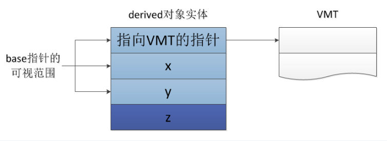
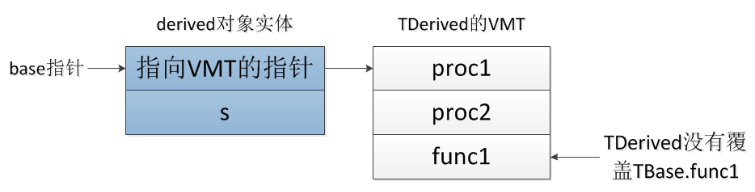
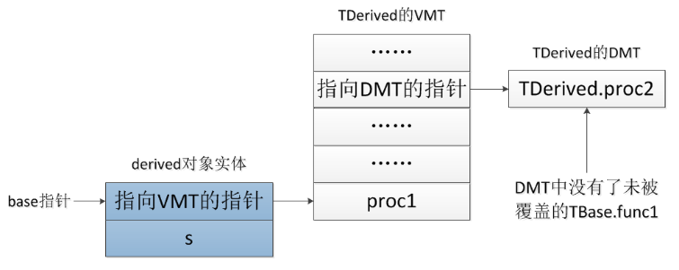

多态的本质是“将派生类类型的指针赋值给基类类型的指针”。那么，为什么这种赋值是允许的，或者说是安全的呢？

从语义上讲，继承所表现的是“是一种”关系，也就是说，每个派生类对象必定“是一种”基类对象。所以任何向基类类型的请求，派生类对象都可以无条件地正常处理。因为麻雀“是一种”鸟，燕子“是一种”鸟，所以所有对于鸟的操作请求，它们都应该正常处理

从语言上来讲，由于派生类通常比基类拥有更多的数据成员而不是更少，派生类对象所占用的内存空间必定大于等于基类对象所占的内存空间。所以将基类类型的指针指向派生类类型的对象时，在指针的可视范围中的内存必定是可用的，这一部分内存空间必定是属于对象的。所以这种赋值行为是合法的、安全的

## Delphi的继承

首先定义一个基类TBase

```
TBase = class
private
	x: Integer;
	y: Integer;
end;
```

定义继承自TBase的子类TDerived

```
TDerived = class(TBase)
private
	z: Integer;
end;
```

可以将基类的指针指向其派生类的对象

```
var
	base: TBase;
	derived: TDerived;
begin
	derived := TDerived.Create();
	base := derived;

	//以上代码可以简化为 base := TDerived.Create();

	...
end;
```

TBase类型的指针（base指针）指向了derived对象实体所在的内存首地址。因为每个派生类对象实体中都包含一个完整的基类对象实体，此处的base指针可以访问的范围正是这个完整基类（TBase）对象实体的大小。因此，base指针始终可以合法地访问其所指向的内存空间



>本文内容主要参考自[《Delphi高手突破》](http://nicrosoft.net/category/book/)

## Delphi 6类的VMT

Delphi的面向对象语法中，当创建一个类的实例后，编译器会在该对象的内存空间的首4个地址安插一个指针，该指针所指向的地址称为VMT（Virtual Method Table，虚方法表），这个表中存放了该类的所有虚方法的入口地址。在Delphi中，所有类实例都会有这么一个指向VMT的指针。如果没有在类中声明虚方法，则该指针值为nil

假如有一个父类TBase以及它的一个派生类TDerived

```
TBase = class
protected
	s: string;
public
	procedure proc1(); virtual; abstract;
	procedure proc2(): virtual; abstract;
	function func1(): string; virtual;
end;

TDerived = class(TBase)
public
	constructor Create();
	destructor Destroy(); override;
	procedure proc1(); override;
	procedure proc2(); override;
	//没有覆盖TBase.func1()
end;
```

用TBase类型指针创建一个TDerived对象实例

```
var
	base: TBase;
begin
	base := TDerived.Create();
end;
```

这时base指针指向的对象内存模型如下



没有被派生类覆盖的方法，编译器会基类的该方法的实现入口地址填入派生类的VMT中。比如上面的例子，TDerived类覆盖了基类TBase的proc1()和proc2()，因此在TDerived的VMT中，proc1()和proc2()被确定为TDerived自己所实现的方法入口地址。而由于TDerived没有覆盖父类的func1()方法，所以在TDerived的VMT中还是填入TBase.func()的入口地址

继续上面的代码，所以当调用base.proc1()时对应调用子类TDerived实现的proc1()方法，而当调用base.func1()时则对应调用的父类TBase实现的func1()方法

这部分的解释总体和C++对象内存模型一致，可以对比[《C++对象内存模型》](http://www.xumenger.com/tags/#C++对象内存模型)系列以更深入的了解

这里存在一个问题，TBase的析构方法也是virtual的，为什么没有出现在VMT中呢？其实并非VMT中没有析构函数，只能说它没有出现在我们能看到的VMT中。之前所说的“指向VMT的指针”所指向的VMT，其实只是真正的VMT的一部分，也就是用户定义的第一个虚方法的位置。如果以这个位置作为原点，向正方向即刚才所说的VMT。而向负方向则是语言定义的另一些类信息所在的地址，析构函数地址就被放在了负方向上了。Delphi之所以这么做，是为了使得Delphi的VMT与C++以及COM的vtabl（虚函数表）兼容！

## Delphi 6的VMT布局

偏移地址  |  类型    |    描述
----------|----------|---------------------
 -76      | Pointer  | pointer to virtual method table (or nil)
 -72      | Pointer  | pointer to interface table (or nil)
 -68      | Pointer  | pointer to Automation information table (or nil)
 -64      | Pointer  | pointer to instance initialization table (or nil)
 -60      | Pointer  | pointer to type information table (or nil)
 -56      | Pointer  | pointer to field defination table (or nil)
 -52      | Pointer  | pointer to method defination table (or nil)
 -48      | Pointer  | pointer to dynamic method table (or nil) 指向DMT的指针
 -44      | Pointer  | pointer to short string containing class name
 -40      | Cardinal | instance size in bytes
 -36      | Pointer  | pointer to a pointer to ancestor class (or nil)
 -32      | Pointer  | pointer to entry point of SafecallException method (or nil)
 -28      | Pointer  | entry point of AfterConstruction method
 -24      | Pointer  | entry point of BeforeDestruction method
 -20      | Pointer  | entry point of Dispatch method
 -16      | Pointer  | entry point of DefaultHandler method
 -12      | Pointer  | entry point of NewInstance method
 -8       | Pointer  | entry point of FreeInstance method
 -4       | Pointer  | entry point of Destroy destructor
 0        | Pointer  | entry point of first user-defined virtual method
 4        | Pointer  | entry point of second user-defined virtual method
 4n(n>1)  | Pointer  | entry point of n+1 user-defined virtul method (n是整数)


可以看到，偏移地址-28~-4所存放的都是TObject的虚方法地址，当然析构函数也在其中

>Delphi中所有类（除TObject类外）都是从TObject类派生的！C++中则不存在这样一个所有类都必须继承的基类！

## Delphi 6类的DMT

上面表格中，在偏移量-48处是一个指向DMT的指针。在VMT中可以看到，派生类的虚方法表完全继承了基类的虚方法表，只是将被覆盖了的虚方法的地址改变了。基类和每个派生类都有一份自己的虚方法表。可以想象，随着类层次的扩展，虚方法表将耗费非常大的内存空间。为了防止这种情况，Delphi引入了“dynamic”的概念。对程序员来说，dynamic方法和virtual方法实现相同的功能，只是声明的关键字不同

被声明为dynamic的方法，其入口地址将被放在DMT中。DMT和VMT的区别在于：对于派生类没有覆盖的方法，这些方法的入口地址不会出现在DMT中，编译器要通过基类的信息来寻找它们的入口地址

还是上面的例子，将proc2、func2改成dynamic，proc1还是保持virtual

```
TBase = class
protected
	s: string;
public
	procedure proc1(); virtual; abstract;		//仍保持为virtual
	procedure proc2(); dynamic; abstract;		//将virtual改为dynamic
	function func1(): string; dynamic;			//将virtual改为dynamic
end;

TDerived = class(TBase)
public
	constructor Create();
	destructor Destroy(); override;
	procedure proc1(); override;
	procedure proc2(); override;
	function func1(): string; override;			//不覆盖TBase.func1()方法
end;
```

TDerived类对象的内存模型如下，可以看到DMT中没有func2，因为func2被声明为dynamic，但TDerived又没有实现该方法去覆盖TBase的func2方法：



由于DMT中不会出现没有被派生类覆盖的基类dynamic方法，因此DMT会比VMT节省空间（大多数情况下）。当基类有许多虚方法，而派生类只覆盖很少几个时，区别尤其明显。当派生层次越来越深，派生类数量越来越多，DMT就能节省更多的空间。但DMT中对基类的动态方法的寻址不是直接进行的，因此dynamic方法的寻址相比于virtual要慢得多

virtual和dynamic的区别仅在于编译器采用不同的晚绑定策略而已，对于程序员而言，其功能是相同的，具体选择使用dynamic还是virtual需考虑程序是更注重性能还是更注重内存空间！

>另外需要注意的是，只有VMT才与C++、COM的vtable兼容，因此当需要这样的兼容性时，只能使用virtual

推荐一篇关于C++、COM的文章：[《关于 COM 的无责任评论》](http://blog.codingnow.com/2005/09/about_com.html)
