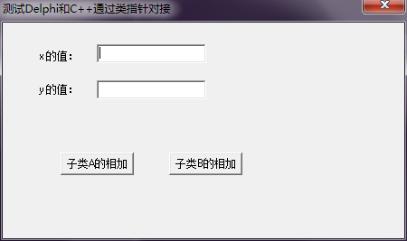
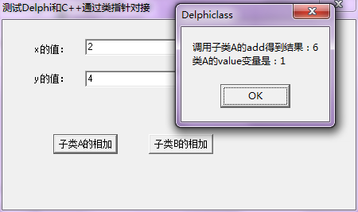
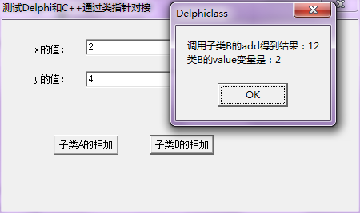
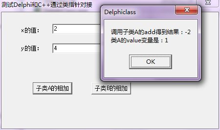
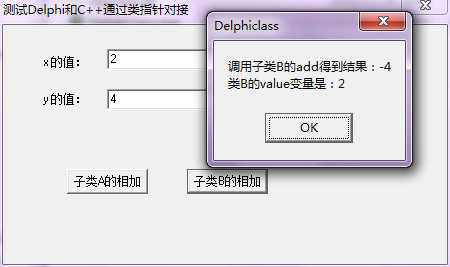

之前的系列博客[《Delphi配合VC++开发 》](http://www.xumenger.com/tags/#Delphi配合VC++开发)中有讲到如何对接Delphi和C/C++进行开发。比如你们部门使用的主流开发语言是Delphi，但第三方接口给的是C++接口，那么就很有必要使用DLL将C++的接口进行封装，然后在Delphi端进行调用

在[《Delphi配合VC++开发 》](http://www.xumenger.com/tags/#Delphi配合VC++开发)系列中讲到了如何使用导出函数进行两种语言间的对接，其中导出函数的参数和返回值可以是基础的int、char等类型，也可以是基于基础数据类型扩展而来的指针、函数指针、数组、结构体

>再深入想想：C++是面向对象的开发语言，Delphi也是面向对象的开发语言，那么Delphi对接C++开发的时候，能否使用类进行对接？

##类指针和类对象

假设有一个类TestClass

在Delphi中声明类的语法是这样的：

```
var
	aObject: TestClass;
begin
	aObject := TestClass.Create(...);
end;
```

注意对应在C++中的声明语法是声明一个类指针：

```
{
	TestClass *aObject;
	aObject = new TestClass(...);
}
```

而不是如下这样声明一个类对象变量：

```
{
	TestClass aObject;
}
```

如上，在Delphi中只能声明类指针，而在C++中既可以声明类指针也可以声明类变量，如果要进行对接，则必须统一使用类指针

##C++端定义接口和类

以下代码在VC++ 6.0中开发、编译。C++端的代码大概思路是：先声明一个接口类，定义了其子类的接口；然后实现两个子类，分别实现父类的方法，然后通过导出函数允许动态创建子类A或者子类B

先在main.def中定义导出信息

```
LIBRARY			"cppclass"
DESCRIPTION		'测试C++和Delphi通过类进行对接'

EXPORTS
	getClass
```

在TestClass.h中定义接口类和具体的实现类

```
//因为子类需要跨语言传递，所以双方需要约定好共同使用__stdcall调用约定

//定义一个接口类
class testInterface
{
	public:
		//定义一个变量
		int value;
		//定义一种加法，结果是x add y 的值
		virtual int __stdcall add(int x, int y) = 0;
		//定义一种减法，结果是x sub y 的值
		virtual int __stdcall sub(int x, int y) = 0;
};

//实现一个具体的子类A
class testDerivedA : public testInterface
{
	public:
		//子类A实现一种加法
		int __stdcall add(int x, int y);
		//子类A实现一种减法
		int __stdcall sub(int x, int y);
};

//实现一个具体的子类B
class testDerivedB : public testInterface
{
	public:
		//子类B实现一种加法
		int __stdcall add(int x, int y);
		//子类B实现一种减法
		int __stdcall sub(int x, int y);
};
```

在TestClass.cpp中实现两个子类

```
#include "TestClass.h"

//A子类实现的add就是两个参数相加
int testDerivedA::add(int x, int y)
{
	return x + y;
}

//A子类实现的sub就是两个参数相减
int testDerivedA::sub(int x, int y)
{
	return x - y;
}

//B子类实现的add就是两个参数相加，然后乘以2
int testDerivedB::add(int x, int y)
{
	return 2 * (x + y);
}

//A子类实现的sub就是两个参数相减，然后乘以2
int testDerivedB::sub(int x, int y)
{
	return 2 * (x - y);
}
```

在main.h中定义导出方法

```
#include "TestClass.h"

extern "C"
{
	testInterface* __stdcall getClass(int type);
}
```

在main.cpp中实现导出方法

```
#include<iostream>
#include "main.h"

using namespace std;

testInterface* __stdcall getClass(int type)
{
	testInterface *tb = NULL;
	if (1 == type){
		tb = new testDerivedA();
		tb->value = 1;
	}
	else if (2 == type){
		tb = new testDerivedB();
		tb->value = 2;
	}

	return tb;
}
```

##Delphi端对应的调用代码

以下代码在Delphi 6中开发、编译。Delphi的实现大概思路是：加载C++端的dll文件，获取导出方法，调用getClass获取对应的类，然后调用C++类的相关方法

首先是在CppClass.pas中定义对接C++端类（方法需要使用virtual和abstract关键字），并通过静态加载的方式加载DLL

```
//说明：定义对接C++端的类、使用静态加载DLL方法加载C++端导出函数
unit CppClass;

interface

uses
  Classes;

type
  //定义接口类
  TestInterface = class
  public
    value: Integer;
    function add(x: Integer; y: Integer): Integer; virtual; stdcall; abstract;
    function sub(x: Integer; y: Integer): Integer; virtual; stdcall; abstract;
  end;

function GetClass(Class_Type: Integer): TestInterface; stdcall; external 'cppclass.dll' name 'getClass';

implementation

end.
```

然后在主窗体中调用并将调用的结果用弹出框展示

```
unit MainFrm;

interface

uses
  Windows, Messages, SysUtils, Variants, Classes, Graphics, Controls, Forms,
  Dialogs, StdCtrls, CppClass;

type
  TForm1 = class(TForm)
    edtX: TEdit;
    edtY: TEdit;
    lbl1: TLabel;
    lbl2: TLabel;
    btn1: TButton;
    btn2: TButton;
    procedure btn1Click(Sender: TObject);
    procedure btn2Click(Sender: TObject);
  private
    { Private declarations }
  public
    { Public declarations }
  end;

var
  Form1: TForm1;

implementation

{$R *.dfm}

procedure TForm1.btn1Click(Sender: TObject);
var
  DerivedA: TestInterface;
  x, y: Integer;
  ret: Integer;
begin
  DerivedA := GetClass(1);
  x := StrToInt(edtX.Text);
  y := StrToInt(edtY.Text);

  ret := DerivedA.add(x, y);
  ShowMessage('调用子类A的add得到结果：' + IntToStr(ret) + #13#10 + '类A的value变量是：' + IntToStr(DerivedA.value));
end;

procedure TForm1.btn2Click(Sender: TObject);
var
  DerivedB: TestInterface;
  x, y: Integer;
  ret: Integer;
begin
  DerivedB := GetClass(2);
  x := StrToInt(edtX.Text);
  y := StrToInt(edtY.Text);

  ret := DerivedB.add(x, y);
  ShowMessage('调用子类B的add得到结果：' + IntToStr(ret) + #13#10 + '类B的value变量是：' + IntToStr(DerivedB.value));
end;

end.
```

##运行效果和说明

本文对应的程序源码点击[这里](../download/20161128/testClass.zip)下载，多说一句，以上纯粹是为了展示效果，所以代码实现的时候对于内存管理、异常处理都没有做考虑

打开exe程序



输入x=2，y=4，点击【子类A的相加】，结果是6，确实是在C++的子类A中定义的add方法；而且输出的value确实是在C++赋的值1



输入x=2，y=4，点击【子类B的相加】，结果是12，确实是在C++的子类B中定义的add方法；而且输出的value确实是在C++赋的值2



可以看出跨语言后多态还是有效的！

>**思考**：以上的实际运行效果验证了Delphi是可以通过类和C++对接的，但我记得之前看过的书[《Delphi高手突破》](http://nicrosoft.net/category/book/)讲到的Delphi对象的内存模型和C++的对象内存模型并不是一致的？为什么这里的实际效果取实实在在的可以进行对接？经过[《C++对象内存模型》](http://www.xumenger.com/tags/#C++对象内存模型)系列文章我们可以很清楚的知道本文中的C++类的内存模型，但是本文中的Delphi类的内存模型是什么样的？关于Delphi对象的内存模型还是得结合C++进行对比学习，然后在返回来好好理解为什么文本例子是这样的运行效果？！

##Delphi端类方法如何与C++端类方法对应

上面的例子中可以看到Delphi端的add与C++端的add准确的对应起来，但实际上只是一种巧合，试着将Delphi端对应类的add和sub方法换一下位置：

```
//说明：定义对接C++端的类、使用静态加载DLL方法加载C++端导出函数
unit CppClass;

interface

uses
  Classes;

type
  //定义接口类
  TestInterface = class
  public
    value: Integer;
    function sub(x: Integer; y: Integer): Integer; virtual; stdcall; abstract;
    function add(x: Integer; y: Integer): Integer; virtual; stdcall; abstract;
  end;

function GetClass(Class_Type: Integer): TestInterface; stdcall; external 'cppclass.dll' name 'getClass';

implementation

end.
```

编译后，输入x=2，y=4，点击【子类A的相加】，结果是-2而不是6，细心些可以发现调用的其实是C++端的子类A的sub方法



编译后，输入x=2，y=4，点击【子类B的相加】，结果是-4而不是12，细心些可以发现调用的其实是C++端的子类B的sub方法



上面的运行情况，我们可以得到结论，使用本文方法来实现使用类对接Delphi和C++时，Delphi和C++端类的成员变量的对应关系并不是通过函数名来实现的，而要严格约定好成员变量的对应顺序，否则在运行时调用的可能不是我们预期的成员方法

##总结

>平时的学习中我们可以钻研各种奇技淫巧以深入了解内部的运行机制，但在实际的开发中代码还是越简单越好！
