>开发环境：Windows 7、Visual C++ 6.0

调试的程序源码如下

```
#include<stdio.h>

int main()
{
	//定义3个整型的指针变量
	int *p = NULL;			//32位整型
	__int64 *q = NULL;		//64位整型
	char *m = NULL;			//char型，8位

	//使用new分配一个整型的内存空间
	p = new int;
	if (NULL == p){
		return -1;
	}
	//对指针变量p指向的内存空间赋值
	*p = 0x11223344;

	//q和m操作同p
	q = new __int64;
	if (NULL == q){
		return -1;
	}
	*q = 0x1122334455667788;

	m = new char;
	if (NULL == m){
		return -1;
	}
	*m = 0x11;

	//释放3个变量指向的地址空间
	delete q;
	q = NULL;

	delete m;
	m = NULL;
	
	delete p;
	p = NULL;

	return 0;
}
```

在Visual C++开发工具下，对于以上的项目源码按F7进行编译连接，生成可执行文件。上面的程序是在运行时动态申请堆内存的。堆空间是在程序运行时由程序员自己申请的空间，该空间同样需要程序员自己进行释放。在C++中，使用new申请堆空间，delete释放；在C中使用malloc()和free()实现内存的申请和释放。与堆空间对应的是栈空间，栈空间是由系统进行维护的空间，局部变量、函数的参数使用的都是栈空间，栈空间的分配和回收都是有系统自动进行的

##调试窗口

按F10让程序处于调试状态

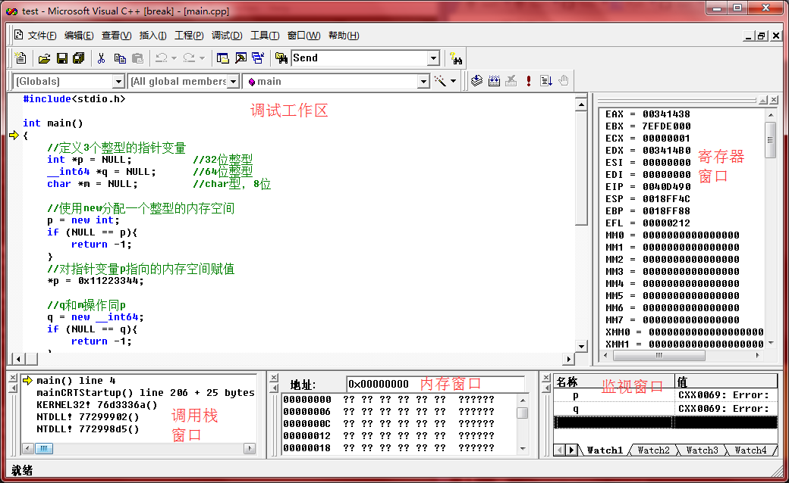

上面的各个窗口，可以在菜单【查看】-->【调试窗口】将其调出来。除了以上五个窗口，还有一个反汇编窗口

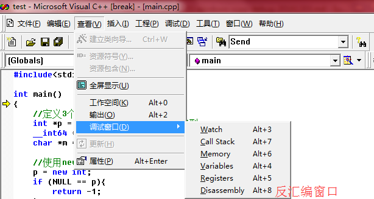

然后就可以通过Visual C++控制程序的运行来进行调试了

* 【F11】：Step Into，单步步入，表示单步调试程序，遇到函数调用时会进入被调用的函数内部
* 【F10】：Step Over，单步步过，单步调试程序，遇到函数调用时不进入函数内部
* 【Shift + F11】：Step Out，执行到函数返回处。当调试进入某个函数时，该函数又不是调试的关键函数，可用该快捷键快速返回
* 【Ctrl + F10】：执行到光标处
* 【F9】：在光标指定的位置设置断点，当程序在调试状态下运行时遇到断点，会产生中断（中断后可观察某变量值、某块内存的内容）
* 【F5】：是程序进入调试状态，如果代码中有断点，则会在断点处产生中断，如果没有断点，程序运行完自动结束调试状态
* 【F7】：结束调试状态下运行的程序

调试程序时，尤其是调试代码量非常大的程序时，往往不可能通过单步执行一直来进行调试。通常情况是在某个或某几个关键的位置设置断点，然后让程序一直处于调试状态，当程序运行到断点处就会产生中断，这时再通过单步调试方法调试重要的代码部分，观察变量、内存、调用栈等数据的实时变化情况

##栈内存和堆内存

按【F10】后，现在程序入口（main()）处停止，先观察以下值：三个指针的值p、q、m；三个指针指向变量的值\*p、\*q、\*m；三个指针的地址值&p、&q、&m。但所有的值都是Error，说明此时还未分配内存

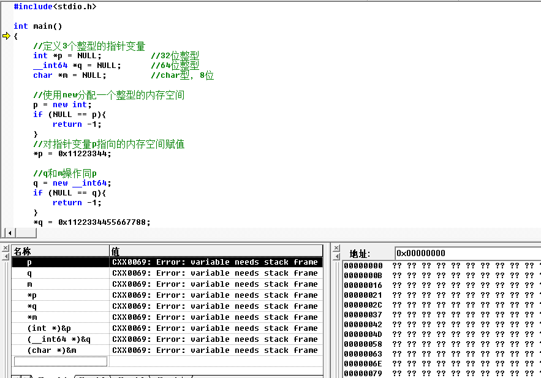

然后按下【F10】走到第一行代码后，可以看到三个地址值p、q、m都变成了十六进制值0xcccccccc，这是VC6 Debug编译方式下默认对局部变量（栈空间）初始化的值；并且&p、&q、&m都有值了

&p值是0x0018ff44、&q值是0x0018ff40、&m值是0x0018ff3c。说明此时已经为三个指针变量p、q、m分配了内存空间了

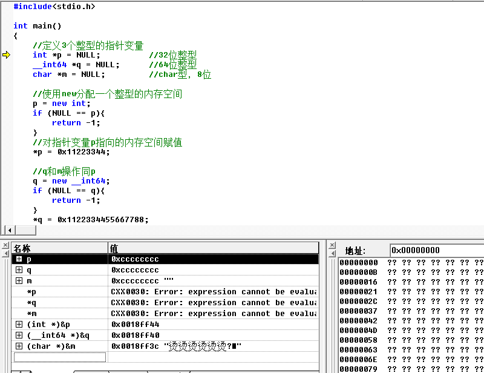

另外还可以看到一个规律，就是第一个声明的变量p的地址比第二声明的变量q地址多4，而q地址则比第三声明的m地址多4。其实这背后是因为Win32程序的内存模型导致的。如下图，可以看到Win32程序在内存中，堆空间是从小地址往大地址增长的，而栈空间是从大地址往小地址增长的。而本例中的局部变量p、q、m是分配在栈空间的，所以其是往下增长的，所以后声明的局部变量相比于先声明的局部变量地址会小

>注意下面这幅图中，小地址在上，大地址在下，而图中栈是在下面，并且向上增长的，所以正好是从大地址往小地址增长


在单步停到`p = new int;`处，可以看到p、q、m的值都是0x00000000，因为上面分别显式地将p、q、m的值赋为NULL了

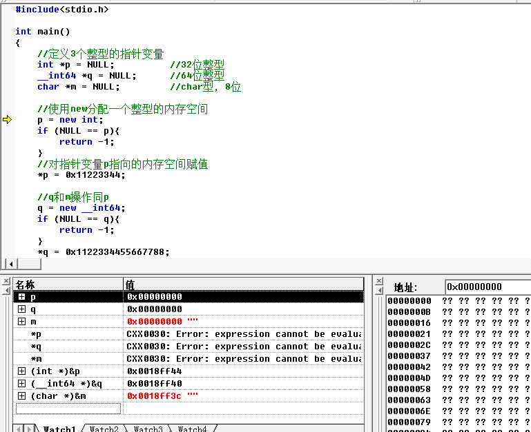

继续单步往下走，到`p = new int;`后面一行，此时已经使用new分配了新的堆地址，并且将指针变量p指向该地址了，该内存的地址是0x00372f08。可以使用内存窗口查看该地址处的二进制内容，也就是查看该地址处变量的内容，可以看到其值是0xCDCDCDCD，因为在VC6的Debug编译方式下，未进行赋值的堆空间的值为0xCDCDCDCD

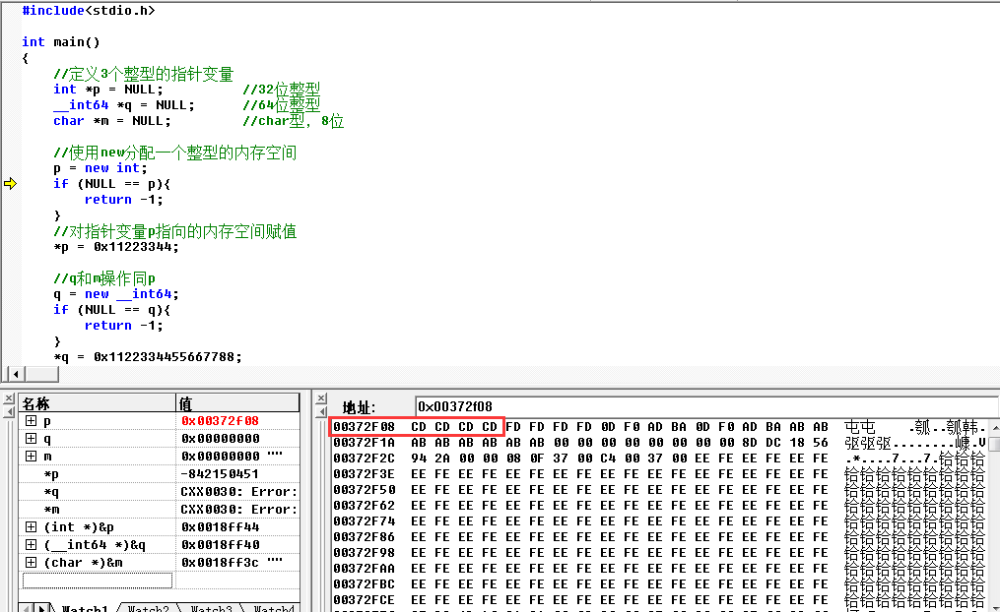

继续单步往下走，停到`q = new __int64;`处，因为停在这里，上面的`*p = 0x11223344;`的赋值操作就执行完成了，所以此时p指针指向的堆内存中的数据是0x11223344，注意这里在内存窗口中显示的顺序是“44 33 22 11”，和0x11223344顺序相反。补充0x11223344对应的十进制值是287454020

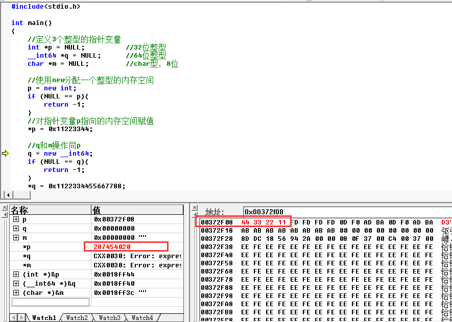

##堆空间的链式管理

【F10】单步执行到`delete p;`时停止，将p指向的地址减去0x20字节，即0x00372f08-0x20=0x00372ee8，然后在内存窗口查看该地址处的二进制内容

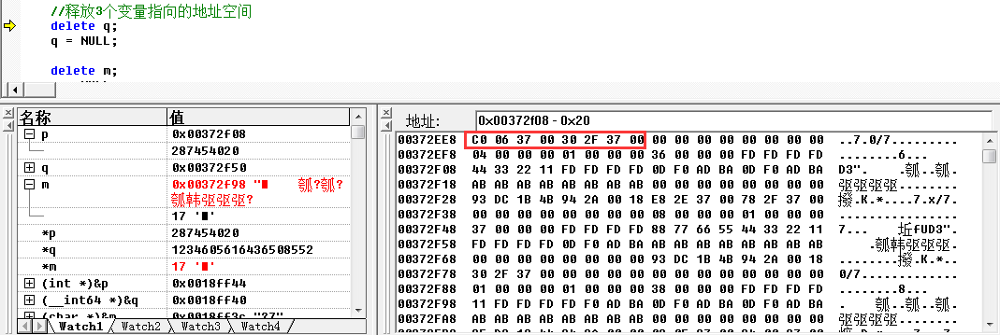

p指向的空间为0x00372f08，q指向的空间为0x00372f50，m指向的空间为0x00372f98。这3个变量指向的空间比较近。再看一下内存窗口，0x00372ee8地址处的值为“C0 06 37 00 30 2F 37 00”，这里是两个地址，分别是0x003706c0和0x00372f30（因为显示的顺序是逆序的）

0x00372f30这个值就是内存窗口中第一个地址的位置。再通过内存窗口看0x00372f30地址处的值是“E8 2E 37 00 78 2F 37 00”，同样是两个地址，分别是0x00372ee8和0x00372f78

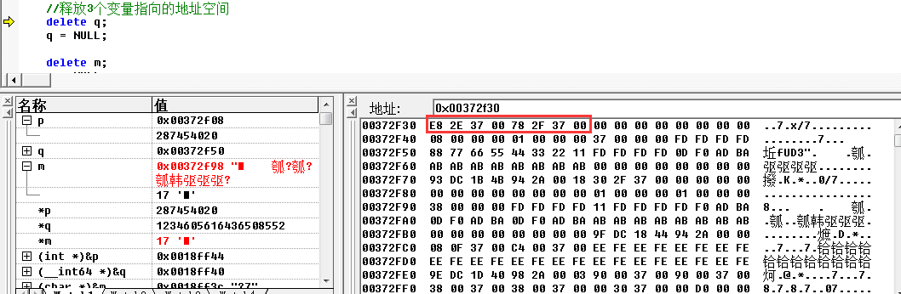

哎，0x00372ee8怎么又出现了？

如下图，使用new申请的堆空间是通过双向链表进行链式管理的，最后一个节点0x00000000表示链表的结尾

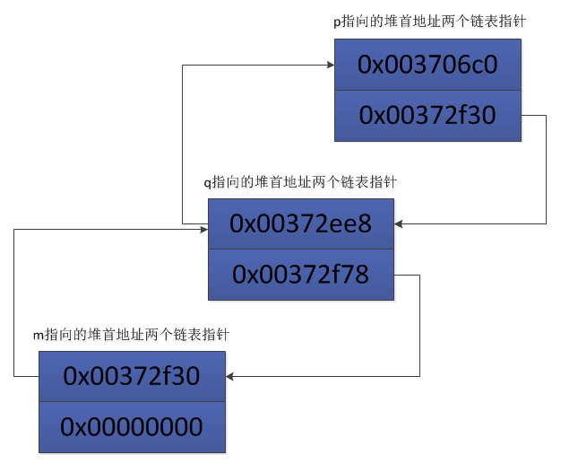

明白了堆内存是链式管理后，接着分析其他相关数据。当使用new申请的空间不再使用时，会使用delete释放空间，那么delete要释放多大空间呢？堆空间的首地址是管理双向链表的指针，在首地址偏移0x10的位置记录了堆空间的大小

p指向一个int型的堆空间，p的值是0x00372f08，其首地址是0x00372f08-0x20=0x00372ee8，然后0x00372ee8+0x10=0x00372ef8，通过内存窗口可以看到这部分内存存储的值是0x00000004，所以是4字节，正好是int型的长度；同样的方法可以看q、m指向的堆空间的大小


##详细分析堆内存布局

以上对进程的内存布局做了大概的讲解，下图详细展示p、q、m指向的堆内存的布局情况！其中详细讲解p指向的堆布局，q、m简单在图中标明，详细可以类比p指向的堆空间的内存布局进行分析！

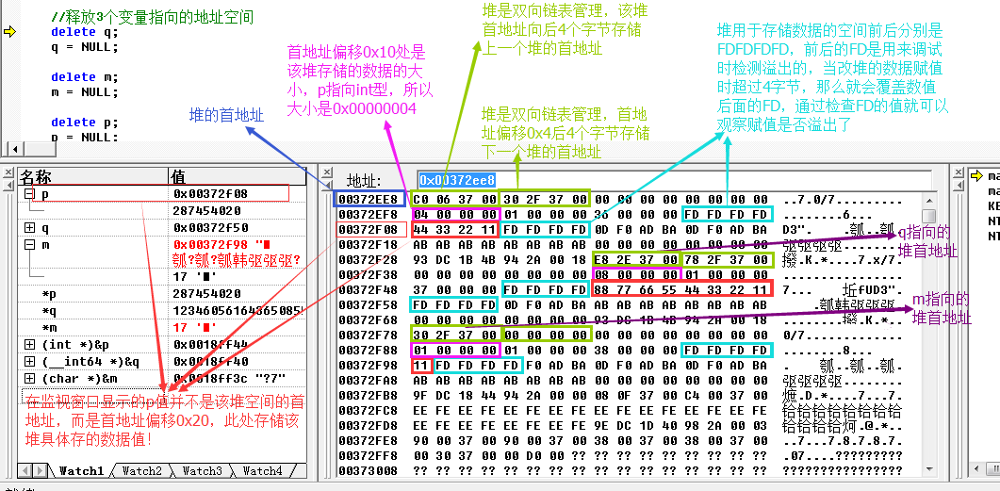

上图中只说明了一个堆中部分字节所存储值的含义，剩下的都没有提及。目前我也没有查清楚剩下的字节在堆内存管理中具体起到什么作用！后续有必要时在作补充

可以看到，为了实现使用堆来动态分配内存，需要不止存储数据本身的内存空间，还需要很多额外的空间来实现堆内存的管理！所以动态申请内存时，数据本身占用的内存越大，那么堆内存的利用率就越高！

到这里，其实和之前整理的[《深入理解DBF文件格式》](http://www.xumenger.com/dbf-20160703/)有点类似的思路

【F10】继续断点走，走到`q = NULL;`的地方，这时候q指向的堆空间被释放了，而p、m指向的堆空间依然存在。首先看到释放后的堆空间被赋值为“EE FE”。观察堆链表的指针变化，第1块堆(p指向的堆)的后继链表指针指向了第3块堆(m指向的堆)，第3快堆的前驱指针指向了第1块堆

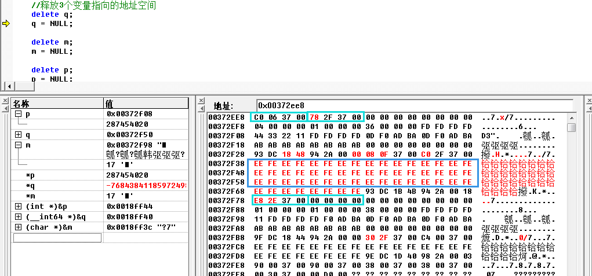

>VC默认提供2种编译方式，分别是DEBUG和RELEASE，以上对管理方法为DEBUG编译方式，RELEASE编译方式并不是该种管理方法

##扩展：Delphi 6 开发工具

Delphi 6开发工具中也有类似的调试功能，比如调试窗口

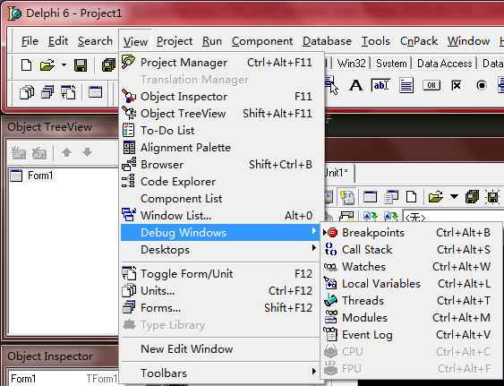
