##环境搭建

点击[【这里】](http://www.dosbox.com/)，通过DOSBox官网，下载DOSBox。或者点击[【这里】](../download/20161208/DOSBox.rar)直接下载然后安装

DOSBox的安装和普通的Windows程序安装一样，支持选择安装路径，然后在桌面上会产生图标

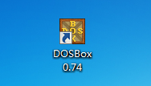

下载汇编工具：masm、link、debug、edit，点击[【这里】](../download/20161208/asmTool.rar)下载。然后将其放到D盘某文件夹下

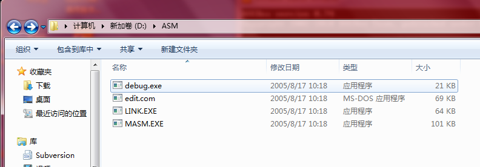

运行DOSBox程序


输入命令：`mount c d:\`。刚才下载的几个汇编工具我放到了D盘，这个命令其实是将实际的D盘虚拟为C盘，在DOSBox下执行`c:\`进入的是虚拟的C盘，其实实际上进入的是机器的D盘。每次重启DOSBox都需要执行该命令

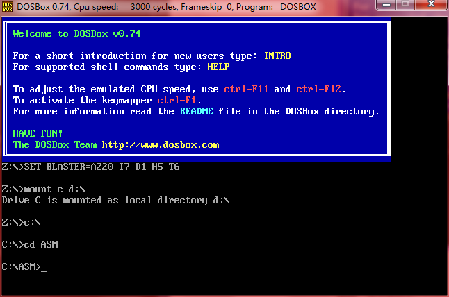

##实现一个简单的汇编程序

在DOSBox的命令行中输入`edit`命令


回车后进入汇编语言的编辑界面。注意：如果鼠标在编辑框中点击后需要按【Windows键】才能出来

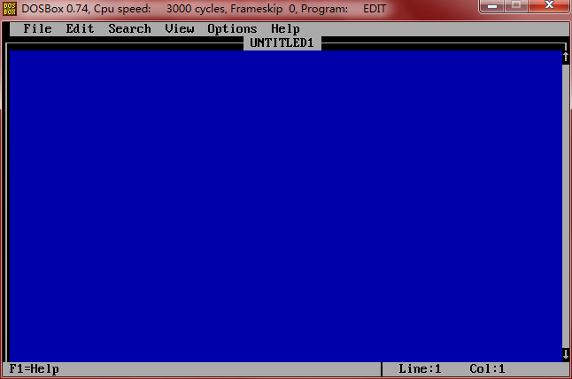

然后来写一个简单的汇编程序

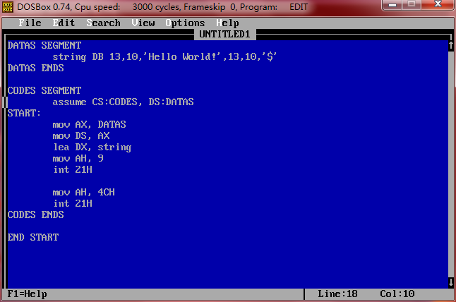

然后点击保存程序

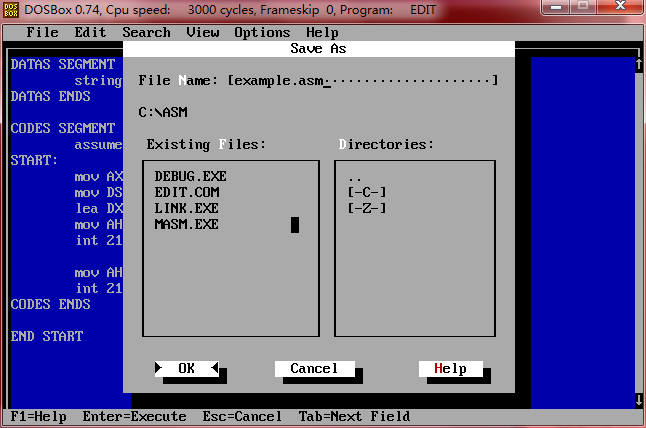

可以看到对应的文件夹下已经有该汇编文件了。其实.asm就是一个文本文件，完全可以使用其他编辑器编写

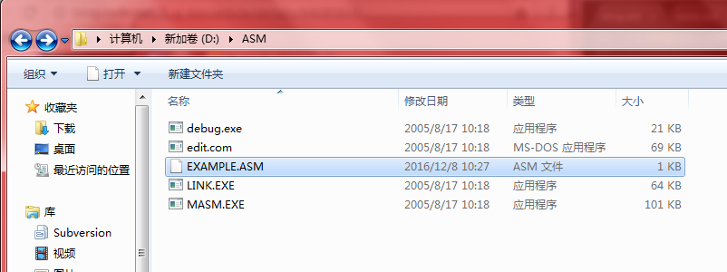

然后通过菜单【File】-->【Exit】退出编辑环境

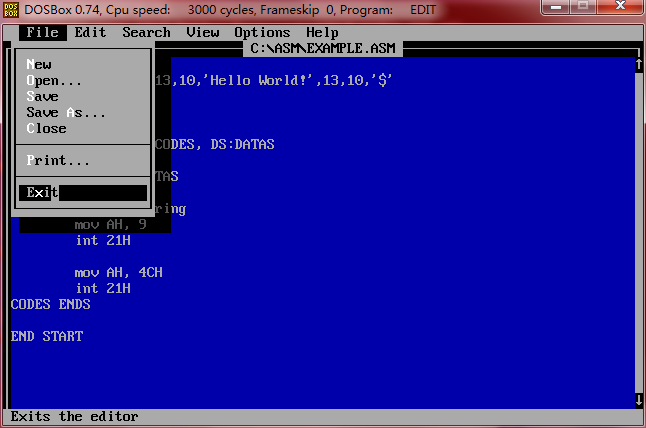

然后执行`masm example.asm`编译汇编代码，红框表示本次输入的信息

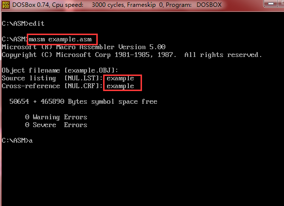

然后看到对应的目录下生成了EXAMPLE.CRF、EXAMPLE.LST、EXAMPLE.OBJ

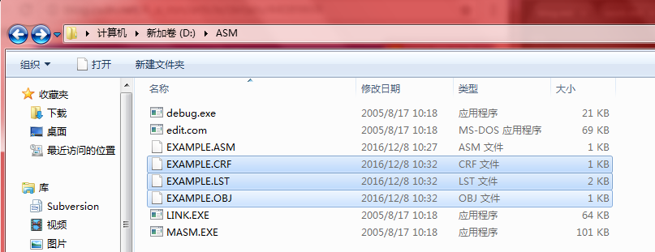

然后进行链接，执行命令`link example`

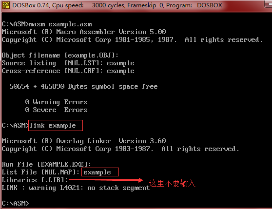

这时候就编译得到了可执行文件EXAMPLE.EXE

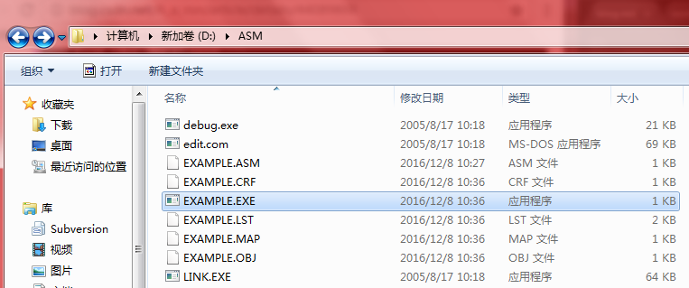

然后在命令行中输入命令`example`运行该可执行程序，输入如下：

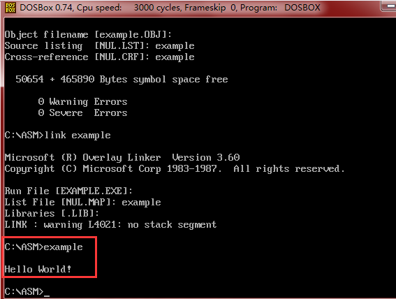

##解释本文的汇编程序

对应的汇编代码如下。其编译链接得到的可执行程序会在命令行下输出“Hello World!”

```
DATAS SEGMENT
        string DB 13,10,'Hello World!',13,10,'$'
DATAS ENDS

CODES SEGMENT
        assume CS:CODES, DS:DATAS
START:
        mov AX, DATAS
        mov DS, AX
        lea DX, string
        mov AH, 9
        int 21H

        mov AH, 4CH
        int 21H
CODES ENDS

END START

```

>扩展文章：[《x86汇编语言语法简介》](http://www.xumenger.com/x86-20160720/)

下面庖丁解牛讲解这个简单的汇编程序

##汇编程序简单框架

```
; 定义数据段，就是数据存放的地方
DATAS SEGMENT
	......
DATAS ENDS

; 定义代码段，当然就是要执行的程序代码
CODES SEGMENT
START:
	......
CODES ENDS

END START
```

##分析数据段

汇编语言中的DB(不区分大小写)是定义单字节数据段的意思，编译时，DB后面的数据将视为纯数据而不是指令代码

13是回车符号，10是换行符，'$'类似C语言中的'\0'

```
DATAS SEGMENT
        string DB 13,10,'Hello World!',13,10,'$'
DATAS ENDS
```

##mov指令

类似于高级语言的赋值语句，其使用格式是`mov dst, src`，可以实现寄存器与寄存器之间、寄存器与内存之间、寄存器与立即数、内存与立即数之间的数据传递。但内存与内存之间无法直接传递数据、目的操作数不能为立即数

```
mov eax, 12345678h		//寄存器<--立即数
mov eax, [00401000h]		//寄存器<--内存
mov eax, ebx			//寄存器<--寄存器
mov [00401000h], 12345678h	//内存<--立即数
mov [00401000h], eax		//内存<--寄存器
```

##lea指令

lea指令(load effective address)，即装入有效地址的意思。其格式是：`lea dst, src`

比如本程序中的代码

```
lea DX, string
```

加载字符串变量地址，也就是将string的地址赋值到DX中

lea指令是装入有效地址的意思。它的操作数就是地址，而不是具体的数据，这就是lea和mov的区别

比如

```
lea edi, [ebp + 0000000ch]
```

##int指令

int是interrupt的缩写，是中断的意思

比如本程序中的

```
mov AH, 9
int 21H	
```

09H对应的是显示字符串，将09H赋值到AH中。然后调用`int 21H`指令，计算机就会根据AH寄存器中的值执行相应的操作，所以这样的调用就是输出"Hello World!"字符串

再比如

```
mov AH 4CH
int 21H
```

通过给AH寄存器赋值4CH，其中因为4CH就是返回DOS系统，所以上面的代码就是返回实现返回DOS系统的功能

当然也可以给AH寄存器赋其他的值，实现各种功能。参见[《DOS系统功能调用表(INT 21H)》](http://blog.csdn.net/chinazeze/article/details/1735621)

##assume指令

assume的意思是“假定”

它是伪指令，只是告诉编译软件，假定CS和CODES对应，DS和DATAS对应，其中的':'就是对应的意思

##代码中涉及到的寄存器

* AX：EAX寄存器是数据寄存器，可以存储32位数据，EAX的低16位表示为AX，可以存储16位的数据
* AH：AX寄存器又可以分为AH和AL两个8位寄存器，AH对应AX寄存器的高8位，配合int指令使用，可以看本文中的例子
* DX：EDX也是数据寄存器，可以存储32位数据，EDX的高16位是DX，可以存储16位数据
* CS：段寄存器，CS是代码段
* DS：段寄存器，DS是数据段
* 补充1：16位CPU中，段寄存器有4个，分别是CS(代码段)、DS(数据段)、SS(堆栈段)、ES(附加段)
* 补充2：32位寄存器中，段寄存器从4个扩展到6个，分别是CS、DS、SS、ES、FS和GS。FS和GS段寄存器也属于附加的段寄存器

##本文测试程序添加注释

```
DATAS SEGMENT
        string DB 13,10,'Hello World!',13,10,'$'
DATAS ENDS

CODES SEGMENT
        assume CS:CODES, DS:DATAS
START:
        mov AX, DATAS	;将DATAS的地址拷贝到AX寄存器
        mov DS, AX	;将AX寄存器中的内存拷贝给DS数据段寄存器。经过这两步就将数据放到DS数据段寄存器中了
        lea DX, string	;加载字符串变量地址，也就是将string的地址赋值到DX中
        mov AH, 9	;09H对应的是显示字符串
        int 21H		;INT 21H是用来调用功能的，对应调用的是当前AH寄存器中值对应的指令09H，所以是输出字符串

        mov AH, 4CH	;4CH功能是让你退出程序
        int 21H		;调用功能，由上面的AH决定，这句就是要退出程序了
CODES ENDS

END START

```
