在阅读反汇编代码进行逆向分析时，第一步是要对函数进行识别。这里的识别是指确定函数的开始位置、结束位置、参数个数、返回值以及函数的调用方式

在逆向分析过程中，不会把单个的反汇编执行作为最基础的逆向分析单位，因为一条指令只能表示出CPU执行的是何种操作，而无法明确反应出一段程序的功能所在。就像在用C语言进行编程时，很难不通过代码的上下文关系去了解一条语句的含义

##OllyDbg调试工具

OllyDbg1.10可以点击[这里](../downloads/20161216/OllyDBG.rar)下载。不需安装，解压缩后即可使用

使用OllyDbg打开一个Exe文件后，窗口显示如下


* 反汇编窗口：显示反汇编代码，调试分析程序主要在该窗口中操作
* 信息窗口：显示与反汇编窗口上下相关的内存或寄存器信息
* 数据窗口：以多种格式显示内存中的内容，可以使用Hex、文本、短型、长型、反汇编等
* 寄存器窗口：显示各寄存器的内容，包括通用寄存器、段寄存器、标志寄存器、浮点寄存器等。还可以在寄存器窗口中的右键菜单选择显示MMX寄存器、3DNow！寄存器和调试寄存器
* 栈窗口：显示堆栈内容，即ESP寄存器指向的地址部分
* 命令窗口：用于输入命令来简化调试分析的工作，非OllyDbg自带的窗口，通过插件实现的

如果感觉刚开始字体大小不舒服，可以右键进行调整

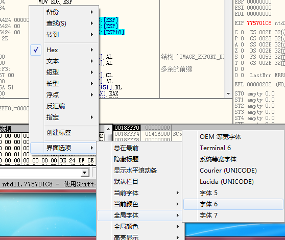

使用OllyDbg调试EXE文件时常有的快捷键如下

* F8：单步步过，依次执行每条指令，遇到CALL不进入，遇到REP不重复
* F7：单步步入，依次执行每条指令，遇到CALL进入，遇到REP重复
* F4：执行到功能的代码处（前提条件是选中的代码在程序的流程中一定会会被执行到
* F9：运行程序，直到遇到断点才停止
* CTRL+F9：返回调用处
* ALT+F9：执行到函数的结尾处

>其实OllyDbg的调试功能的使用逻辑和VC、Delphi这些开发工具的调试逻辑是一致的

##IDA逆向反汇编分析工具

IDA下载地址是：https://www.hex-rays.com/products/ida/support/download.shtml

选择下载[免费版IDA 5.0 Freeware](https://www.hex-rays.com/products/ida/support/download_freeware.shtml)。或者直接点击[【这里】](https://out7.hex-rays.com/files/idafree50.exe)下载

IDA是一款支持多种格式以及处理器的反汇编工具。IDA强大的交互功能可以让逆向分析人员提高逆向分析的效率。IDA同样可以像OllyDbg一样，支持脚本、插件来扩展其分析功能

IDA的界面大致如下

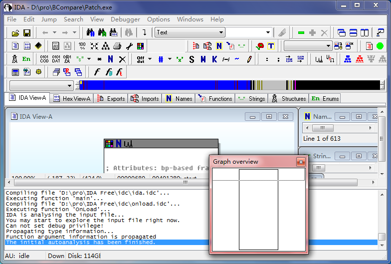

##用VC6实现一个C函数调用程序

点击[这里](../download/20161216/callFunction.rar)下载测试程序

注意需要修改一下Visual C++的配置，因为我们要通过C语言而不是C++进行测试，可以通过在创建源码文件时指定后缀名为.c来实现

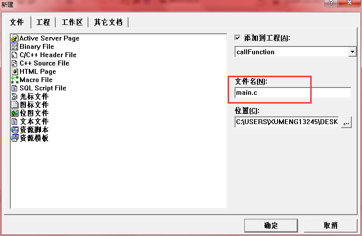

```
#include<stdio.h>
#include<windows.h>

int test(char *szStr, int nNum)
{
	printf("%s, %d \r\n", szStr, nNum);
	MessageBox(NULL, szStr, NULL, MB_OK);

	return 5;
}

int main()
{
	int nNum = test("hello", 6);
	
	printf("%d \r\n", nNum);

	return 0;
}
```

而且编译的时候，需要使用Debug模式

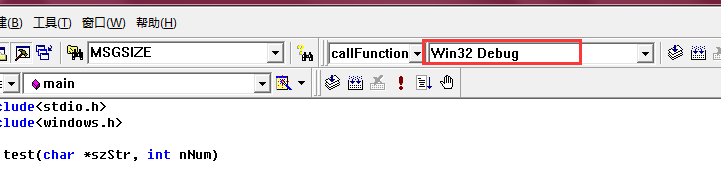

这个程序的运行效果如下

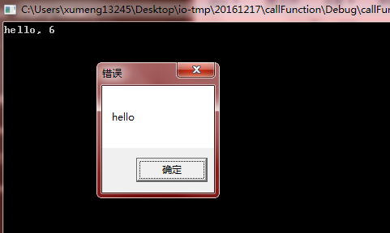

在程序代码中，自定义函数test()由主函数main()所调用，test()函数的返回值为int类型。在test函数中调用了printf()和MessageBox()函数

##开始进行逆向分析

确定函数的开始位置和结束位置非常重要，而IDA一般可以自动识别函数的起始位置和结束位置，只有在代码被刻意改变之后才需要程序员自己进行识别

如果在逆向分析的过程中发现有不准确的时候，可以通过Alt+P快捷键打开“Edit function(编辑函数)”对话框来调整函数的起始位置和结束位置

用IDA打开exe文件时，IDA会有一个提示，如下图，询问是否使用PDB，我们这里选择【Yes】

>PDB文件是程序数据库文件，是编译器生成的一个文件，方便程序调试使用。PDB包含函数地址、全局变量的名字和地址、参数和局部变量的名字和在堆栈的偏移量等信息

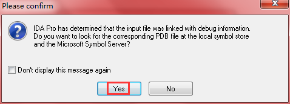

>在分析其他程序的时候，通常没有PDB文件（这次因为是在自己机器上编译的，所以编译时会同时生成PDB文件），那么就选择【No】。在有PDB和无PDB文件时，IDA的分析结果是截然不同的！！没有PDB显然会更负责！！

打开后的界面大致如下

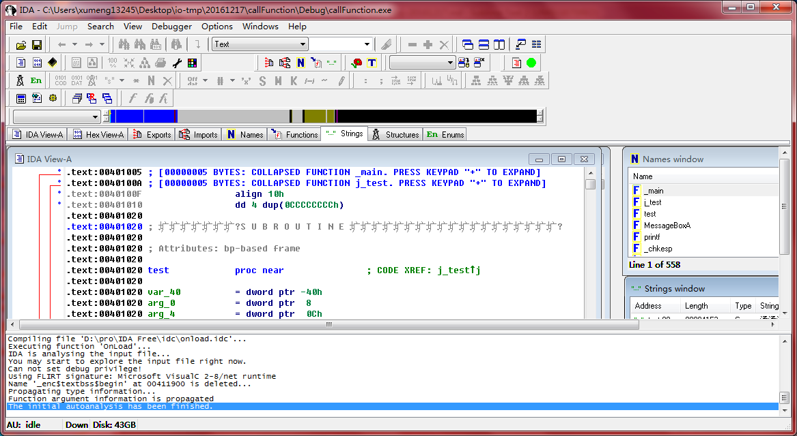

稍等IDA在运行几秒钟，完成对程序的分析后，IDA直接找到了main()函数的跳表项（下图红框标注）

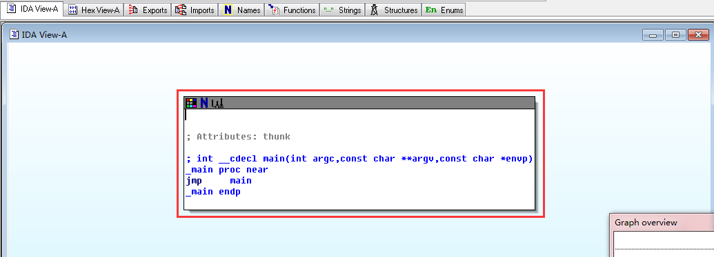

>所谓main()函数的跳表项，并不是main()函数的真正起始位置，而是该位置是一个跳表，用来统一管理各个函数的地址，上图中有一个`jmp main`的汇编代码，这条代码用来跳向真正的main()函数的地址

并不是每个程序都能被IDA识别出跳转到main()函数的跳表项，而且程序的入口点也并非main()函数

##分析程序入口函数mainCRTStartup

在IDA上单击窗口选项卡，选择“Exports”窗口（Exports窗口就是导出窗口以，用于查看导出函数的地址，但对于EXE程序来说通常是没有导出函数的，这里会显示EXE程序的入口地址）。在“Exports”窗口可以看到`mainCRTStartup`

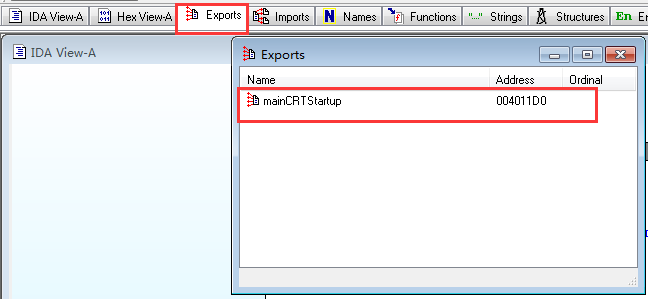

双击mainCRTStartup就可以到达启动函数的位置了

>再次强调：在C语言中，main()并不是程序运行的第一个函数，而是程序员编写函数时的第一个函数，main()函数是由启动函数来调用的

打开后的截图大概如下

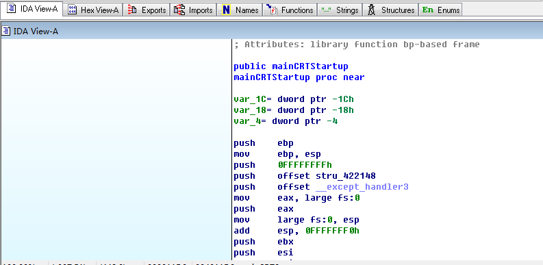

然后选择用“Text View”模式查看


现在将对应的反汇编代码复制出来方便分析（从mainCRTStartup的开始位置到结束位置）

```
.text:004011D0 ; Attributes: library function bp-based frame
.text:004011D0
.text:004011D0                 public mainCRTStartup
.text:004011D0 mainCRTStartup  proc near
.text:004011D0
.text:004011D0 var_1C          = dword ptr -1Ch
.text:004011D0 var_18          = dword ptr -18h
.text:004011D0 var_4           = dword ptr -4
.text:004011D0
.text:004011D0                 push    ebp
.text:004011D1                 mov     ebp, esp
.text:004011D3                 push    0FFFFFFFFh
.text:004011D5                 push    offset stru_422148
.text:004011DA                 push    offset __except_handler3
.text:004011DF                 mov     eax, large fs:0
.text:004011E5                 push    eax
.text:004011E6                 mov     large fs:0, esp
.text:004011ED                 add     esp, 0FFFFFFF0h
.text:004011F0                 push    ebx
.text:004011F1                 push    esi
.text:004011F2                 push    edi
.text:004011F3                 mov     [ebp+var_18], esp
.text:004011F6                 call    ds:__imp__GetVersion@0 ; Get current version number of Windows
.text:004011F6                                         ; and information about the operating system platform
.text:004011FC                 mov     _osver, eax
.text:00401201                 mov     eax, _osver
.text:00401206                 shr     eax, 8
.text:00401209                 and     eax, 0FFh
.text:0040120E                 mov     _winminor, eax
.text:00401213                 mov     ecx, _osver
.text:00401219                 and     ecx, 0FFh
.text:0040121F                 mov     _winmajor, ecx
.text:00401225                 mov     edx, _winmajor
.text:0040122B                 shl     edx, 8
.text:0040122E                 add     edx, _winminor
.text:00401234                 mov     _winver, edx
.text:0040123A                 mov     eax, _osver
.text:0040123F                 shr     eax, 10h
.text:00401242                 and     eax, 0FFFFh
.text:00401247                 mov     _osver, eax
.text:0040124C                 push    0
.text:0040124E                 call    _heap_init
.text:00401253                 add     esp, 4
.text:00401256                 test    eax, eax
.text:00401258                 jnz     short loc_401264
.text:0040125A                 push    1Ch
.text:0040125C                 call    fast_error_exit
.text:00401261                 add     esp, 4
.text:00401264
.text:00401264 loc_401264:                             ; CODE XREF: mainCRTStartup+88j
.text:00401264                 mov     [ebp+var_4], 0
.text:0040126B                 call    _ioinit
.text:00401270                 call    ds:__imp__GetCommandLineA@0 ; GetCommandLineA()
.text:00401276                 mov     _acmdln, eax
.text:0040127B                 call    __crtGetEnvironmentStringsA
.text:00401280                 mov     _aenvptr, eax
.text:00401285                 call    _setargv
.text:0040128A                 call    _setenvp
.text:0040128F                 call    _cinit
.text:00401294                 mov     ecx, _environ
.text:0040129A                 mov     __initenv, ecx
.text:004012A0                 mov     edx, _environ
.text:004012A6                 push    edx             ; envp
.text:004012A7                 mov     eax, __argv
.text:004012AC                 push    eax             ; argv
.text:004012AD                 mov     ecx, __argc
.text:004012B3                 push    ecx             ; argc
.text:004012B4                 call    _main
.text:004012B9                 add     esp, 0Ch
.text:004012BC                 mov     [ebp+var_1C], eax
.text:004012BF                 mov     edx, [ebp+var_1C]
.text:004012C2                 push    edx
.text:004012C3                 call    exit
.text:004012C3 mainCRTStartup  endp
```

从反汇编代码可以看出，main函数的调用在004012B4位置处 

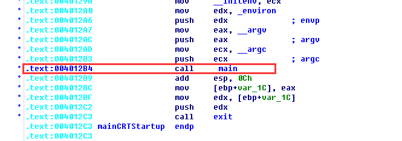

启动函数从004011D0地址处开始，期间

* 调用GetVersion()函数获取系统版本号
* 调用\_\_heap_init()函数初始化了程序所需要的堆空间
* 调用GetCommandLineA()函数获取了命令行参数
* 调用\_\_crtGetEnvironmentStringsA()函数获得了环境变量字符串
* ………………

在完成了一些列启动所需要的工作后，终于在004012B4处调用了\_main

>由于这里使用的是Debug版，且带有PDB文件，因此在反汇编代码中直接显示出程序的符号，在分析其他程序时是没有PDB文件的，这样\_main就会显示为一个地址，而不是一个符号

不过依然通过规律来找到\_main所在的位置

没有PDB文件，如何找到\_main所在的位置呢？在VC6中，启动函数会一次调用GetVersion、GetCommandLineA()、GetEnvironmentStringsA()等函数，而这一系列函数即使一串明显的特征。在调用玩GetEnvironmentStringsA()后，不远处会有3个push操作，分别是main()函数的3个参数，代码如下

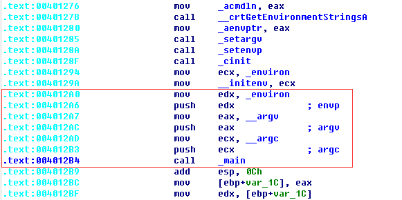

该反汇编代码对应的C代码如下

```
#ifdef WPRFLAG
	__winitenv = _wenviron;
	mainret = wmain(__argc, __wargv, _wenviron);
#else /* WPRFLAG */
	__initenv = _environ;
	mainret = main(_argc, __argv, _environ);
#endif /* WPRFLAG */
```

上面的代码是从CRT0.C中得到的，可以看到启动函数在调用main()函数时有3个参数

在3个push操作后的第1个call处，就是\_main函数的地址。往\_main()下面看，\_main后地址为004012C3的指令为`call exit`，对应的，如果可以确定程序是由VC6写的，那么找到对exit的调用后，往上找一个call指令就找到了\_main所对应的地址

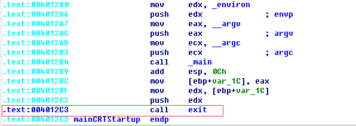

##分析main函数

顺利找到\_main函数后，直接双击反汇编的\_main，到达函数跳转表处

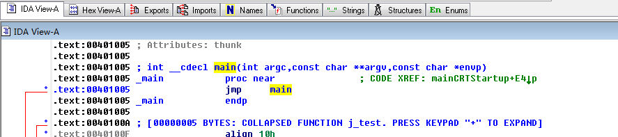

再在跳转表中双击\_main，即可达到真正的\_main函数的反汇编代码处

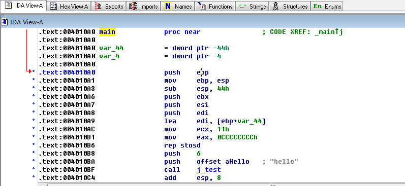

同样为了方便分析，将其拷贝下来

```
.text:004010A0 main            proc near               ; CODE XREF: _mainj
.text:004010A0
.text:004010A0 var_44          = dword ptr -44h
.text:004010A0 var_4           = dword ptr -4
.text:004010A0
.text:004010A0                 push    ebp
.text:004010A1                 mov     ebp, esp
.text:004010A3                 sub     esp, 44h
.text:004010A6                 push    ebx
.text:004010A7                 push    esi
.text:004010A8                 push    edi
.text:004010A9                 lea     edi, [ebp+var_44]
.text:004010AC                 mov     ecx, 11h
.text:004010B1                 mov     eax, 0CCCCCCCCh
.text:004010B6                 rep stosd
.text:004010B8                 push    6
.text:004010BA                 push    offset aHello   ; "hello"
.text:004010BF                 call    j_test
.text:004010C4                 add     esp, 8
.text:004010C7                 mov     [ebp+var_4], eax
.text:004010CA                 mov     eax, [ebp+var_4]
.text:004010CD                 push    eax
.text:004010CE                 push    offset aD       ; "%d \r\n"
.text:004010D3                 call    printf
.text:004010D8                 add     esp, 8
.text:004010DB                 xor     eax, eax
.text:004010DD                 pop     edi
.text:004010DE                 pop     esi
.text:004010DF                 pop     ebx
.text:004010E0                 add     esp, 44h
.text:004010E3                 cmp     ebp, esp
.text:004010E5                 call    __chkesp
.text:004010EA                 mov     esp, ebp
.text:004010EC                 pop     ebp
.text:004010ED                 retn
.text:004010ED main            endp
```

>短短几行C语言代码，在编译连接生成可执行文件后，再进行反汇编可以看到生成了比C语言代码多得多的代码

上面的反汇编代码，在004010BF处有对test函数的调用，在004010D3处有对printf的调用，确定这就是main函数。在main函数的入口部分有如下代码

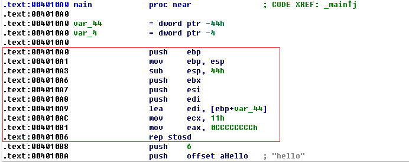

大多数的函数的入口处都是：`push ebp`、`mov ebp, esp`、`sub esp, XXX`的形式，这几句代码完成了保存栈帧，并开辟当前函数所需要的栈空间

`push ebx`、`push esi`、`push edi`，是用来保存几个关键寄存器的值，以便函数返回后这几个寄存器中的值还能在调用函数处继续使用而没有被破坏

`lea edi, [ebp + var_44]`、`mov ecx, 11h`、`mov eax, 0CCCCCCCh`、`rep stosd`，这几句代码是开辟的内存空间，全部初始化为0xCC。0xCC被当做机器码来解释时，其对应的汇编指令为`int 3`，也就是调用3号断点中断来产生一个软件中断，将新开辟的栈空间初始化为0xCC，这样做的好处是方便调试，尤其是给指针变量的调试带来了方便

以上反汇编代码是一个固定的形式，唯一会变化的是`sub esp, XXX`部分，在当前反汇编代码处是`sub esp, 44h`。在VC6下使用Debug方式编译，如果当前函数没有变量，那么这句代码就是`sub esp 40h`；如果有一个变量，其代码是`sub esp 44h`；有两个变量时，为`sub esp 48h`。也就是说，通过Debug方式编译时，函数分配栈空间总是开辟了局部变量的空间后又预留了40h字节的空间。局部变量都在栈空间中，栈空间是在进入函数后临时开辟的空间，由此局部变量在函数结束后就不存在了

与函数入口代码对应的代码当然是出口代码了，其代码如下

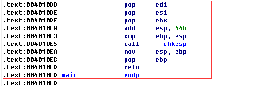

函数的出口部分也属于固定格式，这个格式跟入口的格式基本是对应的

首先是`pop edi`、`pop esi`、`pop ebx`，这是将入口部分保存的几个关键寄存器的值进行恢复。push和pop是对堆栈进行操作的指令。堆栈的特点是后进先出/先进后出。因此，在函数入口部分的入栈顺序是`push ebx`、`push esi`、`push edi`，出栈的顺序则是`pop edi`、`pop esi`、`pop ebx`

>恢复玩寄存器的值后，需要恢复esp指针的位置，这里的指令是`add esp, 44h`，将临时开辟的栈空间释放掉（这里的释放只是改变寄存器的值，其中的数据并没有清除掉），其中44h和入口处的44h对应。从入口和出口改变esp寄存器的情况可以看出，栈的方向是由高地址向低地址方向延伸的，开辟空间是将esp做减法操作

`mov esp, ebp`、`pop ebp`是恢复栈帧

retn就是返回上层函数了

在该反汇编代码中还有一步没有讲到，也就是`cmp ebp, esp`、`call __chkesp`，这两句是对\_\_chkesp函数的一个调用。在Debug方式下编译，对几乎所有的函数调用完成后都会调用一次\_\_chkesp。该函数的功能是用来检查栈是否平衡，以保证程序的正确性，如果栈不平，会给出错误提示！该功能只在Debug版本中存在

主函数的反汇编代码还有如下部分

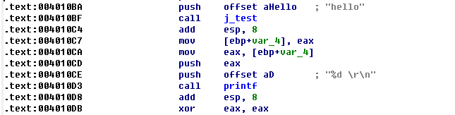

`push 6`、`push offset aHello`、`call j_test`、`add esp, 8`、`mov [ebp+var_4], eax`，这几句反汇编代码是主函数对test函数的调用。函数参数的传递可以选择寄存器或内存。由于寄存器数量有限，几乎大部分函数调用都是通过内存进行传递的

当参数使用完成后，需要把参数所使用的内存进行回收。对于VC开发环境而言，其默认的调用约定方式为cdecl，这种函数调用约定对参数的传递依靠占内存，在调用函数前，会通过压栈操作将参数依次从右往左进行入栈。在C代码中，对test()函数的调用形式如下

```
int nNum = test("hello", 6);
```

而对应的反汇编代码是`push 6`、`push offset aHello`、`call j_test`。从压栈操作的push指令看，参数是从右往左依次入栈的

当函数返回时，需要将参数使用的空间回收。这里的回收，指的是恢复esp寄存器的值到函数调用前的值。而对于cdecl调用方式而言，平衡堆栈的操作是由函数调用方来完成的，从上面的反汇编代码中可以看出`add esp, 8`，它是main函数对test函数的参数进行平衡堆栈的，该代码对应的语言为调用函数前的两个push操作，即函数参数入栈的操作

>函数的返回值通常都保存在eax寄存器中。这里返回值是以return语句来完成的返回值，并非以参数接收的返回值

004010C7地址处的反汇编代码`mov [ebp+var_4], eax`是将对j\_test调用后的返回值保存在[ebp+var\_4]中，这句指令的通俗解释就是将eax寄存器中的值拷贝到ebp+var\_4对应的内存地址处。这里的[ebp+var\_4]就相当于C语言中的nNum变量。逆向分析时，可以在IDA中通过快捷键N来完成对var\_4的重命名

继续往下看汇编代码

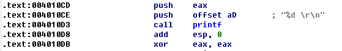

在对j\_test调用完成并将返回值保存在var\_4中后，紧接着`push eax`、`push offset aD`、`call _printf`、`add esp, 8`的反汇编代码可以很好理解了

而最后的`xor eax, eax`这句代码是将eax进行清0，因为在C语言代码中，main函数的返回值是0，即`return 0;`，所以这里对eax进行了清零操作

##分析test函数

双击004010BF地址处的`call j_test`，就会移到j\_test的函数跳表处


双击跳表中的\_test，看到对应的反汇编代码

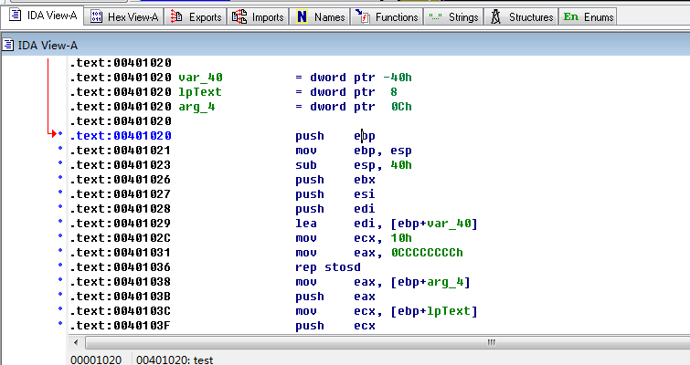

同样，先将其拷贝出来，方便进行分析

```
.text:00401020 ; int __cdecl test(LPCSTR lpText,int)
.text:00401020 test            proc near               ; CODE XREF: j_testj
.text:00401020
.text:00401020 var_40          = dword ptr -40h
.text:00401020 lpText          = dword ptr  8
.text:00401020 arg_4           = dword ptr  0Ch
.text:00401020
.text:00401020                 push    ebp
.text:00401021                 mov     ebp, esp
.text:00401023                 sub     esp, 40h
.text:00401026                 push    ebx
.text:00401027                 push    esi
.text:00401028                 push    edi
.text:00401029                 lea     edi, [ebp+var_40]
.text:0040102C                 mov     ecx, 10h
.text:00401031                 mov     eax, 0CCCCCCCCh
.text:00401036                 rep stosd
.text:00401038                 mov     eax, [ebp+arg_4]
.text:0040103B                 push    eax
.text:0040103C                 mov     ecx, [ebp+lpText]
.text:0040103F                 push    ecx
.text:00401040                 push    offset aSD      ; "%s, %d \r\n"
.text:00401045                 call    printf
.text:0040104A                 add     esp, 0Ch
.text:0040104D                 mov     esi, esp
.text:0040104F                 push    0               ; uType
.text:00401051                 push    0               ; lpCaption
.text:00401053                 mov     edx, [ebp+lpText]
.text:00401056                 push    edx             ; lpText
.text:00401057                 push    0               ; hWnd
.text:00401059                 call    ds:__imp__MessageBoxA@16 ; MessageBoxA(x,x,x,x)
.text:0040105F                 cmp     esi, esp
.text:00401061                 call    __chkesp
.text:00401066                 mov     eax, 5
.text:0040106B                 pop     edi
.text:0040106C                 pop     esi
.text:0040106D                 pop     ebx
.text:0040106E                 add     esp, 40h
.text:00401071                 cmp     ebp, esp
.text:00401073                 call    __chkesp
.text:00401078                 mov     esp, ebp
.text:0040107A                 pop     ebp
.text:0040107B                 retn
.text:0040107B test            endp
```

该反汇编代码的开头部分和结尾部分，和main函数的一样，这里不做重复说明，直接看中间部分的反汇编代码，主要就是对printf和MessageBox函数的调用

调用printf函数的反汇编代码如下

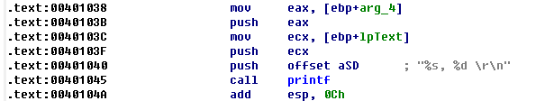

调用MessageBox函数的反汇编代码如下

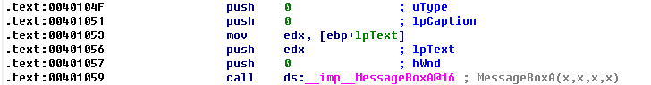

比较以上简单的代码段会发现很多不同

首先在调用完printf后会有`add esp, 0Ch`的代码进行平衡堆栈，而调用MessageBox函数没有。对于调用printf后的`add esp, 0Ch`，前面已经有解释，为什么对MessageBox函数的调用则没有呢？因为在Windows系统下，对API函数的调用都遵循的函数约定是stdcall

>对于stdcall这种调用约定而言，参数依然是从右往左被推送入堆栈，但参数的平栈时在API函数内部完成的，而不是调用者来完成的

使用OllyDbg打开该EXE文件，按F9开始运行，按F8一直单步运行到main函数的调用处

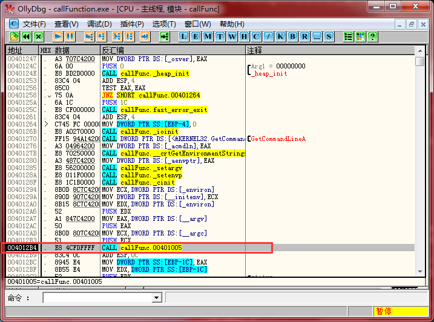

可以看到使用OllyDbg调试时，main函数的调用并没有函数名，只有函数的地址，但是可以回看之前使用IDA分析的情况，使用两个工具在进行反汇编和调试时，调用main函数的指令都在004012B4的地方，main函数的入口都在00401005的地方

然后我们按F7进入main函数的内部，然后按F8逐步单步运行到调用test函数的地方

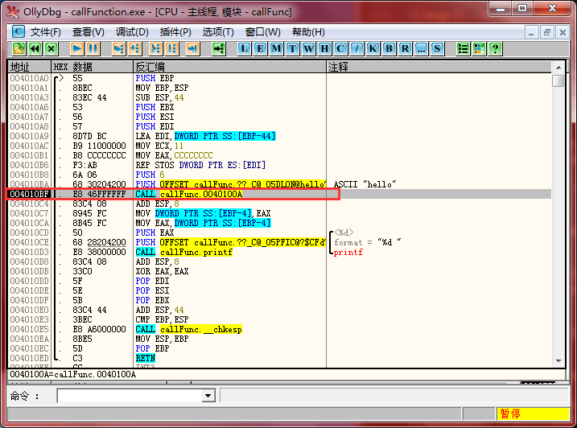

和上面main函数一样，无论是使用OllyDbg还是IDA，看到的调用test的地址都是004010BF，并且test函数的地址都是0040100A

然后我们按F7进入test函数的内部，然后按F8逐步单步调试运行到MessageBox调用的地方

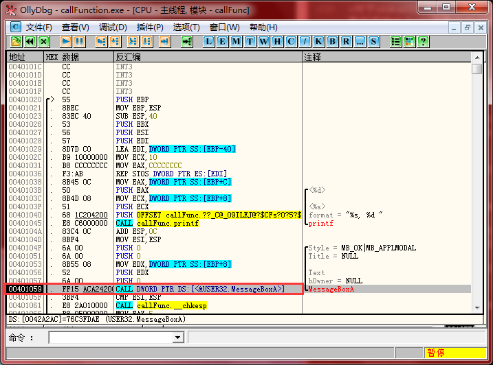

然后按F7进入MessageBox函数内部，然后我们就可以看到MessageBox对应的汇编代码了

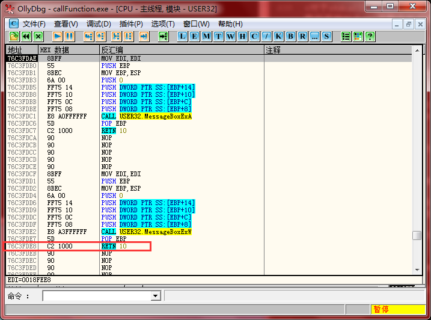

可以看到上面截图中，MessageBox函数在调用retn指令后跟了一个10，这里的10是一个16进制数，16进制的10等于10进制的16。而在为MessageBox传递参数时，每个参数都是4字节，4个参数也就是16字节。因此`retn 10`除了有返回的作用外，还包含了`add esp, 10`的作用

上面的两段反汇编代码中除了平衡堆栈的不同外，还有一个明显的区别：在调用printf时的指令是`call printf`，而调用MessageBox的指令是`call    ds:__imp__MessageBoxA@16 ; MessageBoxA(x,x,x,x)`

因为printf函数在stdio.h头文件中，该函数属于C语言的静态库，在连接时会将其代码连接入二进制文件中，而MessageBox函数的实现是在user32.dll这个动态连接库中。在代码中，这里只留了进入MessageBox函数的地址，并没有具体的代码。MessageBox的具体地址存放在数据节中，因此在反汇编代码中给出了提示，使用了前缀"ds:"。"\_\_impl\_\_"表示导入函数。MessageBox后面的"@16"表示该API函数有4个参数，即16/4=4

>多参的API函数仍然在函数调用方进行平栈，比如wsprintf()函数，原因在于，被调用的函数无法具体明确调用方会传递几个参数，因此多参函数无法在函数内部完成参数的堆栈平衡工作

>stdcall是Windows下的标准函数调用约定。Windows提供的应用层以及内核层函数均使用stdcall的调用约定方式。cdecl是C语言的调用函数约定方式

##简单总结

在逆向分析函数时

* 首先需要确定函数的起始位置，这通常会由IDA自动进行识别（识别不准确的话，就只能手动识别了）
* 其次需要掌握函数的调用约定和确定函数的参数个数，确定函数的调用约定和参数个数都是通过平栈的方式和平栈时对esp操作的值来进行判断的
* 最后就是观察函数的返回值，这部分通常就是观察eax的值，由于return通常只会返回布尔类型、数值类型相关的值，因此通过观察eax的值可以确定返回值的类型，确定了返回值的类型后，可以进一步考虑函数调用方下一步的动作

>很明显这个例子是很简单的，知道了C代码，再去分析。而实际的逆向分析完全是一个黑盒，而且代码量、调用关系会很复杂，就要看自己的灵活运行基础知识的能力了

>使用Delphi、VC可以调试代码，而使用OllyDbg、IDA可以直接调试和分析EXE文件