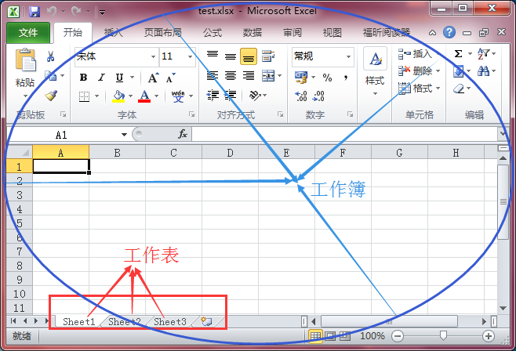
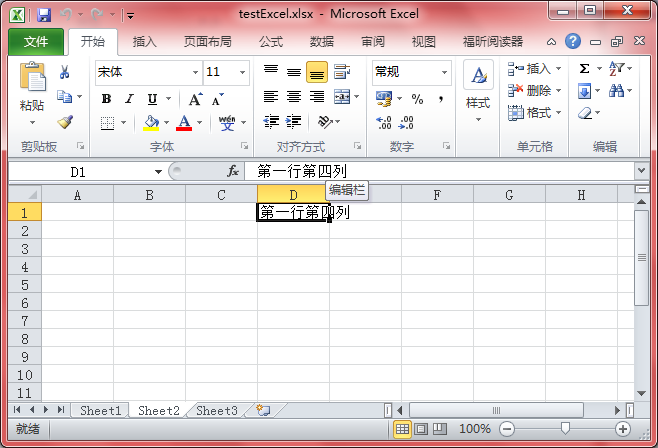

>测试环境：Windows 7、Delphi 6、Office 2010

先了解一下Excel文件的格式，下图展示了工作簿和工作表的概念



## 使用COM方式动态访问

```
unit Unit1;

interface

uses
  Windows, Messages, SysUtils, Variants, Classes, Graphics, Controls, Forms,
  Dialogs, StdCtrls, ComObj;

type
  TForm1 = class(TForm)
    btn1: TButton;
    procedure btn1Click(Sender: TObject);
  private
    { Private declarations }
  public
    { Public declarations }
  end;

var
  Form1: TForm1;

implementation

{$R *.dfm}

procedure TForm1.btn1Click(Sender: TObject);
var
  ExcelApp: Variant;
begin
  //创建Excel对象
  ExcelApp := CreateOleObject('Excel.Application');

  //是否显示当前窗口
  //若指定为True，会导致在调用Save时要求你选择保存的路径，而非保存在Open指定的Excel文件中
  ExcelApp.Visible := False;

  //更改Excel标题栏
  //ExcelApp.Caption := 'testExcel';

  //打开已存在的工作簿（测试使用相对路径会出错）
  ExcelApp.WorkBooks.Open('C:\Users\xumeng13245\Desktop\excel\testExcel.xlsx');

  //设置第2个工作表为活动工作表
  ExcelApp.WorkSheets[2].Activate;

  //给单元格赋值
  ExcelApp.Cells[1, 4].Value := '第一行第四列';

  //保存
  ExcelApp.Save;

  //关闭工作簿
  ExcelApp.WorkBooks.Close;

  //退出 Excel
  ExcelApp.Quit;
 
end;

end.
```

更多的操作方式参见[《Delphi对Excel的所有操作》](http://www.cnblogs.com/fefe/p/5692381.html)

这种方式，可能在最后保存的时候有这样的弹出框


在调用Save的地方做如下修改

```
  ......

  //不弹出警告信息，在调用Save之前调用
  ExcelApp.DisplayAlerts := False;

  //保存
  ExcelApp.Save;

  ......
```

打开Excel文件，可以看到成功写入数据



>以上的代码实现要求先创建好Excel文件，并放置在指定的路径上，否则会出错

最终的程序和Excel文件点击[这里](../download/20161220/testExcel.rar)下载
